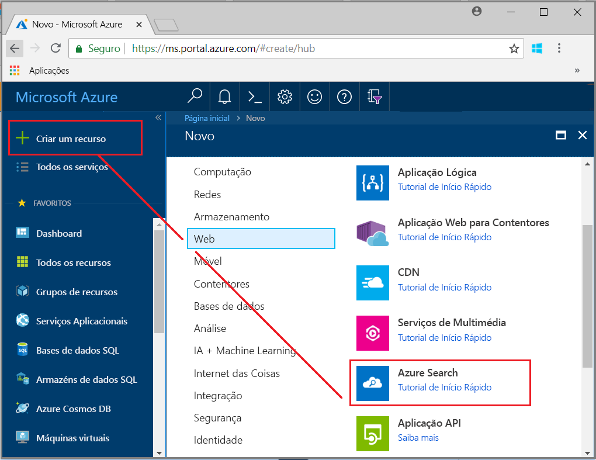
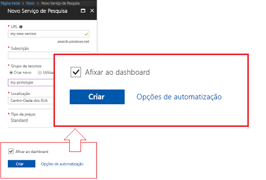
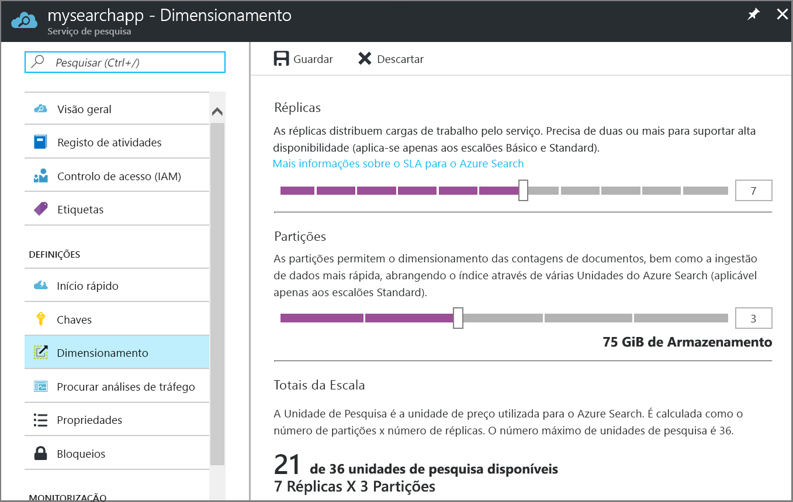

# Quickstart: Create an Azure Cognitive Search service in the portal

Azure Cognitive Search is a standalone resource used to plug in a search experience in custom apps. Although Azure Cognitive Search integrates easily with other Azure services, you can also use it as a standalone component, or integrate it with apps on network servers, or with software running on other cloud platforms.

In this article, learn how to create a resource in the [Azure portal](https://portal.azure.com/).

Prefere o PowerShell? Utilize o [modelo de serviço](https://azure.microsoft.com/resources/templates/101-azure-search-create/) do Azure Resource Manager. For help with getting started, see [Manage Azure Cognitive Search with PowerShell](search-manage-powershell.md).

## Subscrever (gratuito ou pago)

[Abra uma conta do Azure gratuita](https://azure.microsoft.com/pricing/free-trial/?WT.mc_id=A261C142F) e utilize créditos gratuitos para experimentar serviços do Azure pagos. Depois de gastar os créditos, mantenha a conta e continue a utilizar os serviços do Azure gratuitos, como Web sites. O seu cartão de crédito não será cobrado, a menos que altere explicitamente as suas definições e peça para ser cobrado.

Em alternativa, [ative os benefícios do subscritor do MSDN](https://azure.microsoft.com/pricing/member-offers/msdn-benefits-details/?WT.mc_id=A261C142F). Uma subscrição do MSDN dá-lhe créditos todos os meses que pode utilizar em serviços pagos do Azure. 

## Find Azure Cognitive Search

1. Inicie sessão no [portal do Azure](https://portal.azure.com/).
2. Click the plus sign ("+ Create Resource") in the top-left corner.
3. Use the search bar to find "Azure Cognitive Search" or navigate to the resource through **Web** > **Azure Cognitive Search**.

## Choose a subscription

Setting the subscription ID and resource group is your first step. Se tiver mais do que uma subscrição, escolha uma que tenha também serviços de armazenamento de dados ou ficheiros. Azure Cognitive Search can autodetect Azure Table and Blob storage, SQL Database, and Azure Cosmos DB for indexing via [*indexers*](search-indexer-overview.md), but only for services under the same subscription.

## Set a resource group

A resource group is required and is useful for managing resources all-up, including costs. A resource group can consist of one service, or multiple services used together. For example, if you are using Azure Cognitive Search to index an Azure Cosmos DB database, you could make both services part of the same resource group for management purposes. 

If you aren't combining resources into a single group, or if existing resource groups are filled with resources used in unrelated solutions, create a new resource group just for your Azure Cognitive Search resource. 

Over time, you can track current and projected costs all-up (as shown in the screenshot) or scroll down to view charges for individual resources. The following screenshot shows the kind of cost information you can eventually expect to see when you combine multiple resources into one group.

> [!TIP]
> Resource groups simplify cleanup because deleting a group also deletes the services within it. Para projetos de protótipo que utilizam múltiplos serviços, colocá-los a todos no mesmo grupo de recursos facilita a limpeza depois de o projeto terminar.

## Name the service

In Instance Details, provide a service name in the **URL** field. The name is part of the URL endpoint against which API calls are issued: `https://your-service-name.search.windows.net`. For example, if you want the endpoint to be `https://myservice.search.windows.net`, you would enter `myservice`.

Requisitos do nome do serviço:

* Tem de ser exclusivo no espaço de nomes search.windows.net
* Ter 2 e 60 carateres
* Utilize letras minúsculas, números ou hífenes ("-")
* Evite hífenes ("-") nos primeiro 2 carateres ou como último caráter único
* Sem hífenes consecutivos ("-") em qualquer parte

> [!TIP]
> If you think you'll be using multiple services, we recommend including the region (or location) in the service name as a naming convention. Services within the same region can exchange data at no charge, so if Azure Cognitive Search is in West US, and you have other services also in West US, a name like `mysearchservice-westus` can save you a trip to the properties page when deciding how to combine or attach resources.

## Choose a location

As an Azure service, Azure Cognitive Search can be hosted in datacenters around the world. The list of supported regions can be found in the [pricing page](https://azure.microsoft.com/pricing/details/search/). 

You can minimize or avoid bandwidth charges by choosing the same location for multiple services. For example, if you are indexing data provided by another Azure service (Azure storage, Azure Cosmos DB, Azure SQL Database), creating your Azure Cognitive Search service in the same region avoids bandwidth charges (there are no charges for outbound data when services are in the same region).

Additionally, if you are using AI enrichment, create your service in the same region as Cognitive Services. *Co-location of Azure Cognitive Search and Cognitive Services in the same region is a requirement for AI enrichment*.

> [!Note]
> Central India is currently unavailable for new services. For services already in Central India, you can scale up with no restrictions, and your service is fully supported in that region. The restriction on this region is temporary and limited to new services only. We will remove this note when the restriction no longer applies.

## Choose a pricing tier (SKU)

[Azure Cognitive Search is currently offered in multiple pricing tiers](https://azure.microsoft.com/pricing/details/search/): Free, Basic, or Standard. Cada escalão tem a sua própria [capacidade e limites](search-limits-quotas-capacity.md). Veja [Escolher um escalão de preço ou SKU](search-sku-tier.md) para obter orientações.

Basic and Standard are the most common choices for production workloads, but most customers start with the Free service. Key differences among tiers is partition size and speed, and limits on the number of objects you can create.

Remember that a pricing tier cannot be changed once the service is created. Se precisar de um escalão superior ou inferior mais tarde, terá de voltar a criar o serviço.

## Criar o serviço

After you've provided the necessary inputs, go ahead and create the service. 

Your service is deployed within minutes, which you can monitor through Azure notifications. Consider pinning the service to your dashboard for easy access in the future.

## Get a key and URL endpoint

Unless you are using the portal, programmatic access to your new service requires that you provide the URL endpoint and an authentication api-key.

1. On the **Overview** page, locate and copy the URL endpoint on the right side of the page.

2. On the **Keys** page, copy either one of the admin keys (they are equivalent). Admin api-keys are required for creating, updating, and deleting objects on your service. In contrast, query keys provide read-access to index content.

   

An endpoint and key are not needed for portal-based tasks. The portal is already linked to your Azure Cognitive Search resource with admin rights. For a portal walkthrough, start with [Quickstart: Create an Azure Cognitive Search index in the portal](search-get-started-portal.md).

## Dimensionar o serviço

Depois de o serviço ser aprovisionado, pode dimensioná-lo para satisfazer as suas necessidades. If you chose the Standard tier for your Azure Cognitive Search service, you can scale your service in two dimensions: replicas and partitions. Se tiver escolhido o escalão Básico, apenas pode adicionar réplicas. Se tiver aprovisionado o serviço gratuito, o dimensionamento não está disponível.

As ***partições*** permitem ao serviço armazenar e pesquisar mais documentos.

As ***réplicas*** permitem ao serviço processar uma carga maior de consultas de pesquisa.

A adição de recursos aumenta a sua fatura mensal. A [calculadora de preços](https://azure.microsoft.com/pricing/calculator/) pode ajudá-lo a compreender as ramificações de faturação da adição de recursos. Lembre-se de que pode ajustar os recursos com base na carga. Por exemplo, pode aumentar os recursos para criar um índice inicial completo e, em seguida, reduzir recursos mais tarde para um nível mais adequado para a indexação incremental.

> [!Important]
> Um serviço tem de ter [2 réplicas para SLA só de leitura e 3 réplicas para SLA de leitura/escrita](https://azure.microsoft.com/support/legal/sla/search/v1_0/).

1. Aceda à página do serviço de pesquisa no portal do Azure.
2. No painel de navegação esquerdo, selecione **Definições** > **Dimensionar**.
3. Utilize a barra de deslize para adicionar recursos de qualquer tipo.

> [!Note]
> Per-partition storage and speed increases at higher tiers. For more information, see [capacity and limits](search-limits-quotas-capacity.md).

## Quando adicionar um segundo serviço

Most customers use just one service provisioned at a tier providing the [right balance of resources](search-sku-tier.md). Um serviço pode alojar vários índices, sujeitos aos [limites máximos do escalão que selecionar](search-capacity-planning.md), com os índices isolados uns dos outros. In Azure Cognitive Search, requests can only be directed to one index, minimizing the chance of accidental or intentional data retrieval from other indexes in the same service.

Embora a maioria dos clientes utilize apenas um serviço, a redundância de serviços pode ser necessária se os requisitos operacionais incluírem o seguinte:

* Recuperação após desastre (falha do datacenter). Azure Cognitive Search does not provide instant failover in the event of an outage. Para obter recomendações e orientações, veja [Administração de serviços](search-manage.md).
* A investigação de modelação de multi-inquilinos determinou que a conceção ideal é ter serviços adicionais. Para obter mais informações, veja [Conceber para multi-inquilinos](search-modeling-multitenant-saas-applications.md).
* For globally deployed applications, you might require an instance of Azure Cognitive Search in multiple regions to minimize latency of your application’s international traffic.

> [!NOTE]
> In Azure Cognitive Search, you cannot segregate indexing and querying operations; thus, you would never create multiple services for segregated workloads. Um índice é sempre consultado no serviço em que foi criado (não pode criar um índice num serviço e copiá-lo para outro).

Não é necessário um segundo serviço para elevada disponibilidade. A elevada disponibilidade para consultas é alcançada ao utilizar 2 ou mais réplicas no mesmo serviço. Replica updates are sequential, which means at least one is operational when a service update is rolled out. For more information about uptime, see [Service Level Agreements](https://azure.microsoft.com/support/legal/sla/search/v1_0/).

## Passos seguintes

After provisioning a service, you can continue in the portal to create your first index.

> [!div class="nextstepaction"]
> [Quickstart: Create an Azure Cognitive Search index in the portal](search-get-started-portal.md)
