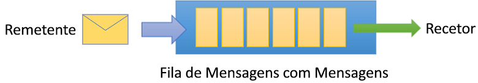
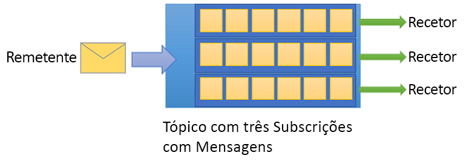

# O que é o Azure Service Bus?
O Microsoft Azure Service Bus é um corretor de mensagens da empresa totalmente gerido com filas de mensagens e tópicos de subscrição de publicação. O Service Bus é utilizado para dissociar aplicações e serviços entre si, proporcionando os seguintes benefícios:

- Trabalho de equilíbrio de cargas entre trabalhadores concorrentes
- Encaminhamento e transferência de dados e controlo em segurança através dos limites de serviço e aplicação
- Coordenação do trabalho transacional que requer um elevado grau de fiabilidade 

## Descrição Geral
Os dados são transferidos entre diferentes aplicações e serviços utilizando *mensagens*. Uma mensagem é um recipiente decorado com metadados e contém dados. Os dados podem ser qualquer tipo de informação, incluindo dados estruturados codificados com os formatos comuns, tais como os seguintes: JSON, XML, Apache Avro, Texto Simples.

Alguns cenários comuns de mensagens são:

* *Mensagens.* Transfira dados empresariais, tais como encomendas de vendas ou compras, revistas ou movimentos de inventário.
* *Desaconsição de candidaturas.* Melhorar a fiabilidade e escalabilidade das aplicações e serviços. O produtor e o consumidor não têm de estar online ou prontamente disponíveis ao mesmo tempo. A [carga é nivelada](/azure/architecture/patterns/queue-based-load-leveling) de modo que os picos de tráfego não sobrecarregam um serviço. 
* *Equilíbrio de carga*. Permitir que vários [consumidores concorrentes](/azure/architecture/patterns/competing-consumers) leiam a partir de uma fila ao mesmo tempo, cada um obtendo de forma segura a propriedade exclusiva para mensagens específicas. 
* *Tópicos e subscrições.* Ativar 1:*n* relações entre [editores e assinantes,](/azure/architecture/patterns/publisher-subscriber)permitindo aos assinantes selecionarem mensagens específicas a partir de um fluxo de mensagens publicado.
* *Transações*. Permite-lhe fazer várias operações, todas no âmbito de uma transação atómica. Por exemplo, as seguintes operações podem ser feitas no âmbito de uma transação.  

    1. Obtenha uma mensagem de uma fila.
    2. Postar resultados de processamento para uma ou mais filas diferentes.
    3. Desloque a mensagem de entrada da fila original. 
    
    Os resultados tornam-se visíveis apenas para os consumidores a jusante apenas com o sucesso, incluindo a liquidação bem sucedida da mensagem de entrada, permitindo uma vez apenas o processamento da semântica. Este modelo de transação é uma base robusta para o padrão [de transações compensatórias](/azure/architecture/patterns/compensating-transaction) no contexto de maior solução. 
* *Sessões de mensagens*. Implementar uma coordenação de alta escala de fluxos de trabalho e transferências multiplexed que requerem pedidos rigorosos de mensagens ou diferimento de mensagens.

Se você está familiarizado com outros corretores de mensagens como Apache ActiveMQ, os conceitos de Service Bus são semelhantes ao que você sabe. Como o Service Bus é uma oferta de plataforma como serviço (PaaS), uma diferença fundamental é que não precisa de se preocupar com as seguintes ações. O Azure trata dessas tarefas para ti. 

- Colocação de troncos e gestão do espaço do disco
- Manuseamento de backups
- Manter os sistemas operativos ou os produtos remendados
- Preocupação com falhas de hardware 
- Falhando numa máquina de reserva

## Cumprimento das normas e protocolos

O protocolo de fio primário para o Service Bus é [o Advanced Messaging Queueing Protocol (AMQP) 1.0](service-bus-amqp-overview.md), uma norma ISO/IEC aberta. Permite que os clientes escrevam aplicações que funcionem contra o Service Bus e corretores no local, como o ActiveMQ ou o RabbitMQ. O [guia de protocolo amQP](service-bus-amqp-protocol-guide.md) fornece informações detalhadas no caso de pretender construir tal abstração.

[O Service Bus Premium](service-bus-premium-messaging.md) está em total conformidade com o Java/Jakarta EE [Java Message Service (JMS) 2.0](how-to-use-java-message-service-20.md) API. E, a Service Bus Standard suporta o subconjunto JMS 1.1 focado nas filas. JMS é uma abstração comum para corretores de mensagens e integra-se com muitas aplicações e quadros, incluindo o popular quadro da primavera. Para mudar de outros corretores para Azure Service Bus, basta recriar a topologia de filas e tópicos e alterar as dependências e configurações do fornecedor do cliente. Por exemplo, consulte o [guia de migração ActiveMQ](migrate-jms-activemq-to-servicebus.md).

## Conceitos e terminologia 
Esta secção discute conceitos e terminologia da Service Bus.

### Espaços de nomes
Um espaço de nome é um recipiente para todos os componentes de mensagens. Várias filas e tópicos podem estar num espaço com um único nome, e os espaços de nomes muitas vezes servem como recipientes de aplicação. 

Um espaço de nome pode ser comparado a um "servidor" na terminologia de outros corretores, mas os conceitos não são diretamente equivalentes. Um espaço de nomes de ônibus de serviço é a sua própria fatia de capacidade de um grande cluster composto por dezenas de máquinas virtuais totalmente ativas. Pode, opcionalmente, abranger três [zonas de disponibilidade de Azure.](../availability-zones/az-overview.md) Assim, obtém-se todos os benefícios de disponibilidade e robustez de executar o corretor de mensagens em enorme escala. E não precisas de te preocupar com as complexidades subjacentes. O Service Bus é uma mensagem "sem servidor".

### Filas
As mensagens são enviadas e recebidas de *filas*. As filas armazenam mensagens até que a aplicação recetora esteja disponível para as receber e processar.

As mensagens nas filas são encomendadas e anotados à chegada. Uma vez aceite pelo corretor, a mensagem é sempre mantida duramente em armazenamento triplo-redundante, espalhada por zonas de disponibilidade se o espaço de nome estiver ativado em zona. A Service Bus nunca deixa mensagens na memória ou armazenamento volátil depois de terem sido reportadas ao cliente como aceites.

As mensagens são entregues no modo *de puxar,* apenas entregando mensagens quando solicitadas. Ao contrário do modelo de sondagens atarefadas de algumas outras filas de nuvens, a operação de pull pode ser de longa duração e só completa uma vez que uma mensagem esteja disponível. 

### Tópicos

Também pode utilizar *tópicos* para enviar e receber mensagens. Embora uma fila seja utilizada frequentemente para comunicação ponto a ponto, os tópicos são úteis em cenários de publicação/subscrição.

Os tópicos podem ter várias subscrições independentes, que se ligam ao tópico e de outra forma funcionam exatamente como as filas do lado do recetor. Um subscritor de um tópico pode receber uma cópia de cada mensagem enviada para esse tópico. As assinaturas são entidades nomeadas. As subscrições são duradouras por padrão, mas podem ser configuradas para expirar e depois ser automaticamente eliminadas. Através da API JMS, o Service Bus Premium também permite criar subscrições voláteis que existem durante a duração da ligação.

Pode definir regras numa subscrição. Uma regra de subscrição tem um *filtro* para definir uma condição para a mensagem ser copiada na subscrição e uma *ação* opcional que pode modificar metadados de mensagens. Para mais informações, consulte [filtros e ações tópicos.](topic-filters.md) Esta funcionalidade é útil nos seguintes cenários:

- Não pretende que uma subscrição receba todas as mensagens enviadas para um tópico.
- Pretende marcar mensagens com metadados extra quando passam por uma subscrição.

## Funcionalidades avançadas

O Service Bus inclui funcionalidades avançadas que lhe permitem resolver problemas de mensagens mais complexos. As seguintes secções descrevem várias destas características.

### Sessões de mensagens

Para criar uma garantia de primeira e primeira saída (FIFO) no Service Bus, utilize sessões. As sessões de mensagens permitem o manuseamento exclusivo e ordenado de sequências não ilimitadas de mensagens relacionadas. Para permitir sessões de manuseamento em sistemas de alta disponibilidade e alta escala, a funcionalidade de sessão também permite armazenar o estado da sessão, o que permite que as sessões se movam com segurança entre os manipuladores. Para obter mais informações, consulte [as sessões de mensagem: primeiro a entrar, a sair primeiro (FIFO)](message-sessions.md).

### Autoforwarding

A funcionalidade de auto-ordenação acorra uma fila ou subscrição de outra fila ou tópico dentro do mesmo espaço de nome. Quando utiliza esta funcionalidade, o Service Bus move automaticamente mensagens de uma fila ou subscrição para uma fila ou tópico alvo. Todos estes movimentos são feitos transacionalmente. Para mais informações, consulte [as entidades chaining Service Bus com autoforwarding.](service-bus-auto-forwarding.md)

### Fila de cartas mortas

Todas as filas de autocarros de serviço e subscrições de tópicos têm uma fila de cartas mortas associada (DLQ). Um DLQ contém mensagens que satisfazem os seguintes critérios: 

- Não podem ser entregues com sucesso a nenhum recetor.
- Esgotaram o tempo.
- São explicitamente excluídos pelo pedido de receção. 

As mensagens na fila das cartas mortas são anotadas pela razão pela qual foram colocadas lá. A fila das letras mortas tem um ponto final especial, mas de outra forma age como qualquer fila normal. Uma aplicação ou ferramenta pode navegar num DLQ ou descaíduo a partir dele. Você também pode sair automaticamente de uma fila de letras mortas. Para mais informações, consulte [as filas de cartas mortas do Service Bus.](service-bus-dead-letter-queues.md)

### Entrega agendada

Pode submeter mensagens a uma fila ou tópico para processamento atrasado, definindo uma hora em que a mensagem estará disponível para consumo. As mensagens agendadas também podem ser canceladas. Para mais informações, consulte [mensagens agendadas.](message-sequencing.md#scheduled-messages)

### Diferimento de mensagens

Uma fila ou cliente por subscrição pode adiar a recuperação de uma mensagem recebida até uma hora posterior. A mensagem pode ter sido postada fora de uma ordem esperada e o cliente quer esperar até receber outra mensagem. As mensagens diferidas permanecem na fila ou na subscrição e devem ser reativadas explicitamente utilizando o número de sequência atribuído ao serviço. Para mais informações, consulte [o adiamento da mensagem.](message-deferral.md)

### Lotes

O lote do lado do cliente permite que uma fila ou cliente tópico acumule um conjunto de mensagens e as transfira em conjunto. É frequentemente feito para salvar largura de banda ou para aumentar a produção. Para obter mais informações, consulte [o lote do lado do Cliente.](service-bus-performance-improvements.md#client-side-batching)

### Transações

Uma transação agrupo duas ou mais operações juntas num *âmbito de execução.* A Service Bus permite-lhe agrupar operações contra várias entidades de mensagens no âmbito de uma única transação. Uma entidade de mensagens pode ser uma fila, tópico ou subscrição. Para mais informações, consulte [a visão geral do processamento de transações de service bus.](service-bus-transactions.md)

### Autodelete em marcha lenta

A autodelete em marcha lenta permite especificar um intervalo de marcha lenta após o qual uma subscrição de fila ou tópico é automaticamente eliminada. A duração mínima é 5 minutos. Para mais informações, consulte a [Propriedade QueueDescription.AutoDeleteOnIdle](/dotnet/api/microsoft.servicebus.messaging.queuedescription.autodeleteonidle).

### Deteção de duplicados
A função de deteção duplicada permite ao remetente reensi para reencamender a mesma mensagem novamente e para que o corretor deixe cair uma possível duplicação. A deteção duplicada baseia-se no rastreio `message-id` da propriedade de uma mensagem, o que significa que a aplicação precisa de ter o cuidado de usar o mesmo valor ao reenresesse a mensagem, que pode ser diretamente derivada de algum contexto específico da aplicação. Para obter mais informações, consulte [a deteção de Duplicado.](duplicate-detection.md)

### Recuperação após desastre geográfica

Quando uma região de Azure experimenta tempo de inatividade, a funcionalidade de recuperação de desastres permite que o processamento de dados continue a operar numa região ou centro de dados diferente. A funcionalidade mantém um espelho estrutural de um espaço de nome disponível na região secundária e permite que a identidade do espaço de nome mude para o espaço de nome secundário. As mensagens já publicadas permanecem no antigo espaço de nome primário para recuperação uma vez que o episódio de disponibilidade diminui. Para mais informações, consulte [a recuperação de geo-desastres de autocarros da Azure Service.](service-bus-geo-dr.md)

### Segurança

A Service Bus suporta os protocolos [AMQP 1.0](service-bus-amqp-overview.md) e [HTTP ou REST](/rest/api/servicebus/) padrão e respetivas instalações de segurança, incluindo a segurança ao nível do transporte (TLS). Os clientes podem ser autorizados a aceder usando [a Assinatura de Acesso Partilhado](service-bus-sas.md) ou a segurança baseada em funções do [Azure Ative Directory.](service-bus-authentication-and-authorization.md) 

Para proteção contra tráfego indesejado, o Service Bus fornece [funcionalidades](network-security.md) de segurança como firewall IP e integração com redes virtuais. 

## Bibliotecas de cliente

As bibliotecas de clientes do Service Bus totalmente suportadas estão disponíveis através do Azure SDK.

- [Ônibus de serviço Azure para .NET](/dotnet/api/overview/azure/service-bus?preserve-view=true)
- [Bibliotecas de ônibus de serviço Azure para Java](/java/api/overview/azure/servicebus?preserve-view=true)
- [Fornecedor de ônibus de serviço Azure para Java JMS 2.0](how-to-use-java-message-service-20.md)
- [Módulos de ônibus de serviço Azure para JavaScript e TypeScript](/javascript/api/overview/azure/service-bus?preserve-view=true)
- [Bibliotecas de ônibus de serviço Azure para Python](/python/api/overview/azure/servicebus?preserve-view=true)

[O protocolo principal da Azure Service Bus é AMQP 1.0](service-bus-amqp-overview.md) e pode ser usado a partir de qualquer cliente protocolo compatível com AMQP 1.0. Vários clientes amqp de código aberto têm amostras que demonstram explicitamente a interoperabilidade do Service Bus. Reveja o [guia de protocolo AMQP 1.0](service-bus-amqp-protocol-guide.md) para entender como utilizar as funcionalidades do Service Bus com clientes AMQP 1.0 diretamente.

[!INCLUDE [messaging-oss-amqp-stacks.md](../../includes/messaging-oss-amqp-stacks.md)]

## Integração

A Service Bus integra-se totalmente com muitos serviços microsoft e Azure, por exemplo:

* [Event Grid](service-bus-to-event-grid-integration-example.md)
* [Logic Apps](../connectors/connectors-create-api-servicebus.md)
* [Funções do Azure](../azure-functions/functions-bindings-service-bus.md)
* [Power Platform](../connectors/connectors-create-api-servicebus.md)
* [Dynamics 365](/dynamics365/fin-ops-core/dev-itpro/business-events/how-to/how-to-servicebus)
* [Azure Stream Analytics](../stream-analytics/stream-analytics-define-outputs.md)

## Passos seguintes

Para começar a utilizar as mensagens do Service Bus, consulte os seguintes artigos:

* Para comparar os serviços de mensagens Azure, consulte [Comparação de serviços.](../event-grid/compare-messaging-services.md?toc=%2fazure%2fservice-bus-messaging%2ftoc.json&bc=%2fazure%2fservice-bus-messaging%2fbreadcrumb%2ftoc.json)
* Experimente os quickstarts para [.NET,](service-bus-dotnet-get-started-with-queues.md) [Java](service-bus-java-how-to-use-queues.md)ou [JMS](service-bus-java-how-to-use-jms-api-amqp.md).
* Para gerir os recursos do Service Bus, consulte [o Service Bus Explorer.](https://github.com/paolosalvatori/ServiceBusExplorer/releases)
* Para saber mais sobre os níveis Standard e Premium e seus preços, consulte [os preços do Service Bus.](https://azure.microsoft.com/pricing/details/service-bus/)
* Para saber sobre desempenho e latência para o nível Premium, consulte [Mensagens Premium](https://techcommunity.microsoft.com/t5/Service-Bus-blog/Premium-Messaging-How-fast-is-it/ba-p/370722).