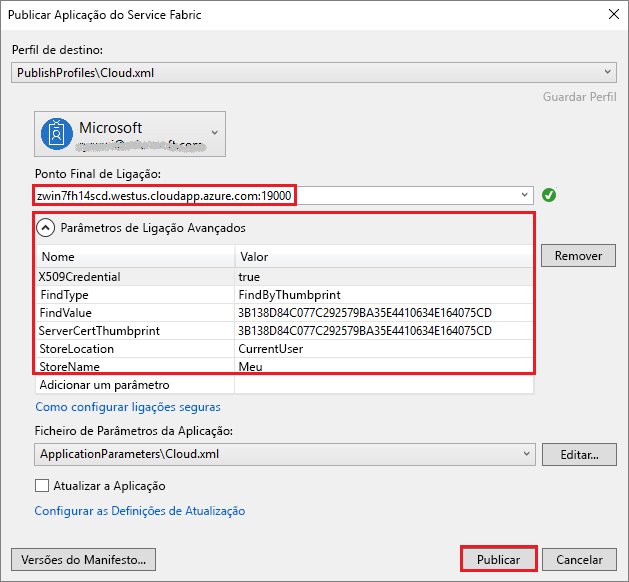

# <a name="quickstart-deploy-windows-containers-to-service-fabric"></a>Início rápido: Implementar contentores do Windows no Service Fabric

O Azure Service Fabric é uma plataforma de sistemas distribuídos par implementar e gerir microsserviços e contentores dimensionáveis e fiáveis.

Para executar uma aplicação existente num contentor do Windows num cluster do Service Fabric, não precisa de fazer quaisquer alterações à sua aplicação. Este guia de início rápido mostra como implementar uma imagem de contentor do Docker pré-concebida numa aplicação do Service Fabric. Quando terminar, terá um servidor e um recipiente IIS do Windows Server Core 2016 em execução. Este quickstart descreve a implantação de um recipiente Windows. Leia [este arranque rápido](service-fabric-quickstart-containers-linux.md) para colocar um recipiente Linux.

![Página Web do IIS predefinida][iis-default]

Neste início rápido, vai aprender a:

* Empacotar um contentor de imagens do Docker
* Configurar a comunicação
* Criar e empacotar a aplicação do Service Fabric
* Implementar a aplicação de contentor no Azure


[!INCLUDE [updated-for-az](../../includes/updated-for-az.md)]

## <a name="prerequisites"></a>Pré-requisitos

* Uma subscrição do Azure (pode criar uma [conta gratuita](https://azure.microsoft.com/free/?WT.mc_id=A261C142F)).
* Um computador de programação com:
  * Visual Studio 2019 ou Windows 2019.
  * [SDK e ferramentas do Service Fabric](service-fabric-get-started.md).

## <a name="package-a-docker-image-container-with-visual-studio"></a>Empacotar um contentor de imagens do Docker com o Visual Studio

O SDK e as ferramentas do Service Fabric fornecem um modelo de serviço para o ajudar a implementar um contentor num cluster do Service Fabric.

Inicie o Visual Studio como “Administrador”.  Selecione **o**  >  **novo**  >  **projeto de arquivo**.

Selecione **a aplicação de Tecido de Serviço**, nomeie-a como "MyFirstContainer", e clique em **Criar**.

Selecione **Contentor** nos modelos de **Contentores e Aplicações Alojados**.

Em **Nome de Imagem**, introduza "mcr.microsoft.com/windows/servercore/iis:windowsservercore-ltsc2016", o Servidor Central do Servidor do Windows e a imagem base do [IIS](https://hub.docker.com/_/microsoft-windows-servercore-iis).

Configure o mapeamento de portas, da porta para o anfitrião do contentor, de modo que os pedidos recebidos para o serviço na porta 80 sejam mapeados para a porta 80 no contentor.  Defina a **Porta de Contentor** para "80" e defina a **Porta do Anfitrião** para "80".  

Dê ao serviço o nome "MyContainerService" e clique em **OK**.

![Caixa de diálogo do novo serviço][new-service]

## <a name="specify-the-os-build-for-your-container-image"></a>Especificar a compilação do SO para a imagem do contentor

Os contentores criados com uma versão específica do Windows Server poderão não funcionar num anfitrião com uma versão diferente do Windows Server. Por exemplo, os contentores construídos com a versão 1709 do Windows Server não funcionam em anfitriões que executam o Windows Server 2016. Para obter mais informações, veja [Compatibilidade do sistema operativo do contentor do Windows Server e do sistema operativo do sistema anfitrião ](service-fabric-get-started-containers.md#windows-server-container-os-and-host-os-compatibility). 

Com a versão 6.1 do runtime do Service Fabric e com versões mais recentes, pode especificar várias imagens de sistema operativo por contentor e etiquetar cada uma com a versão do sistema operativo para a qual deve ser implementada. Este procedimento ajuda-o a verificar se a aplicação funcionará em sistemas anfitriões com versões diferentes do sistema operativo Windows. Para saber mais, veja [Indicar imagens de contentor específicas da compilação de SO](service-fabric-get-started-containers.md#specify-os-build-specific-container-images). 

A Microsoft publica imagens diferentes para as versões do IIS criadas em diferentes versões do Windows Server. Para verificar se o Service Fabric implementa um contentor compatível com a versão do Windows Server que em execução nos nós do cluster onde implementa a aplicação, adicione as seguintes linhas ao ficheiro *ApplicationManifest.xml*. A versão de compilação do Windows Server 2016 é 14393 e a da versão 1709 do Windows Server é 16299.

```xml
    <ContainerHostPolicies CodePackageRef="Code"> 
      <ImageOverrides> 
        ...
          <Image Name="mcr.microsoft.com/windows/servercore/iis:windowsservercore-1803" /> 
          <Image Name= "mcr.microsoft.com/windows/servercore/iis:windowsservercore-ltsc2016" Os="14393" /> 
          <Image Name="mcr.microsoft.com/windows/servercore/iis:windowsservercore-1709" Os="16299" /> 
      </ImageOverrides> 
    </ContainerHostPolicies> 
```

O manifesto de serviço continua a especificar apenas uma imagem para o Nano Server, `mcr.microsoft.com/windows/servercore/iis:windowsservercore-ltsc2016`.

Também no ficheiro *ApplicationManifest.xml,* **altere o PasswordEncrypted** para **falso**. A conta e a palavra-passe estão em branco para a imagem do contentor público que está no Docker Hub, por isso desligamos a encriptação porque encriptar uma palavra-passe em branco gerará um erro de construção.

```xml
<RepositoryCredentials AccountName="" Password="" PasswordEncrypted="false" />
```

## <a name="create-a-cluster"></a>Criar um cluster

O seguinte script de amostra cria um cluster de tecido de serviço de cinco nós protegido com um certificado X.509. O comando cria um certificado autoassinado e carrega-o para um novo cofre de chaves. O certificado é também copiado para um diretório local. Pode aprender mais sobre a criação de um cluster utilizando este script no [Create a Service Fabric cluster.](scripts/service-fabric-powershell-create-secure-cluster-cert.md)

Se necessário, instale o Azure PowerShell utilizando as instruções encontradas no [guia Azure PowerShell](/powershell/azure/).

Antes de executar o seguinte script, na powerShell run `Connect-AzAccount` para criar uma ligação com Azure.

Copie o seguinte script para a prancheta e abra o **Windows PowerShell ISE**.  Cole o conteúdo na janela vazia Untitled1.ps1. Em seguida, forneça valores para as variáveis no roteiro: `subscriptionId` , , , , , e assim por `certpwd` `certfolder` `adminuser` `adminpwd` diante.  O diretório para o qual `certfolder` especificas deve existir antes de executares o guião.

[!code-powershell[main](../../powershell_scripts/service-fabric/create-secure-cluster/create-secure-cluster.ps1 "Create a Service Fabric cluster")]

Depois de fornecer os seus valores para as variáveis, prima **F5** para executar o script.

Depois de o script ser executado e o cluster for criado, encontre a `ClusterEndpoint` saída. Por exemplo:

```powershell
...
ClusterEndpoint : https://southcentralus.servicefabric.azure.com/runtime/clusters/b76e757d-0b97-4037-a184-9046a7c818c0
```

### <a name="install-the-certificate-for-the-cluster"></a>Instale o certificado para o cluster

Agora vamos instalar o PFX no *CurrentUser\A minha* loja de certificados. O ficheiro PFX estará no diretório especificado utilizando a `certfolder` variável ambiente no script PowerShell acima.

Mude para esse diretório e, em seguida, execute o seguinte comando PowerShell, substituindo o nome do ficheiro PFX que está no seu `certfolder` diretório, e a palavra-passe que especificou na `certpwd` variável. Neste exemplo, o diretório atual é definido para o diretório especificado pela `certfolder` variável no script PowerShell. A partir daí, o `Import-PfxCertificate` comando é executado:

```powershell
PS C:\mycertificates> Import-PfxCertificate -FilePath .\mysfclustergroup20190130193456.pfx -CertStoreLocation Cert:\CurrentUser\My -Password (ConvertTo-SecureString Password#1234 -AsPlainText -Force)
```

O comando devolve a impressão digital:

```powershell
  ...
  PSParentPath: Microsoft.PowerShell.Security\Certificate::CurrentUser\My

Thumbprint                                Subject
----------                                -------
0AC30A2FA770BEF566226CFCF75A6515D73FC686  CN=mysfcluster.SouthCentralUS.cloudapp.azure.com
```

Lembre-se do valor da impressão digital para o passo seguinte.

## <a name="deploy-the-application-to-azure-using-visual-studio"></a>Implementar a aplicação no Azure com o Visual Studio

Agora que a aplicação está pronta, pode implementá-la num cluster diretamente a partir do Visual Studio.

Clique com o botão direito do rato em **MyFirstContainer**, no Explorador de Soluções, e escolha **Publicar**. É apresentada a caixa de diálogo Publicar.

Copie o conteúdo que se segue **cn=** na janela PowerShell quando executar o `Import-PfxCertificate` comando acima e `19000` adicione-lhe a porta. Por exemplo, `mysfcluster.SouthCentralUS.cloudapp.azure.com:19000`. Copie-o para o campo **'Endpoint' de ligação.** Lembre-se deste valor porque vai precisar dele num passo futuro.

Clique em **Parâmetros de Ligação Avançada** e verifique as informações dos parâmetros da ligação.  Os valores *FindValue* e *ServerCertThumbprint* devem corresponder à impressão digital do certificado instalado quando correu `Import-PfxCertificate` no passo anterior.



Clique em **Publish** (Publicar).

Cada aplicação no cluster tem de ter um nome exclusivo. Se houver um conflito de nomes, mude o nome do projeto Visual Studio e volte a ser implementado.

Abra um browser e navegue para o endereço que colocou no campo **Endpoint de Ligação** no passo anterior. Opcionalmente, pode preceder o identificador do esquema, `http://`, e acrescentar a porta, `:80`, ao URL. Por exemplo, http: \/ /mysfcluster.SouthCentralUS.cloudapp.azure.com:80.

 Deverá ver a página Web predefinida do IIS: ![Página Web predefinida do IIS][iis-default]

## <a name="clean-up"></a>Limpeza

Continuas a incorrer em acusações enquanto o grupo está a funcionar. Considere [apagar o seu cluster.](./service-fabric-tutorial-delete-cluster.md)

## <a name="next-steps"></a>Passos seguintes

Neste início rápido, aprendeu a:

* Empacotar um contentor de imagens do Docker
* Configurar a comunicação
* Criar e empacotar a aplicação do Service Fabric
* Implementar a aplicação de contentor no Azure

Para saber mais sobre como trabalhar com contentores do Windows no Service Fabric, avance para o tutorial para aplicações de contentor do Windows.

> [!div class="nextstepaction"]
> [Criar uma aplicação contentora do Windows](./service-fabric-host-app-in-a-container.md)

[iis-default]: ./media/service-fabric-quickstart-containers/iis-default.png
[publish-dialog]: ./media/service-fabric-quickstart-containers/publish-dialog.png
[new-service]: ./media/service-fabric-quickstart-containers/NewService.png
