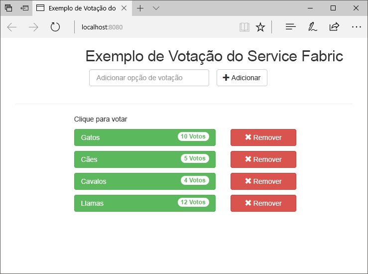
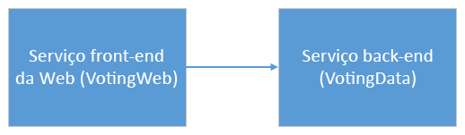
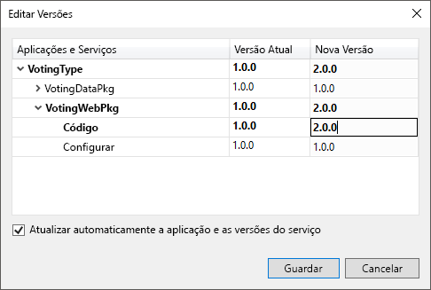
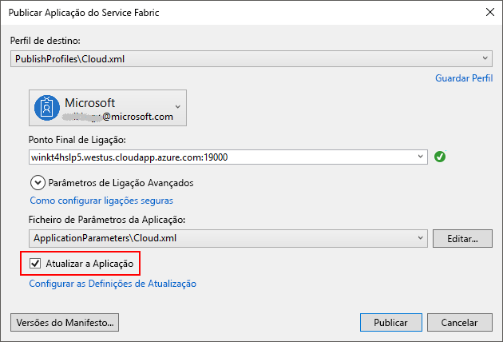
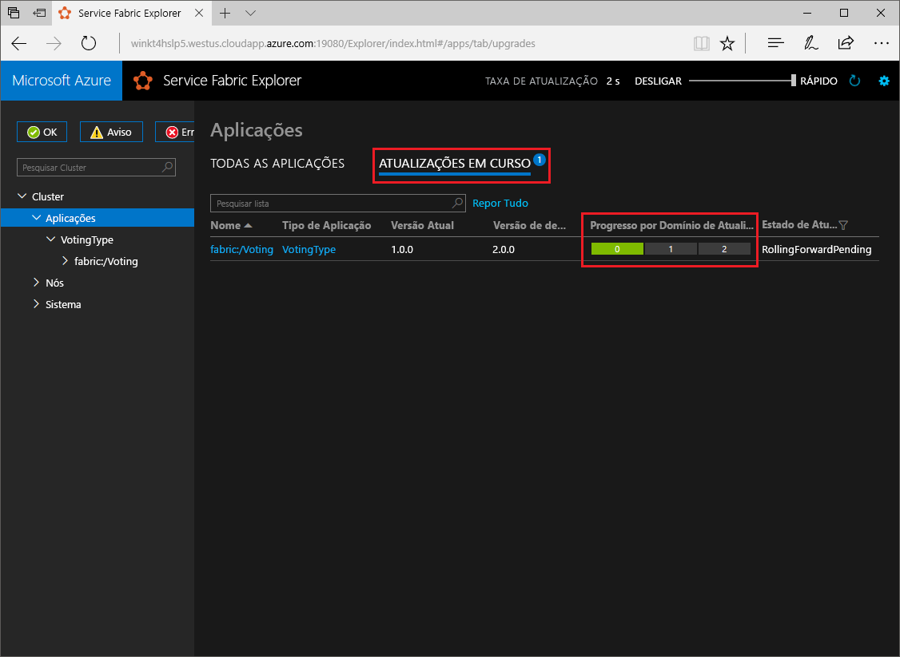

# <a name="quickstart-deploy-a-net-reliable-services-application-to-service-fabric"></a>Início rápido: Implantar um aplicativo do .NET Reliable Services para Service Fabric

O Azure Service Fabric é uma plataforma de sistemas distribuídos par implementar e gerir microsserviços e contentores dimensionáveis e fiáveis.

Este início rápido mostra como implementar a sua primeira aplicação .NET no Service Fabric. Quando tiver terminado, terá uma aplicação de votações com um front-end da Web ASP.NET que guarda os resultados das votações num serviço de back-end com estado no cluster.



Com esta aplicação, vai aprender a:

* Criar uma aplicação com .NET e o Service Fabric
* Usar o ASP.NET Core como um front-end da Web
* Armazenar dados da aplicação num serviço com estado
* Depurar a sua aplicação localmente
* Aumentar horizontalmente a aplicação em vários nós
* Realizar atualizações sem interrupção de aplicações

## <a name="prerequisites"></a>Pré-requisitos

Para concluir este guia de início rápido:

1. [Instale o Visual Studio 2019](https://www.visualstudio.com/) com as cargas de trabalho de desenvolvimento e **ASP.net e** desenvolvimento para a Web **do Azure** .
2. [Instalar o Git](https://git-scm.com/)
3. [Instale o SDK do Microsoft Azure Service Fabric](https://www.microsoft.com/web/handlers/webpi.ashx?command=getinstallerredirect&appid=MicrosoftAzure-ServiceFabric-CoreSDK)
4. Execute o comando seguinte para permitir que o Visual Studio implemente no cluster do Service Fabric local:

   ```powershell
   Set-ExecutionPolicy -ExecutionPolicy Unrestricted -Force -Scope CurrentUser
   ```
    
## <a name="build-a-cluster"></a>Compilar um cluster

Depois de instalar o tempo de execução, os SDKs, as ferramentas do Visual Studio, o Docker e o Docker em execução, crie um cluster de desenvolvimento local de cinco nós.

> [!Note]
> O motivo para que o Docker seja executado quando você cria o cluster é para que o cluster seja criado com os recursos de contêiner habilitados. Se o Docker não estiver em execução, você precisará recriar o cluster para habilitar os recursos do contêiner.
> Embora seja desnecessário para esse início rápido específico, a instrução para que o Docker em execução quando você cria o cluster está incluída como uma prática recomendada.
> Teste se o Docker está em execução ao abrir uma janela de terminal e ao executar `docker ps` para ver se ocorre um erro. Se a resposta não indicar um erro, o Docker está a ser executado e está pronto para compilar um cluster.

1. Abra uma nova janela do PowerShell elevada como administrador.
2. Execute o seguinte comando do PowerShell para criar um cluster de desenvolvimento:

   ```powershell
   . "C:\Program Files\Microsoft SDKs\Service Fabric\ClusterSetup\DevClusterSetup.ps1"
   ```
3. Execute o seguinte comando para iniciar a ferramenta Gerenciador de cluster local:

   ```powershell
   . "C:\Program Files\Microsoft SDKs\Service Fabric\Tools\ServiceFabricLocalClusterManager\ServiceFabricLocalClusterManager.exe"
   ```

>[!NOTE]
> O exemplo de aplicação neste guia de introdução utiliza funcionalidades que não estão disponíveis no Windows 7.
>

## <a name="download-the-sample"></a>Transferir o exemplo

Numa janela do comando, execute o seguinte comando para clonar o repositório da aplicação de exemplo para o seu computador local.

```git
git clone https://github.com/Azure-Samples/service-fabric-dotnet-quickstart
```

## <a name="run-the-application-locally"></a>Executar a aplicação localmente

Clique com o botão direito do rato no ícone do Visual Studio, no Menu Iniciar, e escolha **Executar como administrador**. Para anexar o depurador aos seus serviços, você precisa executar o Visual Studio como administrador.

Abra a solução **Voting.sln** do Visual Studio no repositório que clonou.

Por padrão, o aplicativo de votação escuta na porta 8080.  A porta da aplicação está definida no ficheiro */VotingWeb/PackageRoot/ServiceManifest.xml*.  Pode atualizar o atributo **Port** do elemento **Endpoint** para alterá-la.  Para implementar e executar a aplicação localmente, a porta da aplicação tem de estar aberta e disponível no seu computador.  Se você alterar a porta do aplicativo, substitua o novo valor de porta do aplicativo por "8080" em todo este artigo.

Para implementar a aplicação, prima **F5**.

> [!NOTE]
> Na janela saída do Visual Studio, você verá a mensagem "a URL do aplicativo não está definida ou não é uma URL HTTP/HTTPS, de modo que o navegador não será aberto no aplicativo".  Esta mensagem não indica um erro, mas sim que o browser não se vai abrir automaticamente.

Quando a implantação for concluída, inicie um navegador e abra `http://localhost:8080` para exibir o front-end da Web do aplicativo.


Agora, pode adicionar um conjunto de opções de voto e começar a recolher votos. A aplicação é executada e armazena todos os dados no seu cluster do Service Fabric, sem que seja preciso uma base de dados separada.

## <a name="walk-through-the-voting-sample-application"></a>Percorrer a aplicação de votação de exemplo

A aplicação de votação é composta por dois serviços:

* Serviço de front-end da Web (VotingWeb) - um serviço de front-end da Web ASP.NET Core, que serve a página Web e expõe as APIs da Web para comunicar com o serviço de back-end.
* Serviço de back-end (VotingData) - um serviço Web ASP.NET Core, que expõe uma API para armazenar os resultados da votação num dicionário fiável que é persistido no disco.



Quando você votar no aplicativo, ocorrerão os seguintes eventos:

1. Um JavaScript envia o pedido de voto para a API Web no serviço de front-end Web como pedido HTTP PUT.

2. O serviço de front-end da Web utiliza um proxy para localizar e reencaminhar um pedido HTTP PUT para o serviço de back-end.

3. O serviço de back-end recebe o pedido de entrada e armazena os resultados atualizados num dicionário fiável, que é replicado para vários nós dentro do cluster e persistido no disco. Todos os dados da aplicação são armazenados no cluster, pelo que não é necessária uma base de dados.

## <a name="debug-in-visual-studio"></a>Depurar no Visual Studio

A aplicação deve estar em execução OK, mas pode utilizar o depurador para ver como as partes das chaves do trabalho de aplicação. Ao depurar o aplicativo no Visual Studio, você está usando um cluster de desenvolvimento Service Fabric local. Você pode ajustar sua experiência de depuração ao seu cenário. Nesta aplicação, os dados são armazenados no serviço de back-end através de um dicionário fiável. O Visual Studio remove a aplicação por predefinição, quando para o depurador. Remover a aplicação faz com que os dados no serviço de back-end sejam também removidos. Para persistir os dados entre as sessões de depuração, pode alterar o **Modo de Depuração da Aplicação** como propriedade no projeto **Voting** no Visual Studio.

Para ver o que acontece no código, conclua os passos seguintes:

1. Abra o ficheiro **/VotingWeb/Controllers/VotesController.cs** e defina um ponto de interrupção no método **Put** da API Web (linha 69). Pode procurar o ficheiro no Explorador de Soluções no Visual Studio.

2. Abra o ficheiro **/VotingData/Controllers/VoteDataController.cs** e defina um ponto de interrupção no método **Put** desta API Web (linha 54).

3. Regresse ao browser e clique numa opção de votação ou adicione uma opção nova. Atingiu o primeiro ponto de interrupção no controlador de API do front-end da Web.
   * Esta etapa é onde o JavaScript no navegador envia uma solicitação ao controlador da API Web no serviço de front-end.

     

   * Primeiro, construa o URL para o ReverseProxy para o nosso serviço de back-end **(1)** .
   * Em seguida, envie o Pedido HTTP PUT para ReverseProxy **(2)** .
   * Por último, devolva a resposta do serviço de back-end para o cliente **(3)** .

4. Prima **F5** para continuar
   - Se lhe for pedido pelo browser, conceda permissões para o Modo de Depuração de leitura e execução ao grupo ServiceFabricAllowedUsers.
   - Agora você está no ponto de interrupção no serviço de back-end.

     

   - Na primeira linha no método **(1)** , `StateManager` obtém ou adiciona um dicionário fiável chamado `counts`.
   - Todas as interações com os valores num dicionário fiável requer uma transação; a utilização da declaração **(2)** cria essa transação.
   - Na transação, atualize o valor da chave relevante para a opção de votação e consolide a operação **(3)** . Quando é devolvido o método de consolidação, os dados são atualizados no dicionário e replicados para outros nós do cluster. Os dados estão agora armazenados em segurança no cluster e o serviço de back-end pode fazer a ativação pós-falha para outros nós, mantendo os dados disponíveis.
5. Prima **F5** para continuar

Para parar a sessão de depuração, prima **Shift + F5**.

## <a name="perform-a-rolling-application-upgrade"></a>Realizar atualizações sem interrupção de aplicações

O Service Fabric implementa as atualizações novas na sua aplicação de forma segura. As atualizações sem interrupção evitam períodos de indisponibilidade, bem como reversão automática, caso ocorram erros.

Para atualizar a aplicação, faça o seguinte:

1. Abra o ficheiro **/VotingWeb/Views/Home/Index.cshtml** no Visual Studio.
2. Altere o cabeçalho da página ao adicionar ou atualizar o texto. Por exemplo, altere o cabeçalho para "Exemplo de Aplicação de Votação v2" do Service Fabric".
3. Guarde o ficheiro.
4. Clique com o botão direito do rato em **Voting**, no Explorador de Soluções, e escolha **Publish** (Publicar). É apresentada a caixa de diálogo Publicar.
5. Clique no botão **Manifest Version** (Versão do Manifesto) para alterar a versão do serviço e da aplicação.
6. Altere a versão do elemento **Code** em **VotingWebPkg** para "2.0.0", por exemplo, e clique em **Save** (Guardar).

    
7. No diálogo **publicar Service Fabric aplicativo** , marque a **caixa de seleção atualizar o aplicativo**.
8.  Altere **o perfil de destino** para **PublishProfiles\Local.5Node.xml** e verifique se o ponto de extremidade de **conexão** está definido como **cluster local**. 
9. Selecione **atualizar o aplicativo**.

    

10. Clique em **Publicar**.

    Pode continuar a utilizar a aplicação enquanto a atualização estiver em execução. Uma vez que tem duas instâncias do serviço em execução no cluster, alguns dos seus pedidos poderão receber uma versão atualizada da aplicação e outros continuar a versão antiga.

11. Abra o navegador e navegue até o endereço do cluster na porta 19080. Por exemplo, `http://localhost:19080/`.
12. Clique no nó **Applications** (Aplicações) na vista de árvore e em **Upgrades in Progress** (Atualizações em Curso), no painel do lado direito. Pode ver de que forma é que a atualização é aplicada nos domínios de atualização do seu cluster e confirmar que cada domínio está em bom estado de funcionamento antes de avançar para o seguinte. Após o estado de funcionamento de um domínio ter sido verificado, o domínio de atualização aparece a verde na barra de progresso.
    

    O Service Fabric torna as atualizações seguras, ao aguardar dois minutos após atualizar o serviço em cada nó do cluster. A atualização completa deverá demorar aproximadamente oito minutos.

## <a name="next-steps"></a>Passos seguintes

Neste início rápido, aprendeu a:

* Criar uma aplicação com .NET e o Service Fabric
* Usar o ASP.NET Core como um front-end da Web
* Armazenar dados da aplicação num serviço com estado
* Depurar a sua aplicação localmente
* Aumentar horizontalmente a aplicação em vários nós
* Realizar atualizações sem interrupção de aplicações

Para saber mais sobre o Service Fabric e .NET, veja este tutorial:
> [!div class="nextstepaction"]
> [Aplicação .NET no Service Fabric](service-fabric-tutorial-create-dotnet-app.md)
