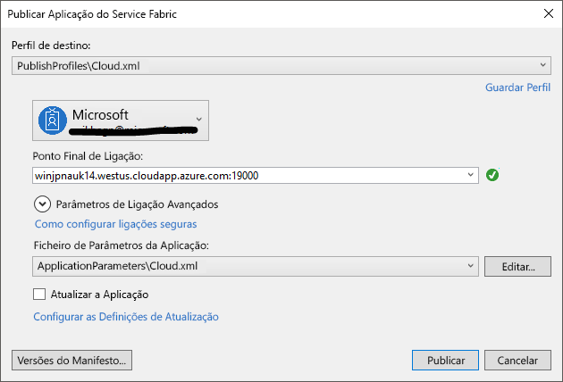

# <a name="tutorial-deploy-a-service-fabric-application-to-a-cluster-in-azure"></a>Tutorial: Implementar uma aplicação do Service Fabric num cluster no Azure

Este tutorial é a segunda parte de uma série. Mostra-lhe como implementar uma aplicação do Azure Service Fabric num novo cluster no Azure.

Neste tutorial, ficará a saber como:
> [!div class="checklist"]
> * Criar um aglomerado.
> * Implementar uma aplicação num cluster remoto com o Visual Studio.

Nesta série de tutoriais, ficará a saber como:
> [!div class="checklist"]
> * [Construa uma aplicação de tecido de serviço .NET](service-fabric-tutorial-create-dotnet-app.md).
> * Implementar a aplicação num cluster remoto.
> * [Adicione um ponto final HTTPS a um serviço frontal core ASP.NET](service-fabric-tutorial-dotnet-app-enable-https-endpoint.md).
> * [Configurar CI/CD com o Azure Pipelines](service-fabric-tutorial-deploy-app-with-cicd-vsts.md).
> * [Configurar monitorização e diagnósticos para a aplicação](service-fabric-tutorial-monitoring-aspnet.md).

## <a name="prerequisites"></a>Pré-requisitos

Antes de começar este tutorial:

* Se não tiver uma subscrição do Azure, crie uma [conta gratuita](https://azure.microsoft.com/free/?WT.mc_id=A261C142F).
* [Instale o Visual Studio 2019](https://www.visualstudio.com/)e instale as cargas de trabalho de desenvolvimento do **Azure** e **ASP.NET e desenvolvimento web.**
* [Instale o SDK do Service Fabric](service-fabric-get-started.md).

> [!NOTE]
> Uma conta gratuita pode não satisfazer os requisitos para criar uma máquina virtual. Isto impedirá a conclusão do tutorial. Além disso, uma conta não profissional ou não escolar pode encontrar problemas de permissão enquanto cria o certificado no teclado associado ao cluster. Se sentir um erro relacionado com a criação de certificados, utilize o Portal para criar o cluster. 

## <a name="download-the-voting-sample-application"></a>Transferir o exemplo de aplicação de votação

Se não conseguiu criar a aplicação de votação de exemplo na [primeira parte desta série de tutoriais](service-fabric-tutorial-create-dotnet-app.md), pode transferi-la. Numa janela de comando, execute o seguinte código para clonar o repositório de aplicação da amostra para a sua máquina local.

```git
git clone https://github.com/Azure-Samples/service-fabric-dotnet-quickstart 
```

Abra a aplicação no Visual Studio, funcionando como administrador, e construa a aplicação.

## <a name="create-a-cluster"></a>Criar um cluster

Agora que a aplicação está pronta, cria-se um cluster de Tecido de Serviço e, em seguida, implementa a aplicação para o cluster. Um [cluster de tecido](./service-fabric-deploy-anywhere.md) de serviço é um conjunto de máquinas virtuais ou físicas ligadas à rede em que os seus microserviços são implantados e geridos.

Neste tutorial, cria-se um novo cluster de teste de três nós no IDE do Estúdio Visual e depois publica a aplicação para esse cluster. Consulte o [Create e gere um tutorial de cluster](service-fabric-tutorial-create-vnet-and-windows-cluster.md) para obter informações sobre a criação de um cluster de produção. Também pode implementar a aplicação num cluster existente que criou anteriormente através do [portal Azure,](https://portal.azure.com)utilizando scripts [PowerShell](./scripts/service-fabric-powershell-create-secure-cluster-cert.md) ou [Azure CLI,](./scripts/cli-create-cluster.md) ou a partir de um [modelo de Gestor de Recursos Azure](service-fabric-tutorial-create-vnet-and-windows-cluster.md).

> [!NOTE]
> A aplicação De Voto, e muitas outras aplicações, usam o proxy reverso do Tecido de Serviço para comunicar entre serviços. Os clusters criados a partir do Visual Studio têm o proxy invertido ativado por padrão. Se estiver a implantar-se num cluster existente, tem de [ativar o proxy inverso no cluster](service-fabric-reverseproxy-setup.md) para que a aplicação de voto funcione.


### <a name="find-the-votingweb-service-endpoint"></a>Localizar o ponto final de serviço do VotingWeb

O serviço web frontal da aplicação Vote está a ouvir numa porta específica (8080 se seguir os passos na [primeira parte desta série tutorial](service-fabric-tutorial-create-dotnet-app.md). Quando implementa a aplicação num cluster do Azure, tanto o cluster como a aplicação são executados atrás de um balanceador de carga do Azure. A porta de aplicação deve ser aberta no equilibrador de carga Azure utilizando uma regra. A regra envia o tráfego de entrada através do balançador de carga para o serviço web. A porta encontra-se no ficheiro **VotingWeb/PackageRoot/ServiceManifest.xml** no elemento **Endpoint**. 

```xml
<Endpoint Protocol="http" Name="ServiceEndpoint" Type="Input" Port="8080" />
```

Tome nota do ponto final de serviço, que é necessário num passo posterior.  Se estiver a implantar-se num cluster existente, abra esta porta criando uma regra de equilíbrio de carga e sonda no equilibrador de carga Azure utilizando um [script PowerShell](./scripts/service-fabric-powershell-open-port-in-load-balancer.md) ou através do equilibrador de carga para este cluster no [portal Azure](https://portal.azure.com).

### <a name="create-a-test-cluster-in-azure"></a>Criar um cluster de teste em Azure
No Explorador de Soluções, clique com o botão direito do rato em **Voting** e selecione **Publish** (Publicar).

No **ponto final de ligação,** selecione Criar novo **cluster**.  Se estiver a implantar para um cluster existente, selecione o ponto final do cluster da lista.  O diálogo do Cluster de Tecido de Serviço criar abre.'

No **separador Cluster,** insira o **nome Cluster** (por exemplo, "mytestcluster"), selecione a sua subscrição, selecione uma região para o cluster (como o South Central US), introduza o número de nós de cluster (recomendamos três nós para um cluster de teste) e insira um grupo de recursos (como "mytestclustergroup"). Clique em **Seguinte**.


No **separador Certificado,** introduza a palavra-passe e o percurso de saída para o certificado de cluster. Um certificado auto-assinado é criado como um ficheiro PFX e guardado na trajetória de saída especificada.  O certificado é utilizado tanto para a segurança nó-a-nó como para a segurança do cliente-a-nó.  Não use um certificado auto-assinado para clusters de produção.  Este certificado é utilizado pelo Visual Studio para autenticar com o cluster e implementar aplicações. **Selecione certificado de importação** para instalar o PFX no CurrentUser\A minha loja de certificados do seu computador.  Clique em **Seguinte**.


No **separador VM Detail,** insira o **nome de utilizador** e a **palavra-passe** para a conta de administração do cluster.  Selecione a **imagem da máquina Virtual** para os nós de cluster e o tamanho da máquina **Virtual** para cada nó de cluster.  Clique no separador **Avançado.**


Nos Portos , **insira** o ponto final do serviço VotingWeb a partir do passo anterior (por exemplo, 8080).  Quando o cluster é criado, estas portas de aplicação são abertas no equilibrador de carga Azure para encaminhar o tráfego para o cluster.  Clique em **Criar** para criar o cluster, que demora vários minutos.


## <a name="publish-the-application-to-the-cluster"></a>Publicar a aplicação para o cluster

Quando o novo cluster estiver pronto, pode implementar a aplicação de Votação diretamente do Visual Studio.

No Explorador de Soluções, clique com o botão direito do rato em **Voting** e selecione **Publish** (Publicar). É apresentada a caixa de diálogo **Publicar**.

Em **Connection Endpoint**, selecione o ponto final para o cluster que criou no passo anterior.  Por exemplo, "mytestcluster.southcentral.cloudapp.azure.com:19000". Se selecionar **Parâmetros de Ligação Avançados,** as informações do certificado devem ser preenchidas automaticamente.  


Selecione **Publicar**.

Uma vez implementada a aplicação, abra um browser e introduza o endereço de cluster seguido de **:8080**. Ou introduza outra porta, se estiver configurada uma. Um exemplo é `http://mytestcluster.southcentral.cloudapp.azure.com:8080`. Deverá ver a aplicação em execução no cluster no Azure. Na página Web de votação, experimente adicionar e eliminar as opções de votação e votar numa ou em várias destas opções.


## <a name="next-steps"></a>Passos seguintes
Nesta parte do tutorial, ficou a saber como:

> [!div class="checklist"]
> * Criar um aglomerado.
> * Implementar uma aplicação num cluster remoto com o Visual Studio.

Avance para o tutorial seguinte:
> [!div class="nextstepaction"]
> [Ativar HTTPS](service-fabric-tutorial-dotnet-app-enable-https-endpoint.md)
