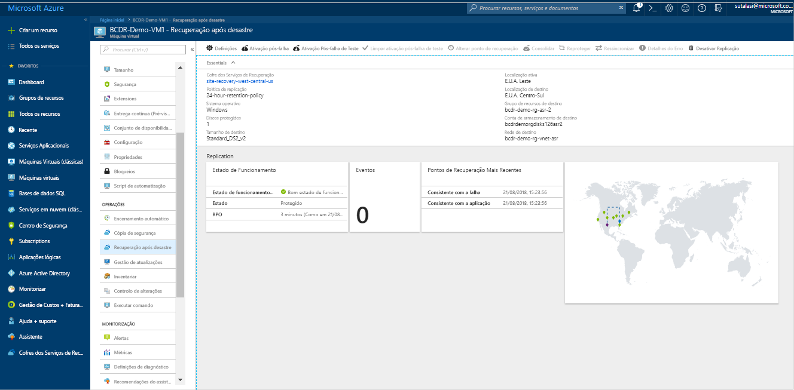

# Configurar a recuperação após desastre para uma região secundária do Azure de uma VM do Azure        

O serviço [Azure Site Recovery](site-recovery-overview.md) contribui para a sua estratégia de continuidade comercial e recuperação após desastre (BCDR) ao manter as suas aplicações empresariais em funcionamento e durante falhas planeadas e não planeadas. O Site Recovery gere e orquestra a recuperação após desastre de computadores no local e máquinas virtuais (VMs) do Azure, incluindo replicação, ativação pós-falha e recuperação.

Este guia de início rápido descreve como configurar a recuperação de desastre para uma VM do Azure replicando-a para uma região diferente do Azure.

Se não tiver uma subscrição do Azure, crie uma [conta gratuita](https://azure.microsoft.com/free/?WT.mc_id=A261C142F) antes de começar.

> [!NOTE]
> Este artigo é uma explicação rápida para novos usuários. Ele usa o caminho mais simples, com opções padrão e personalização mínima.  Para obter uma explicação detalhada, consulte [nosso tutorial](azure-to-azure-tutorial-enable-replication.md).

## Iniciar sessão no Azure

Inicie sessão no portal do Azure em https://portal.azure.com.

## Ativar a replicação para a VM do Azure

1. No portal do Azure, clique em **Máquinas virtuais** e selecione a VM que pretende replicar.
2. Nas **Operações**, clique em **Recuperação após desastre**.
3. Em **Configurar recuperação após desastre** > **Região de destino**, selecione a região de destino para a qual irá replicar.
4. Para este Início Rápido, aceite as outras predefinições.
5. Clique em **Ativar replicação**. Esta ação inicia uma tarefa para ativar a replicação para a VM.

    

## Verificar as definições

Após a tarefa de replicação ser concluída, pode ver o estado da replicação, modificar a replicação e testar a implementação.

1. Nas **Operações**, clique em **Recuperação após desastre**.
2. Pode verificar o estado de funcionamento da replicação, os pontos de recuperação que foram criados e as regiões de origem e destino num mapa.

   

## Limpar recursos

A VM na região primária para de replicar quando desativa a replicação na mesma:

- As definições de replicação da origem são limpas automaticamente. A extensão de Site Recovery instalada na VM como parte da replicação não é removida e deve ser removida manualmente. 
- Site Recovery a cobrança pela VM é interrompida.

Parar a replicação da seguinte maneira

1. Selecione a VM.
2. Na **Recuperação após desastre**, clique em **Desativar Replicação**.

   

## Passos Seguintes

Neste início rápido, replicou uma única VM numa região secundária. Agora, tente replicar várias VMs do Azure usando um plano de recuperação.

> [!div class="nextstepaction"]
> [Configurar a recuperação após desastre para VMs do Azure](azure-to-azure-tutorial-enable-replication.md)
