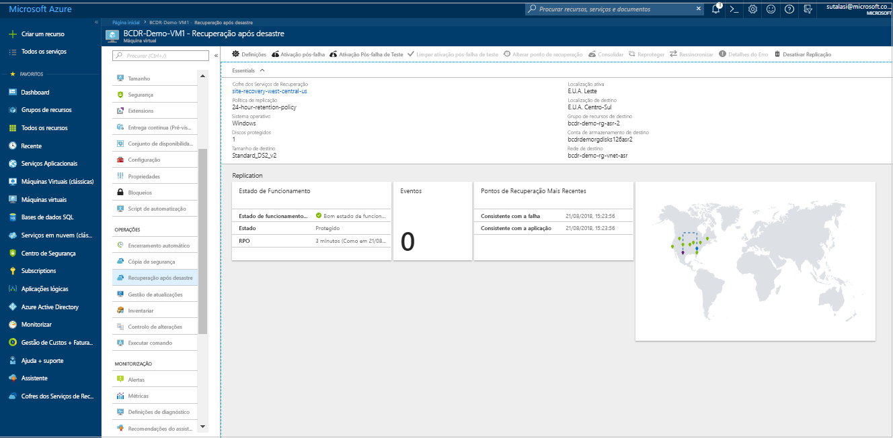

# Mover VMs do Azure para zonas de disponibilidade
As zonas de disponibilidade no Azure ajudam a proteger as suas aplicações e dados de falhas de datacenter. Cada Zona de Disponibilidade é composta por um ou mais datacenters equipados com energia, refrigeração e rede independentes. Para garantir a resiliência, existe um mínimo de três zonas separadas em todas as regiões ativadas. A separação física das zonas de disponibilidade numa região ajuda a proteger aplicações e dados contra falhas de datacenter. Com as zonas de disponibilidade, o Azure oferece um contrato de nível de serviço (SLA) de 99,99% de tempo de atividade de máquinas virtuais (VMs). As zonas de disponibilidade são suportadas em determinadas regiões, conforme mencionado na [quais são as zonas de disponibilidade no Azure?](https://docs.microsoft.com/azure/availability-zones/az-overview#regions-that-support-availability-zones).

Num cenário em que as suas VMs são implementadas como *única instância* numa região específica e deseja melhorar a disponibilidade ao mover estas VMs para uma zona de disponibilidade, pode fazê-lo com o Azure Site Recovery. Esta ação ainda mais pode ser categorizada em:

- Mover VMs de instância única para zonas de disponibilidade numa região de destino
- Mover as VMs num conjunto em zonas de disponibilidade numa região de destino de disponibilidade

> [!IMPORTANT]
> Atualmente, o Azure Site Recovery suporta mover VMs de uma região para outra mas não suporta a movimentação dentro de uma região.

## Verificar os pré-requisitos

- Verificar se a região de destino tem [suporte para zonas de disponibilidade](https://docs.microsoft.com/azure/availability-zones/az-overview#regions-that-support-availability-zones). Verifique se sua escolha de [combinação de região de destino/região de origem é suportada](https://docs.microsoft.com/azure/site-recovery/azure-to-azure-support-matrix#region-support). Tome uma decisão informada sobre a região de destino.
- Certifique-se de que compreende a [arquitetura e os componentes do cenário](azure-to-azure-architecture.md).
- Veja os [requisitos e limitações de suporte](azure-to-azure-support-matrix.md).
- Verifique as permissões de conta. Se acabou de criar sua conta gratuita do Azure, é o administrador da sua subscrição. Se não o administrador de subscrição, trabalhe com o administrador para atribuir as permissões que necessárias. Para ativar a replicação para uma VM e, eventualmente, copiar dados para o destino com o Azure Site Recovery, tem de ter:

    1. Permissão para criar uma VM nos recursos do Azure. O *contribuinte de Máquina Virtual* a função incorporada tem estas permissões, que incluem:
        - Permissão para criar uma VM no grupo de recursos selecionado
        - Permissão para criar uma VM na rede virtual selecionada
        - Permissão para escrever na conta de armazenamento selecionada

    2. Permissão para gerir as tarefas de recuperação de sites do Azure. O *contribuinte do Site Recovery* função tem todas as permissões necessárias para gerir as ações do Site Recovery num cofre dos serviços de recuperação.

## Preparar as VMs de origem

1. As VMs devem utilizar discos geridos, se quiser movê-los numa zona de disponibilidade com o Site Recovery. Pode converter VMs existentes do Windows que utilizam discos não geridos para utilizar discos geridos. Siga os passos indicados em [converter uma máquina virtual do Windows de discos não geridos para managed disks](https://docs.microsoft.com/azure/virtual-machines/windows/convert-unmanaged-to-managed-disks). Certifique-se de que o conjunto de disponibilidade está configurado como *geridos*.
2. Verifique se todos os certificados de raiz mais recentes estão presentes nas VMs do Azure que pretende mover. Se os certificados de raiz mais recentes não estão presentes, a cópia de dados para a região de destino não pode ser ativada devido a restrições de segurança.

3. Para VMs do Windows, instale todas as atualizações mais recentes do Windows na VM, para que todos os certificados de raiz fidedigna fiquem na máquina. Num ambiente desligado, siga os padrão Windows update e o certificado de processos de atualização para a sua organização.

4. Para VMs do Linux, siga as orientações fornecidas pelo distribuidor do Linux para obter os certificados de raiz fidedigna mais recentes e a lista de revogação de certificado na VM.
5. Certifique-se de que não utilize um proxy de autenticação para controlar a conectividade de rede para as VMs que pretende mover.

6. Se a VM está a tentar mover não tem acesso à internet e utiliza um proxy de firewall para controlar o acesso de saída, verifique os requisitos na [ configurar a conectividade de rede de saída](azure-to-azure-tutorial-enable-replication.md#configure-outbound-network-connectivity).

7. Identifique o esquema de rede de origem e os recursos que utiliza atualmente para a verificação, incluindo balanceadores de carga, os NSGs e IP público.

## Preparar a região de destino

1. Verifique que a sua subscrição do Azure permite-lhe criar VMs na região de destino utilizada para recuperação após desastre. Se necessário, contacto de suporte para ativar a quota necessária.

2. Certifique-se de que a sua subscrição tem recursos suficientes para suportar as VMs com tamanhos que correspondem às VMs de origem. Se utilizar o Site Recovery para copiar dados para o destino, ele escolhe o mesmo tamanho ou o tamanho mais próximo possível da VM de destino.

3. Crie um recurso de destino para cada componente identificado no esquema de rede de origem. Esta ação garante que, depois de transitar para a região de destino, as VMs tenham todas as funcionalidades e funções que tinham na origem.

    > [!NOTE]
    > O Azure Site Recovery Deteta e cria uma conta de armazenamento e rede virtual, quando ativar a replicação para a VM de origem automaticamente. Também pode criar previamente estes recursos e atribuir à VM como parte do passo ativar replicação. Mas para outros recursos, como já foi mencionado mais tarde, terá de criá-los manualmente na região de destino.

     Os documentos seguintes informar sobre como criar os recursos de rede utilizadas com mais frequência que são relevantes para si, com base na configuração da VM de origem.

    - [Grupos de segurança de rede](https://docs.microsoft.com/azure/virtual-network/manage-network-security-group)
    - [Balanceadores de carga](https://docs.microsoft.com/azure/load-balancer/#step-by-step-tutorials)
    - [IP público](https://docs.microsoft.com/azure/load-balancer/#step-by-step-tutorials)
    
   Para outros componentes de rede, consulte o sistema de rede [documentação](https://docs.microsoft.com/azure/#pivot=products&panel=network).

    > [!IMPORTANT]
    > Certifique-se de que utiliza um balanceador de carga com redundância de zona no destino. Pode ler mais em [Balanceador de carga Standard e zonas de disponibilidade](https://docs.microsoft.com/azure/load-balancer/load-balancer-standard-availability-zones).

4. Manualmente [criar uma rede de não produção](https://docs.microsoft.com/azure/virtual-network/quick-create-portal) na região de destino se pretender testar a configuração antes de transitar para a região de destino. Recomendamos que essa abordagem porque faz com um mínimo interferência com o ambiente de produção.

## Ativar a replicação
Os seguintes passos irão guiá-lo ao utilizar o Azure Site Recovery para ativar a replicação de dados para a região de destino, antes de prosseguir, eventualmente, em zonas de disponibilidade.

> [!NOTE]
> Essas etapas são para uma única VM. Pode expandir o mesmo para as várias VMs. Vá para o Cofre de serviços de recuperação, selecione **+ replicar**e selecione as VMs relevantes em conjunto.

1. No portal do Azure, selecione **máquinas virtuais**e selecione a VM que pretende mover para zonas de disponibilidade.
2. Na **Operations**, selecione **recuperação após desastre**.
3. Na **configurar a recuperação após desastre** > **região de destino**, selecione a região de destino ao qual irá replicar. Certifique-se nesta região [suporta](https://docs.microsoft.com/azure/availability-zones/az-overview#regions-that-support-availability-zones) zonas de disponibilidade.

    

4. Selecione **seguinte: Definições avançadas**.
5. Escolha os valores adequados para a subscrição de destino, o grupo de recursos VM de destino e a rede virtual.
6. Na **disponibilidade** secção, selecione a zona de disponibilidade na qual pretende mover a VM. 
   > [!NOTE]
   > Se não vir a opção para o conjunto de disponibilidade ou a zona de disponibilidade, certifique-se de que o [pré-requisitos](#prepare-the-source-vms) são cumpridos e a [preparação](#prepare-the-source-vms) de VMs de origem estiver concluída.
  
    

7. Selecione **Ativar Replicação**. Esta ação inicia uma tarefa para ativar a replicação para a VM.

## Verifique as definições

Após a tarefa de replicação ser concluída, pode ver o estado da replicação, modificar a replicação e testar a implementação.

1. No menu da VM, selecione **recuperação após desastre**.
2. Pode verificar o estado de funcionamento da replicação, os pontos de recuperação que foram criados e a origem e regiões de destino no mapa.

   

## Testar a configuração

1. No menu da máquina virtual, selecione **recuperação após desastre**.
2. Selecione o **ativação pós-falha de teste** ícone.
3. Na **ativação pós-falha de teste**, selecione um ponto de recuperação a utilizar para a ativação pós-falha:

   - **Processado mais recentemente**: Falha da VM através do ponto de recuperação mais recente processado pelo serviço do Site Recovery. O carimbo de data/hora é apresentado. Com esta opção, não é despendido tempo a processar os dados, pelo que oferece um RTO (objetivo de tempo de recuperação) baixo.
   - **Mais recente consistente com a aplicação**: Esta opção faz a ativação pós-falha de todas as VMs para o ponto de recuperação consistente com a aplicação mais recente. O carimbo de data/hora é apresentado.
   - **Custom**: Selecione qualquer ponto de recuperação.

3. Selecione o teste de rede virtual do Azure para o qual pretende mover as VMs do Azure para testar a configuração de destino. 

    > [!IMPORTANT]
    > Recomendamos que utilize uma rede de VM do Azure separada para a falha de teste e não a rede de produção na região de destino no qual deseja mover as suas VMs.

4. Para começar a testar a mudança, selecione **OK**. Para controlar o progresso, selecione a VM para abrir as respetivas propriedades. Em alternativa, pode selecionar o **ativação pós-falha de teste** tarefa no nome do cofre > **definições** > **tarefas** > **tarefas do Site Recovery**.
5. Após a conclusão da ativação pós-falha, a VM do Azure de réplica é apresentada no portal do Azure > **Máquinas Virtuais**. Certifique-se de que a VM está em execução, tem as dimensões adequadas e está ligada à rede devida.
6. Se pretender eliminar a VM criada como parte do teste a mudança, selecione **ativação pós-falha de teste de limpeza** no item replicado. Na **notas**, registe e guarde todas as observações associadas com o teste.

## Mover para a região de destino e confirmar

1.  No menu da máquina virtual, selecione **recuperação após desastre**.
2. Selecione o **ativação pós-falha** ícone.
3. Em **Ativação pós-falha**, selecione **Mais recente**. 
4. Selecione **Encerrar a máquina antes de iniciar a ativação pós-falha**. O Site Recovery tenta encerrar a VM de origem antes de acionar a ativação pós-falha. A ativação pós-falha continua, mesmo que o encerramento falhe. Pode seguir o progresso da ativação pós-falha na página **Trabalhos**. 
5. Depois da tarefa estiver concluída, verifique se a VM aparece a região do Azure de destino conforme esperado.
6. Em **Itens replicados**, clique com o botão direito do rato na VM > **Consolidar**. Isto conclui o processo de mover para a região de destino. Aguarde até que a tarefa de confirmação estiver concluída.

## Eliminar o recurso na região de origem

Vá para a VM. Selecione **desative a replicação**. Esta ação interromperá o processo de copiar os dados para a VM.  

> [!IMPORTANT]
> Execute o passo anterior para evitar ser cobrado para replicação do Site Recovery após a mudança. As definições de replicação da origem são limpas automaticamente. Tenha em atenção que a extensão de recuperação de sites que é instalada como parte da replicação não é removida e têm de ser removidos manualmente.

## Passos Seguintes

Neste tutorial, aumenta a disponibilidade de uma VM do Azure ao mover para um conjunto de disponibilidade ou a zona de disponibilidade. Agora pode definir a recuperação após desastre para a VM movida.

> [!div class="nextstepaction"]
> [Configurar a recuperação após desastre após a migração](azure-to-azure-quickstart.md)

