# <a name="quickstart-create-and-query-an-azure-sql-data-warehouse-in-the-azure-portal"></a>Início rápido: criar e consultar uma SQL Data Warehouse do Azure no portal do Azure

Crie e consulte rapidamente uma SQL Data Warehouse do Azure usando o portal do Azure.

Se não tiver uma subscrição do Azure, crie uma conta [gratuita](https://azure.microsoft.com/free/) antes de começar.

> [!NOTE]
> A criação de um SQL Data Warehouse poderá resultar num novo serviço sujeito a faturação. Para obter mais informações, veja [Preços do SQL Data Warehouse](https://azure.microsoft.com/pricing/details/sql-data-warehouse/).

## <a name="before-you-begin"></a>Antes de começar

Transfira e instale a versão mais recente do [SQL Server Management Studio](/sql/ssms/download-sql-server-management-studio-ssms) (SSMS).

## <a name="sign-in-to-the-azure-portal"></a>Iniciar sessão no portal do Azure

Iniciar sessão no [portal do Azure](https://portal.azure.com/).

## <a name="create-a-data-warehouse"></a>Criar um armazém de dados

Uma SQL Data Warehouse do Azure é criada com um conjunto definido de [recursos de computação](memory-concurrency-limits.md). A base de dados é criada num [Grupo de recursos do Azure](../azure-resource-manager/resource-group-overview.md) e num [servidor lógico SQL do Azure](../sql-database/sql-database-logical-servers.md). 

Siga estas etapas para criar um SQL Data Warehouse que contém os dados de exemplo AdventureWorksDW. 

1. Clique em **Criar um recurso**, no canto superior esquerdo do portal do Azure.

2. Selecione **Bases de Dados** na página **Novo** e selecione **Armazém de Dados SQL** em **Destaques** na página **Novo**.

    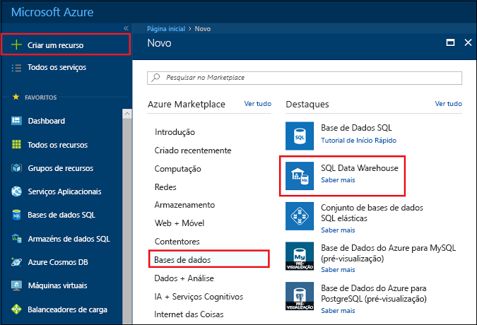

3. Preencha o formulário do SQL Data Warehouse com as seguintes informações:

    | Definição | Valor sugerido | Descrição |
    | :------ | :-------------- | :---------- |
    | **Nome da base de dados** | mySampleDataWarehouse | Para nomes de bases de dados válidos, veja [Database Identifiers](/sql/relational-databases/databases/database-identifiers) (Identificadores de Bases de Dados). Tenha em atenção que um armazém de dados é um tipo de base de dados.|
    | **Subscrição** | A sua subscrição | Para obter detalhes sobre as suas subscrições, veja [Subscriptions](https://account.windowsazure.com/Subscriptions) (Subscrições). |
    | **Grupo de recursos** | myResourceGroup | Para nomes de grupo de recursos válidos, veja [Naming rules and restrictions](/azure/cloud-adoption-framework/ready/azure-best-practices/naming-and-tagging) (Atribuição de nomes de regras e restrições). |
    | **Selecionar origem** | Sample | Especifica para carregar uma base de dados de exemplo. Tenha em atenção que um armazém de dados é um tipo de base de dados. |
    | **Selecionar exemplo** | AdventureWorksDW | Especifica para carregar a base de dados de exemplo AdventureWorksDW. |
    ||||

    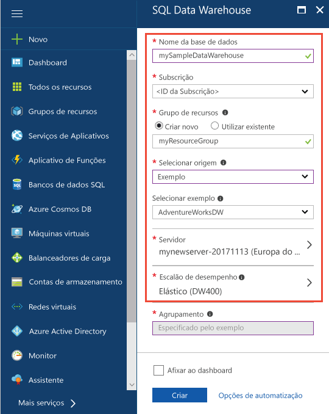

4. Clique em **Servidor** para criar e configurar um novo servidor para a nova base de dados. Preencha o **Novo formulário de servidor** com as seguintes informações: 

    | Definição | Valor sugerido | Descrição |
    | :------ | :-------------- | :---------- |
    | **Nome do servidor** | Qualquer nome globalmente exclusivo | Para nomes de servidores válidos, veja [Naming rules and restrictions](/azure/cloud-adoption-framework/ready/azure-best-practices/naming-and-tagging) (Atribuição de nomes de regras e restrições). |
    | **Início de sessão de administrador do servidor** | Qualquer nome válido | Para nomes de início de sessão válidos, veja [Database Identifiers](https://docs.microsoft.com/sql/relational-databases/databases/database-identifiers) (Identificadores de Bases de Dados).|
    | **Palavra-passe** | Qualquer palavra-passe válida | A sua palavra-passe deve ter, pelo menos, oito carateres e deve conter carateres de três das seguintes categorias: carateres maiúsculos, carateres minúsculos, números e carateres não alfanuméricos. |
    | **Localização** | Nenhuma localização válida | Para obter mais informações sobre regiões, veja [Azure Regions](https://azure.microsoft.com/regions/) (Regiões do Azure). |
    ||||

    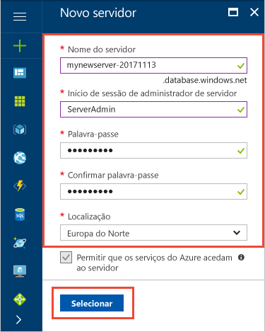

5. Clique em **Selecionar**.

6. Clique em **nível de desempenho** para especificar a configuração de desempenho para o data warehouse.

7. Para este tutorial, selecione **Gen2**. O controle deslizante, por padrão, é definido como **DW1000c**. Experimente movê-lo para cima e para baixo para ver como funciona. 

    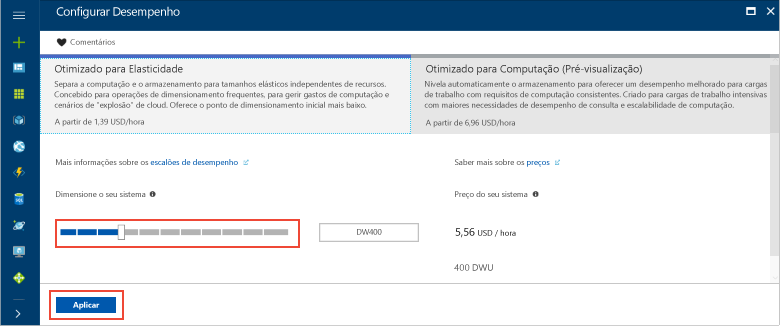

8. Clique em **Aplicar**.

9. Agora que você concluiu o formulário de SQL Data Warehouse, clique em **criar** para provisionar o banco de dados. O aprovisionamento demora alguns minutos.

    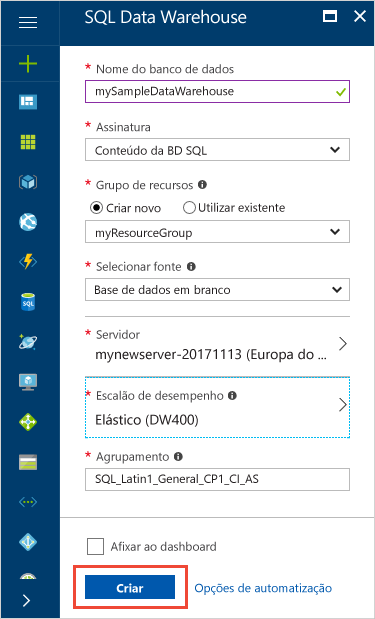

10. Na barra de ferramentas, clique em **Notificações** para monitorizar o processo de implementação.
    
     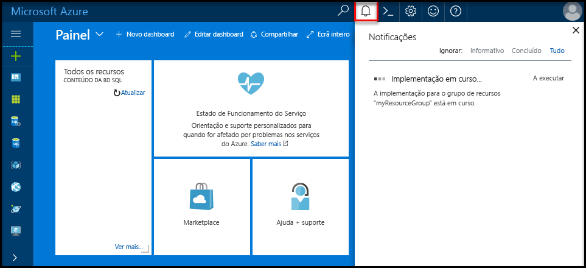

## <a name="create-a-server-level-firewall-rule"></a>Criar uma regra de firewall ao nível do servidor

O serviço de SQL Data Warehouse cria um firewall no nível do servidor. Esse Firewall impede que aplicativos e ferramentas externos se conectem ao servidor ou a qualquer banco de dados no servidor. Para permitir a conectividade, pode adicionar regras de firewall que permitem a conectividade para endereços IP específicos. Siga estes passos para criar uma [regra de firewall ao nível do servidor](../sql-database/sql-database-firewall-configure.md) para o endereço IP do cliente.

> [!NOTE]
> O SQL Data Warehouse comunica através da porta 1433. Se estiver a tentar ligar a partir de uma rede empresarial, o tráfego de saída através da porta 1433 poderá não ser permitido pela firewall da rede. Se assim for, não poderá ligar ao servidor da Base de Dados SQL do Azure, a menos que o departamento de TI abra a porta 1433.

1. Após a conclusão da implantação, selecione **todos os serviços** no menu à esquerda. Selecione **bancos**de dados, selecione a estrela ao lado de **SQL data warehouses** para adicionar SQL data warehouses aos seus favoritos.
1. Selecione **SQL data warehouses** no menu à esquerda e clique em **MySampleDataWarehouse** na página **SQL data warehouses** . A página Visão geral do seu banco de dados é aberta, mostrando o nome totalmente qualificado do servidor (como **mynewserver-20180430.Database.Windows.net**) e fornece opções para configuração adicional.
1. Copie esse nome de servidor totalmente qualificado para usar para se conectar ao seu servidor e seus bancos de dados neste e em outros inícios rápidos. Para abrir as definições do servidor, clique no nome do servidor.

   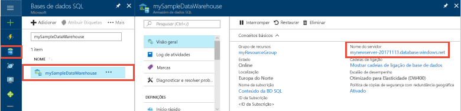

1. Clique em **Mostrar definições da firewall**.

   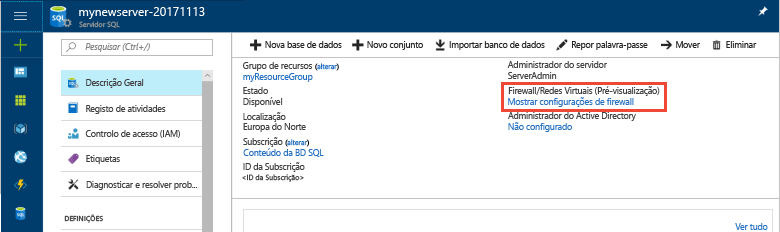

1. É aberta a página **Definições da firewall** do servidor da Base de Dados SQL.

   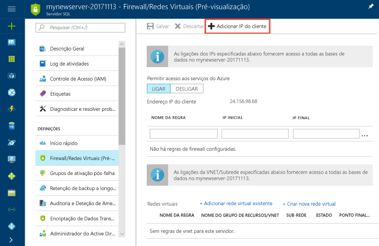

1. Para adicionar o endereço IP atual a uma nova regra de firewall, clique em **Adicionar IP de cliente**. Uma regra de firewall consegue abrir a porta 1433 para um único endereço IP ou para um intervalo de endereços IP.

1. Clique em **Guardar**. É criada uma regra de firewall ao nível do servidor para a sua porta de abertura 1433 do endereço IP atual no servidor lógico.

1. Clique em **OK** e, em seguida, feche a página **Definições da firewall**.

Agora, pode ligar ao servidor SQL e aos respetivos armazéns de dados com este endereço IP. A ligação funciona a partir do SQL Server Management Studio ou de outra ferramenta à sua escolha. Ao ligar, utilize a conta ServerAdmin que criou anteriormente.

> [!IMPORTANT]
> Por predefinição, o acesso através da firewall da Base de Dados SQL está ativado para todos os serviços do Azure. Clique em **DESATIVADO** nesta página e, em seguida, clique em **Guardar** para desativar a firewall para todos os serviços do Azure.

## <a name="get-the-fully-qualified-server-name"></a>Obter o nome de servidor completamente qualificado

Obtenha o nome de servidor completamente qualificado para o servidor SQL no portal do Azure. Utilizará mais tarde o nome completamente qualificado quando ligar ao servidor.

1. Iniciar sessão no [portal do Azure](https://portal.azure.com/).
2. Selecione **SQL data warehouses** no menu à esquerda e clique em seu data warehouse na página **SQL data warehouses** .
3. No painel **Essentials** na página do portal do Azure da sua base de dados, localize e, em seguida, copie o **Nome do servidor**. Neste exemplo, o nome totalmente qualificado é mynewserver-20180430.database.windows.net.

    

## <a name="connect-to-the-server-as-server-admin"></a>Ligar ao servidor como administrador do servidor

Esta secção utiliza o [SQL Server Management Studio](/sql/ssms/download-sql-server-management-studio-ssms) (SSMS) para estabelecer uma ligação ao servidor SQL do Azure.

1. Abra o SQL Server Management Studio.

2. Na caixa de dialogo **Ligar ao Servidor**, introduza as seguintes informações:

   | Definição | Valor sugerido | Descrição |
   | :------ | :-------------- | :---------- |
   | Tipo de servidor | Motor de base de dados | Este valor é obrigatório |
   | Nome do servidor | O nome de servidor completamente qualificado | Aqui está um exemplo: **mynewserver-20180430.Database.Windows.net**. |
   | Autenticação | Autenticação do SQL Server | A Autenticação do SQL é o único tipo de autenticação configurado neste tutorial. |
   | Iniciar sessão | A conta de administrador do servidor | Conta que você especificou quando criou o servidor. |
   | Palavra-passe | A palavra-passe da sua conta de administrador do servidor | Senha que você especificou quando criou o servidor. |
   ||||

    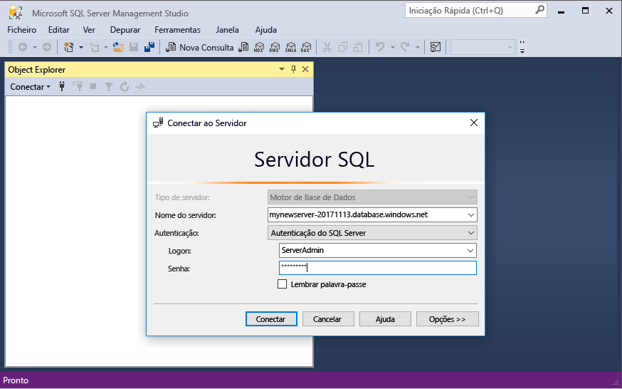

3. Clique em **Ligar**. A janela do Object Explorer é aberta no SSMS. 

4. No Object Explorer, expanda **Databases**. Em seguida, expanda **mySampleDatabase** para ver os objetos na nova base de dados.

    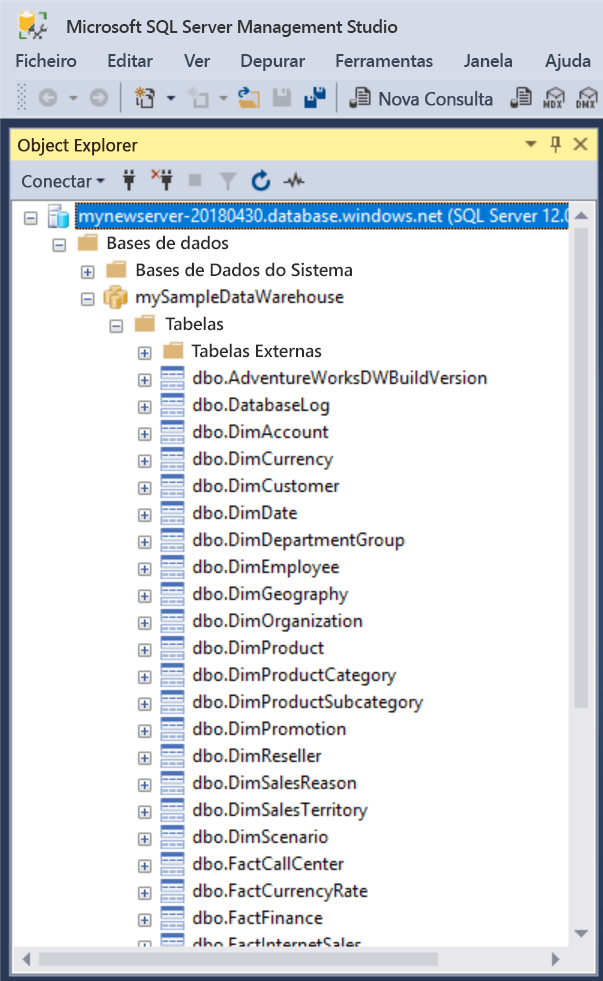 

## <a name="run-some-queries"></a>Executar algumas consultas

O SQL Data Warehouse utiliza o T-SQL como linguagem de consulta. Para abrir uma janela de consulta e executar algumas consultas de T-SQL, utilize os seguintes passos:

1. Clique com o botão direito do rato em **mySampleDataWarehouse** e selecione **Nova Consulta**. É aberta uma nova janela de consulta.
2. Na janela da consulta, introduza o seguinte comando para ver uma lista de bases de dados.

    ```sql
    SELECT * FROM sys.databases
    ```

3. Clique em **Executar**. Os resultados da consulta mostram duas bases de dados: **master** e **mySampleDataWarehouse**.

    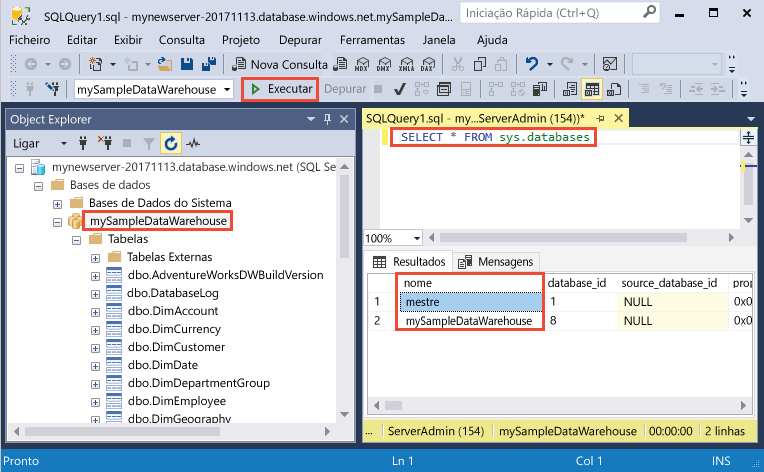

4. Para ver alguns dados, utilize o seguinte comando para ver o número de clientes com o apelido Adams com três filhos em casa. Os resultados listam seis clientes. 

    ```sql
    SELECT LastName, FirstName FROM dbo.dimCustomer
    WHERE LastName = 'Adams' AND NumberChildrenAtHome = 3;
    ```

    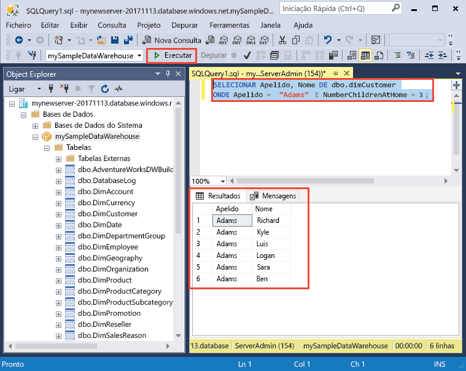

## <a name="clean-up-resources"></a>Limpar recursos

Você está sendo cobrado por unidades de data warehouse e dados armazenados em seu data warehouse. Estes recursos de computação e armazenamento são faturados em separado.

- Se quiser manter os dados no armazenamento, pode interromper a computação quando não estiver a utilizar o armazém de dados. Ao pausar a computação, você é cobrado apenas pelo armazenamento de dados. Você pode retomar a computação sempre que estiver pronto para trabalhar com os dados.
- Se quiser remover futuras cobranças, pode eliminar o armazém de dados.

Siga estas etapas para limpar os recursos que você não precisa mais.

1. Inicie sessão no [portal do Azure](https://portal.azure.com) e clique no seu armazém de dados.

    

2. Para interromper a computação, clique no botão **Pausar**. Quando o data warehouse estiver em pausa, você verá um botão **retomar** . Para retomar a computação, clique em **retomar**.

3. Para remover o data warehouse para que você não seja cobrado pela computação ou pelo armazenamento, clique em **excluir**.

4. Para remover o SQL Server que você criou, clique em **mynewserver-20180430.Database.Windows.net** na imagem anterior e, em seguida, clique em **excluir**. Tenha cuidado com esta eliminação, uma vez que eliminar o servidor também elimina todas as bases de dados atribuídas ao mesmo.

5. Para remover o grupo de recursos, clique em **myResourceGroup** e, em seguida, clique em **Eliminar grupo de recursos**.

## <a name="next-steps"></a>Passos seguintes

Agora você criou um data warehouse, criou uma regra de firewall, conectou-se à sua data warehouse e executou algumas consultas. Para saber mais sobre o Azure SQL Data Warehouse, avance para o tutorial para carregar dados.

> [!div class="nextstepaction"]
> [Carregar dados em um SQL Data Warehouse](load-data-from-azure-blob-storage-using-polybase.md)
