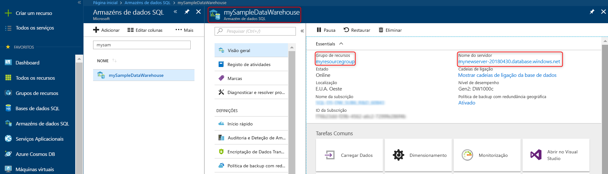

# <a name="quickstart-pause-and-resume-compute-in-synapse-sql-pool-with-azure-powershell"></a>Quickstart: Pausa e retoma a computação na piscina SQL synapse com Azure PowerShell

Pode utilizar o Azure PowerShell para fazer uma pausa e retomar os recursos de computação do pool SQL (data warehouse) da Synapse SQL. Se não tiver uma subscrição do Azure, crie uma conta [gratuita](https://azure.microsoft.com/free/) antes de começar.

## <a name="before-you-begin"></a>Antes de começar

[!INCLUDE [updated-for-az](../../includes/updated-for-az.md)]

Este quickstart assume que já tem uma piscina SQL que pode parar e retomar. Se precisar de criar um, pode utilizar o [Create and Connect - portal](create-data-warehouse-portal.md) para criar um pool SQL chamado **mySampleDataWarehouse**.

## <a name="log-in-to-azure"></a>Iniciar sessão no Azure

Inicie sessão na subscrição do Azure utilizando o comando [Connect-AzAccount](/powershell/module/az.accounts/connect-azaccount) e siga as instruções no ecrã.

```powershell
Connect-AzAccount
```

Para ver que subscrição está a utilizar, execute [a Subscrição Get-Az](/powershell/module/az.accounts/get-azsubscription).

```powershell
Get-AzSubscription
```

Se precisar de utilizar uma subscrição diferente da predefinida, execute o [Set-AzContext](/powershell/module/az.accounts/set-azcontext).

```powershell
Set-AzContext -SubscriptionName "MySubscription"
```

## <a name="look-up-sql-pool-information"></a>Procure informações sobre piscina SQL

Localize o nome da base de dados, o nome do servidor e o grupo de recursos para o pool SQL que planeia parar e retomar.

Siga estes passos para encontrar informações de localização para a sua piscina SQL:

1. Inicie sessão no [portal do Azure](https://portal.azure.com/).
1. Clique em **Azure Synapse Analytics (anteriormente SQL DW)** na página esquerda do portal Azure.
1. Selecione **mySampleDataWarehouse** da página **Azure Synapse Analytics (anteriormente SQL DW).** A piscina SQL abre.

    

1. Escreva o nome da piscina SQL, que é o nome da base de dados. Anote também o nome do servidor e do grupo de recursos.
1. Utilize apenas a primeira parte do nome do servidor nos cmdlets PowerShell. Na imagem anterior, o nome completo do servidor é sqlpoolservername.database.windows.net. Utilizamos o **nome de servidor sqlpoolcomo** nome de servidor no cmdlet PowerShell.

## <a name="pause-compute"></a>Computação de pausa

Para poupar custos, pode parar e retomar os recursos de computação a pedido. Por exemplo, se não estiver a utilizar a base de dados durante a noite e aos fins de semana, pode fazer uma pausa durante esses horários e retomá-la durante o dia. 

>[!NOTE]
>Não há nenhum custo para os recursos computacionais enquanto a base de dados é interrompida. No entanto, continua a ser cobrado para armazenamento.

Para interromper uma base de dados, utilize o cmdlet [suspend-AzSqlDatabase.](/powershell/module/az.sql/suspend-azsqldatabase) O exemplo seguinte faz uma pausa numa piscina SQL chamada **mySampleDataWarehouse** hospedada num servidor chamado **sqlpoolservername**. O servidor está num grupo de recursos Azure chamado **myResourceGroup**.


```Powershell
Suspend-AzSqlDatabase –ResourceGroupName "myResourceGroup" `
–ServerName "nsqlpoolservername" –DatabaseName "mySampleDataWarehouse"
```

O exemplo seguinte recupera a base de dados no $database objeto. Em seguida, canaliza o objeto para [suspender a Base de Dados Suspend-AzSql](/powershell/module/az.sql/suspend-azsqldatabase). Os resultados são armazenados no resultado do objectoBase de dados. O comando final mostra os resultados.

```Powershell
$database = Get-AzSqlDatabase –ResourceGroupName "myResourceGroup" `
–ServerName "sqlpoolservername" –DatabaseName "mySampleDataWarehouse"
$resultDatabase = $database | Suspend-AzSqlDatabase
$resultDatabase
```

## <a name="resume-compute"></a>Retomar a computação

Para iniciar uma base de dados, utilize o cmdlet de Base de [Dados Resume-AzSql.](/powershell/module/az.sql/resume-azsqldatabase) O exemplo seguinte inicia uma base de dados chamada **mySampleDataWarehouse** hospedada num servidor chamado **sqlpoolservername**. O servidor está num grupo de recursos Azure chamado **myResourceGroup**.

```Powershell
Resume-AzSqlDatabase –ResourceGroupName "myResourceGroup" `
–ServerName "sqlpoolservername" -DatabaseName "mySampleDataWarehouse"
```

O próximo exemplo recupera a base de dados no objeto $database. Em seguida, canaliza o objeto para [resume-AzSqlDatabase](/powershell/module/az.sql/resume-azsqldatabase) e armazena os resultados em $resultDatabase. O comando final mostra os resultados.

```Powershell
$database = Get-AzSqlDatabase –ResourceGroupName "myResourceGroup" `
–ServerName "sqlpoolservername" –DatabaseName "mySampleDataWarehouse"
$resultDatabase = $database | Resume-AzSqlDatabase
$resultDatabase
```

## <a name="check-status-of-your-sql-pool-operation"></a>Verifique o estado da sua operação de piscina SQL

Para verificar o estado da sua piscina SQL, utilize o cmdlet [Get-AzSqlDatabaseActivity.](https://docs.microsoft.com/powershell/module/az.sql/Get-AzSqlDatabaseActivity#description)

```Powershell
Get-AzSqlDatabaseActivity -ResourceGroupName "myResourceGroup" -ServerName "sqlpoolservername" -DatabaseName "mySampleDataWarehouse"
```

## <a name="clean-up-resources"></a>Limpar recursos

Está a ser cobrado por unidades de armazém de dados e dados armazenados na sua piscina SQL. Estes recursos de computação e armazenamento são faturados em separado.

- Se quiser manter os dados armazenados, faça uma pausa no cálculo.
- Se quiser remover futuras tarifas, pode eliminar a piscina SQL.

Siga estes passos para limpar os recursos conforme quiser.

1. Inscreva-se no [portal Azure](https://portal.azure.com)e clique na sua piscina SQL.

    

2. Para interromper a computação, clique no botão **Pausar**. Quando a piscina SQL estiver em pausa, consulte um botão **Iniciar.**  Para retomar a computação, clique em **Iniciar**.

3. Para remover a piscina SQL para que não seja cobrado para computação ou armazenamento, clique **em Eliminar**.

4. Para remover o servidor SQL que criou, clique **em sqlpoolservername.database.windows.net**, e, em seguida, clique em **Eliminar**.  Tenha cuidado com esta eliminação, uma vez que eliminar o servidor também elimina todas as bases de dados atribuídas ao mesmo.

5. Para remover o grupo de recursos, clique em **myResourceGroup** e, em seguida, clique em **Eliminar grupo de recursos**.


## <a name="next-steps"></a>Passos seguintes

Para saber mais sobre o pool SQL, continue a carregar os dados em artigo de [piscina SQL.](load-data-from-azure-blob-storage-using-polybase.md) Para obter informações adicionais sobre a gestão das capacidades computacionais, consulte o artigo de visão geral da [computação Manage.](sql-data-warehouse-manage-compute-overview.md) 