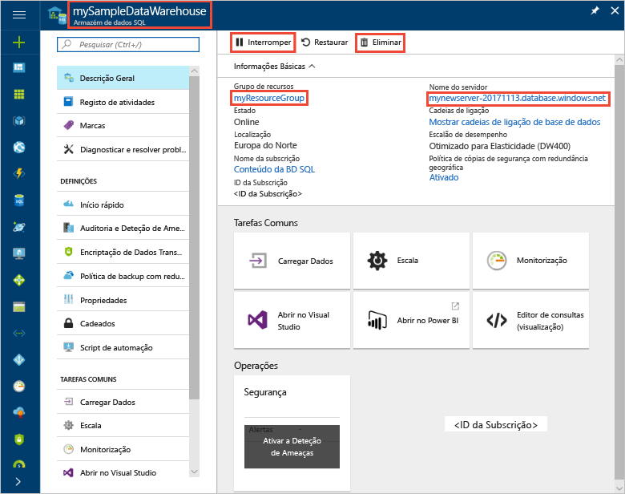

# <a name="quickstart-create-a-workload-classifier-using-t-sql-preview"></a>Início rápido: Criar um classificador de carga de trabalho com o T-SQL (pré-visualização)

Neste início rápido, irá criar rapidamente um classificador de carga de trabalho com importância alta para o CEO da sua organização. Este classificador de carga de trabalho irá permitir que o CEO de consultas têm precedência sobre outras consultas com uma importância inferior na fila.

> [!Note]
> Classificação da carga de trabalho está disponível no SQL Data Warehouse Gen2.

Se não tiver uma subscrição do Azure, crie uma conta [gratuita](https://azure.microsoft.com/free/) antes de começar.

> [!NOTE]
> A criação de um SQL Data Warehouse poderá resultar num novo serviço sujeito a faturação.  Para obter mais informações, veja [Preços do SQL Data Warehouse](https://azure.microsoft.com/pricing/details/sql-data-warehouse/).
>
>

## <a name="prerequisites"></a>Pré-requisitos

Este guia de introdução pressupõe que já tiver um armazém de dados SQL e de que tem permissões de base de dados de controlo. Se precisar de criar um, utilize [Criar e Ligar - Portal](create-data-warehouse-portal.md) para criar um armazém de dados chamado **mySampleDataWarehouse**.

## <a name="sign-in-to-the-azure-portal"></a>Iniciar sessão no portal do Azure

Inicie sessão no [portal do Azure](https://portal.azure.com/).

## <a name="create-login-for-theceo"></a>Criar início de sessão para TheCEO

Criar um início de sessão de autenticação do SQL Server no `master` base de dados com [CREATE LOGIN](/sql/t-sql/statements/create-login-transact-sql) para 'TheCEO'.

```sql
IF NOT EXISTS (SELECT * FROM sys.sql_logins WHERE name = 'TheCEO')
BEGIN
CREATE LOGIN [TheCEO] WITH PASSWORD='<strongpassword>'
END
;
```

## <a name="create-theceo-user-in-mysampledatawarehouse"></a>Criar utilizador TheCEO no mySampleDataWarehouse

```sql
IF NOT EXISTS (SELECT * FROM sys.database_principals WHERE name = 'THECEO')
BEGIN
CREATE USER [TheCEO] FOR LOGIN [TheCEO]
END
;
```

## <a name="create-a-workload-classifier-for-theceo-with-high-importance"></a>Criar um classificador de carga de trabalho para TheCEO com importância alta

```sql
DROP WORKLOAD CLASSIFIER [wgcTheCEO];
CREATE WORKLOAD CLASSIFIER [wgcTheCEO]
WITH (WORKLOAD_GROUP = 'xlargerc'
      ,MEMBERNAME = 'TheCEO'
      ,IMPORTANCE = HIGH);
```

## <a name="view-existing-classifiers"></a>Ver classificadores existentes

```sql
SELECT * FROM sys.workload_management_workload_classifiers
```

## <a name="clean-up-resources"></a>Limpar recursos

```sql
DROP WORKLOAD CLASSIFIER [wgcTheCEO]
DROP USER [TheCEO]
;
```

Será cobrado para unidades de armazém de dados e dados armazenados no seu armazém de dados. Estes recursos de computação e armazenamento são faturados em separado.

- Se quiser manter os dados no armazenamento, pode interromper a computação quando não estiver a utilizar o armazém de dados. Ao colocar em pausa a computação, é-lhe cobrado apenas para o armazenamento de dados. Quando estiver pronto para trabalhar com os dados, retome a computação.
- Se quiser remover futuras cobranças, pode eliminar o armazém de dados.

Siga estes passos para limpar os recursos.

1. Inicie sessão para o [portal do Azure](https://portal.azure.com), selecione no seu armazém de dados.

    

2. A computação em pausa, selecione o **colocar em pausa** botão. Quando o armazém de dados estiver em pausa, verá um botão **Iniciar**.  Para retomar a computação, selecione **iniciar**.

3. Para remover o armazém de dados, de modo que não lhe é cobrada para a computação ou o armazenamento, selecione **eliminar**.

4. Para remover o servidor SQL que criou, selecione **mynewserver-20180430.database.windows.net** na imagem anterior e, em seguida, selecione **eliminar**.  Tenha cuidado com esta eliminação, uma vez que eliminar o servidor também elimina todas as bases de dados atribuídas ao mesmo.

5. Para remover o grupo de recursos, selecione **myResourceGroup**e, em seguida, selecione **eliminar grupo de recursos**.

## <a name="next-steps"></a>Passos Seguintes

Acabou de criar um classificador de carga de trabalho. Execute algumas consultas como TheCEO para ver como realizar. Ver [sys.dm_pdw_exec_requests](/sql/relational-databases/system-dynamic-management-views/sys-dm-pdw-exec-requests-transact-sql) para ver as consultas e a importância atribuído.

Para obter mais informações sobre a gestão da carga de trabalho de armazém de dados SQL, consulte [importância de carga de trabalho de armazém de dados SQL](sql-data-warehouse-workload-importance.md) e [classificação de carga de trabalho de armazém de dados SQL](sql-data-warehouse-workload-classification.md).
