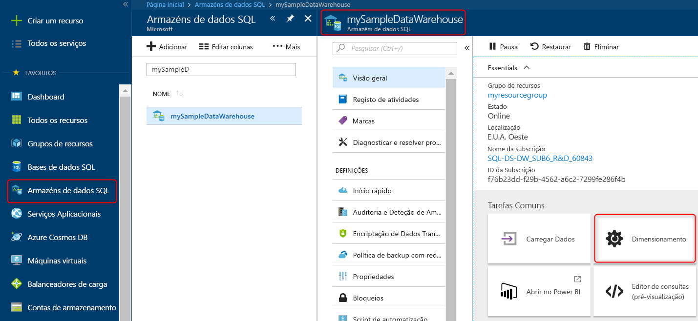

# Início rápido: Dimensionar a computação no Azure SQL Data Warehouse no portal do Azure

Dimensionar a computação do Azure SQL Data Warehouse no portal do Azure. [Dimensionar a computação](sql-data-warehouse-manage-compute-overview.md) para um melhor desempenho ou a escalar a computação novamente para reduzir os custos. 

Se não tiver uma subscrição do Azure, crie uma conta [gratuita](https://azure.microsoft.com/free/) antes de começar.

## Iniciar sessão no portal do Azure

Inicie sessão no [portal do Azure](https://portal.azure.com/).

## Antes de começar

Você pode dimensionar um data warehouse que você já tem ou usar o [início rápido: criar e conectar – portal](create-data-warehouse-portal.md) para criar um data warehouse chamado **mySampleDataWarehouse**.  Este início rápido dimensiona **mySampleDataWarehouse**.

>[!Note]
>Seu data warehouse deve estar online para ser dimensionado. 

## Dimensionar computação

SQL Data Warehouse recursos de computação podem ser dimensionados aumentando ou diminuindo as unidades de data warehouse. O início rápido do [Create and Connect-portal] (Create-data-warehouse-portal.md) criou **mySampleDataWarehouse** e o inicializou com 400 DWUs. Os seguintes passos ajustam as DWUs para **mySampleDataWarehouse**.

Para alterar as unidades do data warehouse:

1. Clique em **Armazéns de dados SQL** na página da esquerda do portal do Azure.
2. Selecione **mySampleDataWarehouse** na página de **Armazéns de dados SQL**. O armazém de dados é aberto.
3. Clique em **Escalar**.

    

2. No painel Escalar, mova o controlo de deslize para a esquerda ou direita para alterar a definição de DWU.

    

3. Clique em **Guardar**. É apresentada uma mensagem de confirmação. Clique em **sim** para confirmar ou **não** para cancelar.

    

## Passos Seguintes
Agora você aprendeu a dimensionar a computação para seu data warehouse. Para saber mais sobre o Azure SQL Data Warehouse, avance para o tutorial para carregar dados.

> [!div class="nextstepaction"]
>[Carregar dados em um SQL Data Warehouse](load-data-from-azure-blob-storage-using-polybase.md)
