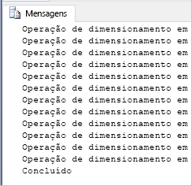

# <a name="quickstart-scale-compute-in-azure-synapse-analytics-using-t-sql"></a>Quickstart: Scale compute in Azure Synapse Analytics usando T-SQL

Computação de escala em Azure Synapse Analytics (anteriormente SQL DW) utilizando o T-SQL e o SQL Server Management Studio (SSMS). [Dimensionar a computação](sql-data-warehouse-manage-compute-overview.md) para um melhor desempenho ou a escalar a computação novamente para reduzir os custos. 

Se não tiver uma subscrição do Azure, crie uma conta [gratuita](https://azure.microsoft.com/free/) antes de começar.

## <a name="before-you-begin"></a>Antes de começar

Transfira e instale a versão mais recente do [SQL Server Management Studio](/sql/ssms/download-sql-server-management-studio-ssms) (SSMS).
 
## <a name="create-a-data-warehouse"></a>Criar um armazém de dados

Utilize [Início Rápido: criar e Ligar - portal](create-data-warehouse-portal.md) para criar um armazém de dados com o nome **mySampleDataWarehouse**. Complete o quickstart para garantir que tem uma regra de firewall e pode ligar-se ao seu armazém de dados a partir do SQL Server Management Studio.

## <a name="connect-to-the-server-as-server-admin"></a>Ligar ao servidor como administrador do servidor

Esta secção utiliza o [SQL Server Management Studio](/sql/ssms/download-sql-server-management-studio-ssms) (SSMS) para estabelecer uma ligação ao servidor SQL do Azure.

1. Abra o SQL Server Management Studio.

2. Na caixa de dialogo **Ligar ao Servidor**, introduza as seguintes informações:

   | Definição       | Valor sugerido | Descrição | 
   | ------------ | ------------------ | ------------------------------------------------- | 
   | Tipo de servidor | Motor de base de dados | Este valor é obrigatório |
   | Nome do servidor | O nome de servidor completamente qualificado | Eis um exemplo: **mySampleDataWarehouseservername.database.windows.net.** |
   | Autenticação | Autenticação do SQL Server | A Autenticação do SQL é o único tipo de autenticação configurado neste tutorial. |
   | Iniciar sessão | A conta de administrador do servidor | A conta que especificou quando criou o servidor. |
   | Palavra-passe | A palavra-passe da sua conta de administrador do servidor | A palavra-passe que especificou quando criou o servidor. |

    

3. Clique em **Ligar**. A janela do Object Explorer é aberta no SSMS.

4. No Object Explorer, expanda **Databases**. Em seguida, expanda **o mySampleDataWarehouse** para ver os objetos na sua nova base de dados.

    

## <a name="view-service-objective"></a>Ver objetivo do serviço
A definição de objetivo de serviço contém o número de unidades de armazém de dados para o armazém de dados. 

Para ver as unidades de armazém de dados atual para o seu armazém de dados:

1. Sob a ligação com **mySampleDataWarehouseservername.database.windows.net,** expandir bases **de dados**do sistema .
2. Clique com o botão direito do rato em **mestra** e selecione **Nova Consulta**. É aberta uma nova janela de consulta.
3. Execute a seguinte consulta para selecionar a partir da vista de gestão dinâmica sys.database_service_objectives. 

    ```sql
    SELECT
        db.name [Database]
    ,   ds.edition [Edition]
    ,   ds.service_objective [Service Objective]
    FROM
        sys.database_service_objectives ds
    JOIN
        sys.databases db ON ds.database_id = db.database_id
    WHERE 
        db.name = 'mySampleDataWarehouse'
    ```

4. Os seguintes resultados mostram **mySampleDataWarehouse** tem um objetivo de serviço de DW400. 

    

## <a name="scale-compute"></a>Dimensionar computação
No Azure Synapse, pode aumentar ou diminuir os recursos computacionais ajustando unidades de armazém de dados. O [Criar e Ligar - portal](create-data-warehouse-portal.md) criou **mySampleDataWarehouse** e inicializou-o com 400 DWUs. Os seguintes passos ajustam as DWUs para **mySampleDataWarehouse**.

Para alterar as unidades do data warehouse:

1. Clique com o botão direito do rato em **mestra** e selecione **Nova Consulta**.
2. Utilize o [ALTER DATABASE](/sql/t-sql/statements/alter-database-azure-sql-database) instrução de T-SQL para modificar o objetivo de serviço. Execute a consulta seguinte para alterar o objetivo de serviço para DW300. 

    ```Sql
    ALTER DATABASE mySampleDataWarehouse
    MODIFY (SERVICE_OBJECTIVE = 'DW300c');
    ```

## <a name="monitor-scale-change-request"></a>Pedido de alteração de dimensionamento do monitor
Para ver o progresso do pedido de alteração anterior, pode utilizar a sintaxe de T-SQL `WAITFORDELAY` para consultar a vista de gestão dinâmica sys.dm_operation_status (DMV).

Para consultar o estado de alteração do objeto do serviço:

1. Clique com o botão direito do rato em **mestra** e selecione **Nova Consulta**.
2. Execute a consulta seguinte para consultar o sys.dm_operation_status DMV.

    ```sql
    WHILE 
    (
        SELECT TOP 1 state_desc
        FROM sys.dm_operation_status
        WHERE 
            1=1
            AND resource_type_desc = 'Database'
            AND major_resource_id = 'mySampleDataWarehouse'
            AND operation = 'ALTER DATABASE'
        ORDER BY
            start_time DESC
    ) = 'IN_PROGRESS'
    BEGIN
        RAISERROR('Scale operation in progress',0,0) WITH NOWAIT;
        WAITFOR DELAY '00:00:05';
    END
    PRINT 'Complete';
    ```
3. A saída resultante mostra um registo da consulta de estado.

    

## <a name="check-data-warehouse-state"></a>Verifique o estado do armazém de dados

Quando um armazém de dados está em pausa, não é possível ligar-se ao mesmo com T-SQL. Para ver o estado atual do armazém de dados, pode utilizar um cmdlet do PowerShell. Por exemplo, veja [Verificar o estado do armazém de dados - Powershell](quickstart-scale-compute-powershell.md#check-data-warehouse-state). 

## <a name="check-operation-status"></a>Verificar o estado da operação

Para devolver informações sobre várias operações de gestão no seu Azure Synapse, ecorra a seguinte consulta no [DMV sys.dm_operation_status.](/sql/relational-databases/system-dynamic-management-views/sys-dm-operation-status-azure-sql-database) Por exemplo, devolve a operação e o estado da operação, que é IN_PROGRESS ou COMPLETED.

```sql
SELECT *
FROM
    sys.dm_operation_status
WHERE
    resource_type_desc = 'Database'
AND 
    major_resource_id = 'mySampleDataWarehouse'
```


## <a name="next-steps"></a>Passos seguintes
Agora já aprendeu como dimensionar a computação para o seu armazém de dados. Para saber mais sobre o Azure Synapse, continue ao tutorial para carregar dados.

> [!div class="nextstepaction"]
>[Carregue os dados num Azure Synapse Analytics](load-data-from-azure-blob-storage-using-polybase.md)
