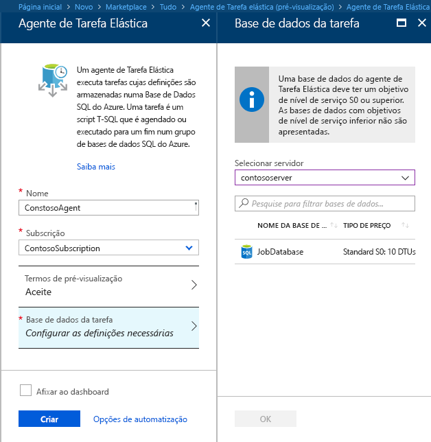
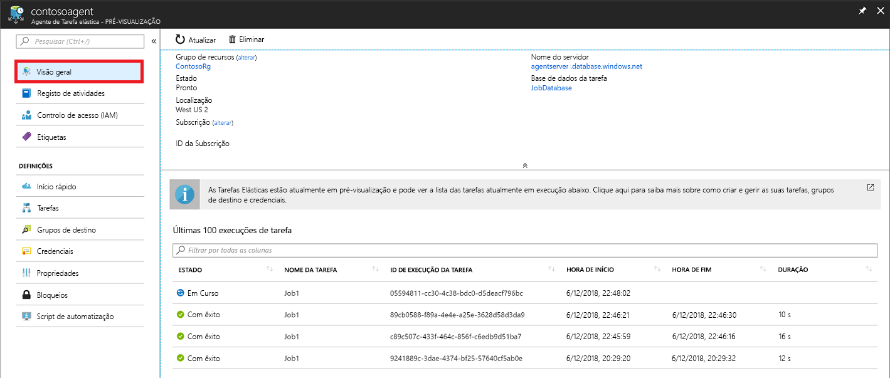

# <a name="create-configure-and-manage-elastic-jobs"></a>Create, configure, and manage elastic jobs

In this article, you will learn how to create, configure, and manage elastic jobs.

If you have not used Elastic jobs, [learn more about the job automation concepts in Azure SQL Database](sql-database-job-automation-overview.md).

## <a name="create-and-configure-the-agent"></a>Criar e configurar o agente

1. Crie ou identifique uma S0 vazia ou uma base de dados SQL superior. This database will be used as the *Job database* during Elastic Job agent creation.
2. Create an Elastic Job agent in the [portal](https://portal.azure.com/#create/Microsoft.SQLElasticJobAgent) or with [PowerShell](elastic-jobs-powershell.md#create-the-elastic-job-agent).

   

## <a name="create-run-and-manage-jobs"></a>Criar, executar e gerir tarefas

1. Create a credential for job execution in the *Job database* using [PowerShell](elastic-jobs-powershell.md) or [T-SQL](elastic-jobs-tsql.md#create-a-credential-for-job-execution).
2. Define the target group (the databases you want to run the job against) using [PowerShell](elastic-jobs-powershell.md) or [T-SQL](elastic-jobs-tsql.md#create-a-target-group-servers).
3. Crie uma credencial do agente de tarefa em cada base de dados onde a tarefa será executada [(adicione o utilizador (ou função) a cada base de dados no grupo)](sql-database-control-access.md). Por consultar um exemplo, veja o [tutorial do PowerShell](elastic-jobs-powershell.md).
4. Create a job using [PowerShell](elastic-jobs-powershell.md) or [T-SQL](elastic-jobs-tsql.md#deploy-new-schema-to-many-databases).
5. Adicione passos de tarefa com o [PowerShell](elastic-jobs-powershell.md) ou o [T-SQL](elastic-jobs-tsql.md#deploy-new-schema-to-many-databases).
6. Run a job using [PowerShell](elastic-jobs-powershell.md#run-the-job) or [T-SQL](elastic-jobs-tsql.md#begin-ad-hoc-execution-of-a-job).
7. Monitor job execution status using the portal, [PowerShell](elastic-jobs-powershell.md#monitor-status-of-job-executions) or [T-SQL](elastic-jobs-tsql.md#monitor-job-execution-status).

   

## <a name="credentials-for-running-jobs"></a>Credenciais para executar tarefas

As tarefas utilizam [credenciais com âmbito de base de dados](/sql/t-sql/statements/create-database-scoped-credential-transact-sql) para ligar às bases de dados especificadas pelo grupo de destino após a execução. Se um grupo de destino contiver servidores ou conjuntos, estas credenciais com âmbito de base de dados são utilizadas para ligar à base de dados mestra para enumerar as bases de dados disponíveis.

A configuração das credenciais corretas para executar uma tarefa pode ser um pouco confusa, por isso, tenha em consideração os seguintes pontos:

- As credenciais com âmbito de base de dados têm de ser criadas na *Base de dados da tarefa*.
- **All target databases must have a login with [sufficient permissions](https://docs.microsoft.com/sql/relational-databases/security/permissions-database-engine) for the job to complete successfully** (`jobuser` in the diagram below).
- Credentials can be reused across jobs, and the credential passwords are encrypted and secured from users who have read-only access to job objects.

A imagem seguinte tem como objetivo ajudar a compreender e a configurar as credenciais de tarefa corretas. **Lembre-se de criar o utilizador em todas as bases de dados (todas as *dbs de utilizador de destino*) onde a tarefa tenha de ser executada**.


## <a name="security-best-practices"></a>Melhores práticas de segurança

Algumas considerações sobre melhores práticas para trabalhar com Tarefas Elásticas:

- Limite a utilização das APIs a pessoas de confiança.
- As credenciais devem ter o mínimo de privilégios necessários para executar o passo de tarefa. For more information, see [Authorization and Permissions SQL Server](https://docs.microsoft.com/dotnet/framework/data/adonet/sql/authorization-and-permissions-in-sql-server).
- When using a server and/or pool target group member, it is highly suggested to create a separate credential with rights on the master database to view/list databases that is used to expand the database lists of the server(s) and/or pool(s) prior to the job execution.

## <a name="agent-performance-capacity-and-limitations"></a>Desempenho, capacidade e limitações do agente

As Tarefas Elásticas utilizam recursos de computação mínimos enquanto aguardam pela conclusão de tarefas de execução longa.

Dependendo do tamanho do grupo de destino de bases de dados e do tempo de execução pretendido para uma tarefa (número de trabalhos em simultâneo), o agente requer diferentes quantidades de computação e desempenho da *Base de dados da tarefa* (quando mais destinos houver e quanto maior for o número de tarefas, maior é a quantidade de computação necessária).

Atualmente, a pré-visualização está limitada a 100 tarefas simultâneas.

### <a name="prevent-jobs-from-reducing-target-database-performance"></a>Impedir que as tarefas reduzam o desempenho da base de dados de destino

Para garantir que os recursos não são sobrecarregados quando executar tarefas nas bases de dados num conjunto elástico de SQL, as tarefas podem ser configuradas para limitar o número de bases de dados nas quais uma tarefa pode ser executada ao mesmo tempo.

Set the number of concurrent databases a job runs on by setting the `sp_add_jobstep` stored procedure's `@max_parallelism` parameter in T-SQL, or `Add-AzSqlElasticJobStep -MaxParallelism` in PowerShell.

## <a name="best-practices-for-creating-jobs"></a>Melhores práticas para criar tarefas

### <a name="idempotent-scripts"></a>Scripts Idempotent
Os scripts T-SQL de uma tarefa têm de ser [idempotent](https://en.wikipedia.org/wiki/Idempotence). **Idempotent** significa que, se o script executado com êxito e for executado novamente, ocorre o mesmo resultado. Um script pode falhar devido a problemas de rede transitória. Nesse caso, a tarefa repetirá automaticamente a execução do script um número predefinido de vezes antes de desistir. Um script idempotent tem o mesmo resultado mesmo que seja executado com êxito duas vezes (ou mais).

Uma tática simples consiste em testar a existência de um objeto antes de o criar.


```sql
IF NOT EXIST (some_object)
    -- Create the object
    -- If it exists, drop the object before recreating it.
```

Da mesma forma, um script tem de poder ser executado com êxito ao testar logicamente e refutar as condições que encontrar.


## <a name="next-steps"></a>Passos seguintes

- [Criar e gerir Tarefas Elásticas com o PowerShell](elastic-jobs-powershell.md)
- [Criar e gerir Tarefas Elásticas com o Transact-SQL (T-SQL)](elastic-jobs-tsql.md)
