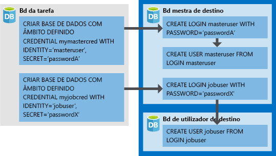

# <a name="create-an-elastic-job-agent-using-powershell"></a>Criar um agente de Tarefa Elástica com o PowerShell

As [tarefas elásticas](sql-database-job-automation-overview.md#elastic-database-jobs-preview) permitem a execução de um ou mais scripts Transact-SQL (T-SQL) em paralelo em muitas bases de dados.

Neste tutorial, você aprende as etapas necessárias para executar uma consulta em vários bancos de dados:

> [!div class="checklist"]
> * Criar um agente de Tarefa Elástica
> * Criar credenciais de tarefa para que as tarefas possam executar scripts nos respetivos destinos
> * Definir os destinos (servidores, conjuntos elásticos, bases de dados, mapas de partições horizontais) em que quer executar a tarefa
> * Criar credenciais com âmbito de base de dados nas bases de dados de destino para que o agente ligue e execute tarefas
> * Criar uma tarefa
> * Adicionar passos de tarefa a uma tarefa
> * Iniciar a execução de uma tarefa
> * Monitorizar uma tarefa

## <a name="prerequisites"></a>Pré-requisitos

A versão atualizada do trabalhos de Banco de Dados Elástico tem um novo conjunto de cmdlets do PowerShell para uso durante a migração. Esses novos cmdlets transferem todas as suas credenciais de trabalho existentes, destinos (incluindo bancos de dados, servidores, coleções personalizadas), gatilhos de trabalho, agendas de trabalho, conteúdos de trabalho e trabalhos para um novo agente de trabalho elástico.

### <a name="install-the-latest-elastic-jobs-cmdlets"></a>Instalar os cmdlets de trabalhos elásticos mais recentes

Se ainda não tiver uma subscrição do Azure, [crie uma conta gratuita](https://azure.microsoft.com/free/) antes de começar.

Instale o módulo **AZ. SQL** 1.1.1-Preview para obter os cmdlets de trabalho elástico mais recentes. Execute os seguintes comandos no PowerShell com acesso administrativo.

```powershell
# Installs the latest PackageManagement powershell package which PowershellGet v1.6.5 is dependent on
Find-Package PackageManagement -RequiredVersion 1.1.7.2 | Install-Package -Force

# Installs the latest PowershellGet module which adds the -AllowPrerelease flag to Install-Module
Find-Package PowerShellGet -RequiredVersion 1.6.5 | Install-Package -Force

# Restart your powershell session with administrative access

# Places Az.Sql preview cmdlets side by side with existing Az.Sql version
Install-Module -Name Az.Sql -RequiredVersion 1.1.1-preview -AllowPrerelease

# Import the Az.Sql module
Import-Module Az.Sql -RequiredVersion 1.1.1

# Confirm if module successfully imported - if the imported version is 1.1.1, then continue
Get-Module Az.Sql
```

- Além do módulo **AZ. SQL** 1.1.1-Preview, este tutorial também requer o módulo PowerShell do *SqlServer* . Para obter detalhes, consulte [instalar SQL Server PowerShell Module](https://docs.microsoft.com/sql/powershell/download-sql-server-ps-module).


## <a name="create-required-resources"></a>Criar os recursos necessários

A criação de um agente de Tarefa Elástica requer uma base de dados (S0 ou superior) para utilização como [base de dados de Tarefa](sql-database-job-automation-overview.md#job-database). 

*O script a seguir cria um novo grupo de recursos, servidor e banco de dados para uso como o banco de dados de trabalho. O script a seguir também cria um segundo servidor com dois bancos de dados em branco para executar trabalhos.*

As tarefas elásticas não têm requisitos de nomenclatura específicos, pelo que pode utilizar quaisquer convenções de nomenclatura que queira, desde que estejam em conformidade com os [requisitos do Azure](/azure/architecture/best-practices/resource-naming).

```powershell
# Sign in to your Azure account
Connect-AzAccount

# Create a resource group
Write-Output "Creating a resource group..."
$ResourceGroupName = Read-Host "Please enter a resource group name"
$Location = Read-Host "Please enter an Azure Region"
$Rg = New-AzResourceGroup -Name $ResourceGroupName -Location $Location
$Rg

# Create a server
Write-Output "Creating a server..."
$AgentServerName = Read-Host "Please enter an agent server name"
$AgentServerName = $AgentServerName + "-" + [guid]::NewGuid()
$AdminLogin = Read-Host "Please enter the server admin name"
$AdminPassword = Read-Host "Please enter the server admin password"
$AdminPasswordSecure = ConvertTo-SecureString -String $AdminPassword -AsPlainText -Force
$AdminCred = New-Object -TypeName "System.Management.Automation.PSCredential" -ArgumentList $AdminLogin, $AdminPasswordSecure
$AgentServer = New-AzSqlServer -ResourceGroupName $ResourceGroupName -Location $Location -ServerName $AgentServerName -ServerVersion "12.0" -SqlAdministratorCredentials ($AdminCred)

# Set server firewall rules to allow all Azure IPs
Write-Output "Creating a server firewall rule..."
$AgentServer | New-AzSqlServerFirewallRule -AllowAllAzureIPs
$AgentServer

# Create the job database
Write-Output "Creating a blank SQL database to be used as the Job Database..."
$JobDatabaseName = "JobDatabase"
$JobDatabase = New-AzSqlDatabase -ResourceGroupName $ResourceGroupName -ServerName $AgentServerName -DatabaseName $JobDatabaseName -RequestedServiceObjectiveName "S0"
$JobDatabase
```

```powershell
# Create a target server and some sample databases - uses the same admin credential as the agent server just for simplicity
Write-Output "Creating target server..."
$TargetServerName = Read-Host "Please enter a target server name"
$TargetServerName = $TargetServerName + "-" + [guid]::NewGuid()
$TargetServer = New-AzSqlServer -ResourceGroupName $ResourceGroupName -Location $Location -ServerName $TargetServerName -ServerVersion "12.0" -SqlAdministratorCredentials ($AdminCred)

# Set target server firewall rules to allow all Azure IPs
$TargetServer | New-AzSqlServerFirewallRule -AllowAllAzureIPs
$TargetServer | New-AzSqlServerFirewallRule -StartIpAddress 0.0.0.0 -EndIpAddress 255.255.255.255 -FirewallRuleName AllowAll
$TargetServer

# Create some sample databases to execute jobs against...
$Db1 = New-AzSqlDatabase -ResourceGroupName $ResourceGroupName -ServerName $TargetServerName -DatabaseName "TargetDb1"
$Db1
$Db2 = New-AzSqlDatabase -ResourceGroupName $ResourceGroupName -ServerName $TargetServerName -DatabaseName "TargetDb2"
$Db2
```

## <a name="enable-the-elastic-jobs-preview-for-your-subscription"></a>Ativar a pré-visualização de Tarefas Elásticas para a sua subscrição

Para usar trabalhos elásticos, registre o recurso em sua assinatura do Azure executando o comando a seguir. Execute esse comando uma vez para a assinatura na qual você pretende provisionar o agente de trabalho elástico. As assinaturas que contêm apenas bancos de dados que são destinos de trabalho não precisam ser registradas.

```powershell
Register-AzProviderFeature -FeatureName sqldb-JobAccounts -ProviderNamespace Microsoft.Sql
```

## <a name="create-the-elastic-job-agent"></a>Criar o agente de Tarefa Elástica

Um agente de Tarefa Elástica é um recurso do Azure para criar, executar e gerir tarefas. O agente executa tarefas com base num agendamento ou como uma tarefa única.

O cmdlet **New-AzSqlElasticJobAgent** requer que um banco de dados SQL do Azure já exista, portanto, os parâmetros *ResourceGroupName*, *ServerName*e *DatabaseName* devem apontar para os recursos existentes.

```powershell
Write-Output "Creating job agent..."
$AgentName = Read-Host "Please enter a name for your new Elastic Job agent"
$JobAgent = $JobDatabase | New-AzSqlElasticJobAgent -Name $AgentName
$JobAgent
```

## <a name="create-job-credentials-so-that-jobs-can-execute-scripts-on-its-targets"></a>Criar credenciais de tarefa para que as tarefas possam executar scripts nos respetivos destinos

As tarefas utilizam credenciais com âmbito de base de dados para ligar às bases de dados de destino especificadas pelo grupo de destino após a execução. Estas credenciais com âmbito de base de dados também são utilizadas para ligar à base de dados mestra para enumerar todas as bases de dados num servidor ou conjunto elástico, quando qualquer um destes for utilizado como tipo de membro do grupo de destino.

As credenciais com âmbito de base de dados têm de ser criadas na base de dados de tarefa.  
Todas as bases de dados de destino precisam de um início de sessão com permissões suficientes para a tarefa ser concluída com êxito.



Além das credenciais na imagem, tenha em atenção a adição dos comandos *GRANT* no script seguinte. Estas permissões são necessárias para o script que escolhemos para esta tarefa de exemplo. Uma vez que o exemplo cria uma nova tabela nas bases de dados de destino, cada base de dados de destino precisa das permissões adequadas para ser executada com êxito.

Para criar as credenciais de tarefa necessárias (na base de dados de tarefa), execute o seguinte script:

```powershell
# In the master database (target server)
# - Create the master user login
# - Create the master user from master user login
# - Create the job user login
$Params = @{
  'Database' = 'master'
  'ServerInstance' =  $TargetServer.ServerName + '.database.windows.net'
  'Username' = $AdminLogin
  'Password' = $AdminPassword
  'OutputSqlErrors' = $true
  'Query' = "CREATE LOGIN masteruser WITH PASSWORD='password!123'"
}
Invoke-SqlCmd @Params
$Params.Query = "CREATE USER masteruser FROM LOGIN masteruser"
Invoke-SqlCmd @Params
$Params.Query = "CREATE LOGIN jobuser WITH PASSWORD='password!123'"
Invoke-SqlCmd @Params

# For each of the target databases
# - Create the jobuser from jobuser login
# - Make sure they have the right permissions for successful script execution
$TargetDatabases = @( $Db1.DatabaseName, $Db2.DatabaseName )
$CreateJobUserScript =  "CREATE USER jobuser FROM LOGIN jobuser"
$GrantAlterSchemaScript = "GRANT ALTER ON SCHEMA::dbo TO jobuser"
$GrantCreateScript = "GRANT CREATE TABLE TO jobuser"

$TargetDatabases | % {
  $Params.Database = $_

  $Params.Query = $CreateJobUserScript
  Invoke-SqlCmd @Params

  $Params.Query = $GrantAlterSchemaScript
  Invoke-SqlCmd @Params

  $Params.Query = $GrantCreateScript
  Invoke-SqlCmd @Params
}

# Create job credential in Job database for master user
Write-Output "Creating job credentials..."
$LoginPasswordSecure = (ConvertTo-SecureString -String "password!123" -AsPlainText -Force)

$MasterCred = New-Object -TypeName "System.Management.Automation.PSCredential" -ArgumentList "masteruser", $LoginPasswordSecure
$MasterCred = $JobAgent | New-AzSqlElasticJobCredential -Name "masteruser" -Credential $MasterCred

$JobCred = New-Object -TypeName "System.Management.Automation.PSCredential" -ArgumentList "jobuser", $LoginPasswordSecure
$JobCred = $JobAgent | New-AzSqlElasticJobCredential -Name "jobuser" -Credential $JobCred
```

## <a name="define-the-target-databases-you-want-to-run-the-job-against"></a>Defina as bases de dados de destino onde quer executar a tarefa

Um [grupo de destino](sql-database-job-automation-overview.md#target-group) define o conjunto de um ou mais bases de dados onde será executado um passo de tarefa. 

O fragmento seguinte cria dois grupos de destino: *ServerGroup* e *ServerGroupExcludingDb2*. *ServerGroup* destina-se a todas as bases de dados existentes no servidor no momento da execução e *ServerGroupExcludingDb2* destina-se a todas as bases de dados no servidor, exceto *TargetDb2*:

```powershell
Write-Output "Creating test target groups..."
# Create ServerGroup target group
$ServerGroup = $JobAgent | New-AzSqlElasticJobTargetGroup -Name 'ServerGroup'
$ServerGroup | Add-AzSqlElasticJobTarget -ServerName $TargetServerName -RefreshCredentialName $MasterCred.CredentialName

# Create ServerGroup with an exclusion of Db2
$ServerGroupExcludingDb2 = $JobAgent | New-AzSqlElasticJobTargetGroup -Name 'ServerGroupExcludingDb2'
$ServerGroupExcludingDb2 | Add-AzSqlElasticJobTarget -ServerName $TargetServerName -RefreshCredentialName $MasterCred.CredentialName
$ServerGroupExcludingDb2 | Add-AzSqlElasticJobTarget -ServerName $TargetServerName -Database $Db2.DatabaseName -Exclude
```

## <a name="create-a-job"></a>Criar uma tarefa

```powershell
Write-Output "Creating a new job"
$JobName = "Job1"
$Job = $JobAgent | New-AzSqlElasticJob -Name $JobName -RunOnce
$Job
```

## <a name="create-a-job-step"></a>Criar um passo de tarefa

Este exemplo define dois passos de tarefa para a tarefa a ser executada. O primeiro passo de tarefa (*step1*) cria uma nova tabela (*Step1Table*) em cada base de dados no grupo de destino *ServerGroup*. O segundo passo de tarefa (*step2*) cria uma nova tabela (*Step2Table*) em cada base de dados, exceto para *TargetDb2*, uma vez que o grupo de destino [definido anteriormente](#define-the-target-databases-you-want-to-run-the-job-against) especificou a sua exclusão.

```powershell
Write-Output "Creating job steps"
$SqlText1 = "IF NOT EXISTS (SELECT * FROM sys.tables WHERE object_id = object_id('Step1Table')) CREATE TABLE [dbo].[Step1Table]([TestId] [int] NOT NULL);"
$SqlText2 = "IF NOT EXISTS (SELECT * FROM sys.tables WHERE object_id = object_id('Step2Table')) CREATE TABLE [dbo].[Step2Table]([TestId] [int] NOT NULL);"

$Job | Add-AzSqlElasticJobStep -Name "step1" -TargetGroupName $ServerGroup.TargetGroupName -CredentialName $JobCred.CredentialName -CommandText $SqlText1
$Job | Add-AzSqlElasticJobStep -Name "step2" -TargetGroupName $ServerGroupExcludingDb2.TargetGroupName -CredentialName $JobCred.CredentialName -CommandText $SqlText2
```


## <a name="run-the-job"></a>Executar a tarefa

Para iniciar a tarefa imediatamente, execute o seguinte comando:

```powershell
Write-Output "Start a new execution of the job..."
$JobExecution = $Job | Start-AzSqlElasticJob
$JobExecution
```

Após a conclusão com êxito, deve ver duas novas tabelas em TargetDb1 e apenas uma nova tabela em TargetDb2:


   


## <a name="monitor-status-of-job-executions"></a>Monitorizar o estado das execuções de tarefas

Os fragmentos seguintes obtêm os detalhes de execução da tarefa:

```powershell
# Get the latest 10 executions run
$JobAgent | Get-AzSqlElasticJobExecution -Count 10

# Get the job step execution details
$JobExecution | Get-AzSqlElasticJobStepExecution

# Get the job target execution details
$JobExecution | Get-AzSqlElasticJobTargetExecution -Count 2
```

### <a name="job-execution-states"></a>Estados de execução do trabalho

A tabela a seguir lista os Estados de execução de trabalho possíveis:

|Estado|Descrição|
|:---|:---|
|**Criação** | A execução do trabalho acabou de ser criada e ainda não está em andamento.|
|**InProgress** | A execução do trabalho está atualmente em andamento.|
|**WaitingForRetry** | A execução do trabalho não pôde concluir sua ação e está aguardando para tentar novamente.|
|**Foi** | A execução do trabalho foi concluída com êxito.|
|**SucceededWithSkipped** | A execução do trabalho foi concluída com êxito, mas alguns de seus filhos foram ignorados.|
|**Falha ao** | A execução do trabalho falhou e esgotou suas tentativas.|
|**TimedOut** | A execução do trabalho atingiu o tempo limite.|
|**Cancel** | A execução do trabalho foi cancelada.|
|**Ignorado** | A execução do trabalho foi ignorada porque outra execução da mesma etapa de trabalho já estava em execução no mesmo destino.|
|**WaitingForChildJobExecutions** | A execução do trabalho está aguardando a conclusão de suas execuções filhas.|

## <a name="schedule-the-job-to-run-later"></a>Agendar a tarefa para execução mais tarde

Para agendar uma tarefa para ser executada num momento específico, execute o seguinte comando:

```powershell
# Run every hour starting from now
$Job | Set-AzSqlElasticJob -IntervalType Hour -IntervalCount 1 -StartTime (Get-Date) -Enable
```

## <a name="clean-up-resources"></a>Limpar recursos

Elimine os recursos do Azure criados neste tutorial ao eliminar o grupo de recursos.

> [!TIP]
> Se quiser continuar a trabalhar com estas tarefas, não limpe os recursos criados neste artigo. Se não planear continuar, utilize os passos seguintes para eliminar todos os recursos criados neste artigo.
>

```powershell
Remove-AzResourceGroup -ResourceGroupName $ResourceGroupName
```


## <a name="next-steps"></a>Passos Seguintes

Neste tutorial, executou um script Transact-SQL num conjunto de bases de dados.  Aprendeu a efetuar as seguintes tarefas:

> [!div class="checklist"]
> * Criar um agente de Tarefa Elástica
> * Criar credenciais de tarefa para que as tarefas possam executar scripts nos respetivos destinos
> * Definir os destinos (servidores, conjuntos elásticos, bases de dados, mapas de partições horizontais) em que quer executar a tarefa
> * Criar credenciais com âmbito de base de dados nas bases de dados de destino para que o agente ligue e execute tarefas
> * Criar uma tarefa
> * Adicionar um passo de tarefa à tarefa
> * Iniciar uma execução da tarefa
> * Monitorizar a tarefa

> [!div class="nextstepaction"]
>[Gerir Tarefas Elásticas com Transact-SQL](elastic-jobs-tsql.md)
