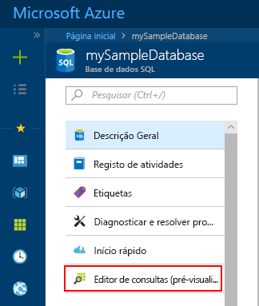
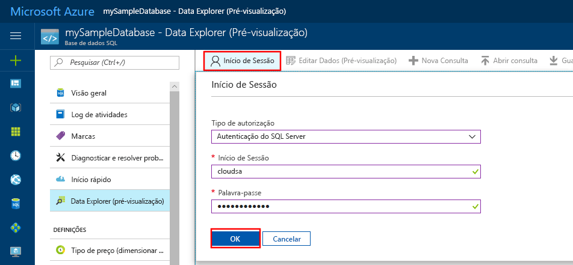
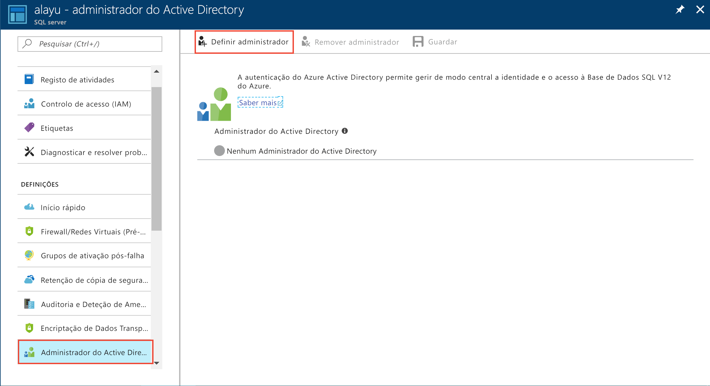
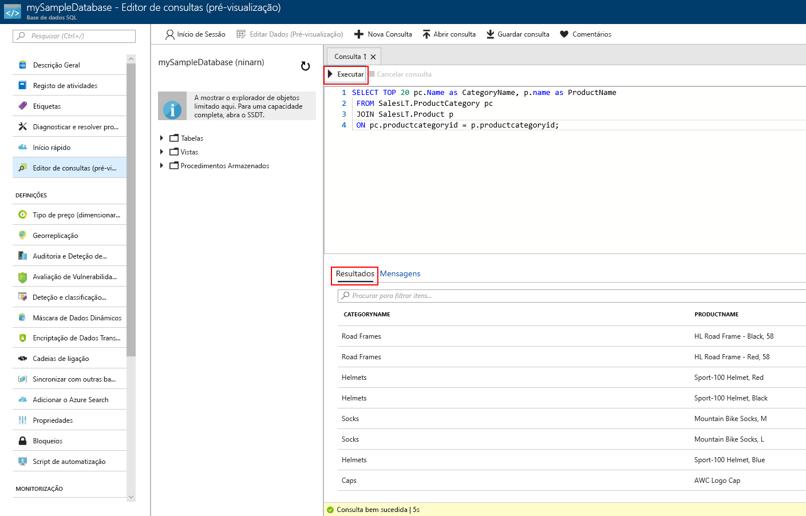

# <a name="quickstart-use-the-azure-portals-sql-query-editor-to-connect-and-query-data"></a>Início rápido: Utilizar o editor de consultas SQL do portal do Azure para ligar e consultar dados

O editor de consultas SQL é uma ferramenta de navegador de portal do Azure, fornecendo uma forma fácil de executar consultas SQL na sua base de dados do Azure SQL ou o Azure SQL Data Warehouse. Neste arranque rápido, utilizará o editor de consulta para se ligar a uma base de dados SQL e, em seguida, executar declarações Transact-SQL para consultar, inserir, atualizar e eliminar dados.

## <a name="prerequisites"></a>Pré-requisitos

Para concluir este tutorial, precisa de:

- Uma base de dados SQL do Azure. Pode utilizar um destes quickstarts para criar e, em seguida, configurar uma base de dados na Base de Dados Azure SQL:

  || Base de dados individual |
  |:--- |:--- |
  | Criar| [Portal](sql-database-single-database-get-started.md) |
  || [CLI](scripts/sql-database-create-and-configure-database-cli.md) |
  || [PowerShell](scripts/sql-database-create-and-configure-database-powershell.md) |
  | Configurar | [Regra de firewall IP ao nível do servidor](sql-database-server-level-firewall-rule.md)|
  |||

> [!NOTE]
> O editor de consulta usa as portas 443 e 1443 para comunicar.  Certifique-se de que ativou o tráfego HTTPS de saída nestes portos. Também terá de adicionar o seu endereço IP de saída às regras de firewall permitidas pelo servidor para aceder às suas bases de dados e armazéns de dados.

## <a name="sign-in-the-azure-portal"></a>Inicie sessão no portal do Azure

Inicie sessão no [portal do Azure](https://portal.azure.com/).

## <a name="connect-using-sql-authentication"></a>Ligar através da autenticação de SQL

1. Vá ao portal Azure para ligar a uma base de dados SQL. Procure e selecione bases de **dados SQL**.

    

2. Selecione a sua base de dados SQL.

    

3. No menu de base de **dados SQL,** selecione **Query editor (pré-visualização)** .

    

4. Na página **de Login,** sob a etiqueta de autenticação do **servidor SQL,** introduza o ID **de Login** e **a Palavra-Passe** da conta de administração do servidor utilizada para criar a base de dados. Em seguida, selecione **OK**.

    

## <a name="connect-using-azure-active-directory"></a>Ligar com o Azure Active Directory

Configurar um administrador azure Ative Directory (Azure AD) permite-lhe utilizar uma única identidade para iniciar sessão no portal Azure e na sua base de dados SQL. Siga os passos abaixo para configurar um administrador Azure AD para o seu servidor SQL.

> [!NOTE]
> * As contas de e-mail (por exemplo, outlook.com, gmail.com, yahoo.com, e assim por diante) ainda não são suportadas como administradores da Azure AD. Confirme que escolhe um utilizador criado nativamente no Azure AD, ou federado no Azure AD.
> * Sessão de administrador do Azure AD não funciona com contas que têm a autenticação de 2 fatores ativada.

1. No menu do portal Azure ou na página **Inicial,** selecione **Todos os recursos.**

2. Selecione o seu servidor SQL.

3. A partir do menu do **servidor SQL,** em **Definições,** selecione **administração de Diretório Ativo**.

4. A partir da barra de ferramentas de administração do servidor SQL **Ative Directory,** selecione **Administração set** e escolha o utilizador ou grupo como administrador aD Azure.

    

5. A partir da página **de administrador adicionar,** na caixa de pesquisa, introduza um utilizador ou grupo para encontrar, selecione-o como administrador e, em seguida, escolha o botão **Select.**

6. De volta à barra de ferramentas de **administração de diretório ativo** do servidor SQL, selecione **Save**.

7. No menu do **servidor SQL,** selecione bases de **dados SQL**e, em seguida, selecione a sua base de dados SQL.

8. No menu de base de **dados SQL,** selecione **Query editor (pré-visualização)** . Na página **de Login,** sob a etiqueta de **autenticação Ative Directy,** aparece uma mensagem a dizer que foi contratada se for administrador ad. Em seguida, selecione o **Botão Continue\<** *seu utilizador ou grupo ID>* botão.

## <a name="view-data"></a>Ver dados

1. Quando estiver autenticado, cole o seguinte SQL editor de consultas para obter os 20 principais produtos por categoria.

   ```sql
    SELECT TOP 20 pc.Name as CategoryName, p.name as ProductName
    FROM SalesLT.ProductCategory pc
    JOIN SalesLT.Product p
    ON pc.productcategoryid = p.productcategoryid;
   ```

2. Na barra de ferramentas, selecione **Executar** e, em seguida, reveja a saída no painel **resultados.**

   

## <a name="insert-data"></a>Inserir dados

Executar a seguinte declaração [INSERT](https://msdn.microsoft.com/library/ms174335.aspx) Transact-SQL para adicionar um novo produto na tabela `SalesLT.Product`.

1. Substitua a consulta anterior este.

    ```sql
    INSERT INTO [SalesLT].[Product]
           ( [Name]
           , [ProductNumber]
           , [Color]
           , [ProductCategoryID]
           , [StandardCost]
           , [ListPrice]
           , [SellStartDate]
           )
    VALUES
           ('myNewProduct'
           ,123456789
           ,'NewColor'
           ,1
           ,100
           ,100
           ,GETDATE() );
   ```


2. Selecione **Executar** para inserir uma nova linha na tabela `Product`. O painel de **mensagens** mostra que a **consulta foi bem sucedida: Linhas afetadas: 1**.


## <a name="update-data"></a>Atualizar dados

Execute a seguinte declaração de [Atualização](https://msdn.microsoft.com/library/ms177523.aspx) Transact-SQL para modificar o seu novo produto.

1. Substitua a consulta anterior este.

   ```sql
   UPDATE [SalesLT].[Product]
   SET [ListPrice] = 125
   WHERE Name = 'myNewProduct';
   ```

2. Selecione **Executar** para atualizar a linha especificada na tabela `Product`. O painel de **mensagens** mostra que a **consulta foi bem sucedida: Linhas afetadas: 1**.

## <a name="delete-data"></a>Eliminar dados

Execute a seguinte declaração [DELETE](https://msdn.microsoft.com/library/ms189835.aspx) Transact-SQL para remover o seu novo produto.

1. Substitua a consulta anterior este:

   ```sql
   DELETE FROM [SalesLT].[Product]
   WHERE Name = 'myNewProduct';
   ```

2. Selecione **Executar** para eliminar a linha especificada na tabela `Product`. O painel de **mensagens** mostra que a **consulta foi bem sucedida: Linhas afetadas: 1**.


## <a name="query-editor-considerations"></a>Considerações de editor de consulta

Existem alguns aspetos a saber ao trabalhar com o editor de consultas.

* O editor de consulta usa as portas 443 e 1443 para comunicar.  Certifique-se de que ativou o tráfego HTTPS de saída nestes portos. Também terá de adicionar o seu endereço IP de saída às regras de firewall permitidas pelo servidor para aceder às suas bases de dados e armazéns de dados.

* O Editor de Consulta trabalha com private link sem necessidade de adicionar o endereço Ip do Cliente na firewall sqL Database

* Prima F5 atualiza a página do editor de consultas e qualquer consulta a ser executada é perdida.

* O editor de consulta não suporta a ligação à base de dados `master`.

* Há um tempo limite de 5 minutos para execução da consulta.

* O editor de consultas suporta apenas a projeção cilíndrica para tipos de dados de geografia.

* Não há suporte para IntelliSense para vistas e tabelas de base de dados. No entanto, o editor suporta preenchimento automático nomes que já tenham sido escritos.


## <a name="next-steps"></a>Passos seguintes

Para saber mais sobre o Transact-SQL suportado nas bases de dados Azure SQL, consulte a resolução das [diferenças Transact-SQL durante](sql-database-transact-sql-information.md)a migração para a Base de Dados SQL .
