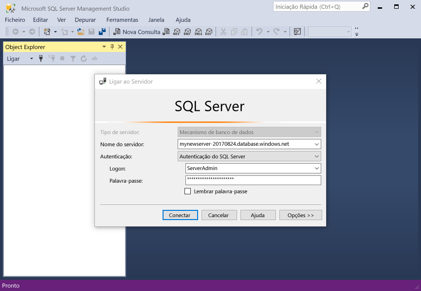
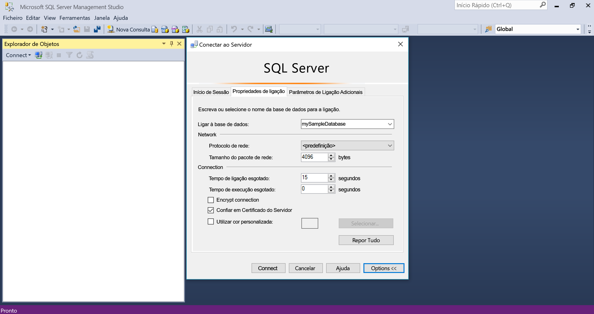
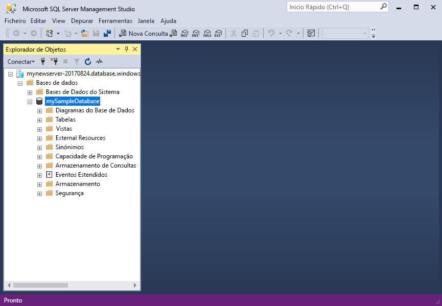

# <a name="quickstart-use-sql-server-management-studio-to-connect-and-query-an-azure-sql-database"></a>Início rápido: usar SQL Server Management Studio para se conectar e consultar um banco de dados SQL do Azure

Neste guia de início rápido, você usará [SQL Server Management Studio][ssms-install-latest-84g] (SSMS) para se conectar a um banco de dados SQL do Azure. Em seguida, você executará instruções Transact-SQL para consultar, inserir, atualizar e excluir dados. Você pode usar o SSMS para gerenciar qualquer infraestrutura do SQL, de SQL Server para o banco de dados SQL para Microsoft Windows.  

## <a name="prerequisites"></a>Pré-requisitos

Uma base de dados SQL do Azure. Você pode usar um desses guias de início rápido para criar e, em seguida, configurar um banco de dados no banco de dados SQL do Azure:

  || Base de dados individual | Instância gerida |
  |:--- |:--- |:---|
  | Criar| [Portal](sql-database-single-database-get-started.md) | [Portal](sql-database-managed-instance-get-started.md) |
  || [CLI](scripts/sql-database-create-and-configure-database-cli.md) | [CLI](https://medium.com/azure-sqldb-managed-instance/working-with-sql-managed-instance-using-azure-cli-611795fe0b44) |
  || [PowerShell](scripts/sql-database-create-and-configure-database-powershell.md) | [PowerShell](scripts/sql-database-create-configure-managed-instance-powershell.md) |
  | Configurar | [Regra de firewall de IP de nível de servidor](sql-database-server-level-firewall-rule.md)| [Conectividade de uma VM](sql-database-managed-instance-configure-vm.md)|
  |||[Conectividade do local](sql-database-managed-instance-configure-p2s.md)
  |Carregar dados|Adventure Works carregado por início rápido|[Restaurar importadores mundiais](sql-database-managed-instance-get-started-restore.md)
  |||Restaurar ou importar o Adventure Works do arquivo [BACPAC](sql-database-import.md) do [GitHub](https://github.com/Microsoft/sql-server-samples/tree/master/samples/databases/adventure-works)|

  > [!IMPORTANT]
  > Os scripts neste artigo são escritos para usar o banco de dados do Adventure Works. Com uma instância gerenciada, você deve importar o banco de dados do Adventure Works para um banco de dados de instância ou modificar os scripts deste artigo para usar o banco de dados de importadores mundiais.

## <a name="install-the-latest-ssms"></a>Instalar o SSMS mais recente

Antes de começar, verifique se você instalou o [SSMS][ssms-install-latest-84g]mais recente.

## <a name="get-sql-server-connection-information"></a>Obter informações de conexão do SQL Server

Obtenha as informações de conexão necessárias para se conectar ao banco de dados SQL do Azure. Você precisará do nome do servidor totalmente qualificado ou nome do host, nome do banco de dados e informações de logon para os próximos procedimentos.

1. Iniciar sessão no [portal do Azure](https://portal.azure.com/).

2. Navegue até a página **bancos de dados SQL** ou **instâncias gerenciadas do SQL** .

3. Na página **visão geral** , examine o nome do servidor totalmente qualificado ao lado de **nome do servidor** para um único banco de dados ou o nome do servidor totalmente qualificado ao lado de **host** para uma instância gerenciada. Para copiar o nome do servidor ou o nome do host, passe o mouse sobre ele e selecione o ícone de **cópia** .

## <a name="connect-to-your-database"></a>Ligar à base de dados

No SMSS, conecte-se ao seu servidor de banco de dados SQL do Azure.

> [!IMPORTANT]
> Um servidor de banco de dados SQL do Azure escuta na porta 1433. Para se conectar a um servidor de banco de dados SQL por trás de um firewall corporativo, o firewall deve ter essa porta aberta.
>

1. Abra o SQL Server Management Studio. A caixa de diálogo **Ligar ao Servidor** é apresentada.

2. Introduza as seguintes informações:

   | Definição      | Valor sugerido    | Descrição |
   | ------------ | ------------------ | ----------- |
   | **Tipo de servidor** | Motor de base de dados | Valor necessário. |
   | **Nome do servidor** | O nome de servidor completamente qualificado | Algo como: **mynewserver20170313.Database.Windows.net**. |
   | **Autenticação** | Autenticação do SQL Server | Este tutorial usa a autenticação do SQL. |
   | **Início de sessão** | ID de usuário da conta do administrador do servidor | A ID de usuário da conta de administrador do servidor usada para criar o servidor. |
   | **Palavra-passe** | Senha da conta do administrador do servidor | A senha da conta de administrador do servidor usada para criar o servidor. |
   ||||

     

3. Selecione **Opções** na caixa de diálogo **conectar ao servidor** . No menu suspenso **conectar ao banco de dados** , selecione **mySampleDatabase**.

     

4. Selecione **Ligar**. A janela pesquisador de objetos é aberta.

5. Para exibir os objetos do banco de dados, expanda **bancos** de dados e, em seguida, expanda **mySampleDatabase**.

     

## <a name="query-data"></a>Consultar dados

Execute esta [seleção](https://msdn.microsoft.com/library/ms189499.aspx) de código TRANSACT-SQL para consultar os 20 principais produtos por categoria.

1. No Pesquisador de objetos, clique com o botão direito do mouse em **mySampleDatabase** e selecione **nova consulta**. Uma nova janela de consulta conectada ao seu banco de dados é aberta.

2. Na janela de consulta, Cole esta consulta SQL.

   ```sql
   SELECT pc.Name as CategoryName, p.name as ProductName
   FROM [SalesLT].[ProductCategory] pc
   JOIN [SalesLT].[Product] p
   ON pc.productcategoryid = p.productcategoryid;
   ```

3. Na barra de ferramentas, selecione **executar** para recuperar dados das tabelas `Product` e `ProductCategory`.

    

## <a name="insert-data"></a>Inserir dados

Execute este código de Transact-SQL de [inserção](https://msdn.microsoft.com/library/ms174335.aspx) para criar um novo produto na tabela de `SalesLT.Product`.

1. Substitua a consulta anterior por esta.

   ```sql
   INSERT INTO [SalesLT].[Product]
           ( [Name]
           , [ProductNumber]
           , [Color]
           , [ProductCategoryID]
           , [StandardCost]
           , [ListPrice]
           , [SellStartDate] )
     VALUES
           ('myNewProduct'
           ,123456789
           ,'NewColor'
           ,1
           ,100
           ,100
           ,GETDATE() );
   ```

2. Selecione **executar** para inserir uma nova linha na tabela `Product`. O painel **mensagens** exibe **(1 linha afetada)** .

## <a name="view-the-result"></a>Exibir o resultado

1. Substitua a consulta anterior por esta.

   ```sql
   SELECT * FROM [SalesLT].[Product]
   WHERE Name='myNewProduct'
   ```

2. Selecione **Executar**. O resultado a seguir é exibido.

   

## <a name="update-data"></a>Atualizar dados

Execute este código Transact-SQL de [atualização](https://msdn.microsoft.com/library/ms177523.aspx) para modificar o novo produto.

1. Substitua a consulta anterior por esta.

   ```sql
   UPDATE [SalesLT].[Product]
   SET [ListPrice] = 125
   WHERE Name = 'myNewProduct';
   ```

2. Selecione **executar** para atualizar a linha especificada na tabela `Product`. O painel **mensagens** exibe **(1 linha afetada)** .

## <a name="delete-data"></a>Eliminar dados

Execute este código de Transact-SQL [delete](https://msdn.microsoft.com/library/ms189835.aspx) para remover o novo produto.

1. Substitua a consulta anterior por esta.

   ```sql
   DELETE FROM [SalesLT].[Product]
   WHERE Name = 'myNewProduct';
   ```

2. Selecione **executar** para excluir a linha especificada na tabela `Product`. O painel **mensagens** exibe **(1 linha afetada)** .

## <a name="next-steps"></a>Passos seguintes

- Para obter informações sobre o SSMS, consulte [SQL Server Management Studio](https://msdn.microsoft.com/library/ms174173.aspx).
- Para ligar e fazer consultas com o portal do Azure, veja [Ligar e fazer consultas com o editor de consultas SQL do portal do Azure](sql-database-connect-query-portal.md).
- Para ligar e consultar com o Visual Studio Code, veja [Connect and query with Visual Studio Code (Ligar e consultar com o Visual Studio Code)](sql-database-connect-query-vscode.md).
- Para ligar e consultar com .NET, consulte [Connect and query with .NET (Ligar e consultar com .NET)](sql-database-connect-query-dotnet.md).
- Para ligar e consultar com PHP, consulte [Connect and query with PHP (Ligar e consultar com PHP)](sql-database-connect-query-php.md).
- Para ligar e consultar com Node.js, consulte [Connect and query with Node.js (Ligar e consultar com Node.js)](sql-database-connect-query-nodejs.md).
- Para ligar e consultar com Java, consulte [Connect and query with Java (Ligar e consultar com Java)](sql-database-connect-query-java.md).
- Para ligar e consultar com Python, consulte [Connect and query with Python (Ligar e consultar com Python)](sql-database-connect-query-python.md).
- Para ligar e consultar com Ruby, consulte [Connect and query with Ruby (Ligar e consultar com Ruby)](sql-database-connect-query-ruby.md).

<!-- Article link references. -->

[ssms-install-latest-84g]: https://docs.microsoft.com/sql/ssms/sql-server-management-studio-ssms
