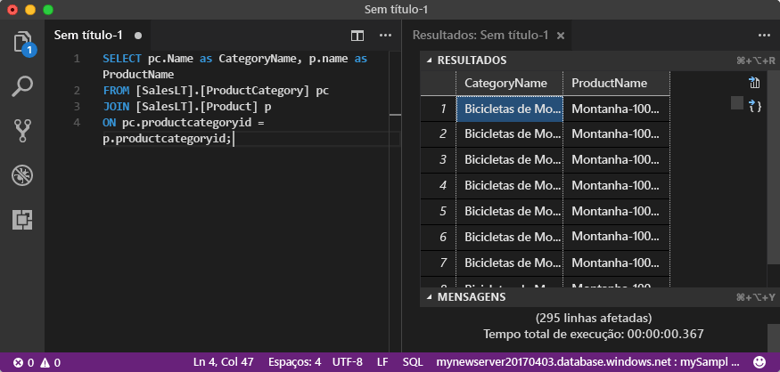

# <a name="quickstart-use-visual-studio-code-to-connect-and-query-an-azure-sql-database"></a>Quickstart: Use visual studio code para ligar e consultar uma base de dados Azure SQL

[Visual Studio Code](https://code.visualstudio.com/docs) é um editor de código gráfico para Linux, macOS e Windows. Suporta extensões, incluindo a [extensão mssql](https://aka.ms/mssql-marketplace) para consulta do Microsoft SQL Server, Azure SQL Database e SQL Data Warehouse. Neste arranque rápido, utilizará o Código do Estúdio Visual para se ligar a uma base de dados Azure SQL e, em seguida, executar declarações Transact-SQL para consultar, inserir, atualizar e eliminar dados.

## <a name="prerequisites"></a>Pré-requisitos

- Uma base de dados SQL do Azure. Pode utilizar um destes quickstarts para criar e, em seguida, configurar uma base de dados na Base de Dados Azure SQL:

  || Base de dados individual | Instância gerida |
  |:--- |:--- |:---|
  | Criar| [Portal](sql-database-single-database-get-started.md) | [Portal](sql-database-managed-instance-get-started.md) |
  || [CLI](scripts/sql-database-create-and-configure-database-cli.md) | [CLI](https://medium.com/azure-sqldb-managed-instance/working-with-sql-managed-instance-using-azure-cli-611795fe0b44) |
  || [PowerShell](scripts/sql-database-create-and-configure-database-powershell.md) | [PowerShell](scripts/sql-database-create-configure-managed-instance-powershell.md) |
  | Configurar | [Regra de firewall IP ao nível do servidor](sql-database-server-level-firewall-rule.md)| [Conectividade a partir de um VM](sql-database-managed-instance-configure-vm.md)|
  |||[Conectividade a partir do local](sql-database-managed-instance-configure-p2s.md)
  |Carregar dados|Obras de Aventura carregadas por quickstart|[Restaurar importadores mundiais](sql-database-managed-instance-get-started-restore.md)
  |||Restaurar ou importar Obras de Aventura a partir do ficheiro [BACPAC](sql-database-import.md) do [GitHub](https://github.com/Microsoft/sql-server-samples/tree/master/samples/databases/adventure-works)|
  |||

  > [!IMPORTANT]
  > Os scripts deste artigo são escritos para usar a base de dados Adventure Works. Com um caso gerido, deve importar a base de dados da Adventure Works numa base de dados de instâncias ou modificar os scripts deste artigo para utilizar a base de dados dos Importadores do Mundo.

## <a name="install-visual-studio-code"></a>Instalar o Visual Studio Code

Certifique-se de que instalou o mais recente [Código de Estúdio Visual](https://code.visualstudio.com/Download) e carregou a [extensão mssql](https://aka.ms/mssql-marketplace). Para obter orientações sobre a instalação da extensão mssql, consulte [Instalar o Código VS](https://docs.microsoft.com/sql/linux/sql-server-linux-develop-use-vscode#install-and-start-visual-studio-code) e [msql para o Código do Estúdio Visual ](https://marketplace.visualstudio.com/items?itemName=ms-mssql.mssql).

## <a name="configure-visual-studio-code"></a>Configure Código de estúdio visual

### <a name="mac-os"></a>**Mac OS**

Para o macOS, é necessário instalar o OpenSSL, que é um pré-requisito para o Núcleo .NET que a extensão mssql utiliza. Abra o terminal e introduza os comandos seguintes para instalar **brew**, **OpenSSL**.

```bash
ruby -e "$(curl -fsSL https://raw.githubusercontent.com/Homebrew/install/master/install)"
brew update
brew install openssl
mkdir -p /usr/local/lib
ln -s /usr/local/opt/openssl/lib/libcrypto.1.0.0.dylib /usr/local/lib/
ln -s /usr/local/opt/openssl/lib/libssl.1.0.0.dylib /usr/local/lib/
```

### <a name="linux-ubuntu"></a>**Linux (Ubuntu)**

Nenhuma configuração especial necessária.

### <a name="windows"></a>**Windows**

Nenhuma configuração especial necessária.

## <a name="get-sql-server-connection-information"></a>Obtenha informações de ligação ao servidor SQL

Obtenha as informações de ligação que precisa para ligar à base de dados Azure SQL. Necessitará do nome do servidor ou nome do anfitrião totalmente qualificado, nome da base de dados e informações de login para os próximos procedimentos.

1. Inicie sessão no [Portal do Azure](https://portal.azure.com/).

2. Navegue para as bases de **dados SQL** ou página de **instâncias geridas pela SQL.**

3. Na página **Overview,** reveja o nome do servidor totalmente qualificado ao lado do **nome do Servidor** para uma única base de dados ou o nome de servidor totalmente qualificado ao lado do **Anfitrião** para uma instância gerida. Para copiar o nome do servidor ou o nome do anfitrião, paire sobre ele e selecione o ícone **Copiar.**

## <a name="set-language-mode-to-sql"></a>Definir modo do idioma para SQL

No Código do Estúdio Visual, detete o modo idioma para **SQL** para ativar comandos mssql e T-SQL IntelliSense.

1. Abra uma nova janela do Visual Studio Code.

2. Prima **Ctrl**+**N**. Abre-se um novo ficheiro de texto simples.

3. Selecione **Texto Simples** no canto inferior direito da barra de estado.

4. No menu de drop-down do **modo de idioma Select** que abre, selecione **SQL**.

## <a name="connect-to-your-database"></a>Ligar à base de dados

Utilize o Visual Studio Code para estabelecer uma ligação ao servidor da Base de Dados SQL do Azure.

> [!IMPORTANT]
> Antes de continuar, certifique-se de que tem o seu servidor e faça o sinal de informação. Assim que começar a introduzir as informações de perfil de ligação, se alterar o seu foco do Código do Estúdio Visual, terá de recomeçar a criar o perfil.

1. No Código do Estúdio Visual, prima **Ctrl+Shift+P** (ou **F1)** para abrir a Paleta de Comando.

2. Selecione **MS SQL:Connect** and choose **Enter**.

3. Selecione Criar perfil de **ligação**.

4. Siga as instruções para especificar as propriedades de ligação do novo perfil. Depois de especificar cada valor, escolha **Entrar** para continuar.

   | Propriedade       | Valor sugerido | Descrição |
   | ------------ | ------------------ | ------------------------------------------------- |
   | **Nome do servidor** | O nome de servidor completamente qualificado | Algo como: **mynewserver20170313.database.windows.net.** |
   | **Nome da base de dados** | mySampleDatabase | A base de dados para ligar. |
   | **Autenticação** | Início de sessão do SQL| Este tutorial utiliza a Autenticação SQL. |
   | **Nome de utilizador** | Nome de utilizador | O nome de utilizador da conta de administração do servidor utilizada para criar o servidor. |
   | **Palavra-passe (Início de Sessão do SQL)** | Palavra-passe | A palavra-passe da conta de administração do servidor usada para criar o servidor. |
   | **Guardar Palavra-passe?** | Sim ou Não | Selecione **Sim** se não quiser introduzir a palavra-passe de cada vez. |
   | **Introduza um nome para este perfil** | Um nome de perfil, como **o mySampleProfile** | Um perfil guardado acelera a sua ligação em logins subsequentes. |

   Se for bem sucedido, aparece uma notificação a dizer que o seu perfil é criado e conectado.

## <a name="query-data"></a>Consultar dados

Executar a seguinte declaração [SELECT](https://msdn.microsoft.com/library/ms189499.aspx) Transact-SQL para consultar os 20 melhores produtos por categoria.

1. Na janela do editor, cola a seguinte consulta SQL.

   ```sql
   SELECT pc.Name as CategoryName, p.name as ProductName
   FROM [SalesLT].[ProductCategory] pc
   JOIN [SalesLT].[Product] p
   ON pc.productcategoryid = p.productcategoryid;
   ```

2. Prima O+**Turno**+ **Ctrl****E** para executar `Product` a `ProductCategory` consulta e exibir os resultados das tabelas e tabelas.

    

## <a name="insert-data"></a>Inserir dados

Executar a seguinte declaração [INSERT](https://msdn.microsoft.com/library/ms174335.aspx) Transact-SQL para `SalesLT.Product` adicionar um novo produto à tabela.

1. Substitua a consulta anterior por esta.

   ```sql
   INSERT INTO [SalesLT].[Product]
        ( [Name]
        , [ProductNumber]
        , [Color]
        , [ProductCategoryID]
        , [StandardCost]
        , [ListPrice]
        , [SellStartDate]
        )
     VALUES
        ('myNewProduct'
        ,123456789
        ,'NewColor'
        ,1
         ,100
         ,100
         ,GETDATE() );
   ```

2. Prima o**Turno**+**E** **ctrl**+para `Product` inserir uma nova linha na tabela.

## <a name="update-data"></a>Atualizar dados

Executar a seguinte declaração de [Atualização](https://msdn.microsoft.com/library/ms177523.aspx) Transact-SQL para atualizar o produto adicionado.

1. Substitua a consulta anterior por esta:

   ```sql
   UPDATE [SalesLT].[Product]
   SET [ListPrice] = 125
   WHERE Name = 'myNewProduct';
   ```

2. Prima o**turno**+ **CTRL**+**E** para `Product` atualizar a linha especificada na tabela.

## <a name="delete-data"></a>Eliminar dados

Executar a seguinte declaração [DELETE](https://docs.microsoft.com/sql/t-sql/statements/delete-transact-sql) Transact-SQL para remover o novo produto.

1. Substitua a consulta anterior por esta:

   ```sql
   DELETE FROM [SalesLT].[Product]
   WHERE Name = 'myNewProduct';
   ```

2. Prima o**turno**+ **CTRL**+**E** para `Product` eliminar a linha especificada na tabela.

## <a name="next-steps"></a>Passos seguintes

- Para ligar e consultar utilizando o Estúdio de Gestão de Servidores SQL, consulte Quickstart: Use O Estúdio de Gestão de [Servidores SQL para se ligar a uma Base de Dados SQL Azure e dados de consulta](sql-database-connect-query-ssms.md).
- Para ligar e consultar utilizando o portal Azure, consulte [Quickstart: Use o editor de Consulta SQL no portal Azure para ligar e consultar dados](sql-database-connect-query-portal.md).
- Para ler um artigo de revista MSDN sobre a utilização do Visual Studio Code, veja [Create a database IDE with MSSQL extension blog post](https://msdn.microsoft.com/magazine/mt809115) (Criar uma base de dados IDE com a mensagem de blogue de extensão do MSSQL).
