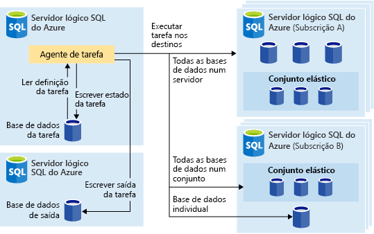
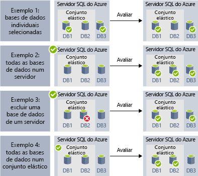
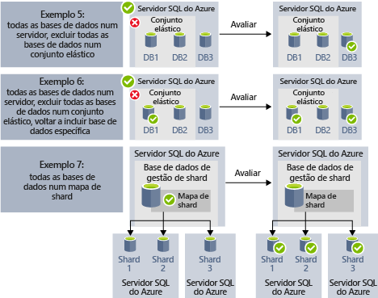

# <a name="automate-management-tasks-using-database-jobs"></a>Automatizar tarefas de gerenciamento usando trabalhos de banco de dados

O banco de dados SQL do Azure permite criar e agendar trabalhos que podem ser executados periodicamente em um ou vários bancos de dados para executar consultas T-SQL e executar tarefas de manutenção. Cada trabalho registra o status de execução e também repete as operações automaticamente se ocorrer alguma falha.
Você pode definir o banco de dados de destino ou grupos de bancos de dados SQL do Azure em que o trabalho será executado e também definir agendas para executar um trabalho.
Um trabalho manipula a tarefa de fazer logon no banco de dados de destino. Você também define, mantém e mantém scripts Transact-SQL a serem executados em um grupo de bancos de dados SQL do Azure.

## <a name="when-to-use-automated-jobs"></a>Quando usar trabalhos automatizados

Há vários cenários em que você pode usar a automação de trabalho:

- Automatize tarefas de gerenciamento e agende-as para execução a cada dia da semana, após horas, etc.
  - Implemente alterações de esquema, gestão de credenciais, recolha de dados de desempenho ou recolha de telemetria do inquilino (cliente).
  - Atualizar dados de referência (informações comuns em todos os bancos de dado), carregar dados do armazenamento de BLOBs do Azure.
  - Reconstrua índices para melhorar o desempenho das consultas. Configure tarefas para serem executadas numa coleção de bases de dados recorrentemente, como, por exemplo, fora das horas de ponta.
  - Recolha os resultados da consulta a partir de um conjunto de bases de dados numa tabela central de forma contínua. As consultas de desempenho podem ser continuamente executadas e configuradas para acionar tarefas adicionais para serem executadas.
- Recolher dados para relatórios
  - Agregue dados a partir de uma coleção de bases de dados SQL do Azure numa tabela de destino única.
  - Execute consultas de processamento de dados de execução mais longa num grande conjunto de bases de dados, por exemplo, a coleção de telemetria de cliente. Os resultados são recolhidos para uma tabela de destino única para análise adicional.
- Movimentações de dados
  - Crie trabalhos que repliquem alterações feitas em seus bancos de dados para outros bancos de dados ou coletem atualizações feitas em bancos de dados remotos e apliquem alterações no banco de dados.
  - Crie trabalhos que carregam dados de ou para seus bancos de dados usando SQL Server Integration Services (SSIS).

## <a name="overview"></a>Descrição geral

As seguintes tecnologias de agendamento de trabalho estão disponíveis no banco de dados SQL do Azure:

- Os **trabalhos do SQL Agent** são clássicos e testados pela batalha SQL Server componente de agendamento de trabalho que está disponível no instância gerenciada. Os trabalhos do SQL Agent não estão disponíveis em bancos de dados individuais.
- Os **trabalhos de banco de dados elástico (versão prévia)** são serviços de agendamento de trabalho que executam trabalhos personalizados em um ou vários bancos de dados SQL do Azure.

Vale a pena observar algumas diferenças entre o SQL Agent (disponível no local e como parte do Instância Gerenciada do Banco de Dados SQL) e o agente de trabalho elástico do banco de dados (disponível para bancos de dados individuais no banco de dados SQL do Azure e em SQL Data Warehouse).

|  |Tarefas Elásticas  |Agente do SQL |
|---------|---------|---------|
|Scope     |  Qualquer número de bases de dados SQL do Azure e/ou de armazéns de dados na mesma cloud do Azure que o agente de tarefa. Os destinos podem estar em diferentes servidores, assinaturas e/ou regiões do banco de dados SQL. <br><br>Os grupos de destino podem ser compostos por bases de dados individuais ou armazéns de dados, ou por todas as bases de dados num servidor, conjunto ou por shardmaps (enumerados dinamicamente durante a execução da tarefa). | Qualquer banco de dados individual na mesma instância de SQL Server que o SQL Agent. |
|APIs e Ferramentas suportadas     |  Portal, PowerShell, T-SQL, Azure Resource Manager      |   T-SQL, SQL Server Management Studio (SSMS)     |

## <a name="sql-agent-jobs"></a>Trabalhos do SQL Agent

Os trabalhos do SQL Agent são uma série especificada de scripts T-SQL em seu banco de dados. Use trabalhos para definir uma tarefa administrativa que pode ser executada uma ou mais vezes e monitorada quanto a êxito ou falha.
Um trabalho pode ser executado em um servidor local ou em vários servidores remotos. Os trabalhos do SQL Agent são um componente de Mecanismo de Banco de Dados interno que é executado no serviço Instância Gerenciada.
Há vários conceitos importantes nos trabalhos do SQL Agent:

- Conjunto de **etapas de trabalho** de uma ou várias etapas que devem ser executadas dentro do trabalho. Para cada etapa de trabalho, você pode definir a estratégia de repetição e a ação que deve ocorrer se a etapa de trabalho for bem-sucedida ou falhar.
- As agendas definem quando o trabalho deve ser executado.
- As **notificações** permitem que você defina regras que serão usadas para notificar operadores por email quando o trabalho for concluído.

### <a name="job-steps"></a>Etapas de trabalho

As etapas de trabalho do SQL Agent são sequências de ações que o SQL Agent deve executar. Cada etapa tem a seguinte etapa que deve ser executada se a etapa for bem-sucedida ou falhar, número de tentativas em caso de falha.
O SQL Agent permite que você crie diferentes tipos de etapas de trabalho, como a etapa de trabalho Transact-SQL que executa um único lote Transact-SQL no banco de dados ou as etapas de comando/PowerShell do sistema operacional que podem executar script de sistema operacional personalizado, as etapas de trabalho do SSIS permitem que você carregue dados usando Tempo de execução do SSIS ou etapas de [replicação](sql-database-managed-instance-transactional-replication.md) que podem publicar alterações do seu banco de dados em outros bancos.

A [replicação](sql-database-managed-instance-transactional-replication.md) transacional é um recurso mecanismo de banco de dados que permite que você publique as alterações feitas em uma ou várias tabelas em um banco de dados e publique/distribua-as para um conjunto de bancos de dados de assinante. A publicação das alterações é implementada usando os seguintes tipos de etapa de trabalho do SQL Agent:

- Leitor de log de transações.
- Instantânea.
- Distribuidor.

Outros tipos de etapas de trabalho não têm suporte no momento, incluindo:

- Não há suporte para a etapa de trabalho de replicação de mesclagem.
- Não há suporte para o leitor de fila.
- Não há suporte para Analysis Services

### <a name="job-schedules"></a>Agendas de trabalhos

Uma agenda especifica quando um trabalho é executado. Mais de um trabalho pode ser executado na mesma agenda e mais de uma agenda pode ser aplicada ao mesmo trabalho.
Uma agenda pode definir as seguintes condições para a hora em que um trabalho é executado:

- Sempre que a instância for reiniciada (ou quando SQL Server Agent for iniciado). O trabalho é ativado após cada failover.
- Uma vez, em uma data e hora específicas, o que é útil para a execução atrasada de algum trabalho.
- Em um agendamento recorrente.

> [!Note]
> Instância Gerenciada atualmente não permite que você inicie um trabalho quando a instância é "ociosa".

### <a name="job-notifications"></a>Notificações de trabalho

Os trabalhos do SQL Agent permitem que você obtenha notificações quando o trabalho for concluído com êxito ou falhar. Você pode receber notificações por email.

Primeiro, você precisaria configurar a conta de email que será usada para enviar as notificações por email e atribuir a conta ao perfil de email chamado `AzureManagedInstance_dbmail_profile`, conforme mostrado no exemplo a seguir:

```sql
-- Create a Database Mail account
EXECUTE msdb.dbo.sysmail_add_account_sp
    @account_name = 'SQL Agent Account',
    @description = 'Mail account for Azure SQL Managed Instance SQL Agent system.',
    @email_address = '$(loginEmail)',
    @display_name = 'SQL Agent Account',
    @mailserver_name = '$(mailserver)' ,
    @username = '$(loginEmail)' ,  
    @password = '$(password)' 

-- Create a Database Mail profile
EXECUTE msdb.dbo.sysmail_add_profile_sp
    @profile_name = 'AzureManagedInstance_dbmail_profile',
    @description = 'E-mail profile used for messages sent by Managed Instance SQL Agent.' ;

-- Add the account to the profile
EXECUTE msdb.dbo.sysmail_add_profileaccount_sp
    @profile_name = 'AzureManagedInstance_dbmail_profile',
    @account_name = 'SQL Agent Account',
    @sequence_number = 1;
```

Você também precisará habilitar Database Mail em Instância Gerenciada:

```sql
GO
EXEC sp_configure 'show advanced options', 1;  
GO  
RECONFIGURE;  
GO  
EXEC sp_configure 'Database Mail XPs', 1;  
GO  
RECONFIGURE 
```

Você pode notificar o operador de que algo aconteceu com seus trabalhos do SQL Agent. Um operador define informações de contato para um indivíduo responsável pela manutenção de uma ou mais instâncias gerenciadas. Às vezes, as responsabilidades do operador são atribuídas a um indivíduo.
Em sistemas com vários servidores Instância Gerenciada ou SQL, muitos indivíduos podem compartilhar responsabilidades de operador. Um operador não contém informações de segurança e não define uma entidade de segurança.

Você pode criar operadores usando o SSMS ou o script Transact-SQL mostrado no exemplo a seguir:

```sql
EXEC msdb.dbo.sp_add_operator 
    @name=N'Mihajlo Pupun', 
        @enabled=1, 
        @email_address=N'mihajlo.pupin@contoso.com'
```

Você pode modificar qualquer trabalho e atribuir operadores que serão notificados por email se o trabalho for concluído, falhar ou conseguir usar o SSMS ou o seguinte script Transact-SQL:

```sql
EXEC msdb.dbo.sp_update_job @job_name=N'Load data using SSIS', 
        @notify_level_email=3,                        -- Options are: 1 on succeed, 2 on failure, 3 on complete
        @notify_email_operator_name=N'Mihajlo Pupun'
```

### <a name="sql-agent-job-limitations"></a>Limitações de trabalho do SQL Agent

Alguns dos recursos do SQL Agent que estão disponíveis no SQL Server não têm suporte no Instância Gerenciada:
- As configurações do SQL Agent são somente leitura. Não `sp_set_agent_properties` há suporte para o procedimento no instância gerenciada.
- Atualmente, não há suporte para habilitar/desabilitar o SQL Agent no Instância Gerenciada. O SQL Agent está sempre em execução.
- Há suporte parcial para notificações
  - Não há suporte para o pager.
  - Não há suporte para Netsend.
  - Não há suporte para alertas.
- Não há suporte para proxies.
- Não há suporte para EventLog.

Para obter informações sobre SQL Server Agent, consulte [SQL Server Agent](https://docs.microsoft.com/sql/ssms/agent/sql-server-agent).

## <a name="elastic-database-jobs-preview"></a>Tarefas de Base de Dados Elástica (pré-visualização)

As **Tarefas de Base de Dados Elástica** permitem executar um ou mais scripts T-SQL em paralelo, num grande número de bases de dados, com base num agendamento ou a pedido.

**Executar tarefas em qualquer combinação de bases de dados**: uma ou mais bases de dados individuais, todas as bases de dados num servidor, todas as bases de dados num conjunto elástico, ou shardmap, com a flexibilidade adicional para incluir ou excluir qualquer base de dados específica. **As tarefas podem ser executadas em vários servidores, vários conjuntos e podem até ser executadas em bases de dados em subscrições diferentes.** Os servidores e os conjuntos são dinamicamente enumerados em runtime, para que as tarefas sejam executadas em todas as bases de dados que existem no grupo de destino no momento da execução.

A imagem seguinte mostra um agente de tarefa a executar tarefas nos diferentes tipos de grupos de destino:



### <a name="elastic-job-components"></a>Componentes de Tarefa Elástica

|Componente  | Descrição (abaixo da tabela encontram-se detalhes adicionais) |
|---------|---------|
|[**Agente de Tarefa Elástica**](#elastic-job-agent) |  O recurso do Azure que cria para executar e gerir tarefas.   |
|[**Base de dados da tarefa**](#job-database)    |    Uma base de dados SQL do Azure que o agente de tarefa utiliza para armazenar dados relacionados com a tarefa, definições de tarefas, etc.      |
|[**Grupo de destino**](#target-group)      |  O conjunto de servidores, conjuntos, bases de dados e mapas de shard no qual executar uma tarefa.       |
|[**Tarefa**](#job)  |  Um trabalho é uma unidade de trabalho composta por uma ou mais etapas de [trabalho](#job-step). Os passos de tarefa especificam o script T-SQL a executar, bem como outros detalhes necessários para executar o script.  |


#### <a name="elastic-job-agent"></a>Agente de Tarefa Elástica

Um agente de Tarefa Elástica é o recurso do Azure para criar, executar e gerir tarefas. O agente de Tarefa Elástica é um recurso do Azure que o utilizador cria no portal (o [PowerShell](elastic-jobs-powershell.md) e o REST também são suportados). 

A criação de um **agente de Tarefa Elástica** requer uma base de dados SQL existente. O agente configura esta base de dados existente como a [*Base de dados da tarefa*](#job-database).

O agente de Tarefa Elástica é gratuito. O banco de dados de trabalho é cobrado com a mesma taxa de qualquer banco de dados SQL.

#### <a name="job-database"></a>Base de dados da tarefa

A *Base de dados da tarefa* serve para definir tarefas e controlar o estado e o histórico de execuções de tarefas. O *banco de dados do trabalho* também é usado para armazenar metadados do agente, logs, resultados, definições de trabalho e também contém muitos procedimentos armazenados úteis e outros objetos de banco de dados para criar, executar e gerenciar trabalhos usando o T-SQL.

Para a pré-visualização atual, é necessária uma base de dados SQL do Azure (S0 ou superior) para criar um agente de Tarefa Elástica.

A *Base de dados da tarefa* não tem literalmente de ser nova, mas deve ser uma S0 limpa e vazia ou uma camada de serviço superior. A camada de serviço recomendada da *Base de dados da tarefa* é S1 ou superior, mas depende realmente das necessidades de desempenho das suas tarefas: número de passos de tarefa, quantas vezes e a frequência com que as tarefas são executadas. Por exemplo, uma base de dados S0 poderá ser suficiente para um agente de tarefa que executa poucas tarefas por hora, mas se executar uma tarefa a cada minuto, poderá não ser suficientemente eficaz e uma camada de serviço superior poderá ser melhor.


##### <a name="job-database-permissions"></a>Permissões da base de dados da tarefa

Durante a criação do agente de tarefa, um esquema, tabelas e uma função chamada *jobs_reader* são criados na *Base de dados da tarefa*. A função é criada com as seguintes permissões e tem como objetivo dar aos administradores um melhor controlo de acesso para a monitorização de tarefas:


|Nome da função  |permissões de esquema "jobs"  |permissões de esquema "jobs_internal"  |
|---------|---------|---------|
|**jobs_reader**     |    SELECIONAR     |    Nenhuma     |

> [!IMPORTANT]
> Considere as implicações de segurança antes de conceder acesso à *Base de dados da tarefa* como um administrador da base de dados. Um utilizador mal intencionado com permissões para criar ou editar tarefas podia criar ou editar uma tarefa que utilize uma credencial armazenada para ligar a uma base de dados sob o controlo do utilizador mal intencionado, o que podia permitir que o utilizador mal intencionado determinasse a palavra-passe da credencial.


#### <a name="target-group"></a>Grupo de destino

Um *grupo de destino* define o conjunto de bases de dados onde será executado um passo de tarefa. Um grupo de destino pode conter qualquer número e combinação dos seguintes elementos:

- **Servidor de banco de dados SQL** -se um servidor for especificado, todos os bancos de dados existentes no servidor no momento da execução do trabalho serão parte do grupo. A credencial da base de dados mestra tem de ser fornecida para que o grupo possa ser enumerado e atualizado antes da execução da tarefa.
- **Conjunto elástico** - se for especificado um conjunto elástico, todas as bases de dados que estão no conjunto elástico no momento da execução da tarefa fazem parte do grupo. Tal como acontece para um servidor, a credencial da base de dados mestra tem de ser fornecida para que o grupo possa ser atualizado antes da execução da tarefa.
- **Base de dados individual** - especifique uma ou mais bases de dados individuais para fazerem parte do grupo.
- **Shardmap** - bases de dados de um shardmap.

> [!TIP]
> No momento da execução da tarefa, a *enumeração dinâmica* reavalia o conjunto de bases de dados nos grupos de destino que incluem servidores ou conjuntos. A enumeração dinâmica garante que as **tarefas são executadas em todas as bases de dados que existem no servidor ou conjunto no momento da execução da tarefa**. A reavaliação da lista de bases de dados em runtime é especificamente útil para cenários em que a associação do conjunto ou do servidor muda com frequência.

Os conjuntos e as bases de dados individuais podem ser especificados como estando incluídos ou excluídos do grupo. Isto permite criar um grupo de destino com qualquer combinação de bases de dados. Por exemplo, pode adicionar um servidor a um grupo de destino, mas excluir bases de dados específicas num conjunto elástico (ou excluir um conjunto completo).

Um grupo de destino pode incluir bases de dados em várias subscrições e em várias regiões. Lembre-se que as execuções em várias regiões têm uma latência superior do que as execuções na mesma região.

Os seguintes exemplos mostram como as diferentes definições de grupo de destino são enumeradas dinamicamente no momento da execução do trabalho, de modo a determinar as bases de dados que o trabalho vai executar:



O **Exemplo 1** mostra um grupo de destino que consiste numa lista de bases de dados individuais. Quando é executado um passo do trabalho com este grupo de destino, a ação desse passo será executada em cada uma dessas bases de dados.<br>
O **Exemplo 2** mostra um grupo de destino que contém um Azure SQL Server como o destino. Quando é executado um passo do trabalho com este grupo de destino, o servidor é enumerado dinamicamente para determinar a lista de bases de dados que estão, atualmente, no servidor. A ação desse passo será executada em cada uma dessas bases de dados.<br>
O **Exemplo 3** mostra um grupo de destino semelhante ao do *Exemplo 2*, mas é excluída especificamente uma base de dados individual. A ação do passo deste trabalho *não* será executada na base de dados excluída.<br>
O **Exemplo 4** mostra um grupo de destino que contém um conjunto elástico como o destino. Tal como no *Exemplo 2*, o conjunto será enumerado dinamicamente no momento de execução do trabalho para determinar a lista de bases de dados contidas no mesmo.
<br><br>




O **exemplo 5** e o **exemplo 6** mostram cenários avançados nos quais os servidores SQL do Azure, pools elásticos e bancos de dados podem ser combinados usando regras de inclusão e exclusão.<br>
O **Exemplo 7** mostra que as partições num mapa de partições também podem ser avaliadas no momento de execução do trabalho.

#### <a name="job"></a>Tarefa

Uma *tarefa* é uma unidade de trabalho que é executada com base num agendamento ou como uma tarefa ocasional. Uma tarefa é composta por um ou mais *passos de tarefa*.

##### <a name="job-step"></a>Passo de tarefa

Cada passo de tarefa especifica um script T-SQL a executar, um ou mais grupos de destino onde executar o script T-SQL e as credenciais de que o agente de tarefa precisa para ligar à base de dados de destino. Cada passo de tarefa tem políticas de repetição e de tempo limite personalizáveis e, opcionalmente, pode especificar parâmetros de saída.

#### <a name="job-output"></a>Saída da tarefa

O resultado dos passos de uma tarefa em cada base de dados de destino é registado pormenorizadamente e a saída do script pode ser capturada numa tabela especificada. Pode especificar uma base de dados para guardar os dados devolvidos por uma tarefa.

#### <a name="job-history"></a>Histórico de tarefas

Histórico de execuções da tarefa é armazenado na *Base de dados da tarefa*. Uma tarefa de limpeza do sistema remove o histórico de execuções com mais de 45 dias. Para remover o histórico com menos de 45 dias, chame o procedimento armazenado **sp_purge_history** na *Base de dados da tarefa*.

### <a name="agent-performance-capacity-and-limitations"></a>Desempenho, capacidade e limitações do agente

As Tarefas Elásticas utilizam recursos de computação mínimos enquanto aguardam pela conclusão de tarefas de execução longa.

Dependendo do tamanho do grupo de destino de bases de dados e do tempo de execução pretendido para uma tarefa (número de trabalhos em simultâneo), o agente requer diferentes quantidades de computação e desempenho da *Base de dados da tarefa* (quando mais destinos houver e quanto maior for o número de tarefas, maior é a quantidade de computação necessária).

Atualmente, a pré-visualização está limitada a 100 tarefas simultâneas.

#### <a name="prevent-jobs-from-reducing-target-database-performance"></a>Impedir que as tarefas reduzam o desempenho da base de dados de destino

Para garantir que os recursos não são sobrecarregados quando executar tarefas nas bases de dados num conjunto elástico de SQL, as tarefas podem ser configuradas para limitar o número de bases de dados nas quais uma tarefa pode ser executada ao mesmo tempo.

## <a name="next-steps"></a>Passos Seguintes

- [O que é SQL Server Agent](https://docs.microsoft.com/sql/ssms/agent/sql-server-agent) 
- [Como criar e gerenciar trabalhos elásticos](elastic-jobs-overview.md) 
- [Criar e gerir Tarefas Elásticas com o PowerShell](elastic-jobs-powershell.md) 
- [Criar e gerir Tarefas Elásticas com o Transact-SQL (T-SQL)](elastic-jobs-tsql.md) 
