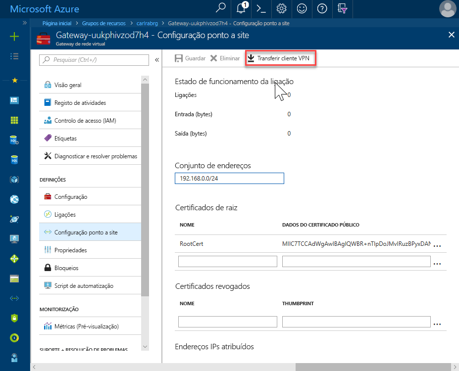
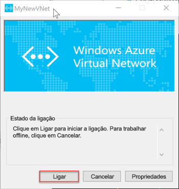

# <a name="quickstart-configure-a-point-to-site-connection-to-an-azure-sql-database-managed-instance-from-on-premises"></a>Início rápido: Configurar uma ligação de ponto a site para uma instância de gerida de base de dados do Azure SQL no local

Este início rápido demonstra como ligar a uma instância gerida da base de dados SQL do Azure, utilizando [SQL Server Management Studio](https://docs.microsoft.com/sql/ssms/sql-server-management-studio-ssms) (SSMS) de um computador de cliente no local através de uma ligação ponto a site. Para obter informações sobre ligações ponto a site, consulte [sobre VPN ponto a Site](../vpn-gateway/point-to-site-about.md)

## <a name="prerequisites"></a>Pré-requisitos

Este guia de início rápido:

- Utiliza os recursos criados [criar uma instância gerida](sql-database-managed-instance-get-started.md) como ponto de partida.
- Requer o PowerShell 5.1 e AZ PowerShell 1.4.0 ou posterior no seu computador de cliente no local. Se necessário, veja as instruções para [instalar o módulo Azure PowerShell](https://docs.microsoft.com/powershell/azure/install-az-ps#install-the-azure-powershell-module).
- Requer a versão mais recente do [SQL Server Management Studio](https://docs.microsoft.com/sql/ssms/sql-server-management-studio-ssms) (SSMS) no seu computador de cliente no local.

## <a name="attach-a-vpn-gateway-to-your-managed-instance-virtual-network"></a>Anexar um gateway de VPN à sua rede virtual de instância gerida

1. Abra o PowerShell no computador cliente no local.

2. Copie este script do PowerShell. Este script anexa um Gateway de VPN para a rede virtual de instância gerida que criou no [criar uma instância gerida](sql-database-managed-instance-get-started.md) início rápido. Este script faz o seguinte:

   - Cria e instalar certificados no computador cliente
   - Calcula o intervalo de IP de sub-rede de Gateway de VPN futuro
   - Cria o GatewaySubnet
   - Implanta o modelo do Azure Resource Manager que anexa o Gateway de VPN para sub-rede VPN

     ```powershell
     $scriptUrlBase = 'https://raw.githubusercontent.com/Microsoft/sql-server-samples/master/samples/manage/azure-sql-db-managed-instance/attach-vpn-gateway'

     $parameters = @{
       subscriptionId = '<subscriptionId>'
       resourceGroupName = '<resourceGroupName>'
       virtualNetworkName = '<virtualNetworkName>'
       certificateNamePrefix  = '<certificateNamePrefix>'
       }

     Invoke-Command -ScriptBlock ([Scriptblock]::Create((iwr ($scriptUrlBase+'/attachVPNGatewayAz.ps1?t='+ [DateTime]::Now.Ticks)).Content)) -ArgumentList $parameters, $scriptUrlBase
     ```

     > [!IMPORTANT]
     > Para utilizar o módulo Azure PowerShell Resource Manager, em vez do módulo de Az, utilize o seguinte cmdlet: `attachVPNGateway.ps1` em vez do `attachVPNGatewayAz.ps1` cmdlet.

3. Cole o script na janela do PowerShell e forneça os parâmetros necessários. Os valores para `<subscriptionId>`, `<resourceGroup>`, e `<virtualNetworkName>` devem corresponder aos perfis que utilizou para o [criar instância gerida](sql-database-managed-instance-get-started.md) início rápido. O valor para `<certificateNamePrefix>` pode ser uma cadeia de caracteres da sua preferência.

4. Execute o script do PowerShell.

> [!IMPORTANT]
> Não continue até que o script do PowerShell seja concluída.

## <a name="create-a-vpn-connection-to-your-managed-instance"></a>Criar uma ligação VPN à sua instância gerida

1. Inicie sessão no [portal do Azure](https://portal.azure.com/).
2. Abra o grupo de recursos no qual criou o gateway de rede virtual e, em seguida, abra o recurso de gateway de rede virtual.
3. Selecione **configuraçãopontoasiteda** e, em seguida, selecione **transferir cliente VPN**.

      
4. No computador cliente no local, extraia os ficheiros a partir do ficheiro zip e, em seguida, abra a pasta com os ficheiros extraídos.
5. Abra o '**WindowsAmd64** pasta e abra o **VpnClientSetupAmd64.exe** ficheiro.
6. Se receber um **Windows protegidos seu PC** da mensagem, clique em **obter mais informações** e, em seguida, clique em **executar mesmo assim**.

    \
7. Na caixa de diálogo controle de conta de utilizador, clique em **Sim** para continuar.
8. Na caixa de diálogo que referencia a rede virtual, selecione **Sim** para instalar o cliente de VPN da rede virtual.

## <a name="connect-to-the-vpn-connection"></a>Ligue-se para a ligação VPN

1. Aceda a **VPN** na **rede e Internet** no seu computador de cliente no local e selecione a rede virtual de instância gerida para estabelecer uma ligação para esta VNet. Na imagem seguinte, é com o nome da VNet **MyNewVNet**.

      
2. Selecione **Ligar**.
3. Na caixa de diálogo, selecione **Connect**.

      
4. Quando lhe for pedido que o Gerenciador de conexões necessita de privilégio elevado para atualizar a tabela de rotas, escolha **continuar**.
5. Selecione **Sim** na caixa de diálogo de controle de conta de utilizador para continuar.

   Estabeleceu uma ligação VPN à sua VNet de instância gerida.

      

## <a name="use-ssms-to-connect-to-the-managed-instance"></a>Utilizar o SSMS para ligar à instância gerida

1. No computador de cliente no local, abra o SQL Server Management Studio (SSMS).
2. Na **ligar ao servidor** caixa de diálogo, introduza o completamente qualificado **nome de anfitrião** da sua instância gerida no **nome do servidor** caixa.
3. Selecione **autenticação do SQL Server**, forneça o seu nome de utilizador e palavra-passe e, em seguida, selecione **Connect**.

      

Depois de ligar, pode ver as bases de dados do sistema e do usuário no nó de bases de dados. Também pode ver vários objetos em nós de segurança, objetos de servidor, replicação, gestão, SQL Server Agent e Profiler de XEvent.

## <a name="next-steps"></a>Passos Seguintes

- Para um início rápido que mostra como ligar a partir de uma máquina virtual do Azure, consulte [configurar uma ligação ponto a site](sql-database-managed-instance-configure-p2s.md).
- Para uma descrição geral das opções de ligação para aplicações, veja [Ligar as suas aplicações à Instância Gerida](sql-database-managed-instance-connect-app.md).
- Para restaurar uma base de dados existente do SQL Server no local para uma instância gerida, pode utilizar o [do Azure Database Migration Service (DMS) para a migração](../dms/tutorial-sql-server-to-managed-instance.md) ou o [comando T-SQL RESTORE](sql-database-managed-instance-get-started-restore.md) para restaurar a partir de um ficheiro de cópia de segurança da base de dados.
