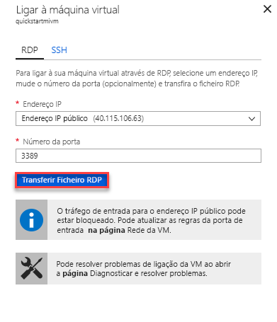

# Início rápido: configurar a VM do Azure para se conectar a um Instância Gerenciada do Banco de Dados SQL do Azure

Este guia de início rápido mostra como configurar uma máquina virtual do Azure para se conectar a um Instância Gerenciada do Banco de Dados SQL do Azure usando o SQL Server Management Studio (SSMS). Para obter um guia de início rápido mostrando como se conectar de um computador cliente local usando uma conexão ponto a site, consulte [Configurar uma conexão ponto a site](sql-database-managed-instance-configure-p2s.md)

## Pré-requisitos

Este guia de início rápido usa os recursos criados em [criar um instância gerenciada](sql-database-managed-instance-get-started.md) como ponto de partida.

## Iniciar sessão no portal do Azure

Iniciar sessão no [portal do Azure](https://portal.azure.com/).

## Criar uma nova sub-rede na VNet Instância Gerenciada

As etapas a seguir criam uma nova sub-rede na VNet Instância Gerenciada para que uma máquina virtual do Azure possa se conectar ao Instância Gerenciada. A sub-rede Instância Gerenciada é dedicada a instâncias gerenciadas. Você não pode criar outros recursos, como máquinas virtuais do Azure, nessa sub-rede.

1. Abra o grupo de recursos para o Instância Gerenciada que você criou no guia de início rápido [criar um instância gerenciada](sql-database-managed-instance-get-started.md) . Selecione a rede virtual para seu Instância Gerenciada.

   

2. Selecione sub- **redes** e, em seguida, selecione **+ sub-rede** para criar uma nova sub-rede.

   

3. Preencha o formulário usando as informações nesta tabela:

   | Definição| Valor sugerido | Descrição |
   | ---------------- | ----------------- | ----------- |
   | **Nome** | Qualquer nome válido|Para nomes válidos, veja [Regras e restrições de nomenclatura](/azure/cloud-adoption-framework/ready/azure-best-practices/naming-and-tagging).|
   | **Intervalo de endereços (bloco CIDR)** | Um intervalo válido | O valor padrão é bom para este guia de início rápido.|
   | **Grupo de segurança de rede** | Nenhum | O valor padrão é bom para este guia de início rápido.|
   | **Tabela de rotas** | Nenhum | O valor padrão é bom para este guia de início rápido.|
   | **Pontos finais de serviço** | 0 selecionado | O valor padrão é bom para este guia de início rápido.|
   | **Delegação de sub-rede** | Nenhum | O valor padrão é bom para este guia de início rápido.|

   

4. Selecione **OK** para criar essa sub-rede adicional na VNet instância gerenciada.

## Criar uma máquina virtual na nova sub-rede na VNet

As etapas a seguir mostram como criar uma máquina virtual na nova sub-rede para se conectar ao Instância Gerenciada.

## Preparar a máquina virtual do Azure

Como o SQL Instância Gerenciada é colocado em sua rede virtual privada, você precisa criar uma VM do Azure com uma ferramenta de cliente SQL instalada, como SQL Server Management Studio ou Azure Data Studio. Essa ferramenta permite que você se conecte ao Instância Gerenciada e execute consultas. Este guia de início rápido usa SQL Server Management Studio.

A maneira mais fácil de criar uma máquina virtual de cliente com todas as ferramentas necessárias é usar os modelos de Azure Resource Manager.

1. Verifique se você está conectado ao portal do Azure em outra guia do navegador. Em seguida, selecione o seguinte botão para criar uma máquina virtual do cliente e instalar SQL Server Management Studio:

    

2. Preencha o formulário usando as informações na tabela a seguir:

   | Definição| Valor sugerido | Descrição |
   | ---------------- | ----------------- | ----------- |
   | **Subscrição** | Uma assinatura válida | Deve ser uma assinatura na qual você tenha permissão para criar novos recursos. |
   | **Grupo de Recursos** |O grupo de recursos que você especificou no guia de início rápido [criar instância gerenciada](sql-database-managed-instance-get-started.md) .|Esse grupo de recursos deve ser aquele em que a VNet existe.|
   | **Localização** | O local do grupo de recursos | Esse valor é preenchido com base no grupo de recursos selecionado. |
   | **Nome da máquina virtual**  | Qualquer nome válido | Para nomes válidos, veja [Regras e restrições de nomenclatura](/azure/cloud-adoption-framework/ready/azure-best-practices/naming-and-tagging).|
   |**Nome de usuário do administrador**|Qualquer nome de usuário válido|Para nomes válidos, veja [Regras e restrições de nomenclatura](/azure/cloud-adoption-framework/ready/azure-best-practices/naming-and-tagging). Não use "ServerAdmin", pois essa é uma função de nível de servidor reservada. Você usa esse nome de usuário sempre que [se conectar à VM](#connect-to-virtual-machine).|
   |**Palavra-passe**|Qualquer palavra-passe válida|A palavra-passe tem de ter, pelo menos, 12 carateres e cumprir os [requisitos de complexidade definidos](../virtual-machines/windows/faq.md#what-are-the-password-requirements-when-creating-a-vm). Use essa senha sempre que [se conectar à VM](#connect-to-virtual-machine).|
   | **Tamanho da máquina virtual** | Qualquer tamanho válido | O padrão neste modelo de **Standard_B2s** é suficiente para este guia de início rápido. |
   | **Localização**|[resourcegroup (). Location].| Não altere esse valor. |
   | **Nome da rede virtual**|A rede virtual na qual você criou a Instância Gerenciada.|
   | **Nome da sub-rede**|O nome da sub-rede que você criou no procedimento anterior| Não escolha a sub-rede na qual você criou a Instância Gerenciada.|
   | **Localização de artefatos** | [Deployment (). Properties. templateLink. URI] | Não altere esse valor. |
   | **token SAS de localização de artefatos** | Deixar em branco | Não altere esse valor. |

   

   Se você usou o nome da VNet sugerido e a sub-rede padrão ao [criar sua instância gerenciada](sql-database-managed-instance-get-started.md), não precisará alterar os dois últimos parâmetros. Caso contrário, você deve alterar esses valores para os valores que você inseriu ao configurar o ambiente de rede.

3. Selecione a caixa de seleção **eu concordo com os termos e condições declarados acima** .
4. Selecione **comprar** para implantar a VM do Azure em sua rede.
5. Selecione o ícone **notificações** para exibir o status da implantação.

> [!IMPORTANT]
> Não continue até cerca de 15 minutos depois que a máquina virtual for criada para dar tempo para que os scripts de pós-criação sejam instalados SQL Server Management Studio.

## Conectar à máquina virtual

Os passos seguintes mostram como ligar à máquina virtual recentemente criada através de uma ligação de ambiente de trabalho remoto.

1. Após a conclusão da implementação, vá para o recurso de máquina virtual.

      

2. Selecione **Ligar**.

   Um formulário de protocolo RDP (arquivo. RDP) aparece com o endereço IP público e o número da porta para a máquina virtual.

     

3. Selecione **baixar arquivo RDP**.

   > [!NOTE]
   > Você também pode usar o SSH para se conectar à sua VM.

4. Feche o formulário **conectar-se à máquina virtual** .
5. Para ligar à sua VM, abra o ficheiro RDP transferido.
6. Quando solicitado, selecione **conectar**. Num Mac, precisa de um cliente RDP como este [Cliente de Ambiente de Trabalho Remoto](https://itunes.apple.com/us/app/microsoft-remote-desktop/id715768417?mt=12) a partir da Mac App Store.

7. Insira o nome de usuário e a senha que você especificou ao criar a máquina virtual e escolha **OK**.

8. Poderá receber um aviso de certificado durante o processo de início de sessão. Escolha **Sim** ou **continuar** para prosseguir com a conexão.

Você está conectado à sua máquina virtual no painel do Gerenciador do Servidor.

## Use o SSMS para se conectar ao Instância Gerenciada

1. Na máquina virtual, abra SQL Server Management Studio (SSMS).

   Leva alguns instantes para ser aberto, pois ele precisa concluir sua configuração, pois esta é a primeira vez que o SSMS foi iniciado.
2. Na caixa de diálogo **conectar ao servidor** , insira o nome de **host** totalmente qualificado para seu instância gerenciada na caixa **nome do servidor** . Selecione **SQL Server autenticação**, forneça seu nome de usuário e senha e, em seguida, selecione **conectar**.

      

Depois de ligar, pode ver as bases de dados do sistema e dos utilizadores no nó de bases de dados e vários objetos em nós de Segurança, Objetos de Servidor, Replicação, Gestão, SQL Server Agent e Gerador de Perfis de XEvent.

## Passos seguintes

- Para obter um guia de início rápido mostrando como se conectar de um computador cliente local usando uma conexão ponto a site, consulte [Configurar uma conexão ponto a site](sql-database-managed-instance-configure-p2s.md).
- Para uma descrição geral das opções de ligação para aplicações, veja [Ligar as suas aplicações à Instância Gerida](sql-database-managed-instance-connect-app.md).
- Para restaurar um banco de dados de SQL Server existente do local para uma instância gerenciada, você pode usar o [serviço de migração de banco de dados do Azure (DMS) para migração](../dms/tutorial-sql-server-to-managed-instance.md) ou o [comando T-SQL RESTORE](sql-database-managed-instance-get-started-restore.md) para restaurar de um arquivo de backup de banco de dados.
