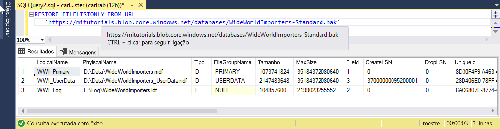

# <a name="quickstart-restore-a-database-to-a-managed-instance"></a>Início rápido: restaurar um banco de dados para um Instância Gerenciada

Neste guia de início rápido, você usará SQL Server Management Studio (SSMS) para restaurar um banco de dados (o arquivo de backup padrão Wide World Importers) do armazenamento de BLOBs do Azure para um banco de dados SQL do Azure [instância gerenciada](sql-database-managed-instance.md).

> [!VIDEO https://www.youtube.com/embed/RxWYojo_Y3Q]

> [!NOTE]
> Para obter mais informações sobre a migração usando o serviço de migração de banco de dados do Azure (DMS), consulte [migração de instância gerenciada usando DMS](../dms/tutorial-sql-server-to-managed-instance.md).
> Para obter mais informações sobre vários métodos de migração, consulte [SQL Server instância de migração para instância gerenciada do banco de dados SQL do Azure](sql-database-managed-instance-migrate.md).

## <a name="prerequisites"></a>Pré-requisitos

Este guia de início rápido:

- Usa recursos do guia de início rápido [criar um instância gerenciada](sql-database-managed-instance-get-started.md) .
- Requer que o computador tenha as [SQL Server Management Studio](https://docs.microsoft.com/sql/ssms/sql-server-management-studio-ssms) mais recentes instaladas.
- Requer o uso do SSMS para se conectar ao seu Instância Gerenciada. Consulte estes guias de início rápido sobre como se conectar:
  - [Habilitar ponto de extremidade público](sql-database-managed-instance-public-endpoint-configure.md) em instância gerenciada-essa é uma abordagem recomendada para este tutorial.
  - [Ligar a uma Instância Gerida da Base de Dados SQL do Azure a partir de uma VM do Azure](sql-database-managed-instance-configure-vm.md)
  - [Configure uma conexão ponto a site com um instância gerenciada do banco de dados SQL do Azure local](sql-database-managed-instance-configure-p2s.md).

> [!NOTE]
> Para obter mais informações sobre como fazer backup e restaurar um banco de dados SQL Server usando o armazenamento de BLOBs do Azure e uma [chave de assinatura de acesso compartilhado (SAS)](https://docs.microsoft.com/azure/storage/common/storage-dotnet-shared-access-signature-part-1), consulte [SQL Server Backup to URL](https://docs.microsoft.com/sql/relational-databases/backup-restore/sql-server-backup-to-url?view=sql-server-2017).

## <a name="restore-the-database-from-a-backup-file"></a>Restaurar o banco de dados de um arquivo de backup

No SSMS, siga estas etapas para restaurar o banco de dados de importadores mundiais para seu Instância Gerenciada. O arquivo de backup do banco de dados é armazenado em uma conta de armazenamento de BLOBs do Azure pré-configurada.

1. Abra SMSS e conecte-se ao seu Instância Gerenciada.
2. No menu à esquerda, clique com o botão direito do mouse no Instância Gerenciada e selecione **nova consulta** para abrir uma nova janela de consulta.
3. Execute o seguinte script SQL, que usa uma conta de armazenamento pré-configurada e uma chave SAS para [criar uma credencial](https://docs.microsoft.com/sql/t-sql/statements/create-credential-transact-sql) em seu instância gerenciada.

   ```sql
   CREATE CREDENTIAL [https://mitutorials.blob.core.windows.net/databases]
   WITH IDENTITY = 'SHARED ACCESS SIGNATURE'
   , SECRET = 'sv=2017-11-09&ss=bfqt&srt=sco&sp=rwdlacup&se=2028-09-06T02:52:55Z&st=2018-09-04T18:52:55Z&spr=https&sig=WOTiM%2FS4GVF%2FEEs9DGQR9Im0W%2BwndxW2CQ7%2B5fHd7Is%3D'
   ```

    

4. Para verificar sua credencial, execute o script a seguir, que usa uma URL de [contêiner](https://azure.microsoft.com/services/container-instances/) para obter uma lista de arquivos de backup.

   ```sql
   RESTORE FILELISTONLY FROM URL =
      'https://mitutorials.blob.core.windows.net/databases/WideWorldImporters-Standard.bak'
   ```

    

5. Execute o script a seguir para restaurar o banco de dados de importadores mundiais.

   ```sql
   RESTORE DATABASE [Wide World Importers] FROM URL =
     'https://mitutorials.blob.core.windows.net/databases/WideWorldImporters-Standard.bak'
   ```

    

6. Execute o script a seguir para acompanhar o status da restauração.

   ```sql
   SELECT session_id as SPID, command, a.text AS Query, start_time, percent_complete
      , dateadd(second,estimated_completion_time/1000, getdate()) as estimated_completion_time
   FROM sys.dm_exec_requests r
   CROSS APPLY sys.dm_exec_sql_text(r.sql_handle) a
   WHERE r.command in ('BACKUP DATABASE','RESTORE DATABASE')
   ```

7. Quando a restauração for concluída, exiba o banco de dados no Pesquisador de objetos. Você pode verificar se a restauração do banco de dados foi concluída usando o modo de exibição [Sys. dm_operation_status](https://docs.microsoft.com/sql/relational-databases/system-dynamic-management-views/sys-dm-operation-status-azure-sql-database) .

> [!NOTE]
> A operação de restauração de banco de dados é assíncrona e passível. Você pode receber algum erro SQL Server Management Studio se quebras de conexão ou algum tempo limite expirar. O banco de dados SQL do Azure continuará tentando restaurar o banco de dados em segundo plano e você poderá acompanhar o progresso da restauração usando as exibições [Sys. dm_exec_requests](https://docs.microsoft.com/sql/relational-databases/system-dynamic-management-views/sys-dm-exec-requests-transact-sql) e [Sys. dm_operation_status](https://docs.microsoft.com/sql/relational-databases/system-dynamic-management-views/sys-dm-operation-status-azure-sql-database) .
> Em algumas fases do processo de restauração, você verá o identificador exclusivo em vez do nome real do banco de dados nas exibições do sistema. Saiba mais sobre as diferenças de comportamento de instrução de `RESTORE` [aqui](https://docs.microsoft.com/azure/sql-database/sql-database-managed-instance-transact-sql-information#restore-statement).

## <a name="next-steps"></a>Passos seguintes

- Para solucionar problemas de backup em uma URL, consulte [SQL Server práticas recomendadas de backup para URL e solução de problemas](https://docs.microsoft.com/sql/relational-databases/backup-restore/sql-server-backup-to-url-best-practices-and-troubleshooting).
- Para obter uma visão geral das opções de conexão de aplicativo, consulte [conectar seus aplicativos ao instância gerenciada](sql-database-managed-instance-connect-app.md).
- Para consultar usando suas ferramentas ou linguagens favoritas, consulte [inícios rápidos: conexão e consulta do banco de dados SQL do Azure](sql-database-connect-query.md).
