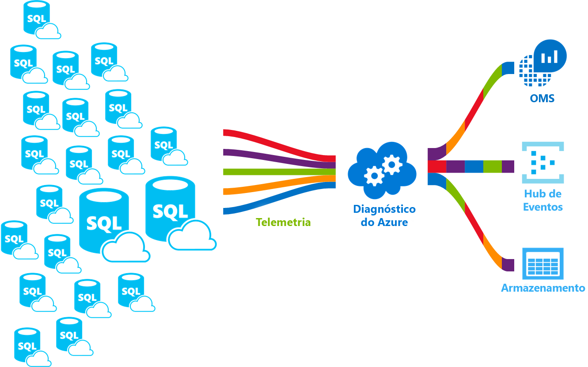

# <a name="azure-sql-database-metrics-and-diagnostics-logging"></a>Extração de métricas de base de dados Azure SQL e diagnósticos

Neste artigo, você aprenderá a ativar e configurar o registo de telemetria de diagnósticos para bases de dados Azure SQL através do portal Azure, PowerShell, Azure CLI, o modelo REST API e Azure Resource Manager. Bases de dados únicas, bases de dados reunidas, piscinas elásticas, instâncias geridas e bases de dados de instâncias podem transmitir métricas e registos de diagnóstico para um dos seguintes recursos Do Azure:

- **Azure SQL Analytics**: Obtenha uma monitorização inteligente das suas bases de dados que inclua relatórios de desempenho, alertas e recomendações de mitigação
- **Azure Event Hubs**: Integre a telemetria da base de dados com as suas soluções de monitorização personalizadas ou oleodutos quentes
- **Armazenamento Azure**: Arquivo grandes quantidades de telemetria por uma fração do preço

Estes diagnósticos podem ser utilizados para medir a utilização de recursos e as estatísticas de execução de consultas para uma monitorização mais fácil do desempenho.



Para obter mais informações sobre as métricas e categorias de registo suportadas pelos vários serviços Azure, consulte:

- [Visão geral das métricas no Microsoft Azure](../monitoring-and-diagnostics/monitoring-overview-metrics.md)
- [Visão geral dos registos de diagnóstico sinuoso do Azure](../azure-monitor/platform/platform-logs-overview.md)

## <a name="enable-logging-of-diagnostics-telemetry"></a>Ativar o registo da telemetria de diagnósticos

Pode ativar e gerir a exploração de telemetria de métricas e diagnósticos utilizando um dos seguintes métodos:

- Portal do Azure
- PowerShell
- CLI do Azure
- Azure Monitor REST API
- Modelo Azure Resource Manager

Quando ativa a exploração de métricas e diagnósticos, é necessário especificar o destino de recursos Azure para recolher a telemetria de diagnósticos. As opções disponíveis incluem:

- [Análise SQL do Azure](#stream-diagnostic-telemetry-into-sql-analytics)
- [Azure Event Hubs](#stream-diagnostic-telemetry-into-event-hubs)
- [Armazenamento do Azure](#stream-diagnostic-telemetry-into-azure-storage)

Pode fornecer um novo recurso Azure ou selecionar um recurso existente. Depois de escolher um recurso utilizando a opção definições de **Diagnóstico,** especifique quais os dados a recolher.

## <a name="supported-diagnostic-logging-for-azure-sql-databases"></a>Exploração de diagnóstico suportada para bases de dados Azure SQL

Pode configurar bases de dados Azure SQL para recolher a seguinte telemetria de diagnóstico:

| Monitorização da telemetria para bases de dados | Base de dados única e suporte de base de dados agréis | Suporte de base de dados de instância sonuosa |
| :------------------- | ----- | ----- |
| [Métricas básicas](#basic-metrics): Contém percentagem dTU/CPU, limite DTU/CPU, percentagem de leitura de dados físicos, percentagem de escrita de registo, sucesso/falhado/bloqueado por ligações de firewall, percentagem de sessões, percentagem de trabalhadores, armazenamento, percentagem de armazenamento e percentagem de armazenamento XTP. | Sim | Não |
| [Instância e App Avançada](#advanced-metrics): Contém dados de base de dados do sistema tempdb e tamanho de ficheiro de registo e ficheiro de registo tempdb por cento utilizado. | Sim | Não |
| [QueryStoreRuntimeStatistics](#query-store-runtime-statistics): Contém informações sobre as estatísticas do tempo de execução da consulta, tais como a utilização do CPU e as estatísticas de duração da consulta. | Sim | Sim |
| [QueryStoreWaitStatistics](#query-store-wait-statistics): Contém informações sobre as estatísticas de espera de consulta (sobre o que as suas consultas esperaram) tais são CPU, LOG e LOCKING. | Sim | Sim |
| [Erros](#errors-dataset): Contém informações sobre erros SQL numa base de dados. | Sim | Sim |
| [DatabaseWaitStatistics](#database-wait-statistics-dataset): Contém informações sobre quanto tempo uma base de dados passou à espera de diferentes tipos de espera. | Sim | Não |
| [Intervalos](#time-outs-dataset): Contém informações sobre intervalos numa base de dados. | Sim | Não |
| [Blocos](#blockings-dataset): Contém informações sobre o bloqueio de eventos numa base de dados. | Sim | Não |
| [Impasses](#deadlocks-dataset): Contém informações sobre eventos de impasse numa base de dados. | Sim | Não |
| [Afinação Automática](#automatic-tuning-dataset): Contém informações sobre recomendações de afinação automática para uma base de dados. | Sim | Não |
| [SQLInsights](#intelligent-insights-dataset): Contém Insights Inteligentes no desempenho de uma base de dados. Para saber mais, consulte [Insights Inteligentes.](sql-database-intelligent-insights.md) | Sim | Sim |

> [!IMPORTANT]
> Piscinas elásticas e instâncias geridas têm a sua própria telemetria de diagnóstico separada das bases de dados que contêm. Isto é importante notar que a telemetria de diagnósticos é configurada separadamente para cada um destes recursos.
>
> Para permitir o streaming de [registos](sql-database-auditing.md#subheading-2) de auditoria, consulte A auditoria da sua base de dados e [registos de auditoria nos registos do Monitor Azure e](https://techcommunity.microsoft.com/t5/Azure-SQL-Database/SQL-Audit-logs-in-Azure-Log-Analytics-and-Azure-Event-Hubs/ba-p/386242)nos Hubs de Eventos Azure .
>
> As definições de diagnóstico não podem ser configuradas para as bases de dados do **sistema**, tais são bases de dados master, msdb, model, resource e tempdb.

## <a name="configure-streaming-of-diagnostic-telemetry"></a>Configurar o streaming da telemetria de diagnóstico

Pode utilizar o menu de **definições** de Diagnóstico no portal Azure para ativar e configurar o streaming de telemetria de diagnósticos. Além disso, pode utilizar os [modelos](../azure-monitor/platform/diagnostic-settings-template.md) PowerShell, Azure CLI, [REST API](https://docs.microsoft.com/rest/api/monitor/diagnosticsettings)e Resource Manager para configurar o streaming de telemetria de diagnóstico. Pode definir os seguintes destinos para transmitir a telemetria de diagnóstico: Armazenamento Azure, Hubs de Eventos Azure e registos do Monitor Azure.

> [!IMPORTANT]
> O registo da telemetria de diagnóstico não é ativado por defeito.

# <a name="azure-portal"></a>[Portal do Azure](#tab/azure-portal)

### <a name="elastic-pools"></a>Conjuntos elásticos

Você pode configurar um recurso de piscina elástica para recolher a seguinte telemetria de diagnóstico:

| Recurso | Telemetria de monitorização |
| :------------------- | ------------------- |
| **Piscina elástica** | [As métricas básicas](sql-database-metrics-diag-logging.md#basic-metrics) contêm percentagem eDTU/CPU, limite eDTU/CPU, percentagem de leitura de dados físicos, percentagem de escrita de registo, percentagem de sessões, percentagem de trabalhadores, armazenamento, percentagem de armazenamento, limite de armazenamento e percentagem de armazenamento XTP. |

Para configurar o streaming de telemetria de diagnóstico para piscinas elásticas e bases de dados reunidas, é necessário configurar separadamente cada um separadamente:

- Ativar o streaming de telemetria de diagnóstico para uma piscina elástica
- Ativar o streaming de telemetria de diagnósticopara cada base de dados em piscina elástica

O recipiente de piscina elástica tem a sua própria telemetria separada da telemetria de cada base de dados individual.

Para permitir o streaming de telemetria de diagnóstico para um recurso de piscina elástica, siga estes passos:

1. Vá ao recurso **de piscina elástica** no portal Azure.
2. Selecione **definições de Diagnóstico**.
3. Selecione **ligar os diagnósticos** se não existirem definições anteriores ou selecione **a definição editar** para editar uma definição anterior.

   

4. Introduza um nome de definição para a sua própria referência.
5. Selecione um recurso de destino para os dados de diagnóstico de streaming: **Archive para a conta de armazenamento,** Stream para um hub de **eventos,** ou Enviar para **Log Analytics**.
6. Para análise de registos, **selecione Configure** e crie um novo espaço de trabalho selecionando **+Create New Workspace,** ou selecione um espaço de trabalho existente.
7. Selecione a caixa de verificação para a telemetria de diagnóstico de piscina elástica: Métricas **básicas.**
   

8. Selecione **Guardar**.
9. Além disso, configurar o streaming de telemetria de diagnóstico para cada base de dados dentro do pool elástico que pretende monitorizar seguindo os passos descritos na secção seguinte.

> [!IMPORTANT]
> Além de configurar a telemetria de diagnóstico para uma piscina elástica, também precisa de configurar a telemetria de diagnóstico para cada base de dados na piscina elástica.

### <a name="single-or-pooled-database"></a>Base de dados única ou agréu

Pode configurar um recurso de base de dados único ou agrupado para recolher a seguinte telemetria de diagnóstico:

| Recurso | Telemetria de monitorização |
| :------------------- | ------------------- |
| **Base de dados única ou agréu** | [As métricas básicas](sql-database-metrics-diag-logging.md#basic-metrics) contêm percentagem de DTU, DTU usado, limite dTU, percentagem de CPU, percentagem de leitura de dados físicos, percentagem de log write, sucesso/falhado/bloqueado por ligações de firewall, percentagem de sessões, percentagem de trabalhadores, armazenamento, percentagem de armazenamento, percentagem de armazenamento XTP e impasses. |

Para permitir o streaming de telemetria de diagnóstico para uma única ou uma base de dados agrofada, siga estes passos:

1. Vá ao recurso de base de dados Azure **SQL.**
2. Selecione **definições de Diagnóstico**.
3. Selecione **ligar os diagnósticos** se não existirem definições anteriores ou selecione **a definição editar** para editar uma definição anterior. Pode criar até três ligações paralelas para transmitir telemetria de diagnósticos.
4. **Selecione Adicionar definição de diagnóstico** para configurar o streaming paralelo de dados de diagnóstico para vários recursos.

   

5. Introduza um nome de definição para a sua própria referência.
6. Selecione um recurso de destino para os dados de diagnóstico de streaming: **Archive para a conta de armazenamento,** Stream para um hub de **eventos,** ou Enviar para **Log Analytics**.
7. Para a experiência de monitorização padrão e baseada em eventos, selecione as seguintes caixas de verificação para a telemetria de registo de diagnósticos de bases de dados: **SQLInsights**, **AutomaticTuning**, **QueryStoreRuntimeStatistics**, **QueryStoreWaitStatistics**, **Errors**, **DatabaseWaitStatistics,** **Timeouts,** **Blocks**e **Deadlocks.**
8. Para uma experiência avançada de monitorização baseada em um minuto, selecione a caixa de verificação para métricas **Básicas.**

   
9. Selecione **Guardar**.
10. Repita estes passos para cada base de dados que pretende monitorizar.

> [!TIP]
> Repita estes passos para cada base de dados individual e agr0éle que pretende monitorizar.

### <a name="managed-instance"></a>Instância gerida

Pode configurar um recurso de instância gerido para recolher a seguinte telemetria de diagnóstico:

| Recurso | Telemetria de monitorização |
| :------------------- | ------------------- |
| **Instância gerida** | [O ResourceUsageStats](#resource-usage-stats-for-managed-instances) contém contagem vCores, percentagem média de CPU, pedidos de IO, bytes lidos/escritos, espaço de armazenamento reservado e espaço de armazenamento usado. |

Para configurar o streaming de telemetria de diagnóstico seleções de instâncias geridas e por exemplo, terá de configurar separadamente cada um:

- Ativar o streaming de telemetria de diagnósticos para instância gerida
- Ativar o streaming de telemetria de diagnósticopara cada base de dados de instâncias

O contentor de instância gerido tem a sua própria telemetria separada da telemetria de cada instância.

Para permitir o streaming de telemetria de diagnóstico para um recurso de instância gerido, siga estes passos:

1. Vá ao recurso **de instância gerido** no portal Azure.
2. Selecione **definições de Diagnóstico**.
3. Selecione **ligar os diagnósticos** se não existirem definições anteriores ou selecione **a definição editar** para editar uma definição anterior.

   

4. Introduza um nome de definição para a sua própria referência.
5. Selecione um recurso de destino para os dados de diagnóstico de streaming: **Archive para a conta de armazenamento,** Stream para um hub de **eventos,** ou Enviar para **Log Analytics**.
6. Para análise de registos, **selecione Configure** e crie um novo espaço de trabalho selecionando **+Create New Workspace**, ou use um espaço de trabalho existente.
7. Selecione a caixa de verificação, por exemplo, telemetria de diagnóstico: **ResourceUsageStats**.

   

8. Selecione **Guardar**.
9. Além disso, configurar o streaming de telemetria de diagnósticopara cada base de dados de cada instância dentro da instância gerida que pretende monitorizar seguindo os passos descritos na secção seguinte.

> [!IMPORTANT]
> Além de configurar a telemetria de diagnósticos para uma instância gerida, também precisa de configurar a telemetria de diagnóstico para cada base de dados de cada instância.

### <a name="instance-database"></a>Base de dados de instâncias

Pode configurar um recurso de base de dados de instância para recolher a seguinte telemetria de diagnóstico:

| Recurso | Telemetria de monitorização |
| :------------------- | ------------------- |
| **Base de dados de instâncias** | [O ResourceUsageStats](#resource-usage-stats-for-managed-instances) contém contagem vCores, percentagem média de CPU, pedidos de IO, bytes lidos/escritos, espaço de armazenamento reservado e espaço de armazenamento usado. |

Para permitir o streaming de telemetria de diagnósticos para uma base de dados de exemplo, siga estes passos:

1. Vá a recurso de base de **dados em caso de** gestão.
2. Selecione **definições de Diagnóstico**.
3. Selecione **ligar os diagnósticos** se não existirem definições anteriores ou selecione **a definição editar** para editar uma definição anterior.
   - Pode criar até três (3) ligações paralelas à telemetria de diagnóstico sonante.
   - Selecione **+Adicione a definição de diagnóstico** para configurar o streaming paralelo de dados de diagnóstico para vários recursos.

   

4. Introduza um nome de definição para a sua própria referência.
5. Selecione um recurso de destino para os dados de diagnóstico de streaming: **Archive para a conta de armazenamento,** Stream para um hub de **eventos,** ou Enviar para **Log Analytics**.
6. Selecione as caixas de verificação para telemetria de diagnóstico de base de dados: **SQLInsights,** **QueryStoreRuntimeStatistics**, **QueryStoreWaitStatistics**, e **Errors**.
   
7. Selecione **Guardar**.
8. Repita estes passos para cada base de dados de cada instância que pretende monitorizar.

> [!TIP]
> Repita estes passos para cada base de dados de cada instância que pretende monitorizar.

# <a name="powershell"></a>[PowerShell](#tab/azure-powershell)

[!INCLUDE [updated-for-az](../../includes/updated-for-az.md)]

> [!IMPORTANT]
> O módulo PowerShell Azure Resource Manager ainda é suportado pela Base de Dados Azure SQL, mas todo o desenvolvimento futuro é para o módulo Az.Sql. Para estes cmdlets, consulte [AzureRM.Sql](https://docs.microsoft.com/powershell/module/AzureRM.Sql/). Os argumentos para os comandos no módulo Az e nos módulos AzureRm são substancialmente idênticos.

Pode ativar o registo de métricas e diagnósticos utilizando o PowerShell.

- Para ativar o armazenamento de registos de diagnóstico numa conta de armazenamento, utilize este comando:

   ```powershell
   Set-AzDiagnosticSetting -ResourceId [your resource id] -StorageAccountId [your storage account id] -Enabled $true
   ```

   O ID da conta de armazenamento é o ID de recursos para a conta de armazenamento de destino.

- Para ativar a transmissão em fluxo de registos de diagnóstico para um hub de eventos, use este comando:

   ```powershell
   Set-AzDiagnosticSetting -ResourceId [your resource id] -ServiceBusRuleId [your service bus rule id] -Enabled $true
   ```

   O ID de regra de Azure Service Bus é uma cadeia de caracteres com este formato:

   ```powershell
   {service bus resource ID}/authorizationrules/{key name}
   ```

- Para ativar o envio de registos de diagnóstico para uma área de trabalho do Log Analytics, use este comando:

   ```powershell
   Set-AzDiagnosticSetting -ResourceId [your resource id] -WorkspaceId [resource id of the log analytics workspace] -Enabled $true
   ```

- Pode obter o ID de recurso da sua área de trabalho do Log Analytics, utilizando o seguinte comando:

   ```powershell
   (Get-AzOperationalInsightsWorkspace).ResourceId
   ```

Pode combinar estes parâmetros para ativar várias opções de saída.

**Para configurar vários recursos Azure**

Para suportar várias subscrições, utilize o script PowerShell a partir de métricas de [recursos Enable Azure utilizando powerShell](https://blogs.technet.microsoft.com/msoms/20../../enable-azure-resource-metrics-logging-using-powershell/).

Forneça o id de recursos do espaço de trabalho \<$WSID\> como parâmetro na execução do script `Enable-AzureRMDiagnostics.ps1` enviar dados de diagnóstico de vários recursos para o espaço de trabalho.

- Para obter o ID do espaço de trabalho \<$WSID\> do destino para os seus dados de diagnóstico, utilize o seguinte script:

    ```powershell
    $WSID = "/subscriptions/<subID>/resourcegroups/<RG_NAME>/providers/microsoft.operationalinsights/workspaces/<WS_NAME>"
    .\Enable-AzureRMDiagnostics.ps1 -WSID $WSID
    ```

   Substitua \<\> subID pelo ID de subscrição, \<RG_NAME\> com o nome do grupo de recursos e \<WS_NAME\> com o nome do espaço de trabalho.

# <a name="azure-cli"></a>[CLI do Azure](#tab/azure-cli)

Pode ativar a exploração de métricas e diagnósticos utilizando o CLI Azure.

> [!IMPORTANT]
> Os scripts para permitir o registo de diagnósticos são suportados para Azure CLI v1.0. Azure CLI v2.0 não é suportado neste momento.

- Para permitir o armazenamento de registos de diagnóstico numa conta de armazenamento, utilize este comando:

   ```azurecli-interactive
   azure insights diagnostic set --resourceId <resourceId> --storageId <storageAccountId> --enabled true
   ```

   O ID da conta de armazenamento é o ID de recursos para a conta de armazenamento de destino.

- Para permitir o streaming de registos de diagnóstico saem para um centro de eventos, utilize este comando:

   ```azurecli-interactive
   azure insights diagnostic set --resourceId <resourceId> --serviceBusRuleId <serviceBusRuleId> --enabled true
   ```

   O ID da regra do ônibus de serviço é uma cadeia com este formato:

   ```azurecli-interactive
   {service bus resource ID}/authorizationrules/{key name}
   ```

- Para permitir o envio de registos de diagnóstico para um espaço de trabalho de Log Analytics, utilize este comando:

   ```azurecli-interactive
   azure insights diagnostic set --resourceId <resourceId> --workspaceId <resource id of the log analytics workspace> --enabled true
   ```

Pode combinar estes parâmetros para ativar várias opções de saída.

---

## <a name="stream-diagnostic-telemetry-into-sql-analytics"></a>Transmitir telemetria de diagnóstico para SQL Analytics

O Azure SQL Analytics é uma solução em nuvem que monitoriza o desempenho de bases de dados individuais, piscinas elásticas e bases de dados reunidas, e casos geridos e bases de dados de instâncias em escala e em várias subscrições. Pode ajudá-lo a recolher e visualizar as métricas de desempenho da Base de Dados Azure SQL, e tem inteligência incorporada para resolução de problemas de desempenho.


As métricas de base de dados SQL e os registos de diagnóstico podem ser transmitidos para o Azure SQL Analytics utilizando a opção **Enviar para Log Analytics** incorporada no separador de definições de diagnóstico no portal Azure. Também pode ativar a análise de registoutilizando definições de diagnóstico através de cmdlets PowerShell, do Azure CLI ou da API DO MONITOR Azure.

### <a name="installation-overview"></a>Descrição geral da instalação

Pode monitorizar uma coleção de bases de dados Azure SQL com a Azure SQL Analytics executando os seguintes passos:

1. Crie uma solução Azure SQL Analytics a partir do Azure Marketplace.
2. Criar um espaço de trabalho de monitorização na solução.
3. Configure bases de dados para transmitir telemetria de diagnóstico para o espaço de trabalho.

Se estiver a usar piscinas elásticas ou instâncias geridas, também precisa de configurar a telemetria de diagnóstico sacana destes recursos.

### <a name="create-an-azure-sql-analytics-resource"></a>Criar um recurso Azure SQL Analytics

1. Procure o Azure SQL Analytics no Azure Marketplace e selecione-o.

   

2. Selecione **Criar** no ecrã de visão geral da solução.

3. Preencha o formulário Azure SQL Analytics com as informações adicionais que são necessárias: nome do espaço de trabalho, subscrição, grupo de recursos, localização e nível de preços.

   

4. Selecione **OK** para confirmar e, em seguida, selecione **Criar**.

### <a name="configure-databases-to-record-metrics-and-diagnostics-logs"></a>Configure bases de dados para registar registos de métricas e diagnósticos

A forma mais fácil de configurar onde as bases de dados registam métricas é utilizando o portal Azure. Vá ao seu recurso de base de dados no portal Azure e selecione **definições**de Diagnóstico .

### <a name="use-azure-sql-analytics-for-monitoring-and-alerting"></a>Utilize o Azure SQL Analytics para monitorização e alerta

Pode utilizar o SQL Analytics como um painel hierárquico para visualizar os seus recursos de base de dados SQL.

- Para aprender a utilizar o Azure SQL Analytics, consulte [o Monitor SQL Database utilizando o SQL Analytics](../log-analytics/log-analytics-azure-sql.md).
- Para aprender a configurar alertas no SQL Analytics, consulte Criar alertas para bases de [dados, piscinas elásticas e instâncias geridas](../azure-monitor/insights/azure-sql.md#analyze-data-and-create-alerts).

## <a name="stream-diagnostic-telemetry-into-event-hubs"></a>Transmitir telemetria de diagnóstico em Centros de Eventos

Pode transmitir métricas de base de dados E diagnósticos SQL em Centros de Eventos, utilizando o Fluxo incorporado para uma opção de hub de **eventos** no portal Azure. Também pode ativar o ID da regra do ônibus de serviço utilizando definições de diagnóstico através de cmdlets PowerShell, o Azure CLI ou o API REST Do Monitor Azure.

### <a name="what-to-do-with-metrics-and-diagnostics-logs-in-event-hubs"></a>O que fazer com métricas e diagnósticos em Centros de Eventos

Depois de os dados selecionados entrarem em Hubs de Eventos, está um passo mais perto de permitir cenários de monitorização avançados. O Event Hubs funciona como a porta da frente para um oleoduto de eventos. Após a recolha de dados num centro de eventos, pode ser transformado e armazenado utilizando um fornecedor de análise em tempo real ou um adaptador de armazenamento. O Event Hubs dissocia a produção de um fluxo de eventos do consumo desses eventos. Desta forma, os consumidores podem aceder aos eventos na sua própria agenda. Para mais informações sobre os Centros de Eventos, consulte:

- [O que são Hubs de Eventos Azure?](../event-hubs/event-hubs-what-is-event-hubs.md)
- [Introdução ao Event Hubs](../event-hubs/event-hubs-csharp-ephcs-getstarted.md)

Pode utilizar métricas transmitidas em Centros de Eventos para:

- **Ver saúde do serviço através do streaming de dados de caminho sinuoso para Power BI**

   Ao utilizar Hubs de Eventos, Stream Analytics e Power BI, pode facilmente transformar as suas métricas e dados de diagnóstico em informações quase em tempo real sobre os seus serviços Azure. Para uma visão geral de como configurar um hub de eventos, processe dados com stream analytics, e use Power BI como uma saída, consulte [Stream Analytics e Power BI](../stream-analytics/stream-analytics-power-bi-dashboard.md).

- **Registos de fluxo para fluxos de exploração e telemetria de terceiros**

   Ao utilizar o streaming de Event Hubs, pode obter os seus registos de métricas e diagnósticos em várias soluções de monitorização e análise de registo de terceiros.

- **Construa uma plataforma personalizada de telemetria e exploração madeireira**

   Já tem uma plataforma de telemetria personalizada ou está a considerar construir uma? A natureza altamente escalável de subscrição de registos de registos de eventos permite-lhe ingerir de forma flexível registos de diagnóstico. Consulte [o guia de Dan Rosanova para usar os Event Hubs numa plataforma de telemetria à escala global.](https://azure.microsoft.com/documentation/videos/build-2015-designing-and-sizing-a-global-scale-telemetry-platform-on-azure-event-Hubs/)

## <a name="stream-diagnostic-telemetry-into-azure-storage"></a>Stream diagnostic telemetria para o Armazenamento Azure

Pode armazenar registos de métricas e diagnósticos no Armazenamento Azure utilizando o Arquivo incorporado **para uma opção** de conta de armazenamento no portal Azure. Também pode ativar o Armazenamento utilizando definições de diagnóstico através de cmdlets PowerShell, do Azure CLI ou da API DO MONITOR Azure.

### <a name="schema-of-metrics-and-diagnostics-logs-in-the-storage-account"></a>Esquema de registos de métricas e diagnósticos na conta de armazenamento

Depois de configurar a recolha de registos de métricas e diagnósticos, é criado um recipiente de armazenamento na conta de armazenamento selecionada quando as primeiras filas de dados estão disponíveis. A estrutura das bolhas é:

```powershell
insights-{metrics|logs}-{category name}/resourceId=/SUBSCRIPTIONS/{subscription ID}/ RESOURCEGROUPS/{resource group name}/PROVIDERS/Microsoft.SQL/servers/{resource_server}/ databases/{database_name}/y={four-digit numeric year}/m={two-digit numeric month}/d={two-digit numeric day}/h={two-digit 24-hour clock hour}/m=00/PT1H.json
```

Ou, mais simplesmente:

```powershell
insights-{metrics|logs}-{category name}/resourceId=/{resource Id}/y={four-digit numeric year}/m={two-digit numeric month}/d={two-digit numeric day}/h={two-digit 24-hour clock hour}/m=00/PT1H.json
```

Por exemplo, um nome blob para métricas básicas pode ser:

```powershell
insights-metrics-minute/resourceId=/SUBSCRIPTIONS/s1id1234-5679-0123-4567-890123456789/RESOURCEGROUPS/TESTRESOURCEGROUP/PROVIDERS/MICROSOFT.SQL/ servers/Server1/databases/database1/y=2016/m=08/d=22/h=18/m=00/PT1H.json
```

Um nome blob para armazenar dados de uma piscina elástica parece:

```powershell
insights-{metrics|logs}-{category name}/resourceId=/SUBSCRIPTIONS/{subscription ID}/ RESOURCEGROUPS/{resource group name}/PROVIDERS/Microsoft.SQL/servers/{resource_server}/ elasticPools/{elastic_pool_name}/y={four-digit numeric year}/m={two-digit numeric month}/d={two-digit numeric day}/h={two-digit 24-hour clock hour}/m=00/PT1H.json
```

## <a name="data-retention-policy-and-pricing"></a>Política de retenção de dados e preços

Se selecionar Hubs de Eventos ou uma conta de Armazenamento, pode especificar uma política de retenção. Esta política elimina dados mais antigos do que um período de tempo selecionado. Se especificar o Log Analytics, a política de retenção depende do nível de preços selecionado. Neste caso, as unidades gratuitas de ingestão de dados fornecidas podem permitir a monitorização gratuita de várias bases de dados todos os meses. Qualquer consumo de telemetria de diagnósticos que exceda as unidades gratuitas pode incorrer em custos. 

> [!IMPORTANT]
> Bases de dados ativas com cargas de trabalho mais pesadas ingebem mais dados do que bases de dados inativas. Para mais informações, consulte [os preços de análise](https://azure.microsoft.com/pricing/details/monitor/)de registo .

Se estiver a utilizar o Azure SQL Analytics, pode monitorizar o seu consumo de ingestão de dados selecionando o **Workspace OMS** no menu de navegação do Azure SQL Analytics e, em seguida, selecionando **o Uso** e **Custos Estimados.**

## <a name="metrics-and-logs-available"></a>Métricas e registos disponíveis

A telemetria de monitorização disponível para bases de dados individuais, bases de dados em conjunto, piscinas elásticas, instâncias geridas e bases de dados de instâncias está documentada nesta secção do artigo. A telemetria de monitorização recolhida dentro do SQL Analytics pode ser usada para a sua própria análise personalizada e desenvolvimento de aplicações usando a linguagem de consultas de [log Do Monitor Azure.](https://docs.microsoft.com/azure/log-analytics/query-language/get-started-queries)

### <a name="basic-metrics"></a>Métricas básicas

Consulte as tabelas seguintes para obter detalhes sobre métricas básicas por recurso.

> [!NOTE]
> A opção de métricas básicas era anteriormente conhecida como Todas as métricas. A alteração feita foi apenas para o nome e não houve alteração das métricas monitorizadas. Esta alteração foi iniciada para permitir a introdução de categorias métricas adicionais no futuro.

#### <a name="basic-metrics-for-elastic-pools"></a>Métricas básicas para piscinas elásticas

|**Recurso**|**Métricas**|
|---|---|
|Conjunto elástico|eDTU percentagem, eDTU usado, limite eDTU, percentagem de CPU, dados físicos ler percentagem, percentagem de log write, percentagem de sessões, percentagem de trabalhadores, armazenamento, percentagem de armazenamento, limite de armazenamento, percentagem de armazenamento XTP |

#### <a name="basic-metrics-for-single-and-pooled-databases"></a>Métricas básicas para bases de dados individuais e reunidas

|**Recurso**|**Métricas**|
|---|---|
|Base de dados única e agréu|Percentagem dTU, DTU usado, limite dTU, percentagem de CPU, percentagem de leitura de dados físicos, percentagem de log write, sucesso/falhado/bloqueado por ligações de firewall, percentagem de sessões, percentagem de trabalhadores, armazenamento, percentagem de armazenamento, percentagem de armazenamento xtp e impasses |

### <a name="advanced-metrics"></a>Métricas avançadas

Consulte a tabela seguinte para obter detalhes sobre métricas avançadas.

|**Métricas**|**Nome de exibição métrica**|**Descrição**|
|---|---|---|
|tempdb_data_size| Kilobytes de tamanho de ficheiro de dados tempdb |Kilobytes de tamanho de ficheiro de dados tempdb. Não aplicável aos armazéns de dados. Esta métrica estará disponível para bases de dados utilizando o modelo de compra vCore com 2 vCores e mais alto, ou 200 DTU e superior para modelos de compra baseados em DTU. Esta métrica não está atualmente disponível para bases de dados de hiperescala.|
|tempdb_log_size| Kilobytes de tamanho de ficheiro de log tempdb |Kilobytes de ficheiro de log tempdb. Não aplicável aos armazéns de dados. Esta métrica estará disponível para bases de dados utilizando o modelo de compra vCore com 2 vCores e mais alto, ou 200 DTU e superior para modelos de compra baseados em DTU. Esta métrica não está atualmente disponível para bases de dados de hiperescala.|
|tempdb_log_used_percent| Log por cento temporário usado |Registo de percentagens temporárias usado. Não aplicável aos armazéns de dados. Esta métrica estará disponível para bases de dados utilizando o modelo de compra vCore com 2 vCores e mais alto, ou 200 DTU e superior para modelos de compra baseados em DTU. Esta métrica não está atualmente disponível para bases de dados de hiperescala.|

### <a name="basic-logs"></a>Troncos básicos

Os detalhes da telemetria disponíveis para todos os registos estão documentados nas tabelas seguintes. Consulte o [registo de diagnóstico suportado](#supported-diagnostic-logging-for-azure-sql-databases) para entender quais os registos suportados para um determinado sabor de base de dados - Azure SQL single, pooled ou por exemplo database.

#### <a name="resource-usage-stats-for-managed-instances"></a>Estatísticas de utilização de recursos para casos geridos

|Propriedade|Descrição|
|---|---|
|TenantId|Sua identificação do inquilino |
|SourceSystem|Sempre: Azure|
|TimeGenerated [UTC]|Carimbo de tempo quando o tronco foi gravado |
|Tipo|Sempre: AzureDiagnostics |
|ResourceProvider|Nome do fornecedor de recursos. Always: MICROSOFT.SQL |
|Categoria|Nome da categoria. Sempre: Estatísticas de Utilização de Recursos |
|Recurso|O nome do recurso |
|ResourceType|Nome do tipo de recurso. Sempre: MANAGEDINSTANCES |
|SubscriptionId|Guia de subscrição para a base de dados |
|ResourceGroup|Nome do grupo de recursos para a base de dados |
|LogicalServerName_s|Nome da instância gerida |
|ResourceId|Recurso URI |
|SKU_s|Produto de instância gerido SKU |
|virtual_core_count_s|Número de vCores disponíveis |
|avg_cpu_percent_s|Percentagem média de CPU |
|reserved_storage_mb_s|Capacidade de armazenamento reservada na instância gerida |
|storage_space_used_mb_s|Armazenamento usado na instância gerida |
|io_requests_s|Contagem de IOPS |
|io_bytes_read_s|IOPS bytes lidos |
|io_bytes_written_s|Bytes IOPS escritos |

#### <a name="query-store-runtime-statistics"></a>Estatísticas de tempo de execução da Loja de Consultas

|Propriedade|Descrição|
|---|---|
|TenantId|Sua identificação do inquilino |
|SourceSystem|Sempre: Azure |
|TimeGenerated [UTC]|Carimbo de tempo quando o tronco foi gravado |
|Tipo|Sempre: AzureDiagnostics |
|ResourceProvider|Nome do fornecedor de recursos. Always: MICROSOFT.SQL |
|Categoria|Nome da categoria. Sempre: QueryStoreRuntimeStatistics |
|OperationName|Nome da operação. Sempre: QueryStoreRuntimeStatisticsEvent |
|Recurso|O nome do recurso |
|ResourceType|Nome do tipo de recurso. SEMPRE: SERVIDORES/BASES DE DADOS |
|SubscriptionId|Guia de subscrição para a base de dados |
|ResourceGroup|Nome do grupo de recursos para a base de dados |
|LogicalServerName_s|Nome do servidor para a base de dados |
|ElasticPoolName_s|Nome da piscina elástica para a base de dados, se houver |
|DatabaseName_s|Nome da base de dados |
|ResourceId|Recurso URI |
|query_hash_s|Hash de consulta |
|query_plan_hash_s|Plano de consulta hash |
|statement_sql_handle_s|Cabo sql de declaração |
|interval_start_time_d|Iniciar data de compensação do intervalo em número de tiques de 1900-1-1 |
|interval_end_time_d|Fim da data compensada do intervalo em número de carrapatos de 1900-1-1 |
|logical_io_writes_d|Número total de io lógicos escreve |
|max_logical_io_writes_d|Número máximo de IO lógico escreve por execução |
|physical_io_reads_d|Número total de leituras físicas de IO |
|max_physical_io_reads_d|Número máximo de io lógico lê por execução |
|logical_io_reads_d|Número total de leituras lógicas de IO |
|max_logical_io_reads_d|Número máximo de io lógico lê por execução |
|execution_type_d|Tipo de execução |
|count_executions_d|Número de execuções da consulta |
|cpu_time_d|Tempo total de CPU consumido pela consulta em microsegundos |
|max_cpu_time_d|Max CPU tempo consumidor por uma única execução em microsegundos |
|dop_d|Soma de graus de paralelismo |
|max_dop_d|Grau máximo de paralelismo usado para execução única |
|rowcount_d|Número total de filas devolvidas |
|max_rowcount_d|Número máximo de filas devolvidas numa única execução |
|query_max_used_memory_d|Quantidade total de memória utilizada em KB |
|max_query_max_used_memory_d|Quantidade máxima de memória usada por uma única execução em KB |
|duration_d|Tempo total de execução em microsegundos |
|max_duration_d|Tempo máximo de execução de uma única execução |
|num_physical_io_reads_d|Número total de leituras físicas |
|max_num_physical_io_reads_d|Número máximo de leituras físicas por execução |
|log_bytes_used_d|Quantidade total de bytes de log usados |
|max_log_bytes_used_d|Quantidade máxima de bytes de log usados por execução |
|query_id_d|ID da consulta na Consulta Store |
|plan_id_d|ID do plano na Loja de Consulta |

Saiba mais sobre os dados estatísticos do tempo de [execução da Consulta Store.](https://docs.microsoft.com/sql/relational-databases/system-catalog-views/sys-query-store-runtime-stats-transact-sql)

#### <a name="query-store-wait-statistics"></a>Estatísticas de espera da Loja de Consultas

|Propriedade|Descrição|
|---|---|
|TenantId|Sua identificação do inquilino |
|SourceSystem|Sempre: Azure |
|TimeGenerated [UTC]|Carimbo de tempo quando o tronco foi gravado |
|Tipo|Sempre: AzureDiagnostics |
|ResourceProvider|Nome do fornecedor de recursos. Always: MICROSOFT.SQL |
|Categoria|Nome da categoria. Sempre: QueryStoreWaitStatistics |
|OperationName|Nome da operação. Sempre: QueryStoreWaitStatisticsEvent |
|Recurso|O nome do recurso |
|ResourceType|Nome do tipo de recurso. SEMPRE: SERVIDORES/BASES DE DADOS |
|SubscriptionId|Guia de subscrição para a base de dados |
|ResourceGroup|Nome do grupo de recursos para a base de dados |
|LogicalServerName_s|Nome do servidor para a base de dados |
|ElasticPoolName_s|Nome da piscina elástica para a base de dados, se houver |
|DatabaseName_s|Nome da base de dados |
|ResourceId|Recurso URI |
|wait_category_s|Categoria da espera |
|is_parameterizable_s|A consulta é parametrável |
|statement_type_s|Tipo de declaração |
|statement_key_hash_s|Hash chave de declaração |
|exec_type_d|Tipo de execução |
|total_query_wait_time_ms_d|Tempo total de espera da consulta na categoria de espera específica |
|max_query_wait_time_ms_d|Tempo de espera máximo da consulta na execução individual na categoria de espera específica |
|query_param_type_d|0 |
|query_hash_s|Hash de consulta na Loja de Consulta |
|query_plan_hash_s|Plano de consulta hash na Loja de Consulta |
|statement_sql_handle_s|Cabo de declaração na Loja de Consulta |
|interval_start_time_d|Iniciar data de compensação do intervalo em número de tiques de 1900-1-1 |
|interval_end_time_d|Fim da data compensada do intervalo em número de carrapatos de 1900-1-1 |
|count_executions_d|Contagem de execuções da consulta |
|query_id_d|ID da consulta na Consulta Store |
|plan_id_d|ID do plano na Loja de Consulta |

Saiba mais sobre [os dados estatísticos](https://docs.microsoft.com/sql/relational-databases/system-catalog-views/sys-query-store-wait-stats-transact-sql)de espera da Consulta Store.

#### <a name="errors-dataset"></a>Conjunto de dados de erros

|Propriedade|Descrição|
|---|---|
|TenantId|Sua identificação do inquilino |
|SourceSystem|Sempre: Azure |
|TimeGenerated [UTC]|Carimbo de tempo quando o tronco foi gravado |
|Tipo|Sempre: AzureDiagnostics |
|ResourceProvider|Nome do fornecedor de recursos. Always: MICROSOFT.SQL |
|Categoria|Nome da categoria. Sempre: Erros |
|OperationName|Nome da operação. Sempre: ErrorEvent |
|Recurso|O nome do recurso |
|ResourceType|Nome do tipo de recurso. SEMPRE: SERVIDORES/BASES DE DADOS |
|SubscriptionId|Guia de subscrição para a base de dados |
|ResourceGroup|Nome do grupo de recursos para a base de dados |
|LogicalServerName_s|Nome do servidor para a base de dados |
|ElasticPoolName_s|Nome da piscina elástica para a base de dados, se houver |
|DatabaseName_s|Nome da base de dados |
|ResourceId|Recurso URI |
|Mensagem|Mensagem de erro em texto simples |
|user_defined_b|É o erro do utilizador bit definido |
|error_number_d|Código de erro |
|Gravidade|Gravidade do erro |
|state_d|Estado do erro |
|query_hash_s|Hash consulta da consulta falhada, se disponível |
|query_plan_hash_s|Plano de consulta hash da consulta falhada, se disponível |

Saiba mais sobre as mensagens de [erro do Servidor SQL](https://docs.microsoft.com/sql/relational-databases/errors-events/database-engine-events-and-errors?view=sql-server-ver15).

#### <a name="database-wait-statistics-dataset"></a>Conjunto de dados de estatísticas de espera de dados de espera de base de dados

|Propriedade|Descrição|
|---|---|
|TenantId|Sua identificação do inquilino |
|SourceSystem|Sempre: Azure |
|TimeGenerated [UTC]|Carimbo de tempo quando o tronco foi gravado |
|Tipo|Sempre: AzureDiagnostics |
|ResourceProvider|Nome do fornecedor de recursos. Always: MICROSOFT.SQL |
|Categoria|Nome da categoria. Sempre: DatabaseWaitStatistics |
|OperationName|Nome da operação. Sempre: DatabaseWaitStatisticsEvent |
|Recurso|O nome do recurso |
|ResourceType|Nome do tipo de recurso. SEMPRE: SERVIDORES/BASES DE DADOS |
|SubscriptionId|Guia de subscrição para a base de dados |
|ResourceGroup|Nome do grupo de recursos para a base de dados |
|LogicalServerName_s|Nome do servidor para a base de dados |
|ElasticPoolName_s|Nome da piscina elástica para a base de dados, se houver |
|DatabaseName_s|Nome da base de dados |
|ResourceId|Recurso URI |
|wait_type_s|Nome do tipo de espera |
|start_utc_date_t [UTC]|Hora de início do período medido |
|end_utc_date_t [UTC]|Período final de período medido |
|delta_max_wait_time_ms_d|Max esperou tempo por execução |
|delta_signal_wait_time_ms_d|Total de sinais tempo de espera |
|delta_wait_time_ms_d|Total de tempo de espera no período |
|delta_waiting_tasks_count_d|Número de tarefas de espera |

Saiba mais sobre as estatísticas de [espera da base de dados.](https://docs.microsoft.com/sql/relational-databases/system-dynamic-management-views/sys-dm-os-wait-stats-transact-sql)

#### <a name="time-outs-dataset"></a>Conjunto de dados de intervalos de tempo

|Propriedade|Descrição|
|---|---|
|TenantId|Sua identificação do inquilino |
|SourceSystem|Sempre: Azure |
|TimeGenerated [UTC]|Carimbo de tempo quando o tronco foi gravado |
|Tipo|Sempre: AzureDiagnostics |
|ResourceProvider|Nome do fornecedor de recursos. Always: MICROSOFT.SQL |
|Categoria|Nome da categoria. Sempre: Intervalos |
|OperationName|Nome da operação. Sempre: TimeoutEvent |
|Recurso|O nome do recurso |
|ResourceType|Nome do tipo de recurso. SEMPRE: SERVIDORES/BASES DE DADOS |
|SubscriptionId|Guia de subscrição para a base de dados |
|ResourceGroup|Nome do grupo de recursos para a base de dados |
|LogicalServerName_s|Nome do servidor para a base de dados |
|ElasticPoolName_s|Nome da piscina elástica para a base de dados, se houver |
|DatabaseName_s|Nome da base de dados |
|ResourceId|Recurso URI |
|error_state_d|Código de estado de erro |
|query_hash_s|Hash de consulta, se disponível |
|query_plan_hash_s|Plano de consulta hash, se disponível |

#### <a name="blockings-dataset"></a>Bloqueio sinteta do conjunto de dados

|Propriedade|Descrição|
|---|---|
|TenantId|Sua identificação do inquilino |
|SourceSystem|Sempre: Azure |
|TimeGenerated [UTC]|Carimbo de tempo quando o tronco foi gravado |
|Tipo|Sempre: AzureDiagnostics |
|ResourceProvider|Nome do fornecedor de recursos. Always: MICROSOFT.SQL |
|Categoria|Nome da categoria. Sempre: Blocos |
|OperationName|Nome da operação. Sempre: BlockEvent |
|Recurso|O nome do recurso |
|ResourceType|Nome do tipo de recurso. SEMPRE: SERVIDORES/BASES DE DADOS |
|SubscriptionId|Guia de subscrição para a base de dados |
|ResourceGroup|Nome do grupo de recursos para a base de dados |
|LogicalServerName_s|Nome do servidor para a base de dados |
|ElasticPoolName_s|Nome da piscina elástica para a base de dados, se houver |
|DatabaseName_s|Nome da base de dados |
|ResourceId|Recurso URI |
|lock_mode_s|Modo de bloqueio utilizado pela consulta |
|resource_owner_type_s|Proprietário da fechadura |
|blocked_process_filtered_s|Relatório de processo bloqueado XML |
|duration_d|Duração do bloqueio em microsegundos |

#### <a name="deadlocks-dataset"></a>Conjunto de dados de impasses

|Propriedade|Descrição|
|---|---|
|TenantId|Sua identificação do inquilino |
|SourceSystem|Sempre: Azure |
|TimeGenerated [UTC] |Carimbo de tempo quando o tronco foi gravado |
|Tipo|Sempre: AzureDiagnostics |
|ResourceProvider|Nome do fornecedor de recursos. Always: MICROSOFT.SQL |
|Categoria|Nome da categoria. Sempre: Impasses |
|OperationName|Nome da operação. Sempre: ImpasseEvento |
|Recurso|O nome do recurso |
|ResourceType|Nome do tipo de recurso. SEMPRE: SERVIDORES/BASES DE DADOS |
|SubscriptionId|Guia de subscrição para a base de dados |
|ResourceGroup|Nome do grupo de recursos para a base de dados |
|LogicalServerName_s|Nome do servidor para a base de dados |
|ElasticPoolName_s|Nome da piscina elástica para a base de dados, se houver |
|DatabaseName_s|Nome da base de dados |
|ResourceId|Recurso URI |
|deadlock_xml_s|Relatório de impasse XML |

#### <a name="automatic-tuning-dataset"></a>Conjunto de dados de afinação automática

|Propriedade|Descrição|
|---|---|
|TenantId|Sua identificação do inquilino |
|SourceSystem|Sempre: Azure |
|TimeGenerated [UTC]|Carimbo de tempo quando o tronco foi gravado |
|Tipo|Sempre: AzureDiagnostics |
|ResourceProvider|Nome do fornecedor de recursos. Always: MICROSOFT.SQL |
|Categoria|Nome da categoria. Sempre: Afinação Automática |
|Recurso|O nome do recurso |
|ResourceType|Nome do tipo de recurso. SEMPRE: SERVIDORES/BASES DE DADOS |
|SubscriptionId|Guia de subscrição para a base de dados |
|ResourceGroup|Nome do grupo de recursos para a base de dados |
|LogicalServerName_s|Nome do servidor para a base de dados |
|LogicalDatabaseName_s|Nome da base de dados |
|ElasticPoolName_s|Nome da piscina elástica para a base de dados, se houver |
|DatabaseName_s|Nome da base de dados |
|ResourceId|Recurso URI |
|RecommendationHash_s|Hash único da recomendação de afinação automática |
|OptionName_s|Operação de afinação automática |
|Schema_s|Esquema de base de dados |
|Table_s|Tabela afetada |
|IndexName_s|Nome do índice |
|IndexColumns_s|Nome da coluna |
|IncludedColumns_s|Colunas incluídas |
|EstimatedImpact_s|Impacto estimado da recomendação de afinação automática JSON |
|Event_s|Tipo de evento de afinação automática |
|Timestamp_t|Última marca de tempo atualizada |

#### <a name="intelligent-insights-dataset"></a>Conjunto de dados de Insights Inteligentes

Saiba mais sobre o formato de [log Insights Inteligentes.](sql-database-intelligent-insights-use-diagnostics-log.md)

## <a name="next-steps"></a>Passos seguintes

Para aprender a permitir a exploração madeireira e compreender as métricas e categorias de registo suportadas pelos vários serviços Azure, consulte:

- [Visão geral das métricas no Microsoft Azure](../monitoring-and-diagnostics/monitoring-overview-metrics.md)
- [Visão geral dos registos de diagnóstico sinuoso do Azure](../azure-monitor/platform/platform-logs-overview.md)

Para saber mais sobre os Centros de Eventos, leia:

- [O que são os Hubs de Eventos do Azure?](../event-hubs/event-hubs-what-is-event-hubs.md)
- [Introdução ao Event Hubs](../event-hubs/event-hubs-csharp-ephcs-getstarted.md)

Para aprender a configurar alertas baseados na telemetria a partir de análise de registo, consulte:

- [Criação de alertas para base de dados SQL e instância gerida](../azure-monitor/insights/azure-sql.md#analyze-data-and-create-alerts)
