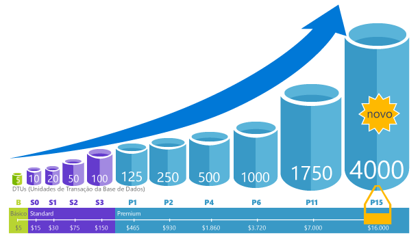

# Dimensionar dinamicamente os recursos do banco de dados com tempo de inatividade mínimo

O banco de dados SQL do Azure permite que você adicione dinamicamente mais recursos ao seu banco de dados com [tempo de inatividade](https://azure.microsoft.com/support/legal/sla/sql-database/v1_2/)mínimo; no entanto, há uma mudança no período em que a conectividade é perdida no banco de dados por um curto período de tempo, o que pode ser mitigado usando a lógica de repetição.

## Visão geral

Quando a demanda de seu aplicativo cresce de alguns dispositivos e clientes para milhões, o banco de dados SQL do Azure é dimensionado rapidamente com tempo de inatividade mínimo. A escalabilidade é uma das características mais importantes do PaaS que permite que você adicione dinamicamente mais recursos ao seu serviço quando necessário. O banco de dados SQL do Azure permite que você altere facilmente os recursos (capacidade de CPU, memória, taxa de transferência de e/s e armazenamento) alocados para seus bancos de dados.

Você pode atenuar problemas de desempenho devido ao aumento do uso de seu aplicativo que não pode ser corrigido usando métodos de indexação ou de reescrita de consulta. Adicionar mais recursos permite reagir rapidamente quando o banco de dados atinge os limites de recursos atuais e precisa de mais capacidade para lidar com a carga de trabalho de entrada. O banco de dados SQL do Azure também permite reduzir os recursos quando eles não são necessários para diminuir o custo.

Você não precisa se preocupar em comprar hardware e alterar a infraestrutura subjacente. O dimensionamento do banco de dados pode ser feito facilmente via portal do Azure usando um controle deslizante.

O banco de dados SQL do Azure oferece o [modelo de compra baseado em DTU](sql-database-service-tiers-dtu.md) e o [modelo de compra baseado em vCore](sql-database-service-tiers-vcore.md).

- O [modelo de compra baseado em DTU](sql-database-service-tiers-dtu.md) oferece uma mistura de recursos de computação, memória e e/s em três camadas de serviço para dar suporte a cargas de trabalho de banco de dados leves a pesadas: básico, Standard e Premium. Os níveis de desempenho em cada camada fornecem uma mistura diferentes destes recursos, à qual pode adicionar recursos de armazenamento adicionais.
- O [modelo de compra baseado em vCore](sql-database-service-tiers-vcore.md) permite que você escolha o número de vCores, a quantidade ou a memória e a quantidade e a velocidade de armazenamento. Esse modelo de compra oferece três camadas de serviço: Uso Geral, Comercialmente Crítico e hiperescala.

Você pode criar seu primeiro aplicativo em um banco de dados pequeno e único com um baixo custo por mês na camada de serviço Basic, Standard ou Uso Geral e, em seguida, alterar sua camada de serviço manualmente ou programaticamente a qualquer momento para a camada de serviço Premium ou Comercialmente Crítico para atender ao ne EDS de sua solução. Pode ajustar o desempenho sem provocar tempos de inatividade na aplicação ou nos clientes. A escalabilidade dinâmica permite que a base de dados responda de forma transparente a requisitos de recursos em rápida mutação e permite-lhe pagar apenas pelos recursos de que precisa, quando precisa.

> [!NOTE]
> A escalabilidade dinâmica é diferente do dimensionamento automático. O dimensionamento automático é quando um serviço é dimensionado automaticamente com base em critérios, enquanto a escalabilidade dinâmica permite o dimensionamento manual com um tempo de inatividade mínimo.

Uma Base de Dados SQL do Azure única suporta a escalabilidade dinâmica manual, mas não o dimensionamento automático. Para uma experiência mais *automática*, considere utilizar conjuntos elásticos, que permitem que as bases de dados partilhem recursos num conjunto com base nas necessidades individuais da base de dados.
No entanto, há scripts que podem ajudar a automatizar a escalabilidade para um único banco de dados SQL do Azure. Por exemplo, veja [Utilizar o PowerShell para monitorizar e dimensionar uma Base de Dados SQL única](scripts/sql-database-monitor-and-scale-database-powershell.md).

Pode alterar os [escalões de serviço DTU](sql-database-service-tiers-dtu.md) ou as [caraterísticas vCore](sql-database-vcore-resource-limits-single-databases.md) a qualquer altura, com um período mínimo de indisponibilidade para a aplicação (em média, menos de quatro segundos). Para muitas empresas e aplicações, ser capaz de criar bases de dados e aumentar e reduzir o desempenho a pedido é suficiente, sobretudo se os padrões de utilização forem relativamente previsíveis. No entanto, se tiver padrões de utilização imprevisíveis, pode tornar-se difícil gerir os custos e o seu modelo de negócio. Para esse cenário, você usa um pool elástico com um determinado número de eDTUs que são compartilhados entre vários bancos de dados no pool.

Todos os três tipos de banco de dados SQL do Azure oferecem alguma capacidade de dimensionar dinamicamente seus bancos de dados:

- Com um [único banco de dados](sql-database-single-database-scale.md), você pode usar os modelos de [DTU](sql-database-dtu-resource-limits-single-databases.md) ou [vCore](sql-database-vcore-resource-limits-single-databases.md) para definir a quantidade máxima de recursos que serão atribuídos a cada banco de dados.
- Um [instância gerenciada](sql-database-managed-instance.md) usa o modo [vCores](sql-database-managed-instance.md#vcore-based-purchasing-model) e permite que você defina os núcleos máximos de CPU e o máximo de armazenamento alocado para sua instância. Todos os bancos de dados dentro da instância compartilharão os recursos alocados para a instância.
- Os [pools elásticos](sql-database-elastic-pool-scale.md) permitem que você defina o limite máximo de recursos por grupo de bancos de dados no pool.

Iniciar a ação escalar verticalmente ou reduzir horizontalmente em qualquer um dos tipos reiniciaria o processo do mecanismo de banco de dados e o moveria para uma máquina virtual diferente, se necessário. Mover o processo do mecanismo de banco de dados para uma nova máquina virtual é um **processo online** no qual você pode continuar usando o serviço de banco de dados SQL do Azure existente enquanto o processo está em andamento. Depois que o mecanismo de banco de dados de destino estiver totalmente inicializado e pronto para processar as consultas, as conexões serão [alternadas da origem para o mecanismo de banco de dados de destino](sql-database-single-database-scale.md#impact-of-changing-service-tier-or-rescaling-compute-size).

> [!NOTE]
> Você pode esperar uma pequena interrupção de conexão quando o processo de escalar/reduzir verticalmente for concluído. Se você tiver implementado a [lógica de repetição para erros transitórios padrão](sql-database-connectivity-issues.md#retry-logic-for-transient-errors), não perceberá o failover.

## Métodos de escala alternativos

O dimensionamento de recursos é a maneira mais fácil e mais eficiente de melhorar o desempenho do banco de dados sem alterar o código do banco de dados ou do aplicativo. Em alguns casos, até mesmo as mais altas camadas de serviço, tamanhos de computação e otimizações de desempenho podem não lidar com a carga de trabalho de maneira bem-sucedida e econômica. Nesses casos, você tem essas opções adicionais para dimensionar seu banco de dados:

- A [expansão de leitura](sql-database-read-scale-out.md) é um recurso disponível no qual você está obtendo uma réplica somente leitura de seus dados, em que você pode executar consultas somente leitura, como relatórios. A réplica somente leitura tratará sua carga de trabalho somente leitura sem afetar o uso de recursos no banco de dados primário.
- A [fragmentação de banco](sql-database-elastic-scale-introduction.md) de dados é um conjunto de técnicas que permite que você divida seus dados em vários bancos e os dimensione de forma independente.

## Passos seguintes

- Para obter informações sobre como melhorar o desempenho do banco de dados alterando o código do banco de dados, consulte [Localizar e aplicar recomendações de desempenho](sql-database-advisor-portal.md)
- Para obter informações sobre como permitir que a inteligência de banco de dados interna Otimize seu banco de dados, consulte [ajuste automático](sql-database-automatic-tuning.md).
- Para obter informações sobre a expansão de leitura no serviço de banco de dados SQL do Azure, consulte como [usar réplicas somente leitura para balancear a carga de cargas de trabalho de consulta somente leitura](sql-database-read-scale-out.md).
- Para obter informações sobre a fragmentação de banco de dados, consulte [escalar horizontalmente com o banco de dados SQL do Azure](sql-database-elastic-scale-introduction.md).
