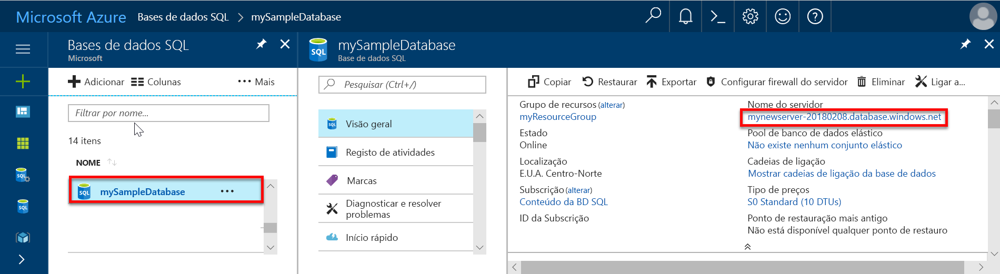
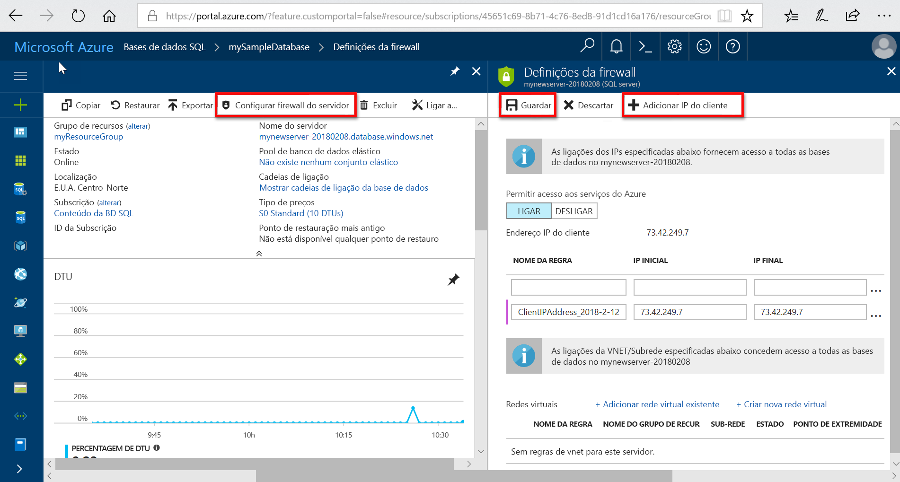

# Início rápido: criar uma regra de firewall no nível de servidor para bancos de dados individuais e em pool usando o portal do Azure

Este guia de início rápido explica como criar uma [regra de firewall no nível de servidor](sql-database-firewall-configure.md) para bancos de dados individuais e em pool no banco de dados SQL do Azure usando o portal do Azure para permitir que você se conecte a servidores de banco de dados, bancos de dados individuais e pools elásticos e seus bancos de dados. Uma regra de firewall é necessária para se conectar de outros recursos do Azure e de recursos locais.

## Pré-requisitos

Este guia de início rápido usa os recursos criados em [criar um banco de dados individual usando o portal do Azure](sql-database-single-database-get-started.md) como ponto de partida.

## Iniciar sessão no portal do Azure

Iniciar sessão no [portal do Azure](https://portal.azure.com/).

## Criar uma regra de firewall de IP no nível de servidor

O serviço do banco de dados SQL cria um firewall no nível do servidor de banco de dados para bancos únicos e em pool. Esse Firewall impede que os aplicativos cliente se conectem ao servidor ou a qualquer um de seus bancos de dados únicos ou em pools, a menos que você crie uma regra de firewall IP para abrir o firewall. Para uma conexão de um endereço IP fora do Azure, crie uma regra de firewall para um endereço IP específico ou um intervalo de endereços que você deseja poder conectar. Para obter mais informações sobre regras de firewall de IP no nível de servidor e de banco de dados, consulte [regras de firewall de IP](sql-database-firewall-configure.md)no nível de servidor e de banco de dados SQL.

> [!NOTE]
> A Base de Dados SQL comunica através da porta 1433. Se estiver a tentar ligar a partir de uma rede empresarial, o tráfego de saída através da porta 1433 poderá não ser permitido pela firewall da rede. Nesse caso, você não pode se conectar ao servidor do banco de dados SQL do Azure, a menos que o departamento de ti Abra a porta 1433.
> [!IMPORTANT]
> Uma regra de firewall de 0.0.0.0 permite que todos os serviços do Azure passem pela regra de firewall no nível de servidor e tentam se conectar a um banco de dados único ou em pool por meio do servidor. 

Siga estas etapas para criar uma regra de firewall de IP no nível de servidor para o endereço IP do seu cliente e habilitar a conectividade externa por meio do firewall do banco de dados SQL somente para seu endereço IP.

1. Após a conclusão da implantação do [banco de dados SQL do Azure](#prerequisites) , selecione bancos de dados **SQL** no menu à esquerda e escolha **mySampleDatabase** na página **bancos de dados SQL** . É aberta uma página de descrição geral para a base de dados que mostra o nome de servidor completamente qualificado (como **mynewserver-20170824.database.windows.net**) e oferece opções para configuração adicional.

2. Copie esse nome de servidor totalmente qualificado para usar ao conectar-se ao servidor e a seus bancos de dados em outros guias de início rápido.

   

3. Selecione **definir Firewall do servidor** na barra de ferramentas. A página **configurações de firewall** do servidor de banco de dados é aberta.

   

4. Escolha **Adicionar IP do cliente** na barra de ferramentas para adicionar o endereço IP atual a uma nova regra de firewall de IP no nível de servidor. Uma regra de firewall de IP no nível de servidor pode abrir a porta 1433 para um único endereço IP ou um intervalo de endereços IP.

   > [!IMPORTANT]
   > Por padrão, o acesso por meio do firewall do banco de dados SQL é desabilitado para todos os serviços do Azure. Escolha **ativado** nesta página se você quiser habilitar o acesso para todos os serviços do Azure.
   >

5. Selecione **Guardar**. Uma regra de firewall de IP no nível de servidor é criada para o endereço IP atual abrindo a porta 1433 no servidor do banco de dados SQL.

6. Feche a página **configurações de firewall** .

Usando o SQL Server Management Studio ou outra ferramenta de sua escolha, agora você pode se conectar ao servidor do banco de dados SQL e a seus bancos dados desse endereço IP usando a conta do administrador do servidor criada anteriormente.

## Limpar recursos

Guarde estes recursos se pretender aceder aos [Próximos passos](#next-steps) e saiba como ligar e consultar a base de dados utilizando um número de métodos diferentes. Se, no entanto, você quiser excluir os recursos criados neste guia de início rápido, use as etapas a seguir.

1. No menu à esquerda na portal do Azure, selecione **grupos de recursos** e, em seguida, selecione grupo de **recursos**.
2. Na página do grupo de recursos, selecione **excluir**, digite **MyResource** Group na caixa de texto e, em seguida, selecione **excluir**.

## Passos seguintes

- Agora que tem uma base de dados, pode [ligar e consultar](sql-database-connect-query.md) com uma das suas ferramentas ou linguagens favoritas, incluindo
  - [Ligar e consultar com o SQL Server Management Studio](sql-database-connect-query-ssms.md)
  - [Ligar e consultar com o Azure Data Studio](/sql/azure-data-studio/quickstart-sql-database?toc=/azure/sql-database/toc.json)
- Para saber como criar a sua primeira base de dados, criar tabelas e inserir dados, veja um destes tutoriais:
  - [Projetar seu primeiro banco de dados único no banco de dados SQL do Azure usando o SSMS](sql-database-design-first-database.md)
  - [Criar um banco de dados individual no banco de dados SQL C# do Azure e conectar-se com e ADO.net](sql-database-design-first-database-csharp.md)
