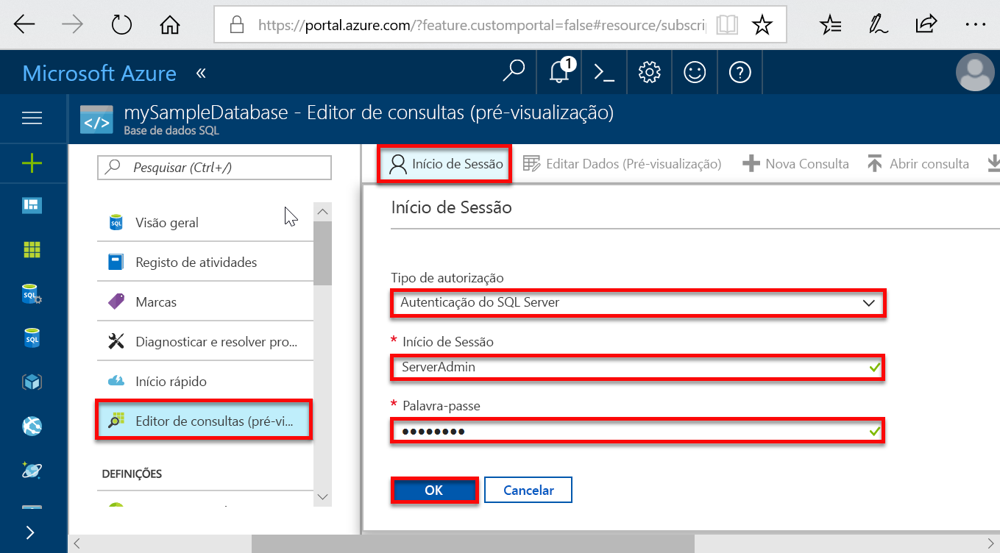

# <a name="quickstart-create-a-single-database-in-azure-sql-database-using-the-azure-portal-powershell-and-azure-cli"></a>Quickstart: Criar uma única base de dados na Base de Dados Azure SQL utilizando o portal Azure, PowerShell e Azure CLI

A criação de uma [única base de dados](sql-database-single-database.md) é a opção de implementação mais rápida e simples para criar uma base de dados na Base de Dados Azure SQL. Este quickstart mostra-lhe como criar e, em seguida, consultar uma única base de dados usando o portal Azure.

Se não tiver uma subscrição do Azure, [crie uma conta gratuita](https://azure.microsoft.com/free/). 

Para todos os passos neste arranque rápido, inscreva-se no [portal Azure](https://portal.azure.com/).

## <a name="create-a-single-database"></a>Criar uma única base de dados

Uma única base de dados pode ser criada no nível de computação provisionado ou sem servidores.

- Uma única base de dados no nível de cálculo provisionado é pré-atribuída uma quantidade fixa de recursos informáticos, incluindo CPU e memória utilizando um dos dois modelos de [compra.](sql-database-purchase-models.md)
- Uma única base de dados no nível de computação sem servidor tem uma gama de recursos computacionais, incluindo CPU e memória que são automaticamente dimensionadas e só estão disponíveis nos [modelos de compra baseados em vCore](sql-database-service-tiers-vcore.md).

Quando cria uma única base de dados, também define um servidor de Base de [Dados SQL](sql-database-servers.md) para geri-lo e colocá-lo dentro do [grupo de recursos Azure](../azure-resource-manager/management/overview.md) numa região especificada.

> [!NOTE]
> Este quickstart utiliza o [modelo de compra baseado em vCore,](sql-database-service-tiers-vcore.md)mas o modelo de compra baseado em [DTU](sql-database-service-tiers-DTU.md) também está disponível.

Para criar uma única base de dados contendo os dados da amostra AdventureWorksLT:

[!INCLUDE [sql-database-create-single-database](includes/sql-database-create-single-database.md)]

## <a name="query-the-database"></a>Consulta na base de dados

Agora que criou a base de dados, utilize a ferramenta de consulta incorporada no portal Azure para ligar à base de dados e consultar os dados.

1. Na página base de **dados SQL** para a sua base de dados, selecione **O editor de Consulta (pré-visualização)** no menu esquerdo.

   

2. Introduza as suas informações de login e selecione **OK**.
3. Introduza a seguinte consulta no painel do editor da **Consulta.**

   ```sql
   SELECT TOP 20 pc.Name as CategoryName, p.name as ProductName
   FROM SalesLT.ProductCategory pc
   JOIN SalesLT.Product p
   ON pc.productcategoryid = p.productcategoryid;
   ```

4. Selecione **Executar**e, em seguida, reveja os resultados da consulta no painel **resultados.**

   

5. Feche a página do editor da **Consulta** e selecione **OK** quando solicitado a descartar as suas edidas não guardadas.

## <a name="clean-up-resources"></a>Limpar recursos

Mantenha este grupo de recursos, servidor de base de dados e base de dados única se pretender ir aos [próximos passos](#next-steps). Os próximos passos mostram-lhe como ligar e consultar a sua base de dados utilizando métodos diferentes.

Quando terminar de usar estes recursos, pode eliminá-los da seguinte forma:

1. A partir do menu esquerdo no portal Azure, selecione **grupos de Recursos,** e depois selecione **myResourceGroup**.
2. Na página do grupo de recursos, selecione **Eliminar o grupo de recursos**.
3. Introduza o *myResourceGroup* no campo e, em seguida, selecione **Eliminar**.

## <a name="next-steps"></a>Passos seguintes

- Crie uma regra de firewall ao nível do servidor para se ligar à base de dados única a partir de instalações ou ferramentas remotas. Para mais informações, consulte [Criar uma regra de firewall ao nível do servidor](sql-database-server-level-firewall-rule.md).
- Depois de criar uma regra de firewall ao nível do servidor, [conecte e consulta](sql-database-connect-query.md) a sua base de dados utilizando várias ferramentas e idiomas diferentes.
  - [Ligar e consultar com o SQL Server Management Studio](sql-database-connect-query-ssms.md)
  - [Ligar e consultar com o Azure Data Studio](https://docs.microsoft.com/sql/azure-data-studio/quickstart-sql-database?toc=/azure/sql-database/toc.json)
- Para criar uma única base de dados no nível de cálculo provisionado utilizando o Azure CLI, consulte [as amostras Do ClI Do Azure](sql-database-cli-samples.md).
- Para criar uma única base de dados no nível de cálculo provisionado utilizando o Azure PowerShell, consulte [as amostras da Azure PowerShell](sql-database-powershell-samples.md).
- Para criar uma única base de dados no nível de computação sem servidor usando o Azure Powershell, consulte Criar uma base de [dados sem servidores](sql-database-serverless.md#create-new-database-in-serverless-compute-tier).
