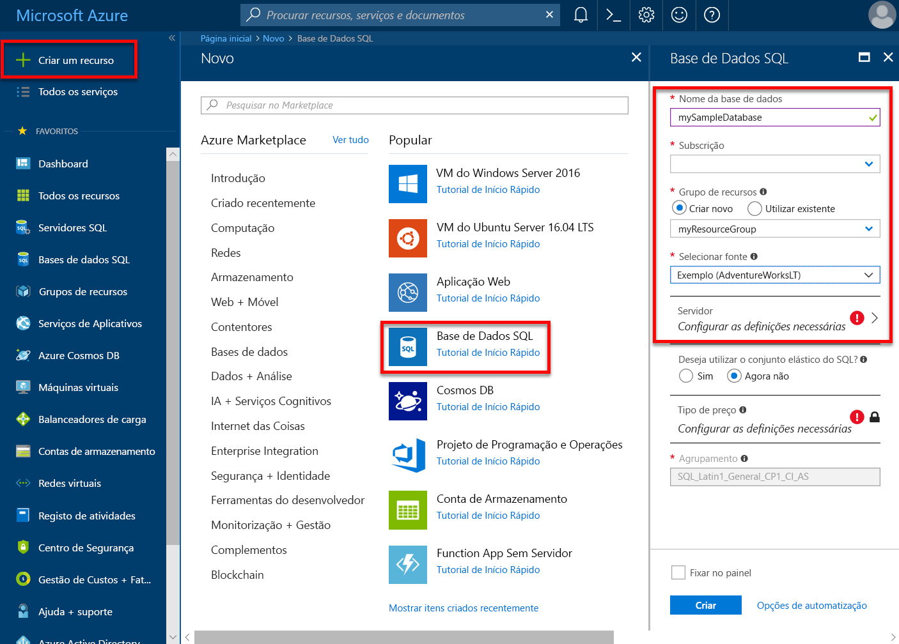

# Criar e gerenciar servidores de banco de dados SQL e bancos de dados individuais no banco de dados SQL do Azure

Você pode criar e gerenciar servidores de banco de dados SQL e bancos de dados individuais usando o portal do Azure, o PowerShell, o CLI do Azure, a API REST e o Transact-SQL.

## Portal do Azure: Gerenciar servidores e bancos de dados individuais

Você pode criar o grupo de recursos do banco de dados SQL do Azure antecipadamente ou ao criar o próprio servidor. Há vários métodos para chegar a um novo formulário do SQL Server, seja criando um novo SQL Server ou como parte da criação de um novo banco de dados.

### Criar um servidor de banco de dados SQL em branco

Para criar um servidor de banco de dados SQL usando o [portal do Azure](https://portal.azure.com), navegue até um formulário em branco do SQL Server (servidor lógico).  

### Criar um banco de dados individual SQL em branco ou de exemplo

Para criar um único banco de dados SQL do Azure usando o [portal do Azure](https://portal.azure.com), navegue até um formulário de banco de dados SQL em branco e forneça as informações solicitadas. Você pode criar o grupo de recursos do banco de dados SQL do Azure e o servidor do banco de dados SQL antecipadamente ou ao criar o próprio banco de dados. Você pode criar um banco de dados em branco ou criar um banco de dados de exemplo com base na Adventure Works LT.

  

> [!IMPORTANT]
> Para obter informações sobre como selecionar o tipo de preço para seu banco de dados, consulte [modelo de compra baseado em DTU](sql-database-service-tiers-dtu.md) e [modelo de compra baseado em vCore](sql-database-service-tiers-vcore.md).

Para criar um Instância Gerenciada, consulte [criar um instância gerenciada](sql-database-managed-instance-get-started.md)

## Gerenciar um servidor de banco de dados SQL existente

Para gerenciar um servidor de banco de dados SQL existente, navegue até o servidor usando vários métodos, como de uma página específica do banco de dados SQL, da página **SQL Servers** ou da página **todos os recursos** .

Para gerenciar um banco de dados existente, navegue até a página bancos de dados **SQL** e clique no banco de dados que você deseja gerenciar. A captura de tela a seguir mostra como começar a definir um firewall de nível de servidor para um banco de dados na página **visão geral** de um banco de dados.

   

> [!IMPORTANT]
> Para configurar as propriedades de desempenho de um banco de dados, consulte [modelo de compra baseado em DTU](sql-database-service-tiers-dtu.md) e [modelo de compra baseado em vCore](sql-database-service-tiers-vcore.md).
> [!TIP]
> Para obter um portal do Azure início rápido, consulte [criar um banco de dados SQL do Azure no portal do Azure](sql-database-single-database-get-started.md).

## PowerShell: Gerenciar servidores e bancos de dados individuais

[!INCLUDE [updated-for-az](../../includes/updated-for-az.md)]
> [!IMPORTANT]
> O módulo Azure Resource Manager do PowerShell ainda tem suporte do banco de dados SQL do Azure, mas todo o desenvolvimento futuro é para o módulo AZ. Sql. Para esses cmdlets, consulte [AzureRM. SQL](https://docs.microsoft.com/powershell/module/AzureRM.Sql/). Os argumentos para os comandos no módulo AZ e nos módulos AzureRm são substancialmente idênticos.

Para criar e gerenciar servidores de banco de dados SQL do Azure, bancos de dados únicos e em pool e firewalls de servidor de banco de dados SQL com Azure PowerShell, use os seguintes cmdlets do PowerShell. Se você precisar instalar ou atualizar o PowerShell, consulte [instalar Azure PowerShell Module](/powershell/azure/install-az-ps).

> [!TIP]
> Para scripts de exemplo do PowerShell, consulte [usar o PowerShell para criar um banco de dados único do Azure SQL e configurar uma regra de firewall de servidor do banco de dados SQL](scripts/sql-database-create-and-configure-database-powershell.md) e [monitorar e dimensionar um banco de dados individual SQL usando o PowerShell](scripts/sql-database-monitor-and-scale-database-powershell.md).

| Cmdlet | Descrição |
| --- | --- |
|[New-AzSqlDatabase](/powershell/module/az.sql/new-azsqldatabase)|Cria um banco de dados |
|[Get-AzSqlDatabase](/powershell/module/az.sql/get-azsqldatabase)|Obtém um ou mais bancos de dados|
|[Set-AzSqlDatabase](/powershell/module/az.sql/set-azsqldatabase)|Define as propriedades de um banco de dados ou move um banco de dados existente para um pool elástico|
|[Remove-AzSqlDatabase](/powershell/module/az.sql/remove-azsqldatabase)|Remove um banco de dados|
|[New-AzResourceGroup](/powershell/module/az.resources/new-azresourcegroup)|Cria um grupo de recursos|
|[New-AzSqlServer](/powershell/module/az.sql/new-azsqlserver)|Cria um servidor|
|[Get-AzSqlServer](/powershell/module/az.sql/get-azsqlserver)|Retorna informações sobre servidores|
|[Set-AzSqlServer](https://docs.microsoft.com/powershell/module/az.sql/set-azsqlserver)|Modifica as propriedades de um servidor|
|[Remove-AzSqlServer](/powershell/module/az.sql/remove-azsqlserver)|Remove um servidor|
|[New-AzSqlServerFirewallRule](/powershell/module/az.sql/new-azsqlserverfirewallrule)|Cria uma regra de firewall no nível de servidor |
|[Get-AzSqlServerFirewallRule](/powershell/module/az.sql/get-azsqlserverfirewallrule)|Obtém as regras de firewall para um servidor|
|[Set-AzSqlServerFirewallRule](/powershell/module/az.sql/set-azsqlserverfirewallrule)|Modifica uma regra de firewall em um servidor|
|[Remove-AzSqlServerFirewallRule](/powershell/module/az.sql/remove-azsqlserverfirewallrule)|Exclui uma regra de firewall de um servidor.|
| New-AzSqlServerVirtualNetworkRule | Cria uma [*regra de rede virtual*](sql-database-vnet-service-endpoint-rule-overview.md), com base em uma sub-rede que é um ponto de extremidade de serviço de rede virtual. |

## CLI do Azure: Gerenciar servidores e bancos de dados individuais

Para criar e gerenciar o Azure SQL Server, bancos de dados e firewalls com [CLI do Azure](/cli/azure), use os comandos de [banco de dados sql](/cli/azure/sql/db) a seguir CLI do Azure. Utilize o [Cloud Shell](/azure/cloud-shell/overview) para executar a CLI no seu browser ou [instale-a](/cli/azure/install-azure-cli) no macOS, Linux ou Windows. Para criar e gerenciar pools elásticos , consulte pools elásticos.

> [!TIP]
> Para obter um CLI do Azure início rápido, consulte [criar um banco de dados SQL do Azure usando o CLI do Azure](sql-database-cli-samples.md). Para CLI do Azure scripts de exemplo, consulte [usar a CLI para criar um banco de dados único do Azure SQL e configurar uma regra de firewall do banco de dados SQL](scripts/sql-database-create-and-configure-database-cli.md) e [usar a CLI para monitorar e dimensionar um banco de dados individual do SQL Azure](scripts/sql-database-monitor-and-scale-database-cli.md).
>

| Cmdlet | Descrição |
| --- | --- |
|[az sql db create](/cli/azure/sql/db#az-sql-db-create) |Cria um banco de dados|
|[az sql db list](/cli/azure/sql/db#az-sql-db-list)|Lista todos os bancos de dados e data warehouses em um servidor ou todos os bancos de dado em um pool elástico|
|[az sql db list-editions](/cli/azure/sql/db#az-sql-db-list-editions)|Lista os objetivos de serviço e os limites de armazenamento disponíveis|
|[az sql db list-usages](/cli/azure/sql/db#az-sql-db-list-usages)|Retorna usos de banco de dados|
|[az sql db show](/cli/azure/sql/db#az-sql-db-show)|Obtém um banco de dados ou data warehouse|
|[az sql db update](/cli/azure/sql/db#az-sql-db-update)|Atualiza um banco de dados|
|[az sql db delete](/cli/azure/sql/db#az-sql-db-delete)|Remove um banco de dados|
|[az group create](/cli/azure/group#az-group-create)|Cria um grupo de recursos|
|[az sql server create](/cli/azure/sql/server#az-sql-server-create)|Cria um servidor|
|[az sql server list](/cli/azure/sql/server#az-sql-server-list)|Listar servidores|
|[az sql server list-usages](/cli/azure/sql/server#az-sql-server-list-usages)|Retorna usos do servidor|
|[az sql server show](/cli/azure/sql/server#az-sql-server-show)|Obter um servidor|
|[az sql server update](/cli/azure/sql/server#az-sql-server-update)|Atualiza um servidor|
|[az sql server delete](/cli/azure/sql/server#az-sql-server-delete)|Exclui um servidor|
|[az sql server firewall-rule create](/cli/azure/sql/server/firewall-rule#az-sql-server-firewall-rule-create)|Cria uma regra de firewall do servidor|
|[az sql server firewall-rule list](/cli/azure/sql/server/firewall-rule#az-sql-server-firewall-rule-list)|Lista as regras de firewall em um servidor|
|[az sql server firewall-rule show](/cli/azure/sql/server/firewall-rule#az-sql-server-firewall-rule-show)|Mostra os detalhes de uma regra de firewall|
|[az sql server firewall-rule update](/cli/azure/sql/server/firewall-rule##az-sql-server-firewall-rule-update)|Atualiza uma regra de firewall|
|[az sql server firewall-rule delete](/cli/azure/sql/server/firewall-rule#az-sql-server-firewall-rule-delete)|Exclui uma regra de firewall|

## Transact-SQL: Gerenciar servidores e bancos de dados individuais

Para criar e gerenciar o Azure SQL Server, bancos de dados e firewalls com o Transact-SQL, use os comandos T-SQL a seguir. Você pode emitir esses comandos usando o portal do Azure, [SQL Server Management Studio](/sql/ssms/use-sql-server-management-studio), [Visual Studio Code](https://code.visualstudio.com/docs)ou qualquer outro programa que possa se conectar a um servidor de banco de dados SQL do Azure e passar comandos Transact-SQL. Para gerenciar pools elásticos , consulte pools elásticos.

> [!TIP]
> Para obter um início rápido usando SQL Server Management Studio no Microsoft Windows [, consulte banco de dados SQL do Azure: Use SQL Server Management Studio para se conectar e consultar](sql-database-connect-query-ssms.md)dados. Para obter um início rápido usando Visual Studio Code no MacOS, Linux ou Windows, consulte [banco de dados SQL do Azure: Use Visual Studio Code para se conectar e consultar](sql-database-connect-query-vscode.md)dados.
> [!IMPORTANT]
> Você não pode criar ou excluir um servidor usando o Transact-SQL.

| Comando | Descrição |
| --- | --- |
|[CREATE DATABASE](https://docs.microsoft.com/sql/t-sql/statements/create-database-transact-sql?view=azuresqldb-current)|Cria um novo banco de dados individual. Você deve estar conectado ao banco de dados mestre para criar um novo banco de dados.|
| [ALTER DATABASE (banco de dados SQL do Azure)](https://docs.microsoft.com/sql/t-sql/statements/alter-database-transact-sql?view=azuresqldb-current) |Modifica um banco de dados SQL do Azure. |
|[DROP DATABASE (Transact-SQL)](/sql/t-sql/statements/drop-database-transact-sql)|Exclui um banco de dados.|
|[sys. database_service_objectives (banco de dados SQL do Azure)](/sql/relational-databases/system-catalog-views/sys-database-service-objectives-azure-sql-database)|Retorna a edição (camada de serviço), o objetivo de serviço (tipo de preço) e o nome do pool elástico, se houver, para um banco de dados SQL do Azure ou um SQL Data Warehouse do Azure. Se estiver conectado ao banco de dados mestre em um servidor de banco de dados SQL do Azure, retorna informações sobre todos os bancos de dados. Para o Azure SQL Data Warehouse, você deve estar conectado ao banco de dados mestre.|
|[sys. dm _db_resource_stats (banco de dados SQL do Azure)](/sql/relational-databases/system-dynamic-management-views/sys-dm-db-resource-stats-azure-sql-database)| Retorna CPU, e/s e consumo de memória para um banco de dados do banco de dados SQL do Azure. Existe uma linha para cada 15 segundos, mesmo que não haja atividade no banco de dados.|
|[sys. resource_stats (banco de dados SQL do Azure)](/sql/relational-databases/system-catalog-views/sys-resource-stats-azure-sql-database)|Retorna o uso de CPU e dados de armazenamento para um banco de dado SQL do Azure. Os dados são coletados e agregados em intervalos de cinco minutos.|
|[sys. database_connection_stats (banco de dados SQL do Azure)](/sql/relational-databases/system-catalog-views/sys-database-connection-stats-azure-sql-database)|Contém estatísticas para eventos de conectividade de banco de dados SQL, fornecendo uma visão geral dos sucessos e falhas de conexão de banco de dados. |
|[sys. event_log (banco de dados SQL do Azure)](/sql/relational-databases/system-catalog-views/sys-event-log-azure-sql-database)|Retorna conexões de banco de dados SQL do Azure bem-sucedidas, falhas de conexão e deadlocks. Você pode usar essas informações para acompanhar ou solucionar problemas de atividade do banco de dados com o banco de dados SQL.|
|[sp_set_firewall_rule (banco de dados SQL do Azure)](/sql/relational-databases/system-stored-procedures/sp-set-firewall-rule-azure-sql-database)|Cria ou atualiza as configurações de firewall no nível de servidor para o servidor do banco de dados SQL. Esse procedimento armazenado só está disponível no banco de dados mestre para o logon da entidade de segurança no nível do servidor. Uma regra de firewall no nível de servidor só pode ser criada usando o Transact-SQL após a criação da primeira regra de firewall no nível de servidor por um usuário com permissões de nível do Azure|
|[sys. firewall_rules (banco de dados SQL do Azure)](/sql/relational-databases/system-catalog-views/sys-firewall-rules-azure-sql-database)|Retorna informações sobre as configurações de firewall no nível de servidor associadas à sua Banco de Dados SQL do Microsoft Azure.|
|[sp_delete_firewall_rule (banco de dados SQL do Azure)](/sql/relational-databases/system-stored-procedures/sp-delete-firewall-rule-azure-sql-database)|Remove as configurações de firewall no nível de servidor do servidor do banco de dados SQL. Esse procedimento armazenado só está disponível no banco de dados mestre para o logon da entidade de segurança no nível do servidor.|
|[sp_set_database_firewall_rule (banco de dados SQL do Azure)](/sql/relational-databases/system-stored-procedures/sp-set-database-firewall-rule-azure-sql-database)|Cria ou atualiza as regras de firewall no nível de banco de dados para o banco de dados SQL do Azure ou SQL Data Warehouse. As regras de firewall de banco de dados podem ser configuradas para o banco de dados mestre e para os bancos de dados de usuário no SQL Database. As regras de firewall de banco de dados são úteis ao usar usuários de banco de dados independente. |
|[sys. database_firewall_rules (banco de dados SQL do Azure)](/sql/relational-databases/system-catalog-views/sys-database-firewall-rules-azure-sql-database)|Retorna informações sobre as configurações de firewall no nível de banco de dados associadas à sua Banco de Dados SQL do Microsoft Azure. |
|[sp_delete_database_firewall_rule (banco de dados SQL do Azure)](/sql/relational-databases/system-stored-procedures/sp-delete-database-firewall-rule-azure-sql-database)|Remove a configuração de firewall no nível de banco de dados do banco de dados SQL do Azure ou SQL Data Warehouse. |

## API REST: Gerenciar servidores e bancos de dados individuais

Para criar e gerenciar o Azure SQL Server, bancos de dados e firewalls, use essas solicitações da API REST.

| Comando | Descrição |
| --- | --- |
|[Servidores – criar ou atualizar](https://docs.microsoft.com/rest/api/sql/servers/createorupdate)|Cria ou atualiza um novo servidor.|
|[Servidores-excluir](https://docs.microsoft.com/rest/api/sql/servers/delete)|Exclui um SQL Server.|
|[Servidores-obter](https://docs.microsoft.com/rest/api/sql/servers/get)|Obtém um servidor.|
|[Servidores-lista](https://docs.microsoft.com/rest/api/sql/servers/list)|Retorna uma lista de servidores em uma assinatura.|
|[Servidores-listar por grupo de recursos](https://docs.microsoft.com/rest/api/sql/servers/listbyresourcegroup)|Retorna uma lista de servidores em um grupo de recursos.|
|[Servidores-atualizar](https://docs.microsoft.com/rest/api/sql/servers/update)|Atualiza um servidor existente.|
|[Bancos de dados – criar ou atualizar](https://docs.microsoft.com/rest/api/sql/databases/createorupdate)|Cria um novo banco de dados ou atualiza um banco de dados existente.|
|[Bancos de dados-excluir](https://docs.microsoft.com/rest/api/sql/databases/delete)|Exclui um banco de dados.|
|[Bancos de dados-obter](https://docs.microsoft.com/rest/api/sql/databases/get)|Obtém um banco de dados.|
|[Bancos de dados-listar por pool elástico](https://docs.microsoft.com/rest/api/sql/databases/listbyelasticpool)|Retorna uma lista de bancos de dados em um pool elástico.|
|[Bancos de dados-listar por servidor](https://docs.microsoft.com/rest/api/sql/databases/listbyserver)|Retorna uma lista de bancos de dados em um servidor.|
|[Bancos de dados-atualização](https://docs.microsoft.com/rest/api/sql/databases/update)|Atualiza um banco de dados existente.|
|[Regras de firewall – criar ou atualizar](https://docs.microsoft.com/rest/api/sql/firewallrules/createorupdate)|Cria ou atualiza uma regra de firewall.|
|[Regras de firewall-excluir](https://docs.microsoft.com/rest/api/sql/firewallrules/delete)|Exclui uma regra de firewall.|
|[Regras de firewall-obter](https://docs.microsoft.com/rest/api/sql/firewallrules/get)|Obtém uma regra de firewall.|
|[Regras de firewall-listar por servidor](https://docs.microsoft.com/rest/api/sql/firewallrules/listbyserver)|Retorna uma lista de regras de firewall.|

## Passos Seguintes

- Para saber mais sobre como migrar um banco de dados SQL Server para o Azure, consulte [migrar para o banco de dados SQL do Azure](sql-database-single-database-migrate.md)
- Para obter informações sobre as funcionalidades suportadas, veja [Funcionalidades](sql-database-features.md).
