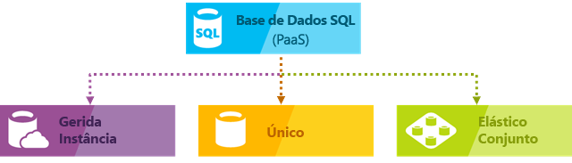
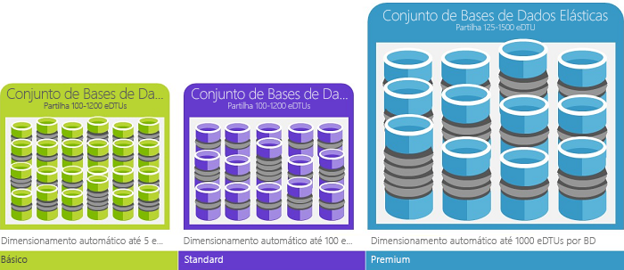

# O que é o serviço de banco de dados SQL do Azure

O banco de dados SQL do Azure é um serviço gerenciado de banco de dados relacional de uso geral que permite criar uma camada de armazenamento altamente disponível e de alto desempenho para os aplicativos e soluções no Microsoft Azure Cloud. O banco de dados SQL pode ser a escolha certa para uma variedade de aplicativos de nuvem modernos porque permite que você use funcionalidades poderosas para processar dados relacionais e [estruturas não relacionais](sql-database-multi-model-features.md) , como grafos, JSON, espacial e XML. Ele se baseia na versão estável mais recente do [mecanismo de banco de dados Microsoft SQL Server](https://docs.microsoft.com/sql/sql-server/sql-server-technical-documentation?toc=/azure/sql-database/toc.json) e permite que você use um rico conjunto de recursos avançados de processamento de consulta, como [tecnologias de alto desempenho na memória](sql-database-in-memory.md) e [processamento inteligente de consultas ](https://docs.microsoft.com/sql/relational-databases/performance/intelligent-query-processing?toc=/azure/sql-database/toc.json).
Com a estratégia da cloud prioritária da Microsoft, as mais recentes capacidades do SQL Server são lançadas primeiro na Base de Dados SQL e, depois, no próprio SQL Server. Esta abordagem disponibiliza-lhe as últimas capacidades do SQL Server sem sobrecarga em termos de aplicação de patches ou atualizações - com estas funcionalidades novas testadas em milhões de bases de dados. O banco de dados SQL permite que você defina e dimensione facilmente o desempenho em dois modelos de compra diferentes: um [modelo de compra baseado em vCore](sql-database-service-tiers-vcore.md) e um [modelo de compra baseado em DTU](sql-database-service-tiers-dtu.md). O banco de dados SQL é um serviço totalmente gerenciado que tem alta disponibilidade, backups e outras operações de manutenção comuns. A Microsoft trata toda a aplicação de patch e atualização do código do SQL e do sistema operacional de forma direta e abstrai todo o gerenciamento da infraestrutura subjacente.

> [!NOTE]
> Para obter um glossário de termos no banco de dados SQL do Azure, consulte [Glossário de termos do banco de dados SQL](sql-database-glossary-terms.md)

A Base de Dados SQL do Azure oferece as seguintes opções de implementação para bases de dados SQL do Azure:

- [Um banco](sql-database-single-database.md) de dados individual representa um banco de dados isolado totalmente gerenciado que é perfeito para os aplicativos e microserviços de nuvem modernos que precisam de uma única fonte de dados confiável. Um banco de dados individual é semelhante a um bancos de dados [independentes](https://docs.microsoft.com/sql/relational-databases/databases/contained-databases?toc=/azure/sql-database/toc.json) no [mecanismo de banco Microsoft SQL Server](https://docs.microsoft.com/sql/sql-server/sql-server-technical-documentation?toc=/azure/sql-database/toc.json).
- A [instância gerenciada](sql-database-managed-instance.md) é uma instância totalmente gerenciada do [mecanismo de banco de dados do Microsoft SQL Server](https://docs.microsoft.com/sql/sql-server/sql-server-technical-documentation?toc=/azure/sql-database/toc.json) que contém um conjunto de bancos que podem ser usados juntos. É uma opção perfeita para a fácil migração de bancos de dados locais SQL Server para a nuvem do Azure e para aplicativos que precisam aproveitar recursos avançados de banco de dados que SQL Server Mecanismo de Banco de Dados oferece.
- O [pool elástico](sql-database-elastic-pool.md) é uma coleção de [bancos de dados individuais](sql-database-single-database.md) com um conjunto compartilhado de recursos, como CPU ou memória. Bancos de dados individuais podem ser movidos para dentro e para fora de um pool elástico.

> [!IMPORTANT]
> Para entender as diferenças de recursos entre o banco de dados SQL e SQL Server, bem como as diferenças entre diferentes opções de implantação de banco de dados SQL do Azure, consulte [recursos do SQL](sql-database-features.md).

O banco de dados SQL fornece desempenho previsível com vários tipos de recursos, camadas de serviço e tamanhos de computação que fornecem escalabilidade dinâmica sem tempo de inatividade, otimização inteligente interna, escalabilidade e disponibilidade globais e segurança avançada opções — tudo com administração quase zero. Estas capacidades permitem-lhe concentrar-se no desenvolvimento rápido de aplicações e acelerar o seu tempo de colocação no mercado, em vez de alocar tempo e recursos valiosos para a gestão de máquinas virtuais e de infraestruturas. O serviço Base de Dados SQL encontra-se atualmente em 38 datacenters em todo o mundo, sendo que são colocados online mais datacenters regularmente, o que lhe permite executar a sua base de dados num datacenter perto de si.

## Dimensionar o desempenho e os conjuntos

Todos os tipos de banco de dados SQL permitem que você defina a quantidade de recursos que serão atribuídos. 
- Com bancos de dados individuais, cada um deles é isolado entre si e portátil, cada um com sua própria quantidade garantida de recursos de computação, memória e armazenamento. A quantidade de recursos que é atribuída ao banco de dados é dedicada a esse banco de dados e não será compartilhada com outros banco de dados na nuvem do Azure. Ele também oferece a capacidade de escalar e reduzir dinamicamente os [recursos de um banco de dados individual](sql-database-single-database-scale.md) . O Banco de Dados Individual fornece recursos diferentes de computação, memória e armazenamento para diferentes necessidades que variam de 1 a 80 vCores, 32 GB a 4 TB etc. A [camada de serviço](sql-database-service-tier-hyperscale.md) de hiperescala para um único banco de dados permite que você dimensione para 100 TB, com recursos rápidos de backup e restauração.
- Com os pools elásticos, você pode atribuir recursos que serão compartilhados por todos os bancos de dados no pool. Você pode criar um novo banco de dados ou movê-los para um pool de recursos a fim de maximizar o uso de recursos e economizar dinheiro e a capacidade de dimensionar dinamicamente os [recursos do pool elástico](sql-database-elastic-pool-scale.md) para cima e para baixo.
- Com instâncias gerenciadas, cada instância gerenciada é isolada de outras instâncias com recursos garantidos. Em uma instância gerenciada, os bancos de dados de instância compartilham um conjunto de recursos e a capacidade de [dimensionar](sql-database-managed-instance-resource-limits.md) dinamicamente os recursos de instância gerenciada.

Você pode criar seu primeiro aplicativo em um banco de dados pequeno e único com um baixo custo por mês na camada de serviço de uso geral e, em seguida, alterar sua camada de serviço manualmente ou programaticamente a qualquer momento para a camada de serviço comercialmente crítica para atender às necessidades da sua solução. Pode ajustar o desempenho sem provocar tempos de inatividade na aplicação ou nos clientes. A escalabilidade dinâmica permite que a base de dados responda de forma transparente a requisitos de recursos em rápida mutação e permite-lhe pagar apenas pelos recursos de que precisa, quando precisa.

A escalabilidade dinâmica é diferente do dimensionamento automático. O dimensionamento automático é quando um serviço é dimensionado automaticamente com base em critérios, enquanto a escalabilidade dinâmica permite o dimensionamento manual sem períodos de indisponibilidade. Um banco de dados individual dá suporte à escalabilidade dinâmica manual, mas não ao dimensionamento automático. Para uma experiência mais *automática*, considere utilizar conjuntos elásticos, que permitem que as bases de dados partilhem recursos num conjunto com base nas necessidades individuais da base de dados. No entanto, há scripts que podem ajudar a automatizar a escalabilidade de um único banco de dados. Para obter um exemplo, consulte [usar o PowerShell para monitorar e dimensionar um único banco de dados](scripts/sql-database-monitor-and-scale-database-powershell.md).

### Modelos de compra, camadas de serviço, tamanhos de computação e valores de armazenamento

O banco de dados SQL oferece dois modelos de compra:
- O [modelo de compra baseado em vCore](sql-database-service-tiers-vcore.md) permite que você escolha o número de vCores, a quantidade ou a memória e a quantidade e a velocidade de armazenamento. O modelo de compra baseado em vCore também permite que você use [benefício híbrido do Azure para SQL Server](https://azure.microsoft.com/pricing/hybrid-benefit/) para obter economias de custos. Para obter mais informações sobre o Benefício Híbrido do Azure, consulte [perguntas](#sql-database-frequently-asked-questions-faq)frequentes.
- O [modelo de compra baseado em DTU](sql-database-service-tiers-dtu.md) oferece uma mistura de computação, memória e recursos de e/s em três camadas de serviço para dar suporte a cargas de trabalho de banco de dados leves a pesadas. Os tamanhos de computação em cada camada fornecem uma combinação diferente desses recursos, à qual você pode adicionar recursos de armazenamento adicionais.

### Conjuntos elásticos para maximizar a utilização de recursos

Para muitas empresas e aplicações, ser capaz de criar bases de dados individuais e aumentar e reduzir o desempenho a pedido é suficiente, sobretudo se os padrões de utilização forem relativamente previsíveis. No entanto, se tiver padrões de utilização imprevisíveis, pode tornar-se difícil gerir os custos e o seu modelo de negócio. Os [conjuntos elásticos](sql-database-elastic-pool.md) foram concebidos para resolver este problema. O conceito é simples. Você aloca recursos de desempenho para um pool em vez de um banco de dados individual e paga pelos recursos de desempenho coletivo do pool em vez de ter um desempenho de banco de dados único.

   

Com os conjuntos elásticos, não tem de se concentrar em ajustar o desempenho da base de dados à medida que a procura pelos recursos flutua. As bases de dados de conjunto consomem os recursos de desempenho do conjunto elástico conforme necessário. As bases de dados de conjunto consomem os limites do conjunto, mas não os excedem, pelo que os seus custos se mantêm previsíveis, mesmo que a utilização das bases de dados não. Além disso, pode [adicionar e remover bases de dados do conjunto](sql-database-elastic-pool-manage-portal.md), dimensionando a sua aplicação de um punhado de bases de dados para milhares, tudo dentro de um orçamento controlado por si. Também pode controlar os recursos mínimos e máximos disponíveis para as bases de dados do conjunto, para garantir que nenhuma utiliza todos os recursos e que todas as bases de dados de conjunto têm uma quantidade mínima garantida de recursos. Para saber mais sobre os padrões de estrutura de aplicações SaaS que utilizam conjuntos elásticos, veja [Design Patterns for Multi-tenant SaaS Applications with SQL Database](sql-database-design-patterns-multi-tenancy-saas-applications.md) (Padrões de Design para Aplicações SaaS multi-inquilino com a Base de Dados SQL).

Os scripts podem ajudar na monitorização e no dimensionamento dos conjuntos elásticos. Por exemplo, veja [Utilizar o Azure PowerShell para monitorizar e dimensionar um conjunto elástico SQL na Base de Dados SQL do Azure](scripts/sql-database-monitor-and-scale-pool-powershell.md)

> [!IMPORTANT]
> Uma instância gerenciada não dá suporte A pools elásticos. Em vez disso, uma instância gerenciada é uma coleção de bancos de dados de instância que compartilham recursos de instância gerenciada.

### Combinar bases de dados individuais com bases de dados de conjunto

Você pode misturar bancos de dados individuais com pools elásticos e alterar as camadas de serviço de bancos de dados individuais e pools elásticos de forma rápida e fácil para se adaptar à sua situação. Com o poder e a o alcance do Azure, pode combinar outros serviços do Azure com a Base de Dados SQL para satisfazer as necessidades de design da sua aplicação única, aumentar as eficiências de custos e recursos e conseguir novas oportunidades de negócio.

## Capacidades alargadas de monitorização e alertas

O banco de dados SQL do Azure fornece um conjunto de recursos avançados de monitoramento e solução de problemas que podem ajudá-lo a obter informações completas sobre as características da carga de trabalho. Os recursos e as ferramentas podem ser categorizados como:
 - Os recursos de monitoramento internos fornecidos pela versão mais recente do SQL Server Mecanismo de Banco de Dados que permitem encontrar informações de desempenho em tempo real. 
 - Recursos de monitoramento de PaaS fornecidos pela plataforma Azure que permitem que você monitore facilmente um grande número de instâncias de banco de dados e também forneça avisos de solução de problemas que podem ajudá-lo a corrigir problemas de desempenho.

O recurso de monitoramento de mecanismo de banco de dados interno mais importante que você deve aproveitar é [repositório de consultas](sql-database-operate-query-store.md) componente que registra o desempenho de suas consultas em tempo real e permite que você identifique os possíveis problemas de desempenho e os principais consumidores de recursos. O ajuste automático e as recomendações fornecem conselhos sobre as consultas com o desempenho regressivo e índices ausentes ou duplicados. O ajuste automático no banco de dados SQL do Azure permite que você aplique manualmente os scripts que podem corrigir os problemas ou deixar que o banco de dados SQL do Azure aplique a correção, o teste e a verificação, ele fornece algum benefício e retém ou reverte a alteração dependendo do resultado. Além dos recursos de Repositório de Consultas e de ajuste automático, você também pode usar [DMVs e XEvent](sql-database-monitoring-with-dmvs.md) padrão para monitorar o desempenho da carga de trabalho.

A plataforma Azure fornece as ferramentas [internas de monitoramento](sql-database-performance.md) e [alerta](sql-database-insights-alerts-portal.md) de desempenho, combinadas com as classificações de desempenho, que permitem que você monitore facilmente o status de milhares de bancos de dados. Com estas ferramentas, pode avaliar rapidamente o impacto de aumentar ou reduzir verticalmente consoante as necessidades de desempenho atuais ou do projeto. Além disso, a Base de Dados SQL pode [emitir métricas e registos de diagnósticos](sql-database-metrics-diag-logging.md) para uma monitorização mais fácil. Pode configurar a Base de Dados SQL para armazenar a utilização de recursos, funções de trabalho e sessões e a conectividade a um dos recursos do Azure seguintes:

- **Armazenamento do Azure**: Para arquivar enormes quantidades de telemetria por um preço pequeno
- **Hub de eventos do Azure**: Para integrar a telemetria do banco de dados SQL com sua solução de monitoramento Personalizada ou pipelines quentes
- **Logs de Azure monitor**: Para solução de monitoramento interna com relatórios, alertas e recursos de mitigação.

    

## Capacidades de disponibilidade

Em um ambiente de SQL Server tradicional, geralmente você teria (pelo menos) 2 computadores configurados localmente com cópias exatas (mantidas de forma síncrona) dos dados (usando recursos como grupos de disponibilidade AlwaysOn ou instâncias de cluster de failover) para proteger contra um falha de um único computador/componente. Isso fornece alta disponibilidade, mas não protege contra um desastre natural destruindo sua data center.

A recuperação de desastres pressupõe que um evento catastrófico será localizado geograficamente o suficiente para ter outro computador/conjunto de computadores com uma cópia dos seus dados muito longe.  No SQL Server, você pode usar Always On grupos de disponibilidade em execução no modo assíncrono para obter esse recurso.  Normalmente, a velocidade dos problemas leves significa que as pessoas não querem esperar que a replicação ocorra antes de confirmar uma transação, portanto, há potencial para perda de dados quando você faz failovers não planejados.

Os bancos de dados nas camadas de serviço Premium e comercialmente crítico já [fazem algo muito semelhante](sql-database-high-availability.md#premium-and-business-critical-service-tier-availability) à sincronização de um grupo de disponibilidade. Os bancos de dados em camadas de serviço inferiores fornecem redundância por meio do armazenamento usando um [mecanismo diferente, mas equivalente](sql-database-high-availability.md#basic-standard-and-general-purpose-service-tier-availability). Há uma lógica que protege contra uma falha de máquina única.  O recurso de replicação geográfica ativa oferece a capacidade de proteger contra desastres em que uma região inteira é destruída.

Zonas de Disponibilidade do Azure é uma reprodução sobre o problema de alta disponibilidade.  Ele tenta se proteger contra a interrupção de um único data center compilando em uma única região.  Portanto, ele deseja proteger contra a perda de energia ou rede para um prédio. Em SQL Azure, isso funcionará colocando as diferentes réplicas em diferentes zonas de disponibilidade (prédios diferentes, efetivamente) e, de outra forma, funcionando como antes.

Na verdade, o contrato de nível de serviço [(SLA)](https://azure.microsoft.com/support/legal/sla/)de disponibilidade líder do setor do Azure, de 99,99%, é alimentado por uma rede global de data centers gerenciados pela Microsoft, ajuda a manter seu aplicativo em execução 24/7. A plataforma Azure gerencia totalmente todos os bancos de dados e garante que não haja perda e alta porcentagem de disponibilidade de dados. O Azure gere automaticamente a aplicação de patches, as cópias de segurança, a replicação, a deteção de falhas, falhas potenciais subjacentes de hardware, software ou rede, a implementação de correções de erros, as ativações pós-falha, as atualizações da base de dados e outras tarefas de manutenção. A disponibilidade standard é conseguida por uma separação das camadas de armazenamento e computação. A disponibilidade Premium é obtida com a integração da computação e do armazenamento em um único nó para o desempenho e, em seguida, a implementação de uma tecnologia semelhante à Always On grupos de disponibilidade nos bastidores. Para obter uma discussão completa sobre os recursos de alta disponibilidade do banco de dados SQL do Azure, consulte [disponibilidade do banco de dados SQL](sql-database-high-availability.md). Além disso, a Base de Dados SQL proporciona funcionalidades de [continuidade de negócio e escalabilidade global](sql-database-business-continuity.md):

- **[Backups automáticos](sql-database-automated-backups.md)** :

  O banco de dados SQL executa automaticamente backups completos, diferenciais e de log de transações de bancos de dados SQL do Azure para permitir que você restaure para qualquer ponto no tempo. Para bancos de dados individuais e bancos de dados em pool, você pode configurar o banco de dados SQL para armazenar backups de banco de dados completos no armazenamento do Azure para retenção de backup de longo prazo. Para instâncias gerenciadas, você também pode executar backups somente cópia para retenção de backup de longo prazo.

- **[Restaurações point-in-time](sql-database-recovery-using-backups.md)** :

  Todas as opções de implantação de banco de dados SQL dão suporte à recuperação para qualquer ponto no tempo dentro do período de retenção de backup automático para qualquer banco de dados SQL do Azure.
- **[Replicação geográfica ativa](sql-database-active-geo-replication.md)** :

  Bancos de dados únicos e em pool permitem que você configure até quatro bancos de dado secundários legíveis no mesmo ou em data centers do Azure distribuídos globalmente.  Por exemplo, se tiver uma aplicação SaaS com uma base de dados de catálogo que tem um volume elevado de transações só de leitura simultâneas, utilize a georreplicação ativa para permitir uma escala de leitura global e remover estrangulamentos na base de dados principal que se devam a cargas de trabalho de leitura. Para instâncias gerenciadas, use grupos de failover automático.
- **[Grupos de failover automático](sql-database-auto-failover-group.md)** :

  Todas as opções de implantação do banco de dados SQL permitem que você use grupos de failover para habilitar a alta disponibilidade e o balanceamento de carga em escala global, incluindo replicação geográfica transparente e failover de grandes conjuntos de bancos de dados, pools elásticos e instâncias gerenciadas. Os grupos de failover permitem a criação de aplicativos SaaS distribuídos globalmente com sobrecarga de administração mínima, deixando todo o monitoramento, roteamento e orquestração de failover complexos para o banco de dados SQL.
- **[Bancos de dados com redundância de zona](sql-database-high-availability.md)** :

  O banco de dados SQL permite a você provisionar bancos de dados Premium ou comercialmente críticos ou pools elásticos em várias zonas de disponibilidade. Uma vez que estas bases de dados e os conjuntos elásticos têm várias réplicas redundantes para elevada disponibilidade, a colocação destas réplicas em várias zonas de disponibilidade permite uma maior resiliência, incluindo a capacidade de recuperar automaticamente de falhas à escala do datacenter sem perda de dados.

## Inteligência incorporada

Com a Base de Dados SQL, pode tirar partido da inteligência incorporada que o ajuda a reduzir significativamente os custos de execução e gestão de bases de dados e que maximiza, tanto o desempenho, como a segurança, da sua aplicação. Executando milhões de cargas de trabalho dos clientes ininterruptamente, a Base de Dados SQL recolhe e processa uma gigantesca quantidade de dados de telemetria, respeitando também totalmente a privacidade dos clientes em segundo plano. Vários algoritmos avaliam continuamente os dados de telemetria, de modo a que o serviço possa aprender e adaptar-se com a sua aplicação. Com babe nestas análises, o serviço oferece recomendações de melhoria do desempenho, personalizadas à medida da sua carga de trabalho específica.

### Monitorização e otimização de desempenho automático

A Base de Dados SQL disponibiliza informações detalhadas sobre as consultas que tem de monitorizar. Aprende os padrões da sua base de dados e permite-lhe adaptar o esquema da mesma à carga de trabalho. A Base de Dados SQL disponibiliza [recomendações de otimização de desempenho](sql-database-advisor.md), onde pode ver as ações de otimização e aplicá-las.

No entanto, a monitorização contínua de bases de dados é uma tarefa difícil e entediante, especialmente se forem muitas. As [Informações inteligentes](sql-database-intelligent-insights.md) realizam esta tarefa para si, ao monitorizar automaticamente o desempenho da Base de Dados SQL em escala e ainda o informa sobre os problemas de degradação de desempenho, identifica a causa do problema e oferece recomendações de melhorias de desempenho, sempre que possível.

Pode ser impossível gerir eficazmente um grande número de bases de dados, mesmo tendo em conta todas as ferramentas e relatórios que a Base de Dados SQL e o Azure proporcionam. Em vez de monitorizar e otimizar a sua base de dados manualmente, pode considerar utilizar a [otimização automática](sql-database-automatic-tuning.md) para delegar algumas das ações de monitorização e otimização à Base de Dados SQL. O banco de dados SQL aplica automaticamente recomendações, testes e verifica cada uma de suas ações de ajuste para garantir que o desempenho continue a melhorar. Desta forma, a Base de Dados SQL adapta-se automaticamente à sua carga de trabalho de forma controlada e segura. A otimização automática significa que o desempenho da sua base de dados é cuidadosamente monitorizado e comparado antes e depois de cada ação de otimização e, caso não melhore, as ações são revertidas.

Hoje em dia, muitos dos nossos parceiros que executam [aplicações SaaS multi-inquilino](sql-database-design-patterns-multi-tenancy-saas-applications.md) tendo a Base de Dados SQL como base confiam na otimização de desempenho automática, para garantir que as aplicações têm sempre um desempenho estável e previsível. Para estes parceiros, esta funcionalidade reduz significativamente o risco de ocorrência de incidentes de desempenho a meio da noite. Além disso, uma vez que parte da base de clientes deles também utiliza o SQL Server, os parceiros utilizam as mesmas recomendações de indexação disponibilizadas pela Base de Dados SQL para ajudar os clientes do SQL Server.

Estão disponíveis dois aspetos de otimização automática na [Base de Dados SQL](sql-database-automatic-tuning.md):

- **Gerenciamento automático de índice**: Identifica os índices que devem ser adicionados ao banco de dados e os índices que devem ser removidos.
- **Correção automática de plano**: Identifica planos problemáticos e corrige problemas de desempenho do plano SQL (em breve, já disponível em SQL Server 2017).

### Processamento de consultas adaptável

Também adicionámos o conjunto de funcionalidades de [processamento de consultas adaptável](/sql/relational-databases/performance/intelligent-query-processing) à Base de Dados SQL, incluindo a execução intercalada para funções de valor de tabela com múltiplas instruções, feedback de concessão de memória no modo de lote e associações adaptativas no modo de lote. Todas estas funcionalidades de processamento de consultas adaptativo aplica técnicas de “aprendizagem e adaptação” semelhantes, o que ajuda a ir ainda mais longe na resolução de problemas de desempenho relacionados com questões de otimização de consultas historicamente complicadas.

## Segurança e conformidade avançadas

A Base de Dados SQL proporciona um conjunto de [funcionalidades de segurança e conformidade incorporadas](sql-database-security-overview.md), para ajudar a sua aplicação a cumprir diversos requisitos de segurança e conformidade.

> [!IMPORTANT]
> O banco de dados SQL do Azure (todas as opções de implantação) foi certificado em relação a vários padrões de conformidade. Para obter mais informações, consulte a [central de confiabilidade do Microsoft Azure](https://gallery.technet.microsoft.com/Overview-of-Azure-c1be3942) , em que você pode encontrar a lista mais atual de certificações de conformidade do banco de dados SQL.

### Proteção Avançada Contra Ameaças

A segurança de dados avançada é um pacote unificado para recursos avançados de segurança do SQL. Inclui a funcionalidade para detetar e classificar dados confidenciais, gerir as vulnerabilidades da sua base de dados e detetar atividades anómalas que podem indicar uma ameaça à sua base de dados. Oferece uma localização única para ativar e gerir estas capacidades.

- [Classificação de & de descoberta de dados](sql-database-data-discovery-and-classification.md):

  Esse recurso (atualmente em visualização) fornece recursos criados no banco de dados SQL do Azure para descobrir, classificar, rotular & proteger os dados confidenciais em seus bancos. Pode ser utilizada para oferecer visibilidade sobre o estado de classificação da base de dados e para controlar o acesso aos dados confidenciais na base de dados e além dos respetivos limites.
- [Avaliação de vulnerabilidade](sql-vulnerability-assessment.md):

  Esse serviço pode descobrir, acompanhar e ajudá-lo a corrigir possíveis vulnerabilidades de banco de dados. Oferece visibilidade sobre o estado de segurança e inclui passos acionáveis para resolver problemas de segurança e melhorar as fortificações da sua base de dados.
- [Detecção de ameaças](sql-database-threat-detection.md):

  Esse recurso detecta atividades anormais que indicam tentativas incomuns e potencialmente prejudiciais de acessar ou explorar seu banco de dados. Monitoriza continuamente a sua base de dados quanto a atividades suspeitas e apresenta alertas de segurança imediata em potenciais vulnerabilidades, ataques de injeção SQL e padrões de acesso de base de dados anómalos. Os alertas de detecção de ameaças fornecem detalhes da atividade suspeita e recomendam a ação de como investigar e mitigar a ameaça.

### Auditoria para conformidade e segurança

A [auditoria](sql-database-auditing.md) rastreia eventos de banco de dados e os grava em um log de auditoria em sua conta de armazenamento do Azure. A auditoria pode ajudá-lo a manter a conformidade regulatória, a compreender as atividades da base de dados e a obter informações relativas a discrepâncias e anomalias que possam traduzir preocupações comerciais ou suspeitas de violações de segurança.

### Encriptação de dados

O banco de dados SQL protege os seus dados fornecendo criptografia para dados em movimento com a [segurança da camada de transporte](https://support.microsoft.com/kb/3135244), para dados em repouso com Transparent [Data Encryption](https://docs.microsoft.com/sql/relational-databases/security/encryption/transparent-data-encryption-azure-sql)e para dados em uso com o [Always Encrypted](https://docs.microsoft.com/sql/relational-databases/security/encryption/always-encrypted-database-engine).

### Integração do Azure Active Directory e a autenticação multifator

A Base de Dados SQL permite-lhe gerir centralmente identidades de utilizadores de bases de dados e outros serviços Microsoft com a [integração do Azure Active Directory](sql-database-aad-authentication.md). Esta capacidade simplifica a gestão de permissões e melhora a segurança. O Azure Active Directory suporta a [autenticação multifator](sql-database-ssms-mfa-authentication.md) (MFA), para aumentar a segurança de dados e aplicações, suportando, ao mesmo tempo, um processo de início de sessão único.

### Certificação de conformidade

A Base de Dados SQL participa em auditorias regulares e foi certificada por várias normas de conformidade. Para obter mais informações, consulte a [central de confiabilidade do Microsoft Azure](https://gallery.technet.microsoft.com/Overview-of-Azure-c1be3942) , em que você pode encontrar a lista mais atual de certificações de conformidade do banco de dados SQL.

## Ferramentas fáceis de utilizar

Com a Base de Dados SQL, criar e manter aplicações é mais fácil e produtivo. A Base de Dados SQL permite-lhe dedicar-se ao que sabe fazer melhor: criar aplicações excelentes. Pode gerir e programar na Base de Dados SQL com as ferramentas e as competências que já tem.

- **[O portal do Azure](https://portal.azure.com/)** :

  Um aplicativo baseado na Web para gerenciar todos os serviços do Azure
- **[SQL Server Management Studio](https://docs.microsoft.com/sql/ssms/download-sql-server-management-studio-ssms)** :

  Um aplicativo cliente gratuito e que pode ser baixado para gerenciar qualquer infraestrutura do SQL, de SQL Server para o banco de dados SQL
- **[SQL Server Data Tools no Visual Studio](https://docs.microsoft.com/sql/ssdt/download-sql-server-data-tools-ssdt)** :

  Um aplicativo cliente gratuito e que pode ser baixado para o desenvolvimento de SQL Server bancos de dados relacionais do Azure, de Integration Servicess, de pacotes, de Analysis Services modelos e de Reporting Services relatórios.
- **[Visual Studio Code](https://code.visualstudio.com/docs)** :

  Um editor de código livre, que pode ser baixado, aberto para Windows, macOS e Linux que dá suporte a extensões, incluindo a [extensão MSSQL](https://aka.ms/mssql-marketplace) para consultar Microsoft SQL Server, banco de dados SQL do Azure e SQL data warehouse.

A Base de Dados suporta a criação de aplicações com Python, Java, Node.js, PHP, Ruby e .NET em macOS, Linux e Windows. A Base de Dados SQL suporta as mesmas [bibliotecas de ligações](sql-database-libraries.md) que o SQL Server.

[!INCLUDE [sql-database-create-manage-portal](includes/sql-database-create-manage-portal.md)]

## Perguntas frequentes sobre o banco de dados SQL

### Qual é a versão atual do banco de dados SQL

A versão atual do banco de dados SQL é V12. A versão v11 foi desativada.

### Posso controlar quando ocorre a aplicação de um tempo de inatividade

Não. O impacto da aplicação de patch geralmente não é perceptível se você [empregar lógica de repetição](sql-database-develop-overview.md#resiliency) em seu aplicativo. Para obter mais informações sobre como se preparar para eventos de manutenção planejada em seu banco de dados SQL do Azure, consulte [planejando eventos de manutenção do Azure no banco de dados SQL do Azure](sql-database-planned-maintenance.md).

### Perguntas Benefício Híbrido do Azures

#### Há direitos de uso duplo com Benefício Híbrido do Azure para SQL Server

Você tem 180 dias de direitos de uso duplos da licença para garantir que as migrações estejam funcionando sem problemas. Após esse período de 180 dias, a licença de SQL Server só pode ser usada na nuvem no banco de dados SQL e não tem direitos de uso duplo local e na nuvem.

#### Como o Benefício Híbrido do Azure para SQL Server difere da mobilidade de licenças

Hoje, oferecemos benefícios de mobilidade de licença para SQL Server clientes com Software Assurance que permite a reatribuição de suas licenças a servidores compartilhados de terceiros. Esse benefício pode ser usado no Azure IaaS e no AWS EC2.
Benefício Híbrido do Azure para SQL Server difere da mobilidade de licenças em duas áreas principais:

- Ele fornece benefícios econômicos para mover cargas de trabalho altamente virtualizadas para o Azure. Os clientes do SQL EE podem obter quatro núcleos no Azure no Uso Geral SKU para cada núcleo que eles possuem localmente para aplicativos altamente virtualizados. A mobilidade de licenças não permite nenhum benefício de custo especial para mover cargas de trabalho virtualizadas para a nuvem.
- Ele fornece um destino de PaaS no Azure (Instância Gerenciada do Banco de Dados SQL) que é altamente compatível com SQL Server local

#### Quais são os direitos específicos do Benefício Híbrido do Azure para SQL Server

Os clientes do banco de dados SQL terão os seguintes direitos associados ao Benefício Híbrido do Azure para SQL Server:

|Superfície da licença|O que Benefício Híbrido do Azure para SQL Server você consegue?|
|---|---|
|Clientes do SQL Server Enterprise Edition core com SA|<li>Pode pagar a taxa base em Uso Geral ou Comercialmente Crítico SKU</li> <li>1 núcleo local = 4 núcleos no Uso Geral SKU</li> <li>1 núcleo local = 1 núcleo no Comercialmente Crítico SKU</li>|
|Clientes do SQL Server Standard Edition core com SA|<li>Pode pagar a taxa base somente em Uso Geral SKU</li> <li>1 núcleo local = 1 núcleo no Uso Geral SKU</li>|
|||

## Envolver a equipa de engenharia do SQL Server

- [Intercâmbio de pilha do DBA](https://dba.stackexchange.com/questions/tagged/sql-server): Fazer perguntas sobre administração de banco de dados
- [Stack Overflow](https://stackoverflow.com/questions/tagged/sql-server): Faça perguntas sobre o desenvolvimento
- [Fóruns do MSDN](https://social.msdn.microsoft.com/Forums/home?category=sqlserver): Faça perguntas técnicas
- [Comentários](https://aka.ms/sqlfeedback): Relatar bugs e solicitar o recurso
- [Reddit](https://www.reddit.com/r/SQLServer/): Discutir SQL Server

## Passos Seguintes

- Consultar a [página de preços](https://azure.microsoft.com/pricing/details/sql-database/) para ver comparações de preços e calculadoras de bases de dados individuais e conjuntos elásticos.
- Veja estes guias de introdução para começar:

  - [Criar uma base de dados SQL no portal do Azure](sql-database-single-database-get-started.md)  
  - [Criar uma base de dados SQL com a CLI do Azure](sql-database-get-started-cli.md)
  - [Criar uma base de dados SQL utilizando o PowerShell](sql-database-get-started-powershell.md)

- Para um conjunto de amostras de CLI do Azure e PowerShell, veja:
  - [Exemplos da CLI do Azure para a Base de Dados SQL (Azure CLI samples for SQL Database)](sql-database-cli-samples.md)
  - [Exemplos do Azure PowerShell para a Base de Dados SQL (Azure PowerShell samples for SQL Database)](sql-database-powershell-samples.md)

 - Para obter informações sobre novos recursos conforme eles são anunciados, consulte 
   - **[Roteiro do Azure para banco de dados SQL](https://azure.microsoft.com/roadmap/?category=databases)** -um lugar para descobrir as novidades e o que vem a seguir.
  - **[Blog do banco de dados SQL do Azure](https://azure.microsoft.com/blog/topics/database)** -um local onde SQL Server membros da equipe do produto sobre notícias e recursos do banco de dados SQL.

