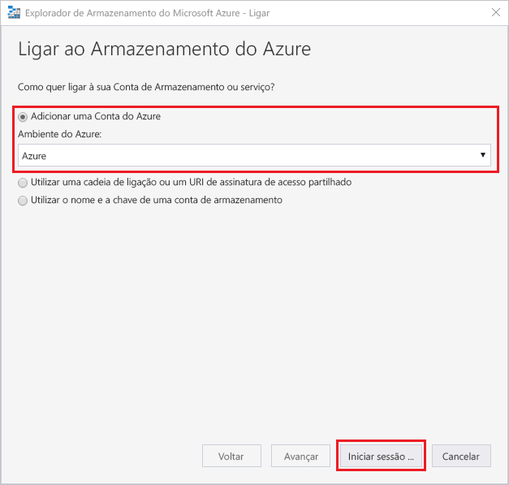
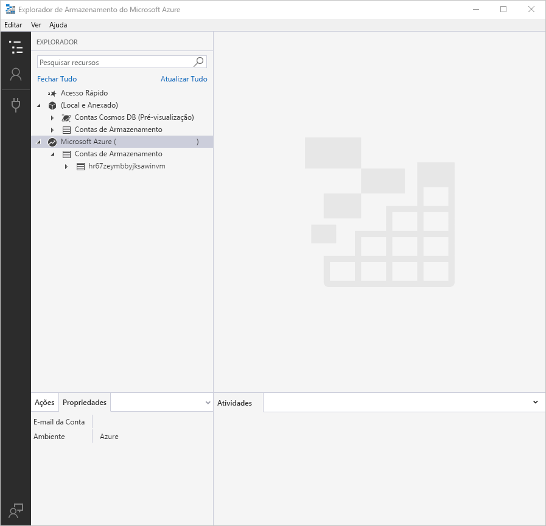

# Use o Azure Storage Explorer para gerir ACLs em Azure Data Lake Storage Gen2

Este artigo mostra-lhe como usar [o Azure Storage Explorer](https://azure.microsoft.com/features/storage-explorer/) para gerir listas de controlo de acesso (ACLs) em contas de armazenamento que têm espaço hierárquico (HNS) ativado.

Pode utilizar o Storage Explorer para visualizar e, em seguida, atualizar os ACLs de diretórios e ficheiros. A herança ACL já está disponível para novos itens infantis que são criados sob um diretório de pais. Mas também pode aplicar as definições ACL de forma recorrente nos itens infantis existentes de um diretório parental sem ter de fazer estas alterações individualmente para cada item infantil. 

Este artigo mostra-lhe como modificar o ACL de ficheiro ou diretório e como aplicar as definições ACL de forma recorrente a diretórios infantis.

## Pré-requisitos

- Uma subscrição do Azure. Consulte [Obter versão de avaliação gratuita do Azure](https://azure.microsoft.com/pricing/free-trial/).

- Uma conta de armazenamento que tem espaço hierárquico de nome (HNS) ativado. Siga [estas](../common/storage-account-create.md) instruções para criar uma.

- Azure Storage Explorer instalado no seu computador local. Para instalar o Explorador de Armazenamento do Azure para Windows, Macintosh ou Linux, consulte [Explorador de Armazenamento do Azure](https://azure.microsoft.com/features/storage-explorer/).

> [!NOTE]
> O Storage Explorer utiliza tanto o Blob (blob) & data lake storage gen2 [(dfs)](../common/storage-private-endpoints.md#private-endpoints-for-azure-storage) quando trabalha com a Azure Data Lake Storage Gen2. Se o acesso ao Azure Data Lake Storage Gen2 estiver configurado utilizando pontos finais privados, certifique-se de que são criados dois pontos finais privados para a conta de armazenamento: um com o sub-recurso-alvo `blob` e o outro com o sub-recurso alvo `dfs` .

## Inscreva-se no Storage Explorer

Ao iniciar o Explorador de Armazenamento, surge a janela **Explorador de Armazenamento do Microsoft Azure - Ligar**. Embora o Storage Explorer forneça várias formas de se conectar às contas de armazenamento, apenas uma forma é suportada para gerir acLs.

|Tarefa|Objetivo|
|---|---|
|Adicionar uma Conta do Azure | Redireciona-o para a página de inscrição da sua organização para autenticá-lo para Azure. Atualmente este é o único método de autenticação suportado se quiser gerir e definir ACLs.|
|Utilizar uma cadeia de ligação ou um URI de assinatura de acesso partilhado | Pode ser utilizado para aceder diretamente a um contentor ou conta de armazenamento com um token SAS ou uma cadeia de ligação partilhada. |
|Utilizar o nome e a chave de uma conta de armazenamento| Utilize o nome e a chave da conta de armazenamento para ligar ao armazenamento do Azure.|

**Selecione Adicionar uma Conta Azure** e clique em Iniciar **sôm.** Siga as instruções no ecrã para iniciar súm na sua conta Azure.

Quando a ligação for concluída, o Explorador de Armazenamento do Azure é carregado com o separador **Explorador** mostrado. Esta vista dá-lhe uma visão de todas as suas contas de armazenamento Azure, bem como armazenamento local configurado através do [emulador de armazenamento Azurite,](../common/storage-use-azurite.md?toc=%2fazure%2fstorage%2fblobs%2ftoc.json) [contas cosmos DB](../../cosmos-db/storage-explorer.md?toc=%2fazure%2fstorage%2fblobs%2ftoc.json) ou ambientes [Azure Stack.](/azure-stack/user/azure-stack-storage-connect-se?toc=%2fazure%2fstorage%2fblobs%2ftoc.json)

## Gerir um ACL

Clique com o botão direito no recipiente, num diretório ou num ficheiro e, em seguida, clique em **Gerir listas de controlo de acesso**.  A imagem que se segue mostra o menu tal como aparece quando clica à direita num diretório.

> [!div class="mx-imgBorder"]
> 

A caixa de diálogo **Manage Access** permite-lhe gerir permissões para o proprietário e o grupo de proprietários. Também permite adicionar novos utilizadores e grupos à lista de controlo de acessos para os quais poderá gerir permissões.

> [!div class="mx-imgBorder"]
> 

Para adicionar um novo utilizador ou grupo à lista de controlo de acesso, selecione o botão **Adicionar.** Em seguida, insira a entrada correspondente do Azure Ative Directory (Azure AD) que pretende adicionar à lista e, em seguida, selecione **Adicionar**.  O utilizador ou grupo irá agora aparecer nos **Utilizadores e grupos:** campo, permitindo-lhe começar a gerir as suas permissões.

> [!NOTE]
> É uma boa prática, e recomendada, criar um grupo de segurança em Azure AD e manter permissões no grupo em vez de utilizadores individuais. Para mais informações sobre esta recomendação, bem como outras boas práticas, consulte o [modelo de controlo de acesso no Azure Data Lake Storage Gen2](data-lake-storage-explorer-acl.md).

Utilize os controlos da caixa de verificação para definir acesso e ACLs predefinidos. Para saber mais sobre a diferença entre estes tipos de ACLs, consulte [Tipos de ACLs](data-lake-storage-access-control.md#types-of-acls).

## Aplicar ACLs recursivamente

Pode aplicar as entradas ACL de forma recorrente nos itens infantis existentes de um diretório parental sem ter de escrutar estas alterações individualmente para cada item infantil.

Para aplicar as entradas ACL de forma recorrente, clique no recipiente ou num diretório e, em seguida, clique em Listas de **Controlo de Acesso propagados**.  A imagem que se segue mostra o menu tal como aparece quando clica à direita num diretório.

> [!div class="mx-imgBorder"]
> 

## Passos seguintes

Saiba mais sobre o modelo de permissão de armazenamento de dados da Gen2.

> [!div class="nextstepaction"]
> [Modelo de controlo de acesso em Azure Data Lake Storage Gen2](./data-lake-storage-access-control-model.md)
