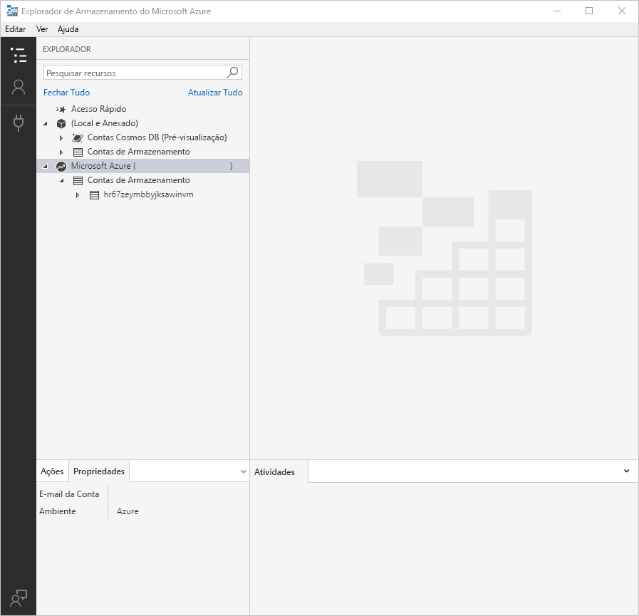

# Use Azure Storage Explorer to manage directories, files, and ACLs in Azure Data Lake Storage Gen2 (Utilizar o Explorador de Armazenamento do Azure para gerir diretórios, ficheiros e ACLs no Azure Data Lake Storage Gen2)

Este artigo mostra-lhe como usar [o Azure Storage Explorer](https://azure.microsoft.com/features/storage-explorer/) para criar e gerir diretórios, ficheiros e listas de controlo de acesso (ACLs) em contas de armazenamento que tenham espaço hierárquico de nomes (HNS) ativados.

## Pré-requisitos

- Uma subscrição do Azure. Consulte [Obter versão de avaliação gratuita do Azure](https://azure.microsoft.com/pricing/free-trial/).

- Uma conta de armazenamento que tem espaço hierárquico de nome (HNS) ativado. Siga [estas](../common/storage-account-create.md) instruções para criar uma.

- Azure Storage Explorer instalado no seu computador local. Para instalar o Explorador de Armazenamento do Azure para Windows, Macintosh ou Linux, consulte [Explorador de Armazenamento do Azure](https://azure.microsoft.com/features/storage-explorer/).

## Inscreva-se no Storage Explorer

Ao iniciar o Explorador de Armazenamento, surge a janela **Explorador de Armazenamento do Microsoft Azure - Ligar**. Embora o Storage Explorer forneça várias formas de se conectar às contas de armazenamento, apenas uma forma é suportada para gerir acLs.

|Tarefa|Objetivo|
|---|---|
|Adicionar uma Conta do Azure | Redireciona-o para a página de inscrição da sua organização para autenticá-lo para Azure. Atualmente este é o único método de autenticação suportado se quiser gerir e definir ACLs.|
|Utilizar uma cadeia de ligação ou um URI de assinatura de acesso partilhado | Pode ser utilizado para aceder diretamente a um contentor ou conta de armazenamento com um token SAS ou uma cadeia de ligação partilhada. |
|Utilizar o nome e a chave de uma conta de armazenamento| Utilize o nome e a chave da conta de armazenamento para ligar ao armazenamento do Azure.|

**Selecione Adicionar uma Conta Azure** e clique em Iniciar **sôm.** Siga as instruções no ecrã para iniciar súm na sua conta Azure.

Quando a ligação for concluída, o Explorador de Armazenamento do Azure é carregado com o separador **Explorador** mostrado. Esta vista dá-lhe uma visão de todas as suas contas de armazenamento Azure, bem como armazenamento local configurado através do [emulador de armazenamento Azurite,](../common/storage-use-azurite.md?toc=%2fazure%2fstorage%2fblobs%2ftoc.json) [contas cosmos DB](../../cosmos-db/storage-explorer.md?toc=%2fazure%2fstorage%2fblobs%2ftoc.json) ou ambientes [Azure Stack.](/azure-stack/user/azure-stack-storage-connect-se?toc=%2fazure%2fstorage%2fblobs%2ftoc.json)

## Criar um contentor

Um contentor contém diretórios e ficheiros. Para criar uma, expanda a conta de armazenamento que criou no passo em curso. Selecione **Blob Containers**, click direito e selecione **Create Blob Container**. Insira o nome do seu recipiente. Consulte a secção [De Conjunto de Contentores](storage-quickstart-blobs-dotnet.md#create-a-container) para obter uma lista de regras e restrições sobre os recipientes de nomeação. Quando estiver concluído, prima **Enter** para criar o recipiente. Uma vez criado o recipiente com sucesso, é apresentado sob a pasta **Blob Containers** para a conta de armazenamento selecionada.

## Criar um diretório

Para criar um diretório, selecione o recipiente que criou no passo de curso. Na fita do recipiente, escolha o botão **Pasta Nova.** Insira o nome do seu diretório. Quando estiver concluído, prima **Enter** para criar o diretório. Uma vez criado o diretório com sucesso, aparece na janela do editor.

## Carregar bolhas para o diretório

Na fita do diretório, escolha o **botão Upload.** Esta operação dá-lhe a opção de carregar uma pasta ou um ficheiro.

Escolha os ficheiros ou pasta a carregar.

Quando seleciona **OK**, os ficheiros selecionados são colocados em fila para carregamento. Quando o carregamento estiver concluído, os resultados são apresentados na janela **Atividades**.

## Ver bolhas num diretório

Na aplicação **Azure Storage Explorer,** selecione um diretório numa conta de armazenamento. O painel principal mostra uma lista das bolhas no diretório selecionado.

## Transferir blobs

Para descarregar ficheiros utilizando **o Azure Storage Explorer,** com um ficheiro selecionado, selecione **Descarregue** a partir da fita. É aberta uma caixa de diálogo de ficheiro que lhe permite introduzir um nome de ficheiro. **Selecione Guardar** para iniciar o download de um ficheiro para a localização local.

## Gerir ACLs

Clique com o botão direito no recipiente, num diretório ou num ficheiro e, em seguida, clique em **Gerir listas de controlo de acesso**.  A imagem que se segue mostra o menu tal como aparece quando clica à direita num diretório.

> [!div class="mx-imgBorder"]
> 

A caixa de diálogo **Manage Access** permite-lhe gerir permissões para o proprietário e o grupo de proprietários. Também permite adicionar novos utilizadores e grupos à lista de controlo de acessos para os quais poderá gerir permissões.

> [!div class="mx-imgBorder"]
> 

Para adicionar um novo utilizador ou grupo à lista de controlo de acesso, selecione o botão **Adicionar.** Em seguida, insira a entrada correspondente do Azure Ative Directory (AAD) que pretende adicionar à lista e, em seguida, selecione **Adicionar**.  O utilizador ou grupo irá agora aparecer nos **Utilizadores e grupos:** campo, permitindo-lhe começar a gerir as suas permissões.

> [!NOTE]
> É uma boa prática, e recomendada, criar um grupo de segurança em AAD e manter permissões no grupo em vez de utilizadores individuais. Para mais informações sobre esta recomendação, bem como outras boas práticas, consulte o [modelo de controlo de acesso no Azure Data Lake Storage Gen2](data-lake-storage-access-control-model.md).

Utilize os controlos da caixa de verificação para definir acesso e ACLs predefinidos. Para saber mais sobre a diferença entre estes tipos de ACLs, consulte [Tipos de ACLs](data-lake-storage-access-control.md#types-of-acls).

## Aplicar ACLs recursivamente

Pode aplicar as entradas ACL de forma recorrente nos itens infantis existentes de um diretório parental sem ter de escrutar estas alterações individualmente para cada item infantil.

Para aplicar as entradas ACL de forma recorrente, clique no recipiente ou num diretório e, em seguida, clique em Listas de **Controlo de Acesso propagados**.  A imagem que se segue mostra o menu tal como aparece quando clica à direita num diretório.

> [!div class="mx-imgBorder"]
> 

## Passos seguintes

Aprenda as listas de controlo de acesso na Data Lake Storage Gen2.

> [!div class="nextstepaction"]
> [Access control in Azure Data Lake Storage Gen2](./data-lake-storage-access-control.md) (Controlo de acesso no Azure Data Lake Storage Gen2)
