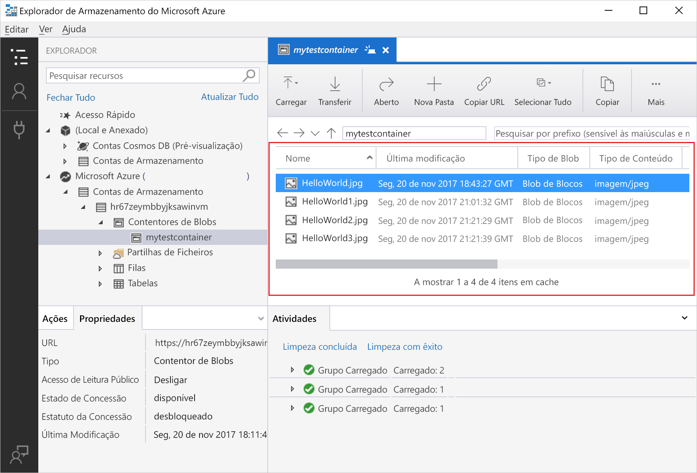

# Usar Gerenciador de Armazenamento do Azure para gerenciar dados em uma conta de Azure Data Lake Storage Gen2

Neste guia de início rápido, você aprende a usar [Gerenciador de armazenamento do Azure](https://azure.microsoft.com/features/storage-explorer/) para criar um diretório e um blob. Em seguida, você aprende a baixar o blob em seu computador local e a exibir todos os BLOBs em um diretório. Você também aprenderá como criar um instantâneo de um blob, gerenciar políticas de acesso ao diretório e criar uma assinatura de acesso compartilhado.

## Pré-requisitos

[!INCLUDE [storage-quickstart-prereq-include](../../../includes/storage-quickstart-prereq-include.md)]

Este início rápido requer que instale o Explorador de Armazenamento do Azure. Para instalar o Explorador de Armazenamento do Azure para Windows, Macintosh ou Linux, consulte [Explorador de Armazenamento do Azure](https://azure.microsoft.com/features/storage-explorer/).

## Entrar no Gerenciador de Armazenamento

Na primeira execução, é mostrada a janela **Explorador de Armazenamento do Microsoft Azure – Ligar**. Embora Gerenciador de Armazenamento fornece várias maneiras de se conectar a contas de armazenamento, atualmente há suporte apenas para uma maneira para gerenciar ACLs.

|Tarefa|Objetivo|
|---|---|
|Adicionar uma Conta do Azure | Redireciona-o para a página de início de sessão de organizações para o autenticar no Azure. Atualmente, esse é o único método de autenticação com suporte se você quiser gerenciar e definir ACLs. |

Selecione **Adicionar uma Conta do Azure** e clique em **Iniciar sessão...** . Siga as mensagens no ecrã para iniciar sessão na conta do Azure.

Quando a ligação for concluída, o Explorador de Armazenamento do Azure é carregado com o separador **Explorador** mostrado. Esta vista fornece-lhe informações detalhadas de todas as contas de armazenamento do Azure, bem como do armazenamento local configurado através do [Emulador de Armazenamento do Azure](../common/storage-use-emulator.md?toc=%2fazure%2fstorage%2fblobs%2ftoc.json), contas do [Cosmos DB](../../cosmos-db/storage-explorer.md?toc=%2fazure%2fstorage%2fblobs%2ftoc.json) ou ambientes do [Azure Stack](/azure-stack/user/azure-stack-storage-connect-se?toc=%2fazure%2fstorage%2fblobs%2ftoc.json).

## Criar um sistema de arquivos

Os BLOBs são sempre carregados em um diretório. Isto permite organizar grupos de blobs, como organiza os ficheiros em pastas no seu computador.

Para criar um diretório, expanda a conta de armazenamento que você criou na etapa de continuação. Selecione **contêiner de blob**, clique com o botão direito do mouse e selecione **criar contêiner de blob**. Insira o nome do sistema de arquivos. Ao concluir, pressione **Enter** para criar o sistema de arquivos. Depois que o diretório de blob tiver sido criado com êxito, ele será exibido na pasta **contêiner de blob** para a conta de armazenamento selecionada.

## Carregar BLOBs para o diretório

O armazenamento de blobs suporta blobs de blocos, blobs de acréscimo e blobs de páginas. Os ficheiros VHD utilizados nas cópias de segurança de VMs IaaS são blobs de páginas. Os blobs de acréscimo são utilizados para registo, como quando quer escrever num ficheiro e continuar a adicionar mais informações. A maioria dos ficheiros guardados no armazenamento de Blobs são blobs de blocos.

Na faixa de opções diretório, selecione **carregar**. Esta operação dá-lhe a opção de carregar uma pasta ou um ficheiro.

Escolha os ficheiros ou pasta a carregar. Selecione o **tipo de blob**. As opções aceitáveis são **Anexar**, **Página** ou **Blob de blocos**.

Se carregar um ficheiro .vhd ou .vhdx, selecione **Carregar ficheiros .vhd/.vhdx como blobs de páginas (recomendado)** .

No campo **carregar na pasta (opcional)** , faça um nome de pasta para armazenar os arquivos ou pastas em uma pasta sob o diretório. Se nenhuma pasta for escolhida, os arquivos serão carregados diretamente no diretório.

Quando seleciona **OK**, os ficheiros selecionados são colocados em fila para carregamento. Quando o carregamento estiver concluído, os resultados são apresentados na janela **Atividades**.

## Exibir BLOBs em um diretório

No **Gerenciador de armazenamento do Azure** aplicativo, selecione um diretório em uma conta de armazenamento. O painel principal mostra uma lista dos BLOBs no diretório selecionado.

## Transferir blobs

Para transferir blobs através do **Explorador de Armazenamento do Azure**, com um blob selecionado, selecione **Transferir** no friso. É aberta uma caixa de diálogo de ficheiro que lhe permite introduzir um nome de ficheiro. Selecione **Guardar** para iniciar a transferência de um blob para a localização local.

## Passos Seguintes

Neste início rápido, aprendeu a transferir ficheiros entre um disco local e o armazenamento de Blobs do Azure através do **Explorador de Armazenamento do Azure**. Para saber mais sobre como definir ACLs em seus arquivos e diretórios, continue com nosso "como" sobre o assunto.

> [!div class="nextstepaction"]
> [Como definir ACLs em arquivos e diretórios](data-lake-storage-how-to-set-permissions-storage-explorer.md)
