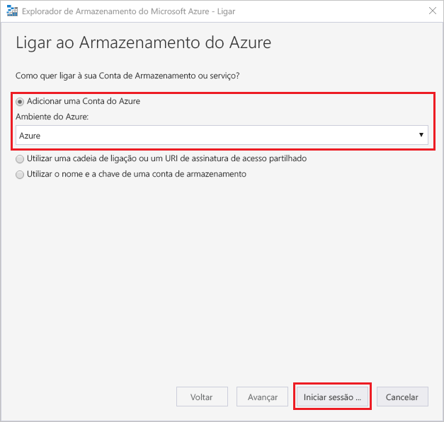
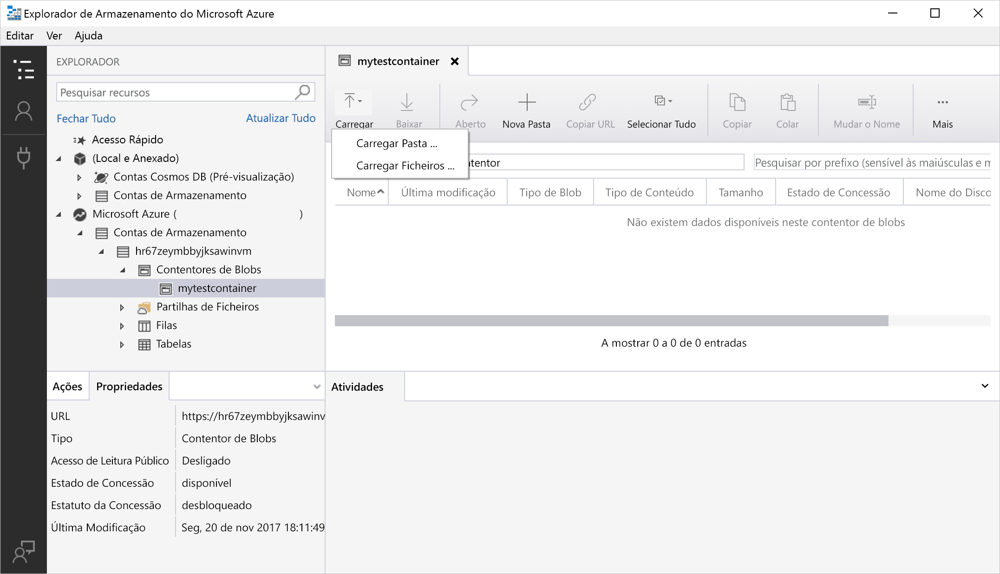

# Use Azure Storage Explorer with Azure Data Lake Storage Gen2

In this article, you'll learn how to use [Azure Storage Explorer](https://azure.microsoft.com/features/storage-explorer/) to create a directory and a blob. Next, you learn how to download the blob to your local computer, and how to view all of the blobs in a directory. You also learn how to create a snapshot of a blob, manage directory access policies, and create a shared access signature.

## Pré-requisitos

[!INCLUDE [storage-quickstart-prereq-include](../../../includes/storage-quickstart-prereq-include.md)]

Este início rápido requer que instale o Explorador de Armazenamento do Azure. Para instalar o Explorador de Armazenamento do Azure para Windows, Macintosh ou Linux, consulte [Explorador de Armazenamento do Azure](https://azure.microsoft.com/features/storage-explorer/).

## Sign in to Storage Explorer

Na primeira execução, é mostrada a janela **Explorador de Armazenamento do Microsoft Azure – Ligar**. While Storage Explorer provides several ways to connect to storage accounts, only one way is currently supported for managing ACLs.

|Tarefa|Finalidade|
|---|---|
|Adicionar uma Conta do Azure | Redireciona-o para a página de início de sessão de organizações para o autenticar no Azure. Currently this is the only supported authentication method if you want to manage and set ACLs. |

Select **Add an Azure Account** and click **Sign in..** . Follow the on-screen prompts to sign into your Azure account.

Quando a ligação for concluída, o Explorador de Armazenamento do Azure é carregado com o separador **Explorador** mostrado. Esta vista fornece-lhe informações detalhadas de todas as contas de armazenamento do Azure, bem como do armazenamento local configurado através do [Emulador de Armazenamento do Azure](../common/storage-use-emulator.md?toc=%2fazure%2fstorage%2fblobs%2ftoc.json), contas do [Cosmos DB](../../cosmos-db/storage-explorer.md?toc=%2fazure%2fstorage%2fblobs%2ftoc.json) ou ambientes do [Azure Stack](/azure-stack/user/azure-stack-storage-connect-se?toc=%2fazure%2fstorage%2fblobs%2ftoc.json).

## Criar um contentor

Blobs are always uploaded into a directory. Isto permite organizar grupos de blobs, como organiza os ficheiros em pastas no seu computador.

To create a directory, expand the storage account you created in the proceeding step. Select **Blob container**, right-click and select **Create Blob container**. Enter the name for your container. When complete, press **Enter** to create the container. Once the blob directory has been successfully created, it is displayed under the **Blob container** folder for the selected storage account.

## Upload blobs to the directory

O armazenamento de blobs suporta blobs de blocos, blobs de acréscimo e blobs de páginas. Os ficheiros VHD utilizados nas cópias de segurança de VMs IaaS são blobs de páginas. Os blobs de acréscimo servem para registo, como quando quer escrever num ficheiro e continuar a adicionar mais informações. A maioria dos ficheiros guardados no armazenamento de Blobs são blobs de blocos.

On the directory ribbon, select **Upload**. Esta operação dá-lhe a opção de carregar uma pasta ou um ficheiro.

Escolha os ficheiros ou pasta a carregar. Selecione o **tipo de blob**. As opções aceitáveis são **Anexar**, **Página** ou **Blob de blocos**.

Se carregar um ficheiro .vhd ou .vhdx, selecione **Carregar ficheiros .vhd/.vhdx como blobs de páginas (recomendado)** .

In the **Upload to folder (optional)** field either a folder name to store the files or folders in a folder under the directory. If no folder is chosen, the files are uploaded directly under the directory.

Quando seleciona **OK**, os ficheiros selecionados são colocados em fila para carregamento. Quando o carregamento estiver concluído, os resultados são apresentados na janela **Atividades**.

## View blobs in a directory

In the **Azure Storage Explorer** application, select a directory under a storage account. The main pane shows a list of the blobs in the selected directory.

## Transferir blobs

Para transferir blobs através do **Explorador de Armazenamento do Azure**, com um blob selecionado, selecione **Transferir** no friso. É aberta uma caixa de diálogo de ficheiro que lhe permite introduzir um nome de ficheiro. Selecione **Guardar** para iniciar a transferência de um blob para a localização local.

## Passos seguintes

Neste início rápido, aprendeu a transferir ficheiros entre um disco local e o armazenamento de Blobs do Azure através do **Explorador de Armazenamento do Azure**. To learn about how to set ACLs on your files and directories, continue to our How-to on the subject.

> [!div class="nextstepaction"]
> [How to set ACLs on files and directories](data-lake-storage-how-to-set-permissions-storage-explorer.md)
