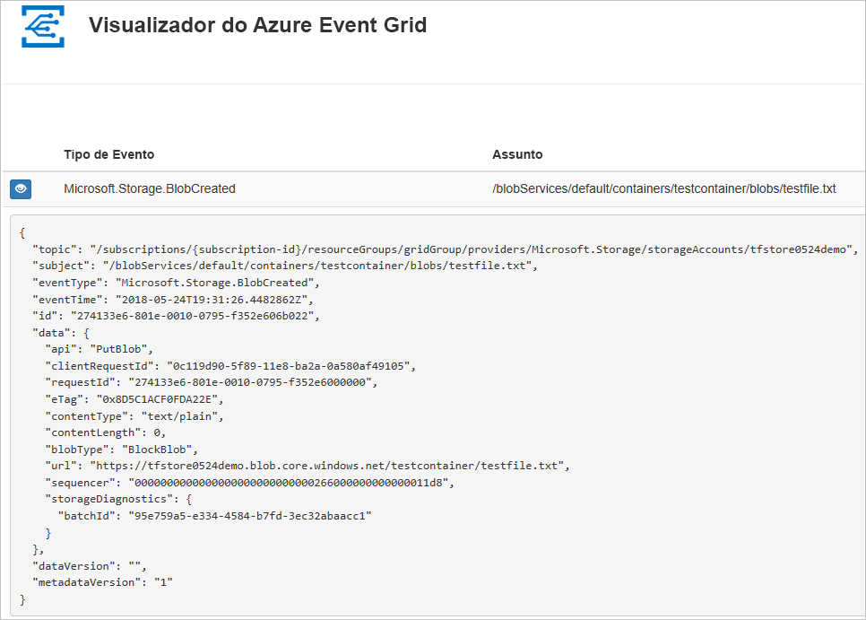
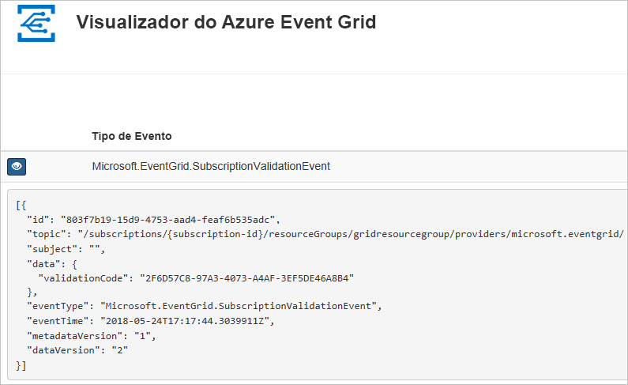

# <a name="quickstart-route-storage-events-to-web-endpoint-with-azure-cli"></a>Quickstart: Route storage events to web endpoint with Azure CLI

O Azure Event Grid é um serviço de eventos para a cloud. Neste artigo, a CLI do Azure é utilizada para subscrever a eventos de armazenamento de Blobs e acionar o evento para ver o resultado.

Normalmente, envia eventos para um ponto final que processa os dados de eventos e efetua ações. No entanto, para simplificar este artigo, vai enviar eventos para uma aplicação Web que recolhe e apresenta as mensagens.

Quando concluir os passos descritos neste artigo, pode ver que os dados do evento foram enviados para a aplicação Web.



[!INCLUDE [quickstarts-free-trial-note.md](../../../includes/quickstarts-free-trial-note.md)]

[!INCLUDE [azure-cli-prepare-your-environment.md](../../../includes/azure-cli-prepare-your-environment.md)]

- Este artigo requer a versão 2.0.70 ou posterior do Azure CLI. Se utilizar o Azure Cloud Shell, a versão mais recente já está instalada.

## <a name="create-a-resource-group"></a>Criar um grupo de recursos

Os tópicos do Event Grid são recursos do Azure e têm de ser colocados num grupo de recursos do Azure. Um grupo de recursos é uma coleção lógica na qual os recursos do Azure são implementados e geridos.

Crie um grupo de recursos com o comando [az group create](/cli/azure/group). 

O exemplo seguinte cria um grupo de recursos com o nome `<resource_group_name>` na localização *westcentralus*.  Substitua `<resource_group_name>` por um nome exclusivo para o seu grupo de recursos.

```azurecli-interactive
az group create --name <resource_group_name> --location westcentralus
```

## <a name="create-a-storage-account"></a>Criar uma conta de armazenamento

Os eventos de armazenamento de blobs estão disponíveis em contas de armazenamento para fins gerais v2 e contas de armazenamento de Blobs. As contas de armazenamento de **Fins gerais v2** suportam todas as funcionalidades de todos os serviços de armazenamento, incluindo Blobs, Ficheiros, Filas e Tabelas. Uma **conta de armazenamento Blob** é uma conta de armazenamento especializada para armazenar os seus dados não estruturados como bolhas (objetos) no Azure Storage. As contas de armazenamento de Blobs são semelhantes às contas de armazenamento para fins gerais e partilham todas as excelentes características de durabilidade, disponibilidade, escalabilidade e desempenho que utiliza atualmente, incluindo 100% de consistência com a API dos blobs de blocos e dos blobs de acréscimo. Para mais informações, veja [Visão geral de conta de armazenamento do Azure](../common/storage-account-overview.md).

Substitua `<storage_account_name>` por um nome exclusivo para a conta de armazenamento, e `<resource_group_name>` com o grupo de recursos que criou anteriormente.

```azurecli-interactive
az storage account create \
  --name <storage_account_name> \
  --location westcentralus \
  --resource-group <resource_group_name> \
  --sku Standard_LRS \
  --kind BlobStorage \
  --access-tier Hot
```

## <a name="create-a-message-endpoint"></a>Criar um ponto final de mensagem

Antes de subscrever o tópico, vamos criar o ponto final para a mensagem de evento. Normalmente, o ponto final executa as ações com base nos dados do evento. Para simplificar este início rápido, vai implementar uma [aplicação Web pré-criada](https://github.com/Azure-Samples/azure-event-grid-viewer) para apresentar as mensagens de evento. A solução implementada inclui um plano do Serviço de Aplicações, uma aplicação Web do Serviço de Aplicações e o código de origem do GitHub.

Substitua `<your-site-name>` por um nome exclusivo para a aplicação Web. O nome da aplicação Web deve ser exclusivo, porque faz parte da entrada DNS.

```azurecli-interactive
sitename=<your-site-name>

az deployment group create \
  --resource-group <resource_group_name> \
  --template-uri "https://raw.githubusercontent.com/Azure-Samples/azure-event-grid-viewer/master/azuredeploy.json" \
  --parameters siteName=$sitename hostingPlanName=viewerhost
```

A implementação pode demorar alguns minutos. Após a implementação ter sido concluída com êxito, verifique a aplicação Web para verificar se está em execução. Num browser, navegue para: `https://<your-site-name>.azurewebsites.net`

Deverá ver o site sem mensagens atualmente apresentadas.

[!INCLUDE [event-grid-register-provider-cli.md](../../../includes/event-grid-register-provider-cli.md)]

## <a name="subscribe-to-your-storage-account"></a>Subscrever à sua conta de armazenamento

Subscreva um tópico para comunicar ao Event Grid os eventos que pretende controlar e para onde enviar esses eventos. O exemplo seguinte subscreve a conta de armazenamento que criou e transmite o URL da aplicação Web como o ponto final para notificação de eventos. Substitua `<event_subscription_name>` por um nome para a subscrição de eventos. Para `<resource_group_name>` e `<storage_account_name>`, utilize o valor que criou anteriormente.

O ponto final para a aplicação Web tem de incluir o sufixo `/api/updates/`.

```azurecli-interactive
storageid=$(az storage account show --name <storage_account_name> --resource-group <resource_group_name> --query id --output tsv)
endpoint=https://$sitename.azurewebsites.net/api/updates

az eventgrid event-subscription create \
  --source-resource-id $storageid \
  --name <event_subscription_name> \
  --endpoint $endpoint
```

Verifique a aplicação Web novamente e repare que um evento de validação de subscrição foi enviado para a mesma. Selecione o ícone do olho para expandir os dados do evento. O Event Grid envia o evento de validação para que o ponto final possa verificar que pretende receber dados de eventos. A aplicação Web inclui código para validar a subscrição.



## <a name="trigger-an-event-from-blob-storage"></a>Acionar um evento a partir do armazenamento de Blobs

Agora, vamos acionar um evento para ver como o Event Grid distribui a mensagem para o ponto final. Em primeiro lugar, vamos configurar o nome e chave para a conta de armazenamento, em seguida, vamos criar um contentor e, em seguida, criar e carregar um ficheiro. Novamente, utilize os valores para `<storage_account_name>` e `<resource_group_name>` que criou anteriormente.

```azurecli-interactive
export AZURE_STORAGE_ACCOUNT=<storage_account_name>
export AZURE_STORAGE_KEY="$(az storage account keys list --account-name <storage_account_name> --resource-group <resource_group_name> --query "[0].value" --output tsv)"

az storage container create --name testcontainer

touch testfile.txt
az storage blob upload --file testfile.txt --container-name testcontainer --name testfile.txt
```

Acionou o evento e o Event Grid enviou a mensagem para o ponto final que configurou ao subscrever. Verifique a aplicação Web para ver o evento que acabámos de enviar.


```json
[{
  "topic": "/subscriptions/xxxxxxxx-xxxx-xxxx-xxxx-xxxxxxxxxxxx/resourceGroups/myrg/providers/Microsoft.Storage/storageAccounts/myblobstorageaccount",
  "subject": "/blobServices/default/containers/testcontainer/blobs/testfile.txt",
  "eventType": "Microsoft.Storage.BlobCreated",
  "eventTime": "2017-08-16T20:33:51.0595757Z",
  "id": "4d96b1d4-0001-00b3-58ce-16568c064fab",
  "data": {
    "api": "PutBlockList",
    "clientRequestId": "d65ca2e2-a168-4155-b7a4-2c925c18902f",
    "requestId": "4d96b1d4-0001-00b3-58ce-16568c000000",
    "eTag": "0x8D4E4E61AE038AD",
    "contentType": "text/plain",
    "contentLength": 0,
    "blobType": "BlockBlob",
    "url": "https://myblobstorageaccount.blob.core.windows.net/testcontainer/testblob1.txt",
    "sequencer": "00000000000000EB0000000000046199",
    "storageDiagnostics": {
      "batchId": "dffea416-b46e-4613-ac19-0371c0c5e352"
    }
  },
  "dataVersion": "",
  "metadataVersion": "1"
}]

```

## <a name="clean-up-resources"></a>Limpar os recursos
Se quiser continuar a trabalhar com esta conta de armazenamento e subscrição de eventos, não limpe os recursos criados neste artigo. Se não quiser continuar, utilize o comando seguinte para eliminar os recursos que criou neste artigo.

Substitua `<resource_group_name>` pelo grupo de recursos que criou acima.

```azurecli-interactive
az group delete --name <resource_group_name>
```

## <a name="next-steps"></a>Passos seguintes

Agora que sabe como criar tópicos e subscrições de eventos, saiba mais sobre os Eventos de armazenamento de Blobs o que o Event Grid pode ajudá-lo a fazer:

- [Reagir aos eventos de armazenamento de Blobs](storage-blob-event-overview.md)
- [Sobre o Event Grid](../../event-grid/overview.md)
