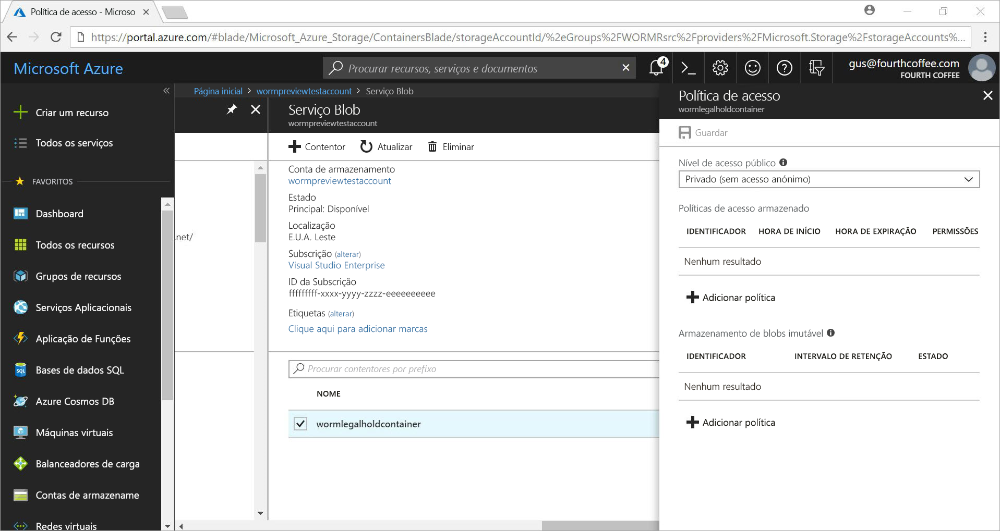
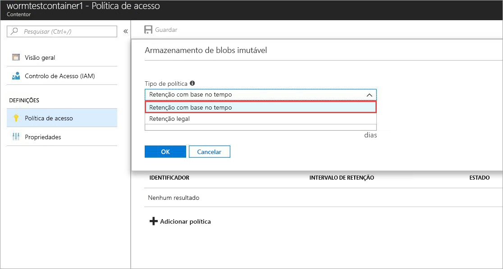
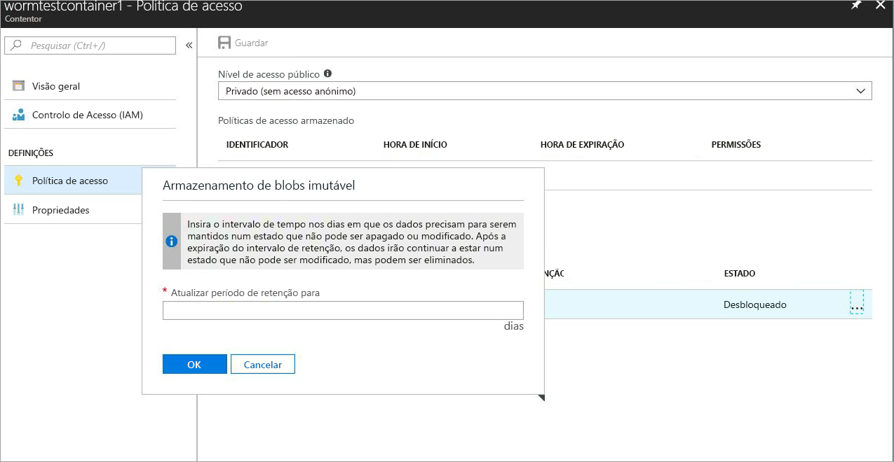
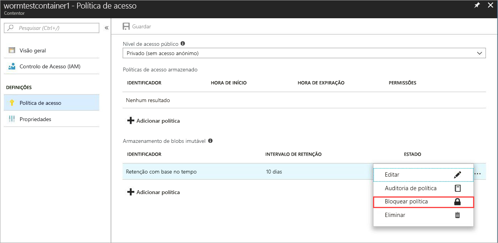
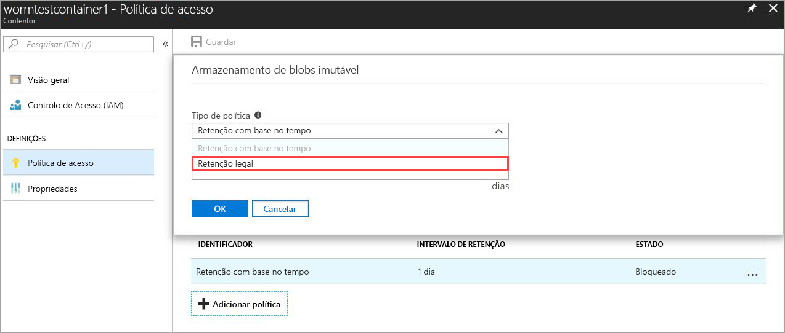
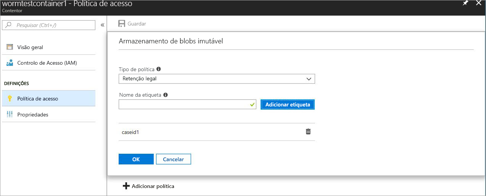

# <a name="store-business-critical-data-in-azure-blob-storage"></a>Store dados críticos da empresa no armazenamento de Blobs do Azure

Armazenamento imutável para armazenamento de Blobs do Azure permite aos utilizadores armazenar os objetos de dados críticos da empresa num Estado WORM (escrever uma vez, muitos de leitura). Este estado não apagável e não modificável os dados faz para um intervalo especificado pelo utilizador. Objetos de BLOBs podem ser criados e ler, mas não modificados ou eliminados, durante o intervalo de retenção. Armazenamento imutável está ativado para fins gerais v2 e contas de armazenamento de BLOBs em todas as regiões do Azure.

## <a name="overview"></a>Descrição geral

Armazenamento imutável ajuda a organização de saúde, instituições financeiras e setores relacionados, particularmente, organizações de Mediador dealer – para armazenar dados de forma segura. Também pode ser aproveitado em qualquer cenário para proteger os dados vitais contra modificação ou eliminação. 

As aplicações típicas incluem:

- **Conformidade a normas**: O armazenamento imutável para o armazenamento de Blobs do Azure ajuda as organizações endereço seg 17a-4(f), CFTC 1.31(d), FINRA e outros regulamentos. Como imutável de armazenamento de endereços, que essas exigências de regulamentações pode ser baixado por meio de detalhes de um documento técnico por Cohasset associa os [Portal de confiança do serviço Microsoft](https://aka.ms/AzureWormStorage). O [Centro de fidedignidade do Azure](https://www.microsoft.com/trustcenter/compliance/compliance-overview) contém informações detalhadas sobre as nossas certificações de conformidade.

- **Proteger a retenção de documentos**: Armazenamento imutável para armazenamento de Blobs do Azure garante que os dados não podem ser modificados ou eliminados por nenhum utilizador, incluindo utilizadores com privilégios administrativos da conta.

- **Suspensão legal**: Armazenamento imutável para armazenamento de Blobs do Azure permite aos utilizadores armazenar informações confidenciais que é essenciais para a utilização de litígio ou business num Estado de prova de adulteração durante o período pretendido até que a espera seja removida. Esta funcionalidade não se limita apenas a casos de utilização legal, mas pode também ser considerada como uma espera baseado em evento ou um bloqueio de empresa, onde é necessária a necessidade de proteger os dados com base em acionadores de eventos ou de política da empresa.

Armazenamento imutável suporta o seguinte:

- **[Suporte de política de retenção com base no tempo](#time-based-retention)**: Os utilizadores podem definir políticas para armazenar dados de um intervalo especificado. Quando uma política de retenção com base no tempo é definido, blobs podem ser criadas e ler, mas não modificados ou eliminados. Após o período de retenção tiver expirado, os blobs podem ser eliminados mas não substituídas.

- **[Suporte de política de retenção legal](#legal-holds)**: Se o intervalo de retenção não é conhecido, os usuários podem defini retenções jurídicas para armazenar dados immutably até que a suspensão legal está desmarcada.  Quando uma política de retenção legal é definida, blobs podem ser criadas e ler, mas não modificados ou eliminados. Cada suspensão legal está associado uma definidas pelo utilizador alfanumérica etiqueta (por exemplo, um ID de incidente, nome do evento, etc.) que é utilizada como uma cadeia de caracteres de identificador. 

- **O suporte para todas as camadas de BLOBs**: Políticas WORM são independentes da camada de armazenamento de Blobs do Azure e aplicam-se a todas as camadas: frequente, esporádico e de arquivo. Os utilizadores podem passar dados para o escalão mais com otimização de custos para as cargas de trabalho, mantendo a imutabilidade de dados.

- **Configuração de nível de contêiner**: Os utilizadores podem configurar políticas de retenção com base no tempo e retenção legal etiquetas ao nível do contentor. Ao utilizar as definições de nível de contêiner simples, os utilizadores podem criar e políticas de retenção com base no tempo de bloqueio, expandir a intervalos de retenção, conjunto e retenções jurídicas claro e muito mais. Estas políticas se aplicam a todos os blobs no contentor, novo e existente.

- **Suporte de registo de auditoria**: Cada contentor inclui um registo de auditoria. Ele apresenta os comandos de retenção com base no tempo até cinco para políticas de retenção com base no tempo bloqueado, com um máximo de três logs para extensões de intervalo de retenção. Para uma retenção com base no tempo, o registo contém o ID de utilizador, tipo de comando, carimbos de data / hora e intervalo de retenção. Para retenções jurídicas, o registo contém o ID de utilizador, tipo de comando, carimbos de data / hora e as etiquetas de retenção legal. Este registo é retido durante o tempo de vida do contentor, de acordo com as diretrizes de normas de 17a-4(f) seg. O [registo de atividades do Azure](../../azure-monitor/platform/activity-logs-overview.md) mostra um registo mais abrangente de todas as atividades do plano de controle; e permitindo [registos de diagnóstico do Azure](../../azure-monitor/platform/diagnostic-logs-overview.md) retém e mostra as operações de plano de dados. É responsabilidade do usuário para armazenar os registos de forma permanente, como poderá ser necessário por motivos de regulamentação ou outros.

## <a name="how-it-works"></a>Como funciona

Armazenamento imutável para armazenamento de Blobs do Azure suporta dois tipos de políticas de imutáveis ou WORM: retenção com base no tempo e retenções jurídicas. Quando uma política de retenção com base no tempo ou a suspensão legal é aplicada num contêiner, mover todos os blobs existentes num Estado WORM imutável em menos de 30 segundos. Todos os novos blobs, que são carregados para esse contentor também irão mudar para o estado imutável. Depois de todos os blobs terem sido movidos para o estado imutável, a política imutável foi confirmada e todas as substituir ou eliminam não são permitidas operações para objetos novos e existentes no contentor imutável.

### <a name="time-based-retention"></a>Retenção com base no tempo

> [!IMPORTANT]
> Tem de ser uma política de retenção com base no tempo *bloqueado* para o blob estar num imutável (escrita e eliminação protegidos) Estado para seg 17a-4(f) e outra a conformidade a normas. Recomendamos que bloqueia a política numa quantidade razoável de tempo, normalmente dentro de 24 horas. Não recomendamos utilizar o *desbloqueado* estado para qualquer finalidade sem ser de curto prazo versões de avaliação do recurso.

Quando é aplicada uma política de retenção com base no tempo num contentor, todos os blobs no contentor permanecerá no Estado imutável durante a *eficaz* período de retenção. O período de retenção em vigor para blobs existentes é igual à diferença entre a hora de modificação de blob e o intervalo de retenção especificado pelo utilizador.

Para novos blobs, o período de retenção efetivo é igual ao intervalo de retenção especificado pelo utilizador. Uma vez que os utilizadores podem expandir o intervalo de retenção, o armazenamento imutável utiliza o valor mais recente do intervalo de retenção especificado pelo utilizador para calcular o período de retenção em vigor.

> [!TIP]
> **Exemplo:** Um utilizador cria uma política de retenção com base no tempo com um intervalo de retenção de cinco anos.
>
> Os BLOBs existentes nesse contentor, _testblob1_, foi criado um ano atrás. Período de retenção em vigor a partir da _testblob1_ é de quatro anos.
>
> Um blob novo, _testblob2_, agora é carregado para o contentor. O período de retenção em vigor para este blob novo é cinco anos.

### <a name="legal-holds"></a>Retenções legais

Ao definir uma retenção legal, todos os blobs novos e existentes permanecem no Estado imutável até que a suspensão legal está desmarcada. Para obter mais informações sobre como conjunto e retenções jurídicas clear, consulte a [introdução ao](#getting-started) secção.

Um contentor pode ter uma retenção legal e uma política de retenção com base no tempo, ao mesmo tempo. Todos os blobs existentes nesse contentor permanecem no Estado imutável até que todos os retenções jurídicas forem verificadas, mesmo que o seu período de retenção em vigor expirou. Por outro lado, um blob permanece num Estado imutável até expira o período de retenção em vigor, apesar de tem sido limpo retenções jurídicas todos os.

A tabela seguinte mostra os tipos de operações de BLOBs que estão desativadas para os diferentes cenários de imutáveis. Para obter mais informações, consulte a [API de serviço de Blobs do Azure](https://docs.microsoft.com/rest/api/storageservices/blob-service-rest-api) documentação.

|Cenário  |Estado de blob  |Operações de BLOBs não permitidas  |
|---------|---------|---------|
|O intervalo de retenção efetivo do blob ainda não expirou e/ou a retenção legal está definida     |Imutável: protegido contra eliminação e escrita         | Colocar o Blob<sup>1</sup>, coloque o bloco<sup>1</sup>, coloque a lista de bloqueios<sup>1</sup>, elimine a metadados de Blob do contentor, Delete Blob, conjunto, colocar a página, definir propriedades de Blob, o Blob de instantâneo, o Blob de cópia Incremental, Bloco de acréscimo         |
|O intervalo de retenção efetivo no blob expirou     |Protegido apenas contra escrita (as operações de eliminação são permitidas)         |Colocar o Blob<sup>1</sup>, coloque o bloco<sup>1</sup>, colocar a lista de bloqueios<sup>1</sup>, definir metadados do Blob, colocar a página, defina o Blob de cópia Incremental de propriedades, o Blob de instantâneo de Blob, acrescentar bloco         |
|Todos os legais mantém desmarcada e nenhuma política de retenção com base no tempo é definida no contentor     |Mutável         |Nenhuma         |
|Nenhuma política WORM é criada (com base no tempo de retenção ou suspensão legal)     |Mutável         |Nenhuma         |

<sup>1</sup> o aplicativo permite que estas operações criar um novo blob de uma vez. Todos os subsequentes substituir não são permitidas operações num caminho de blob existente num contentor de imutável.

## <a name="pricing"></a>Preços

Não é sem custos adicionais para utilizar esta funcionalidade. Dados imutáveis é o preço da mesma forma como os dados regulares, e mutáveis. Para detalhes de preços no armazenamento de Blobs do Azure, consulte a [armazenamento do Azure, página de preços](https://azure.microsoft.com/pricing/details/storage/blobs/).

## <a name="getting-started"></a>Introdução

As versões mais recentes do [portal do Azure](https://portal.azure.com), [CLI do Azure](https://docs.microsoft.com/cli/azure/install-azure-cli?view=azure-cli-latest), e [Azure PowerShell](https://github.com/Azure/azure-powershell/releases) suporta armazenamento imutável para armazenamento de Blobs do Azure. [Suporte de bibliotecas de cliente](#client-libraries) também é fornecida.

> [!NOTE]
>
> Armazenamento imutável está disponível apenas para fins gerais v2 e contas de armazenamento de Blobs. Destas contas devem ser gerenciado através de [do Azure Resource Manager](https://docs.microsoft.com/azure/azure-resource-manager/resource-group-overview). Para obter informações sobre como atualizar uma conta de armazenamento v1 de fins gerais existente, consulte [atualizar uma conta de armazenamento](../common/storage-account-upgrade.md).

### <a name="azure-portal"></a>Portal do Azure

1. Crie um novo contentor ou selecione um contentor existente para armazenar os blobs que precisam de ser mantidos no estado imutável.
 O contentor tem de ser uma conta de armazenamento de BLOBs ou GPv2.
2. Selecione **política de acesso** nas definições de contentor. Em seguida, selecione **+ Adicionar política** sob **armazenamento de BLOBs imutável**.

    

3. Para ativar a retenção com base no tempo, selecione **retenção com base no tempo** no menu pendente.

    

4. Introduza o intervalo de retenção em dias (os valores aceitáveis de 1 para 146000 dias).

    

    O estado inicial da política é desbloqueado, permitindo-lhe testar a funcionalidade e fazer alterações à política antes de bloqueá-lo. A política de bloqueio é essencial para conformidade com as normas, como SEC 17a-4.

5. A política de bloqueio. Faça duplo clique no botão de reticências (**...** ), e é apresentado o menu seguinte ações adicionais:

    

    Selecione **política de bloqueio**. A política agora está bloqueada e não pode ser eliminada, apenas as extensões do intervalo de retenção serão permitidas.

6. Para ativar retenções jurídicas, selecione **+ Adicionar política**. Selecione **suspensão Legal** no menu pendente.

    

7. Crie uma retenção legal com uma ou mais etiquetas.

    

8. Para limpar uma retenção legal, basta remova a marca de identificador de suspensão legal aplicada.

### <a name="azure-cli"></a>CLI do Azure

A funcionalidade está incluída nos seguintes grupos de comandos: `az storage container immutability-policy` e `az storage container legal-hold`. Executar `-h` nos mesmos para ver os comandos.

### <a name="powershell"></a>PowerShell

O módulo de pré-visualização do Az.Storage suporta armazenamento imutável.  Para ativar a funcionalidade, siga estes passos:

1. Certifique-se de que tem a versão mais recente do PowerShellGet instalado: `Install-Module PowerShellGet –Repository PSGallery –Force`.
2. Remova qualquer instalação anterior do Azure PowerShell.
3. Instalar o Azure PowerShell: `Install-Module Az –Repository PSGallery –AllowClobber`.
4. Instale a versão de pré-visualização do módulo de armazenamento do Azure PowerShell: `Install-Module Az.Storage -AllowPrerelease -Repository PSGallery -AllowClobber`

O [código do PowerShell de exemplo](#sample-powershell-code) seção mais adiante neste artigo ilustra a utilização da funcionalidade.

## <a name="client-libraries"></a>Bibliotecas de cliente

As seguintes bibliotecas de cliente suportam armazenamento imutável para armazenamento de Blobs do Azure:

- [Biblioteca de cliente .NET versão 7.2.0-preview e posterior](https://www.nuget.org/packages/Microsoft.Azure.Management.Storage/7.2.0-preview)
- [Biblioteca de cliente do node. js versão 4.0.0 e posterior](https://www.npmjs.com/package/azure-arm-storage)
- [Biblioteca de cliente Python versão 2.0.0 Release Candidate 2 e posterior](https://pypi.org/project/azure-mgmt-storage/2.0.0rc2/)
- [Biblioteca de cliente de Java](https://github.com/Azure/azure-rest-api-specs/tree/master/specification/storage/resource-manager/Microsoft.Storage/preview/2018-03-01-preview)

## <a name="supported-values"></a>Valores suportados

- O intervalo de retenção mínimo é um dia. O máximo é 146,000 dias (400 anos).
- Para uma conta de armazenamento, o número máximo de contentores com políticas de imutáveis bloqueadas é 1000.
- Para uma conta de armazenamento, o número máximo de contentores com uma definição de suspensão legal é 1000.
- Para um contentor, o número máximo de etiquetas de suspensão legal é 10.
- O comprimento máximo de uma etiqueta de suspensão legal é 23 carateres alfanuméricos. O comprimento mínimo é de três carateres.
- Para um contentor, o número máximo de extensões de intervalo de retenção permitido para políticas de imutáveis bloqueadas é três.
- Para um contentor com uma política de imutável bloqueado, um máximo de cinco registos da política de retenção com base no tempo e um máximo de 10 legais armazenar os registos são mantidos durante a duração do contentor de política.

## <a name="faq"></a>FAQ

**Pode fornecer documentação de conformidade de WORM?**

Sim. A conformidade de documento, Microsoft retidos uma empresa de avaliação independente especializada em registos gestão e informações de Governança, Cohasset associados, para avaliar o armazenamento de BLOBs imutável do Azure e a conformidade com requisitos específicos no setor de serviços financeiros. Cohasset validado que imutável Blob Storage do Azure, quando utilizado para manter a Blobs com base no tempo num Estado WORM, cumpre os requisitos de armazenamento relevantes de regra de CFTC 1.31(c)-(d), FINRA regra 4511 e regra SEC 17a-4. Microsoft direcionadas este conjunto de regras, à medida que eles representam as orientações prescritivas mais globalmente para retenção de registos para instituições financeiras. O relatório de Cohasset está disponível na [Microsoft Service Trust Center](https://aka.ms/AzureWormStorage).

**A funcionalidade aplicam-se para apenas blobs de blocos, ou a página e de acréscimo também?**

Armazenamento imutável pode ser utilizado com qualquer tipo de blob, mas recomendamos que use principalmente para blobs de blocos. Ao contrário dos blobs de blocos, página blobs de acréscimo a necessidade de blobs para ser criado fora de um contentor WORM e, em seguida, copiados em. Depois de copiar nestes blobs num contentor WORM, não mais *acrescenta* para um acréscimo são permitidas alterações para um blob de página ou blob.

**É necessário criar sempre uma nova conta de armazenamento para utilizar esta funcionalidade?**

Pode utilizar o armazenamento imutável com qualquer v2 de fins gerais existentes ou recentemente criado ou contas de armazenamento de Blobs. Esta funcionalidade destina-se a utilização com blobs de blocos nas contas de armazenamento de BLOBs e GPv2.

**Posso aplicar uma retenção legal e a política de retenção com base no tempo?**

Um contentor pode ter uma retenção legal e uma política de retenção com base no tempo, ao mesmo tempo. Todos os blobs existentes nesse contentor permanecem no Estado imutável até que todos os retenções jurídicas forem verificadas, mesmo que o seu período de retenção em vigor expirou. Por outro lado, um blob permanece num Estado imutável até expira o período de retenção em vigor, apesar de tem sido limpo retenções jurídicas todos os.

**São as políticas de retenção legal apenas para judiciais ou existem outros cenários de utilização?**

Não, manter Legal é apenas o termo geral utilizado para uma política de retenção não baseados no tempo. Não é necessário ser usado apenas para litígio relacionados judiciais. Políticas de suspensão legais são úteis para desativar a substituir e exclusões para proteger a empresa importante dados WORM, onde o período de retenção é desconhecido. Pode utilizá-lo como uma política de empresa para proteger a sua missão WORM cargas de trabalho críticas ou utilizá-la como uma política de transição antes de um acionador de evento personalizado requer a utilização de uma política de retenção com base no tempo. 

**O que acontece se tentar eliminar um contentor com uma política de retenção baseada no tempo ou de retenção legal *bloqueada*?**

A operação eliminar contentor irá falhar se não existe, pelo menos, um blob com uma política de retenção com base no tempo bloqueado ou uma retenção legal. A operação eliminar contentor apenas terá êxito se não blob com um intervalo de retenção de Active Directory existe e não há nenhum retenções jurídicas. Tem de eliminar os blobs antes de poder eliminar o contentor.

**O que acontece se tentar eliminar uma conta de armazenamento com um contentor WORM que tenha uma política de retenção baseada no tempo ou de retenção legal *bloqueada*?**

A eliminação da conta de armazenamento falhará se existir, pelo menos, um contentor WORM com uma retenção legal ou um blob com um intervalo de retenção ativo.  Tem de eliminar todos os contentores WORM antes de poder eliminar a conta de armazenamento. Para obter informações sobre a eliminação do contentor, consulte a pergunta anterior.

**Posso mover os dados entre camadas de blob diferentes (frequente, esporádico, progressivo) quando o blob está no estado imutável?**

Sim, pode utilizar o comando Set Blob Tier para mover dados entre os escalões de BLOBs, mantendo os dados no Estado imutável em conformidade. O armazenamento imutável é suportado no frequente, esporádico e de arquivo blob.

**O que acontece se eu não conseguir pagar e o meu intervalo de retenção não tiver expirado?**

No caso de não-pagamento, políticas de retenção de dados normais aplica como estipulado nos termos e condições do seu contrato com a Microsoft.

**Oferecem um período de avaliação gratuita ou de tolerância para experimentar a funcionalidade?**

Sim. Quando uma política de retenção com base no tempo é criada, ele está numa *desbloqueado* estado. Neste estado, pode fazer qualquer alteração desejada para o intervalo de retenção, por exemplo, aumento ou diminuição e até mesmo eliminar a política. Depois de bloqueada a política, esta permanece bloqueada até que o intervalo de retenção expira. Esta política bloqueada impede a eliminação e modificação para o intervalo de retenção. Recomendamos vivamente que utilize o *desbloqueado* apenas para fins de avaliação de estado e a política de bloqueio num período de 24 horas. Essas práticas ajudarão a estar em conformidade com seg 17a-4(f) e outros regulamentos.

**Posso utilizar a eliminação de forma recuperável juntamente com as políticas de BLOBs imutável?**

Sim. [Eliminação de forma recuperável para o armazenamento de Blobs do Azure](storage-blob-soft-delete.md) aplica-se a todos os contentores numa conta de armazenamento, independentemente de uma retenção legal ou de uma política de retenção com base no tempo. Recomendamos que ative a eliminação de forma recuperável para proteção adicional antes de quaisquer políticas WORM imutáveis são aplicadas e confirmadas. 

**A funcionalidade está disponível em clouds nacionais e do governo?**

Armazenamento imutável está disponível nas regiões do Azure público, China e administração pública. Se não estiver disponível armazenamento imutável na sua região, entre em contato com suporte e e-mail azurestoragefeedback@microsoft.com.

## <a name="sample-powershell-code"></a>Código do PowerShell de exemplo

[!INCLUDE [updated-for-az](../../../includes/updated-for-az.md)]

É o seguinte script do PowerShell de exemplo para referência. Este script cria uma nova conta de armazenamento e um contentor. Em seguida, mostra como definir e limpar retenções jurídicas, criar e bloquear uma política de retenção com base no tempo (também conhecido como uma política de imutabilidade) e expandir o intervalo de retenção.

Configurar e testar a conta de armazenamento do Azure:

```powershell
$ResourceGroup = "<Enter your resource group>”
$StorageAccount = "<Enter your storage account name>"
$container = "<Enter your container name>"
$container2 = "<Enter another container name>”
$location = "<Enter the storage account location>"

# Log in to the Azure Resource Manager account
Login-AzAccount
Register-AzResourceProvider -ProviderNamespace "Microsoft.Storage"

# Create your Azure resource group
New-AzResourceGroup -Name $ResourceGroup -Location $location

# Create your Azure storage account
New-AzStorageAccount -ResourceGroupName $ResourceGroup -StorageAccountName `
    $StorageAccount -SkuName Standard_LRS -Location $location -Kind StorageV2

# Create a new container
New-AzStorageContainer -ResourceGroupName $ResourceGroup `
    -StorageAccountName $StorageAccount -Name $container

# Create Container 2 with a storage account object
$accountObject = Get-AzStorageAccount -ResourceGroupName $ResourceGroup `
    -StorageAccountName $StorageAccount
New-AzStorageContainer -StorageAccount $accountObject -Name $container2

# Get a container
Get-AzStorageContainer -ResourceGroupName $ResourceGroup `
    -StorageAccountName $StorageAccount -Name $container

# Get a container with an account object
$containerObject = Get-AzStorageContainer -StorageAccount $accountObject -Name $container

# List containers
Get-AzStorageContainer -ResourceGroupName $ResourceGroup `
    -StorageAccountName $StorageAccount

# Remove a container (add -Force to dismiss the prompt)
Remove-AzStorageContainer -ResourceGroupName $ResourceGroup `
    -StorageAccountName $StorageAccount -Name $container2

# Remove a container with an account object
Remove-AzStorageContainer -StorageAccount $accountObject -Name $container2

# Remove a container with a container object
$containerObject2 = Get-AzStorageContainer -StorageAccount $accountObject -Name $container2
Remove-AzStorageContainer -InputObject $containerObject2
```

Definir e desmarque retenções jurídicas:

```powershell
# Set a legal hold
Add-AzStorageContainerLegalHold -ResourceGroupName $ResourceGroup `
    -StorageAccountName $StorageAccount -Name $container -Tag <tag1>,<tag2>,...

# with an account object
Add-AzStorageContainerLegalHold -StorageAccount $accountObject -Name $container -Tag <tag3>

# with a container object
Add-AzStorageContainerLegalHold -Container $containerObject -Tag <tag4>,<tag5>,...

# Clear a legal hold
Remove-AzStorageContainerLegalHold -ResourceGroupName $ResourceGroup `
    -StorageAccountName $StorageAccount -Name $container -Tag <tag2>

# with an account object
Remove-AzStorageContainerLegalHold -StorageAccount $accountObject -Name $container -Tag <tag3>,<tag5>

# with a container object
Remove-AzStorageContainerLegalHold -Container $containerObject -Tag <tag4>
```

Criar ou atualizar as políticas de imutabilidade:
```powershell
# with an account name or container name
Set-AzStorageContainerImmutabilityPolicy -ResourceGroupName $ResourceGroup `
    -StorageAccountName $StorageAccount -ContainerName $container -ImmutabilityPeriod 10

# with an account object
Set-AzStorageContainerImmutabilityPolicy -StorageAccount $accountObject `
    -ContainerName $container -ImmutabilityPeriod 1 -Etag $policy.Etag

# with a container object
$policy = Set-AzStorageContainerImmutabilityPolicy -Container `
    $containerObject -ImmutabilityPeriod 7

# with an immutability policy object
Set-AzStorageContainerImmutabilityPolicy -ImmutabilityPolicy $policy -ImmutabilityPeriod 5
```

Obter políticas de imutabilidade:
```powershell
# Get an immutability policy
Get-AzStorageContainerImmutabilityPolicy -ResourceGroupName $ResourceGroup `
    -StorageAccountName $StorageAccount -ContainerName $container

# with an account object
Get-AzStorageContainerImmutabilityPolicy -StorageAccount $accountObject `
    -ContainerName $container

# with a container object
Get-AzStorageContainerImmutabilityPolicy -Container $containerObject
```

Bloquear as políticas de imutabilidade (adicionar - Force para ignorar a linha de comandos):
```powershell
# with an immutability policy object
$policy = Get-AzStorageContainerImmutabilityPolicy -ResourceGroupName `
    $ResourceGroup -StorageAccountName $StorageAccount -ContainerName $container
$policy = Lock-AzStorageContainerImmutabilityPolicy -ImmutabilityPolicy $policy -force

# with an account name or container name
$policy = Lock-AzStorageContainerImmutabilityPolicy -ResourceGroupName `
    $ResourceGroup -StorageAccountName $StorageAccount -ContainerName $container `
    -Etag $policy.Etag

# with an account object
$policy = Lock-AzStorageContainerImmutabilityPolicy -StorageAccount `
    $accountObject -ContainerName $container -Etag $policy.Etag

# with a container object
$policy = Lock-AzStorageContainerImmutabilityPolicy -Container `
    $containerObject -Etag $policy.Etag -force
```

Expanda as políticas de imutabilidade:
```powershell

# with an immutability policy object
$policy = Get-AzStorageContainerImmutabilityPolicy -ResourceGroupName `
    $ResourceGroup -StorageAccountName $StorageAccount -ContainerName $container

$policy = Set-AzStorageContainerImmutabilityPolicy -ImmutabilityPolicy `
    $policy -ImmutabilityPeriod 11 -ExtendPolicy

# with an account name or container name
$policy = Set-AzStorageContainerImmutabilityPolicy -ResourceGroupName `
    $ResourceGroup -StorageAccountName $StorageAccount -ContainerName $container `
    -ImmutabilityPeriod 11 -Etag $policy.Etag -ExtendPolicy

# with an account object
$policy = Set-AzStorageContainerImmutabilityPolicy -StorageAccount `
    $accountObject -ContainerName $container -ImmutabilityPeriod 12 -Etag `
    $policy.Etag -ExtendPolicy

# with a container object
$policy = Set-AzStorageContainerImmutabilityPolicy -Container `
    $containerObject -ImmutabilityPeriod 13 -Etag $policy.Etag -ExtendPolicy
```

Remover uma política de imutabilidade (adicionar - Force para ignorar a linha de comandos):
```powershell
# with an immutability policy object
$policy = Get-AzStorageContainerImmutabilityPolicy -ResourceGroupName `
    $ResourceGroup -StorageAccountName $StorageAccount -ContainerName $container
Remove-AzStorageContainerImmutabilityPolicy -ImmutabilityPolicy $policy

# with an account name or container name
Remove-AzStorageContainerImmutabilityPolicy -ResourceGroupName `
    $ResourceGroup -StorageAccountName $StorageAccount -ContainerName $container `
    -Etag $policy.Etag

# with an account object
Remove-AzStorageContainerImmutabilityPolicy -StorageAccount $accountObject `
    -ContainerName $container -Etag $policy.Etag

# with a container object
Remove-AzStorageContainerImmutabilityPolicy -Container $containerObject `
    -Etag $policy.Etag

```
