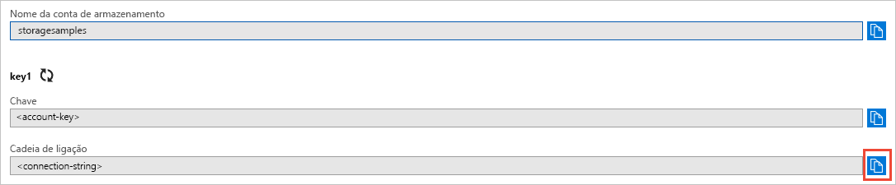

# <a name="quickstart-azure-blob-storage-client-library-v11-for-net"></a>Quickstart: Azure Blob storage client library v11 for .NET

Começa com a biblioteca de clientes Azure Blob Storage v11 para .NET. Azure Blob Storage é a solução de armazenamento de objetos da Microsoft para a nuvem. Siga as medidas para instalar a embalagem e experimente o código de exemplo para tarefas básicas. O armazenamento de blobs está otimizado para armazenar quantidades em grande escala de dados não estruturados.

> [!NOTE]
> Este quickstart usa uma versão antiga da biblioteca de clientes de armazenamento Azure Blob. Para começar com a versão mais recente, consulte [Quickstart: Azure Blob storage client library v12 for.NET](storage-quickstart-blobs-dotnet.md).

Utilize a biblioteca do cliente de armazenamento Azure Blob para .NET para:

* Criar um contentor
* Definir permissões num recipiente
* Criar uma bolha no Azure Storage
* Descarregue a bolha para o seu computador local
* Listar todas as bolhas em um recipiente
* Eliminar um contentor

Recursos adicionais:

* [Documentação de referência da API](/dotnet/api/overview/azure/storage)
* [Código fonte da biblioteca](https://github.com/Azure/azure-storage-net/tree/master/Blob)
* [Pacote (NuGet)](https://www.nuget.org/packages/Microsoft.Azure.Storage.Blob/)
* [Amostras](https://azure.microsoft.com/resources/samples/?sort=0&service=storage&platform=dotnet&term=blob)

[!INCLUDE [storage-multi-protocol-access-preview](../../../includes/storage-multi-protocol-access-preview.md)]

## <a name="prerequisites"></a>Pré-requisitos

* Azure subscrição - [crie uma gratuitamente](https://azure.microsoft.com/free/)
* Azure Storage account - [crie uma conta de armazenamento](../common/storage-account-create.md)
* Corrente [.NET Core SDK](https://dotnet.microsoft.com/download/dotnet-core) para o seu sistema operativo. Certifique-se de pegar o SDK e não o tempo de execução.

## <a name="setting-up"></a>Configuração

Esta secção acompanha-o através da preparação de um projeto para trabalhar com a biblioteca de clientes Azure Blob Storage para .NET.

### <a name="create-the-project"></a>Criar o projeto

Em primeiro lugar, crie uma aplicação .NET Core chamada *blob-quickstart*.

1. Numa janela de consola (como cmd, PowerShell ou Bash), utilize o `dotnet new` comando para criar uma nova aplicação de consola com o nome *blob-quickstart*. Este comando cria um projeto "Hello World" C# com um único ficheiro de origem: *Programa.cs*.

   ```console
   dotnet new console -n blob-quickstart
   ```

2. Mude para a pasta *blob-quickstart recém-criada* e construa a app para verificar se está tudo bem.

   ```console
   cd blob-quickstart
   ```

   ```console
   dotnet build
   ```

A produção esperada da construção deve ser algo assim:

```output
C:\QuickStarts\blob-quickstart> dotnet build
Microsoft (R) Build Engine version 16.0.450+ga8dc7f1d34 for .NET Core
Copyright (C) Microsoft Corporation. All rights reserved.

  Restore completed in 44.31 ms for C:\QuickStarts\blob-quickstart\blob-quickstart.csproj.
  blob-quickstart -> C:\QuickStarts\blob-quickstart\bin\Debug\netcoreapp2.1\blob-quickstart.dll

Build succeeded.
    0 Warning(s)
    0 Error(s)

Time Elapsed 00:00:03.08
```

### <a name="install-the-package"></a>Instale o pacote

Enquanto ainda está no diretório de aplicações, instale a biblioteca cliente de armazenamento Azure Blob para pacote .NET utilizando o `dotnet add package` comando.

```console
dotnet add package Microsoft.Azure.Storage.Blob
```

### <a name="set-up-the-app-framework"></a>Configurar o quadro de aplicações

Do diretório do projeto:

1. Abra o ficheiro *.cs Programa* no seu editor
2. Remova a `Console.WriteLine` declaração
3. Adicionar `using` diretivas
4. Crie um `ProcessAsync` método onde o código principal para o exemplo resida
5. Assíncronosamente chamar o `ProcessAsync` método de `Main`

Aqui está o código:

```csharp
using System;
using System.IO;
using System.Threading.Tasks;
using Microsoft.Azure.Storage;
using Microsoft.Azure.Storage.Blob;

namespace blob_quickstart
{
    class Program
    {
        public static async Task Main()
        {
            Console.WriteLine("Azure Blob Storage - .NET quickstart sample\n");

            await ProcessAsync();

            Console.WriteLine("Press any key to exit the sample application.");
            Console.ReadLine();
        }

        private static async Task ProcessAsync()
        {
        }
    }
}
```

### <a name="copy-your-credentials-from-the-azure-portal"></a>Copiar as credenciais do Portal do Azure

Quando o pedido de amostra fizer um pedido ao Azure Storage, deve ser autorizado. Para autorizar um pedido, adicione as credenciais da sua conta de armazenamento à aplicação como uma cadeia de ligação. Veja as credenciais da conta de armazenamento através dos seguintes passos:

1. Navegue até ao [portal Azure.](https://portal.azure.com)
2. Localize a sua conta de armazenamento.
3. Na secção **Definições** da descrição geral da conta de armazenamento, selecione **Chaves de acesso**. Aqui, pode ver as chaves de acesso da conta e a cadeia de ligação completa para cada chave.
4. Encontre o valor da **Cadeia de ligação** em **key1** e selecione o botão **Copiar** para copiar a cadeia de ligação. Irá adicionar o valor da cadeia de ligação para uma variável de ambiente no próximo passo.

    

### <a name="configure-your-storage-connection-string"></a>Configurar a cadeia de ligação de armazenamento

Após ter copiado a cadeia de ligação, escreva-a numa nova variável de ambiente no computador local que está a executar a aplicação. Para definir a variável de ambiente, abra uma janela da consola e siga as instruções relevantes para o seu sistema operativo. `<yourconnectionstring>`Substitua-a pela sua verdadeira cadeia de ligação.

#### <a name="windows"></a>Windows

```cmd
setx AZURE_STORAGE_CONNECTION_STRING "<yourconnectionstring>"
```

Depois de adicionar a variável ambiente no Windows, deve iniciar uma nova instância da janela de comando.

#### <a name="linux"></a>Linux

```bash
export AZURE_STORAGE_CONNECTION_STRING="<yourconnectionstring>"
```

#### <a name="macos"></a>MacOS

```bash
export AZURE_STORAGE_CONNECTION_STRING="<yourconnectionstring>"
```

Depois de adicionar a variável ambiental, reinicie todos os programas em execução que precisem de ler a variável ambiental. Por exemplo, reinicie o seu ambiente de desenvolvimento ou editor antes de continuar.

## <a name="object-model"></a>Modelo de objeto

O armazenamento Azure Blob está otimizado para armazenar quantidades massivas de dados não estruturados. Os dados não estruturados são dados que não seguem uma definição ou um modelo de dados em particular, como por exemplo, texto ou dados binários. O armazenamento blob oferece três tipos de recursos:

* A conta de armazenamento.
* Um recipiente na conta de armazenamento
* Uma bolha em um recipiente

O diagrama seguinte mostra a relação entre estes recursos.


Utilize as seguintes classes .NET para interagir com estes recursos:

* [CloudStorageAccount](/dotnet/api/microsoft.azure.storage.cloudstorageaccount): A `CloudStorageAccount` classe representa a sua conta de armazenamento Azure. Utilize esta classe para autorizar o acesso ao armazenamento blob utilizando as chaves de acesso à sua conta.
* [CloudBlobClient](/dotnet/api/microsoft.azure.storage.blob.cloudblobclient): A `CloudBlobClient` classe fornece um ponto de acesso ao serviço Blob no seu código.
* [CloudBlobContainer](/dotnet/api/microsoft.azure.storage.blob.cloudblobcontainer): A `CloudBlobContainer` classe representa um recipiente blob no seu código.
* [CloudBlockBlob](/dotnet/api/microsoft.azure.storage.blob.cloudblockblob): O `CloudBlockBlob` objeto representa uma bolha de bloco no seu código. Os blobs de blocos são constituídos por blocos de dados que podem ser geridos individualmente.

## <a name="code-examples"></a>Exemplos de código

Estes excertos de código de exemplo mostram-lhe como executar o seguinte com a biblioteca do cliente de armazenamento Azure Blob para .NET:

   * [Autenticar o cliente](#authenticate-the-client)
   * [Criar um contentor](#create-a-container)
   * [Definir permissões num recipiente](#set-permissions-on-a-container)
   * [Carregar bolhas para um recipiente](#upload-blobs-to-a-container)
   * [Listar os blobs num contentor](#list-the-blobs-in-a-container)
   * [Transferir blobs](#download-blobs)
   * [Eliminar um contentor](#delete-a-container)

### <a name="authenticate-the-client"></a>Autenticar o cliente

O código abaixo verifica se a variável ambiente contém uma cadeia de ligação que pode ser analisada para criar um objeto [CloudStorageAccount](/dotnet/api/microsoft.azure.storage.cloudstorageaccount) apontando para a conta de armazenamento. Para verificar se a cadeia de ligação é válida, utilize o método [TryParse](/dotnet/api/microsoft.azure.storage.cloudstorageaccount.tryparse). Se `TryParse` for bem sucedido, rubrica a `storageAccount` variável e devoluções `true` .

Adicione este código dentro do `ProcessAsync` método:

```csharp
// Retrieve the connection string for use with the application. The storage 
// connection string is stored in an environment variable on the machine 
// running the application called AZURE_STORAGE_CONNECTION_STRING. If the 
// environment variable is created after the application is launched in a 
// console or with Visual Studio, the shell or application needs to be closed
// and reloaded to take the environment variable into account.
string storageConnectionString = Environment.GetEnvironmentVariable("AZURE_STORAGE_CONNECTION_STRING");

// Check whether the connection string can be parsed.
CloudStorageAccount storageAccount;
if (CloudStorageAccount.TryParse(storageConnectionString, out storageAccount))
{
    // If the connection string is valid, proceed with operations against Blob
    // storage here.
    // ADD OTHER OPERATIONS HERE
}
else
{
    // Otherwise, let the user know that they need to define the environment variable.
    Console.WriteLine(
        "A connection string has not been defined in the system environment variables. " +
        "Add an environment variable named 'AZURE_STORAGE_CONNECTION_STRING' with your storage " +
        "connection string as a value.");
    Console.WriteLine("Press any key to exit the application.");
    Console.ReadLine();
}
```

> [!NOTE]
> Para efetuar o resto das operações neste artigo, substitua `// ADD OTHER OPERATIONS HERE` no código acima pelos cortes de código nas seguintes secções.

### <a name="create-a-container"></a>Criar um contentor

Para criar o contentor, primeiro crie uma instância do objeto [CloudBlobClient](/dotnet/api/microsoft.azure.storage.blob.cloudblobclient), que aponte para o Armazenamento de blobs na sua conta de armazenamento. Em seguida, crie uma instância do objeto [CloudBlobContainer](/dotnet/api/microsoft.azure.storage.blob.cloudblobcontainer) e depois crie o contentor.

Neste caso, o código chama o método [CreateAsync](/dotnet/api/microsoft.azure.storage.blob.cloudblobcontainer.createasync) para criar o recipiente. É anexado um valor GUID ao nome do contentor para garantir que é exclusivo. Num ambiente de produção, é muitas vezes preferível usar o método [CreateIfNotExistsAsync](/dotnet/api/microsoft.azure.storage.blob.cloudblobcontainer.createifnotexistsasync) para criar um recipiente apenas se não existir.

> [!IMPORTANT]
> Os nomes dos contentores têm de estar em minúscula. Para obter mais informações sobre a atribuição de nomes de contentores e blobs, veja [Nomenclatura e Referenciação de Contentores, Blobs e Metadados](/rest/api/storageservices/naming-and-referencing-containers--blobs--and-metadata).

```csharp
// Create the CloudBlobClient that represents the 
// Blob storage endpoint for the storage account.
CloudBlobClient cloudBlobClient = storageAccount.CreateCloudBlobClient();

// Create a container called 'quickstartblobs' and 
// append a GUID value to it to make the name unique.
CloudBlobContainer cloudBlobContainer = 
    cloudBlobClient.GetContainerReference("quickstartblobs" + 
        Guid.NewGuid().ToString());
await cloudBlobContainer.CreateAsync();
```

### <a name="set-permissions-on-a-container"></a>Definir permissões num recipiente

Deite permissões no recipiente de modo a que as bolhas no recipiente sejam públicas. Se um blob for público, pode ser acedido anonimamente por qualquer cliente.

```csharp
// Set the permissions so the blobs are public.
BlobContainerPermissions permissions = new BlobContainerPermissions
{
    PublicAccess = BlobContainerPublicAccessType.Blob
};
await cloudBlobContainer.SetPermissionsAsync(permissions);
```

### <a name="upload-blobs-to-a-container"></a>Carregar bolhas para um recipiente

O seguinte corte de código obtém uma referência a um `CloudBlockBlob` objeto chamando o método [GetBlockBlobReference](/dotnet/api/microsoft.azure.storage.blob.cloudblobcontainer.getblockblobreference) no recipiente criado na secção anterior. Em seguida, envia o ficheiro local selecionado para a bolha, chamando o método [UploadFromFileAsync.](/dotnet/api/microsoft.azure.storage.blob.cloudblockblob.uploadfromfileasync) Este método cria o blob, caso ainda não exista, ou substitui-o se o mesmo já existir.

```csharp
// Create a file in your local MyDocuments folder to upload to a blob.
string localPath = Environment.GetFolderPath(Environment.SpecialFolder.MyDocuments);
string localFileName = "QuickStart_" + Guid.NewGuid().ToString() + ".txt";
string sourceFile = Path.Combine(localPath, localFileName);
// Write text to the file.
File.WriteAllText(sourceFile, "Hello, World!");

Console.WriteLine("Temp file = {0}", sourceFile);
Console.WriteLine("Uploading to Blob storage as blob '{0}'", localFileName);

// Get a reference to the blob address, then upload the file to the blob.
// Use the value of localFileName for the blob name.
CloudBlockBlob cloudBlockBlob = cloudBlobContainer.GetBlockBlobReference(localFileName);
await cloudBlockBlob.UploadFromFileAsync(sourceFile);
```

### <a name="list-the-blobs-in-a-container"></a>Listar os blobs num contentor

Lista as bolhas no recipiente utilizando o método [ListBlobsSegmentedAsync.](/dotnet/api/microsoft.azure.storage.blob.cloudblobcontainer.listblobssegmentedasync) Neste caso, apenas uma bolha foi adicionada ao recipiente, pelo que a operação de listagem devolve apenas uma bolha.

Se houver demasiadas bolhas para retornar numa chamada (por defeito, mais de 5000), então o `ListBlobsSegmentedAsync` método devolve um segmento do conjunto de resultados total e um token de continuação. Para obter o segmento seguinte de blobs, indique o token de continuação devolvido pela chamada anterior e assim sucessivamente, até o token de continuação ser nulo. Um token de continuação nulo indica que foram obtidos todos os blobs. O código mostra como usar o símbolo de continuação para o bem das melhores práticas.

```csharp
// List the blobs in the container.
Console.WriteLine("List blobs in container.");
BlobContinuationToken blobContinuationToken = null;
do
{
    var results = await cloudBlobContainer.ListBlobsSegmentedAsync(null, blobContinuationToken);
    // Get the value of the continuation token returned by the listing call.
    blobContinuationToken = results.ContinuationToken;
    foreach (IListBlobItem item in results.Results)
    {
        Console.WriteLine(item.Uri);
    }
} while (blobContinuationToken != null); // Loop while the continuation token is not null.

```

### <a name="download-blobs"></a>Transferir blobs

Descarregue o blob criado anteriormente para o seu sistema de ficheiros local utilizando o método [DownloadToFileAsync.](/dotnet/api/microsoft.azure.storage.blob.cloudblob.downloadtofileasync) O código de exemplo adiciona um sufixo de "_DOWNLOADED" ao nome blob para que possa ver ambos os ficheiros no sistema de ficheiros local.

```csharp
// Download the blob to a local file, using the reference created earlier.
// Append the string "_DOWNLOADED" before the .txt extension so that you 
// can see both files in MyDocuments.
string destinationFile = sourceFile.Replace(".txt", "_DOWNLOADED.txt");
Console.WriteLine("Downloading blob to {0}", destinationFile);
await cloudBlockBlob.DownloadToFileAsync(destinationFile, FileMode.Create);
```

### <a name="delete-a-container"></a>Eliminar um contentor

O código seguinte limpa os recursos que a aplicação criou eliminando todo o contentor utilizando [o CloudBlobContainer.DeleteAsync](/dotnet/api/microsoft.azure.storage.blob.cloudblobcontainer.deleteasync). Se quiser, também pode eliminar os ficheiros locais.

```csharp
Console.WriteLine("Press the 'Enter' key to delete the example files, " +
    "example container, and exit the application.");
Console.ReadLine();
// Clean up resources. This includes the container and the two temp files.
Console.WriteLine("Deleting the container");
if (cloudBlobContainer != null)
{
    await cloudBlobContainer.DeleteIfExistsAsync();
}
Console.WriteLine("Deleting the source, and downloaded files");
File.Delete(sourceFile);
File.Delete(destinationFile);
```

## <a name="run-the-code"></a>Executar o código

Esta aplicação cria um ficheiro de teste na pasta *MyDocuments* local e envia-o para o armazenamento blob. O exemplo enumera então as bolhas no recipiente e descarrega o ficheiro com um novo nome para que possa comparar os ficheiros antigos e novos.

Navegue para o seu diretório de candidaturas, em seguida, construa e execute a aplicação.

```console
dotnet build
```

```console
dotnet run
```

A saída da app é semelhante ao seguinte exemplo:

```output
Azure Blob storage - .NET Quickstart example

Created container 'quickstartblobs33c90d2a-eabd-4236-958b-5cc5949e731f'

Temp file = C:\Users\myusername\Documents\QuickStart_c5e7f24f-a7f8-4926-a9da-96
97c748f4db.txt
Uploading to Blob storage as blob 'QuickStart_c5e7f24f-a7f8-4926-a9da-9697c748f
4db.txt'

Listing blobs in container.
https://storagesamples.blob.core.windows.net/quickstartblobs33c90d2a-eabd-4236-
958b-5cc5949e731f/QuickStart_c5e7f24f-a7f8-4926-a9da-9697c748f4db.txt

Downloading blob to C:\Users\myusername\Documents\QuickStart_c5e7f24f-a7f8-4926
-a9da-9697c748f4db_DOWNLOADED.txt

Press any key to delete the example files and example container.
```

Quando premir a tecla **Enter**, a aplicação elimina o contentor de armazenamento e os ficheiros. Antes de os eliminar, procure os dois ficheiros na pasta *MyDocuments*. Pode abri-los e constatar que são idênticos. Copie o URL do blob a partir da janela da consola e cole-o num browser para ver o conteúdo do blob.

Depois de verificar os ficheiros, prima qualquer tecla para concluir a demonstração e eliminar os ficheiros de teste.

## <a name="next-steps"></a>Passos seguintes

Neste início rápido, aprendeu a carregar, transferir e listar blobs com o .NET.

Para aprender a criar uma aplicação web que faz upload de uma imagem para o armazenamento blob, continue a:

> [!div class="nextstepaction"]
> [Carregar e processar imagens](storage-upload-process-images.md)

* Para saber mais sobre o .NET Core, veja [Introdução ao .NET em 10 minutos](https://www.microsoft.com/net/learn/get-started/).
* Para explorar uma aplicação de exemplo que pode implementar a partir do Visual Studio para Windows, veja [Exemplo de Aplicação Web de Galeria de Fotografias do .NET com o Armazenamento de Blobs do Azure](https://azure.microsoft.com/resources/samples/storage-blobs-dotnet-webapp/).