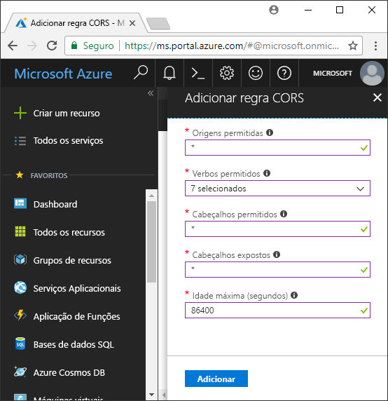

<!-- Customer intent: As a web application developer I want to interface with Azure Blob storage entirely on the client so that I can build a SPA application that is able to upload and delete files on blob storage. -->

# <a name="quickstart-upload-list-and-delete-blobs-using-azure-storage-v10-sdk-for-javascripthtml-in-the-browser"></a>Início rápido: Para carregar, listar e eliminar blobs com o SDK do armazenamento do Azure v10 para JavaScript/HTML no browser

Neste início rápido, irá aprender a utilizar o [V10 de SDK de armazenamento do Azure para JavaScript - Blob](https://github.com/Azure/azure-sdk-for-js/tree/master/sdk/storage/storage-blob#readme) biblioteca gerir blobs a partir do código JavaScript em execução integral no browser. A abordagem utilizada aqui mostra como utilizar as medidas de segurança necessárias para garantir acesso protegido para a sua conta do blob storage.

## <a name="prerequisites"></a>Pré-requisitos

[!INCLUDE [storage-quickstart-prereq-include](../../../includes/storage-quickstart-prereq-include.md)]

As bibliotecas de cliente JavaScript do armazenamento do Azure não irão funcionar diretamente a partir do sistema de arquivos e tem de ser fornecidas de um servidor web. Este tópico utiliza [node. js](https://nodejs.org) para iniciar um servidor básico. Se preferir não instalar o nó, pode utilizar qualquer outro meio da execução de um servidor local web.

Para seguir os passos sobre a depuração, precisará [Visual Studio Code](https://code.visualstudio.com) e o [depurador para o Chrome](vscode:extension/msjsdiag.debugger-for-chrome) ou [depurador para o Microsoft Edge](vscode:extension/msjsdiag.debugger-for-edge) extensão.

## <a name="setting-up-storage-account-cors-rules"></a>Configurar regras de CORS da conta de armazenamento

Antes de seu aplicativo web pode acessar um armazenamento de Blobs do cliente, tem de configurar sua conta para ativar [partilha de recursos de várias origens](https://docs.microsoft.com/rest/api/storageservices/cross-origin-resource-sharing--cors--support-for-the-azure-storage-services), ou CORS.

Regresse ao portal do Azure e selecione a sua conta de armazenamento. Para definir uma nova regra CORS, navegue para o **definições** secção e clique nas **CORS** ligação. Em seguida, clique no botão **Adicionar** para abrir a janela **Adicionar regra de CORS**. Neste início rápido, vai criar uma regra CORS aberta:



A tabela seguinte descreve cada definição de CORS e explica os valores utilizados para definir a regra.

|Definição  |Valor  | Descrição |
|---------|---------|---------|
| Origens permitidas | * | Aceita uma lista delimitada por vírgulas de domínios definidos como origens aceitáveis. Definir o valor como `*` permite que todos os domínios acedam à conta de armazenamento. |
| Verbos permitidos     | delete, get, head, merge, post, options, and put | Apresenta uma lista dos verbos HTTP que podem ser executados na conta de armazenamento. Para efeitos deste início rápido, selecione todas as opções disponíveis. |
| Cabeçalhos permitidos | * | Define uma lista de cabeçalhos de pedidos (incluindo cabeçalhos com prefixo) que a conta de armazenamento permite. Definir o valor como `*` permite acesso a todos os cabeçalhos. |
| Cabeçalhos expostos | * | Apresenta uma lista dos cabeçalhos de resposta que a conta permite. Definir o valor como `*` permite à conta enviar qualquer cabeçalho.  |
| Idade máxima (segundos) | 86400 | O período máximo de tempo que o browser coloca em cache o pedido OPTIONS de validação prévia. Um valor de *86400* permite que a cache permaneça por um dia completo. |

> [!IMPORTANT]
> Certifique-se de que as definições que utilizar na produção expõem a quantidade mínima de acesso necessário à sua conta de armazenamento para manter o acesso seguro. As definições de CORS descritas aqui são adequadas para um início rápido, porque definem uma política de segurança permissiva. No entanto, não são recomendadas para um contexto do mundo real.

Em seguida, vai utilizar o Azure Cloud Shell para criar um token de segurança.

[!INCLUDE [Open the Azure cloud shell](../../../includes/cloud-shell-try-it.md)]

## <a name="create-a-shared-access-signature"></a>Criar uma assinatura de acesso partilhado

A assinatura de acesso partilhado (SAS) é utilizada pelo código em execução no browser para autorizar pedidos ao armazenamento de Blobs. Ao utilizar o SAS, o cliente pode autorizar o acesso aos recursos de armazenamento sem a chave de acesso da conta ou sem a cadeia de ligação. Para obter mais informações, veja [Using shared access signatures (SAS)](../common/storage-dotnet-shared-access-signature-part-1.md) (Utilizar assinaturas de acesso partilhado [SAS]).

Pode criar uma SAS com a CLI do Azure através do Azure cloud shell, ou com o portal do Azure ou o Explorador de armazenamento do Azure. A tabela seguinte descreve os parâmetros, que tem de fornecer valores para gerar uma SAS com a CLI.

| Parâmetro      |Descrição  | Marcador de posição |
|----------------|-------------|-------------|
| *expiry* (expira)       | A data de expiração do token de acesso no formato AAAA-MM-DD. Introduza a data de amanhã para utilização neste início rápido. | *FUTURE_DATE* (data futura) |
| *account-name* (nome da conta) | O nome da conta de armazenamento. Utilize o nome colocado de parte num passo anterior. | *YOUR_STORAGE_ACCOUNT_NAME* (nome da conta de armazenamento) |
| *account-key* (chave da conta)  | A chave da conta de armazenamento. Utilize a chave colocada de parte num passo anterior. | *YOUR_STORAGE_ACCOUNT_KEY* (chave da conta de armazenamento) |

Utilize o seguinte comando da CLI, com valores reais para cada marcador de posição para gerar uma SAS que pode usar em seu código JavaScript.

```azurecli-interactive
az storage account generate-sas \
  --permissions racwdl \
  --resource-types sco \
  --services b \
  --expiry FUTURE_DATE \
  --account-name YOUR_STORAGE_ACCOUNT_NAME \
  --account-key YOUR_STORAGE_ACCOUNT_KEY
```

Poderá achar que as séries de valores a seguir a cada parâmetro são algo crípticas. Estes valores de parâmetros são obtidos a partir da primeira letra da respetiva permissão. A tabela seguinte explica a proveniência dos valores:

| Parâmetro        | Value   | Descrição  |
|------------------|---------|---------|
| *permissões* (permissões)    | racwdl  | Esta SAS permite capacidades de *leitura*, *acrescento*, *criação*, *escrita*, *eliminação* e *listagem*. |
| *resource-types* (tipos de recursos) | sco     | Os recursos que a SAS afeta são *serviço*, *contentor* e *objeto*. |
| *services* (serviços)       | b       | O serviço que a SAS afeta é o serviço de *blobs*. |

Agora que a SAS foi gerada, copie o valor de retorno e guarde-o num local para utilização num passo posterior. Se para gerar a SAS através de um método que não seja a CLI do Azure, terá de remover inicial `?` se estiver presente. Esse caractere é um separador de URL que já é fornecido no modelo de URL mais tarde deste tópico em que a SAS é usada.

> [!IMPORTANT]
> Na produção, transmita sempre tokens os SAS através de SSL. Além disso, os tokens SAS devem gerados no servidor e enviados para a página HTML, de modo a serem transmitidos novamente para o Armazenamento de Blobs do Azure. Uma abordagem que pode considerar passa por utilizar uma função sem servidor para gerar os tokens SAS. O portal do Azure inclui modelos de funções que têm a capacidade de gerar um SAS com uma função de JavaScript.

## <a name="implement-the-html-page"></a>Implementar a página HTML

Nesta secção, irá criar uma página da web básico e configurar o VS Code para iniciar e depurar a página. Antes de pode iniciar, no entanto, terá de utilizar o node. js para iniciar um servidor local web e servir a página quando o seu browser solicita-lo. Em seguida, adicionará código JavaScript ao chamar várias APIs de armazenamento de BLOBs e exibir os resultados na página. Também pode ver os resultados dessas chamadas no [portal do Azure](https://portal.azure.com), [Explorador de armazenamento do Azure](https://azure.microsoft.com/features/storage-explorer)e o [extensão do armazenamento do Azure](vscode:extension/ms-azuretools.vscode-azurestorage) para o VS Code.

### <a name="set-up-the-web-application"></a>Configurar a aplicação Web

Primeiro, crie uma nova pasta chamada *azure-blobs-javascript* e abra-o no VS Code. Em seguida, crie um novo ficheiro no VS Code, adicione o seguinte HTML e guarde-o como *Index. HTML* no *do azure-blobs-javascript* pasta.

```html
<!DOCTYPE html>
<html>

<body>
    <button id="create-container-button">Create container</button>
    <button id="delete-container-button">Delete container</button>
    <button id="select-button">Select and upload files</button>
    <input type="file" id="file-input" multiple style="display: none;" />
    <button id="list-button">List files</button>
    <button id="delete-button">Delete selected files</button>
    <p><b>Status:</b></p>
    <p id="status" style="height:160px; width: 593px; overflow: scroll;" />
    <p><b>Files:</b></p>
    <select id="file-list" multiple style="height:222px; width: 593px; overflow: scroll;" />
</body>

<!-- You'll add code here later in this quickstart. -->

</html>
```

### <a name="configure-the-debugger"></a>Configurar o depurador

Para configurar a extensão de depurador no VS Code, selecione **depurar > Configuração de adicionar...** , em seguida, selecione **Chrome** ou **Edge**, dependendo de qual extensão instalada anteriormente na secção pré-requisitos. Esta ação cria um *Launch* de ficheiros e abre-o no editor.

Em seguida, modifique o *Launch* ficheiro para que o `url` valor inclui `/index.html` conforme mostrado:

```json
{
    // Use IntelliSense to learn about possible attributes.
    // Hover to view descriptions of existing attributes.
    // For more information, visit: https://go.microsoft.com/fwlink/?linkid=830387
    "version": "0.2.0",
    "configurations": [
        {
            "type": "chrome",
            "request": "launch",
            "name": "Launch Chrome against localhost",
            "url": "http://localhost:8080/index.html",
            "webRoot": "${workspaceFolder}"
        }
    ]
}
```

Esta configuração informa o VS Code, o browser para iniciar e o URL para carregar.

### <a name="launch-the-web-server"></a>Iniciar o servidor web

Para iniciar o servidor de web de node. js local, selecione **vista > Terminal** para abrir uma janela de consola no interior do VS Code, em seguida, introduza o seguinte comando.

```console
npx http-server
```

Este comando irá instalar o *http-server* do pacote e iniciar o servidor, que cria a pasta atual disponível através de URLs predefinidos incluindo aquela indicada no passo anterior.

### <a name="start-debugging"></a>Iniciar a depuração

Para iniciar *Index. HTML* no browser com o depurador do VS Code anexado, selecione **depurar > Iniciar depuração** ou prima F5 no VS Code.

A interface do Usuário exibida ainda não faz nada, mas adicionará código JavaScript na seção a seguir para implementar cada função mostrada. Em seguida, pode definir pontos de interrupção e interagir com o depurador quando foi colocado em pausa em seu código.

Quando são efetuadas alterações ao *Index*, certifique-se de que recarregue a página para ver as alterações no navegador. No VS Code, também pode selecionar **depurar > reinicie depuração** ou prima CTRL + SHIFT + F5.

### <a name="add-the-blob-storage-client-library"></a>Adicionar a biblioteca de cliente de armazenamento de BLOBs

Para ativar chamadas para o armazenamento de BLOBs API, primeiro [transferir o SDK de armazenamento do Azure para JavaScript - biblioteca de cliente de Blob](https://aka.ms/downloadazurestoragejsblob), extraia os conteúdos do zip e coloque o *azure storage.blob.js* ficheiro no *azure-blobs-javascript* pasta.

Em seguida, cole o seguinte HTML em *Index. HTML* depois do `</body>` marca de fechamento, substituindo o comentário de marcador de posição.

```html
<script src="azure-storage.blob.js" charset="utf-8"></script>

<script>
// You'll add code here in the following sections.
</script>
```

Este código adiciona uma referência para o ficheiro de script e fornece um local para o seu próprio código JavaScript. Para efeitos deste início rápido, estamos a utilizar o *azure-storage.blob.js* ficheiro de script para que possa abri-lo no VS Code, ler seu conteúdo e defina pontos de interrupção. Na produção, deve usar o mais compacto *azure-storage.blob.min.js* ficheiro que também é fornecido no ficheiro zip.

Pode encontrar mais informações sobre cada função de armazenamento de BLOBs no [documentação de referência](https://docs.microsoft.com/javascript/api/%40azure/storage-blob/index). Tenha em atenção que algumas das funções no SDK só estão disponíveis em node. js ou disponível apenas no browser.

O código na *azure-storage.blob.js* exporta uma variável global chamada `azblob`, que irá utilizar no seu código JavaScript para aceder a APIs de armazenamento de Blobs.

### <a name="add-the-initial-javascript-code"></a>Adicione o código JavaScript inicial

Em seguida, cole o código seguinte para o `<script>` mostrado no bloco de código anterior, substituindo o comentário de marcador de posição do elemento.

```javascript
const createContainerButton = document.getElementById("create-container-button");
const deleteContainerButton = document.getElementById("delete-container-button");
const selectButton = document.getElementById("select-button");
const fileInput = document.getElementById("file-input");
const listButton = document.getElementById("list-button");
const deleteButton = document.getElementById("delete-button");
const status = document.getElementById("status");
const fileList = document.getElementById("file-list");

const reportStatus = message => {
    status.innerHTML += `${message}<br/>`;
    status.scrollTop = status.scrollHeight;
}
```

Este código cria campos para cada elemento HTML que irá utilizar o seguinte código e implementa um `reportStatus` função para apresentar os resultados.

Nas seções a seguir, adicione cada novo bloco de código JavaScript depois do bloco anterior.

### <a name="add-your-storage-account-info"></a>Adicionar as suas informações de conta de armazenamento

Em seguida, adicione o código para aceder à sua conta de armazenamento, substituindo os marcadores de posição pelo nome da sua conta e a SAS gerada num passo anterior.

```javascript
const accountName = "<Add your storage account name>";
const sasString = "<Add the SAS you generated earlier>";
const containerName = "testcontainer";
const containerURL = new azblob.ContainerURL(
    `https://${accountName}.blob.core.windows.net/${containerName}?${sasString}`,
    azblob.StorageURL.newPipeline(new azblob.AnonymousCredential)));
```

Esse código usa suas informações da conta e a SAS para criar uma [ContainerURL](https://docs.microsoft.com/javascript/api/@azure/storage-blob/ContainerURL) instância, o que é útil para criar e manipular um contentor de armazenamento.

### <a name="create-and-delete-a-storage-container"></a>Criar e eliminar um contentor de armazenamento

Em seguida, adicione o código para criar e eliminar o contentor de armazenamento, quando pressiona o botão correspondente.

```javascript
const createContainer = async () => {
    try {
        reportStatus(`Creating container "${containerName}"...`);
        await containerURL.create(azblob.Aborter.none);
        reportStatus(`Done.`);
    } catch (error) {
        reportStatus(error.body.message);
    }
};

const deleteContainer = async () => {
    try {
        reportStatus(`Deleting container "${containerName}"...`);
        await containerURL.delete(azblob.Aborter.none);
        reportStatus(`Done.`);
    } catch (error) {
        reportStatus(error.body.message);
    }
};

createContainerButton.addEventListener("click", createContainer);
deleteContainerButton.addEventListener("click", deleteContainer);
```

Esse código chama o ContainerURL [crie](https://docs.microsoft.com/javascript/api/@azure/storage-blob/ContainerURL#create-aborter--icontainercreateoptions-) e [eliminar](https://docs.microsoft.com/javascript/api/@azure/storage-blob/ContainerURL#delete-aborter--icontainerdeletemethodoptions-) funções sem utilizar um [Aborter](https://docs.microsoft.com/javascript/api/@azure/storage-blob/aborter) instância. Para simplificar as coisas para este início rápido, esse código supõe que a sua conta de armazenamento foi criada e está ativada. No código de produção, utilize uma instância de Aborter para adicionar a funcionalidade de tempo limite.

### <a name="list-blobs"></a>Listar blobs

Em seguida, adicione o código para listar o conteúdo do contentor de armazenamento, quando pressiona o **listar ficheiros** botão.

```javascript
const listFiles = async () => {
    fileList.size = 0;
    fileList.innerHTML = "";
    try {
        reportStatus("Retrieving file list...");
        let marker = undefined;
        do {
            const listBlobsResponse = await containerURL.listBlobFlatSegment(
                azblob.Aborter.none, marker);
            marker = listBlobsResponse.nextMarker;
            const items = listBlobsResponse.segment.blobItems;
            for (const blob of items) {
                fileList.size += 1;
                fileList.innerHTML += `<option>${blob.name}</option>`;
            }
        } while (marker);
        if (fileList.size > 0) {
            reportStatus("Done.");
        } else {
            reportStatus("The container does not contain any files.");
        }
    } catch (error) {
        reportStatus(error.body.message);
    }
};

listButton.addEventListener("click", listFiles);
```

Esse código chama o [ContainerURL.listBlobFlatSegment](https://docs.microsoft.com/javascript/api/@azure/storage-blob/ContainerURL#listblobflatsegment-aborter--string--icontainerlistblobssegmentoptions-) função num loop para se certificar de que todos os segmentos são obtidos. Para cada segmento, ele faz um loop sobre a lista de itens de blob contém e atualiza a **ficheiros** lista.

### <a name="upload-blobs"></a>Carregar blobs

Em seguida, adicione o código para carregar ficheiros para o contentor de armazenamento, quando pressiona o **selecionar e carregar arquivos** botão.

```javascript
const uploadFiles = async () => {
    try {
        reportStatus("Uploading files...");
        const promises = [];
        for (const file of fileInput.files) {
            const blockBlobURL = azblob.BlockBlobURL.fromContainerURL(containerURL, file.name);
            promises.push(azblob.uploadBrowserDataToBlockBlob(
                azblob.Aborter.none, file, blockBlobURL));
        }
        await Promise.all(promises);
        reportStatus("Done.");
        listFiles();
    } catch (error) {
        reportStatus(error.body.message);
    }
}

selectButton.addEventListener("click", () => fileInput.click());
fileInput.addEventListener("input", uploadFiles);
```

Este código liga-se a **selecionar e carregar ficheiros** botão para o ocultos `file-input` elemento. Dessa forma, o botão `click` evento aciona a entrada de ficheiro `click` eventos e apresenta o Seletor de ficheiros. Depois de selecionar os ficheiros e fechar a caixa de diálogo, o `input` evento ocorre e o `uploadFiles` função é chamada. Essa função chama o navegador só [uploadBrowserDataToBlockBlob](https://docs.microsoft.com/javascript/api/@azure/storage-blob/#uploadbrowserdatatoblockblob-aborter--blob---arraybuffer---arraybufferview--blockbloburl--iuploadtoblockbloboptions-) função para cada ficheiro que selecionou. Cada chamada retorna uma promessa, que é adicionada a uma lista para que eles podem todos ser colocadas em espera ao mesmo tempo, fazendo com que os ficheiros carregar em paralelo.

### <a name="delete-blobs"></a>Eliminar blobs

Em seguida, adicione o código para eliminar os ficheiros do contentor de armazenamento, quando pressiona o **eliminar ficheiros selecionados** botão.

```javascript
const deleteFiles = async () => {
    try {
        if (fileList.selectedOptions.length > 0) {
            reportStatus("Deleting files...");
            for (const option of fileList.selectedOptions) {
                const blobURL = azblob.BlobURL.fromContainerURL(containerURL, option.text);
                await blobURL.delete(azblob.Aborter.none);
            }
            reportStatus("Done.");
            listFiles();
        } else {
            reportStatus("No files selected.");
        }
    } catch (error) {
        reportStatus(error.body.message);
    }
};

deleteButton.addEventListener("click", deleteFiles);
```

Esse código chama o [BlobURL.delete](https://docs.microsoft.com/javascript/api/@azure/storage-blob/BlobURL#delete-aborter--iblobdeleteoptions-) para remover cada ficheiro selecionado na lista. Em seguida, chama o `listFiles` função mostrada anteriormente para atualizar o conteúdo do **arquivos** lista.

### <a name="run-and-test-the-web-application"></a>Executar e testar a aplicação web

Neste ponto, pode iniciar a página e a experimentação para ter uma noção sobre como funciona o armazenamento de Blobs. Se ocorrerem erros (por exemplo, quando tentar para listar ficheiros antes de criar o contentor), o **estado** painel apresentará a mensagem de erro recebida. Também pode definir pontos de interrupção no código JavaScript para examinar os valores devolvidos por das APIs de armazenamento.

## <a name="clean-up-resources"></a>Limpar recursos

Para limpar os recursos criados durante este início rápido, vá para o [portal do Azure](https://portal.azure.com) e elimine o grupo de recursos que criou na secção pré-requisitos.

## <a name="next-steps"></a>Passos Seguintes

Neste início rápido, criou um Web site simples que acessos blob de armazenamento a partir de JavaScript baseadas no browser. Para saber como pode alojar um Web site em si no armazenamento de BLOBs, avance para o tutorial seguinte:

> [!div class="nextstepaction"]
> [Alojar um Web site estático no armazenamento de BLOBs](https://docs.microsoft.com/azure/storage/blobs/storage-blob-static-website-host)
