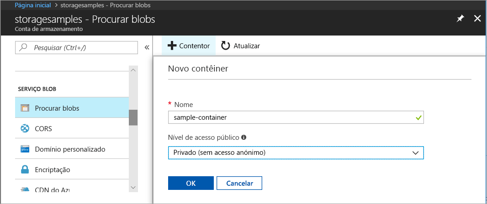
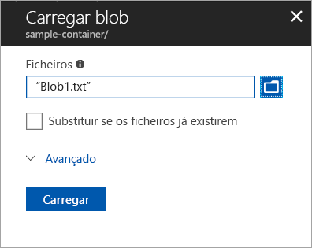
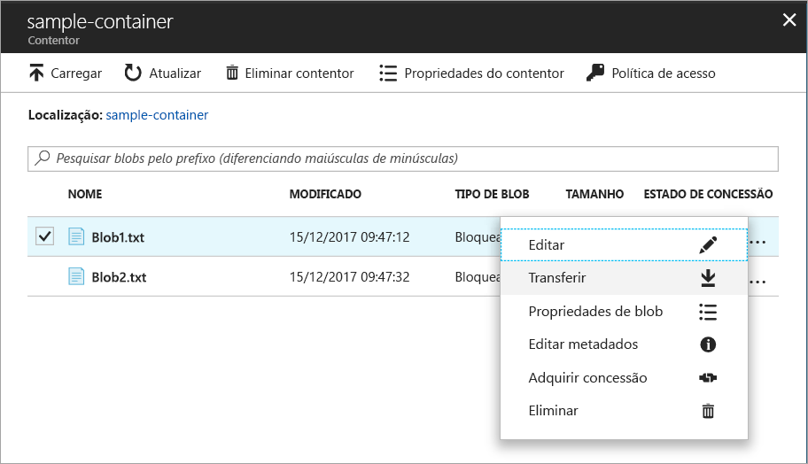

# Início Rápido: carregar, transferir e listar blobs com o portal do Azure

Neste guia de introdução, irá aprender a utilizar o [portal do Azure](https://portal.azure.com/) para criar um contentor no Armazenamento do Azure e para carregar e transferir blobs de blocos nesse contentor.

## Pré-requisitos

[!INCLUDE [storage-quickstart-prereq-include](../../../includes/storage-quickstart-prereq-include.md)]

## Criar um contentor

Para criar um contentor no portal do Azure, siga estes passos:

1. No portal do Azure, navegue para a sua nova conta de armazenamento.
2. No menu esquerdo para a conta de armazenamento, percorra a secção **de serviço Blob** e, em seguida, selecione **Recipientes**.
3. Selecione o botão **+ Contentor**.
4. Escreva um nome para o novo contentor. O nome do contentor tem estar em minúsculas, tem de começar com uma letra ou um número e só pode incluir letras, números e o caráter de travessão (-). Para obter mais informações sobre os nomes dos recipientes e blobs, consulte [o nome e os recipientes de referência, bolhas e metadados.](https://docs.microsoft.com/rest/api/storageservices/naming-and-referencing-containers--blobs--and-metadata)
5. Defina o nível de acesso público ao contentor. O nível predefinido é **Privado (sem acesso anónimo)**.
6. Selecione **OK** para criar o contentor.

    

## Carregar um blob de blocos

Os blobs de blocos são compostos por blocos de dados reunidos para criar um blob. A maioria dos cenários com o armazenamento de Blobs emprega blobs de blocos. Os blobs de blocos são ideais para armazenar dados de texto e binários na cloud, como ficheiros, imagens e vídeos. Este guia de introdução mostra como trabalhar com blobs de blocos.

Para carregar um blob de blocos para o novo contentor no portal do Azure, siga estes passos:

1. No portal do Azure, navegue para o contentor que criou na secção anterior.
1. Selecione o contentor para mostrar uma lista dos blobs que ele contém. Este contentor é novo, por isso ainda não contém bolhas.
1. Selecione o botão **Upload** para abrir a lâmina de upload e navegue no seu sistema de ficheiros local para encontrar um ficheiro para carregar como uma bolha de bloco. Pode expandir opcionalmente a secção **Advanced** para configurar outras definições para a operação de upload.

    

1. Selecione o botão **Upload** para carregar a bolha.
1. Carregue os blobs que quiser desta forma. Verá que os novos blobs estão agora listados no contentor.

## Transferir um blob de blocos

Pode transferir um blob de blocos para apresentar no browser ou guardar no seu sistema de ficheiros local. Para transferir um blob de blocos, siga estes passos:

1. Navegue para a lista de blobs que carregou na secção anterior.
1. Clique com o botão direito do rato no blob que pretende transferir e selecione **Transferir**.

    

## Apagar uma bolha de bloco

Pode transferir um blob de blocos para apresentar no browser ou guardar no seu sistema de ficheiros local. Para transferir um blob de blocos, siga estes passos:

1. Navegue para a lista de blobs que carregou na secção anterior.
1. Selecione as bolhas que pretende eliminar e selecione **Eliminar** na barra de ação superior.

## Limpar recursos

Para remover todos os recursos que criou neste arranque rápido, pode simplesmente apagar o recipiente. Todos os blobs no contentor também serão eliminados.

Para eliminar o contentor:

1. No portal do Azure, navegue para a lista de contentores na sua conta de armazenamento.
1. Selecione o contentor a eliminar.
1. Selecione o botão **Mais** (**... **) e selecione **Eliminar**.
1. Certifique-se de que pretende eliminar o contentor.

## Passos seguintes

Neste início rápido, aprendeu a transferir ficheiros entre um disco local e o armazenamento de Blobs do Azure com o portal do Azure. Para saber mais sobre a utilização do armazenamento de Blobs, avance para os procedimentos do armazenamento de blobs.

> [!div class="nextstepaction"]
> [Procedimentos de Operações de Armazenamento de Blobs](storage-dotnet-how-to-use-blobs.md)
