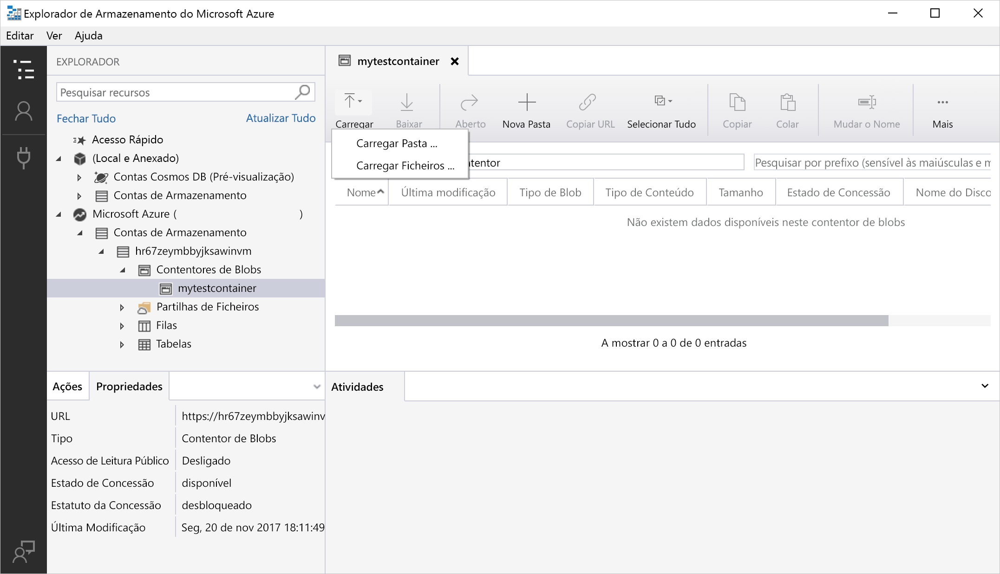
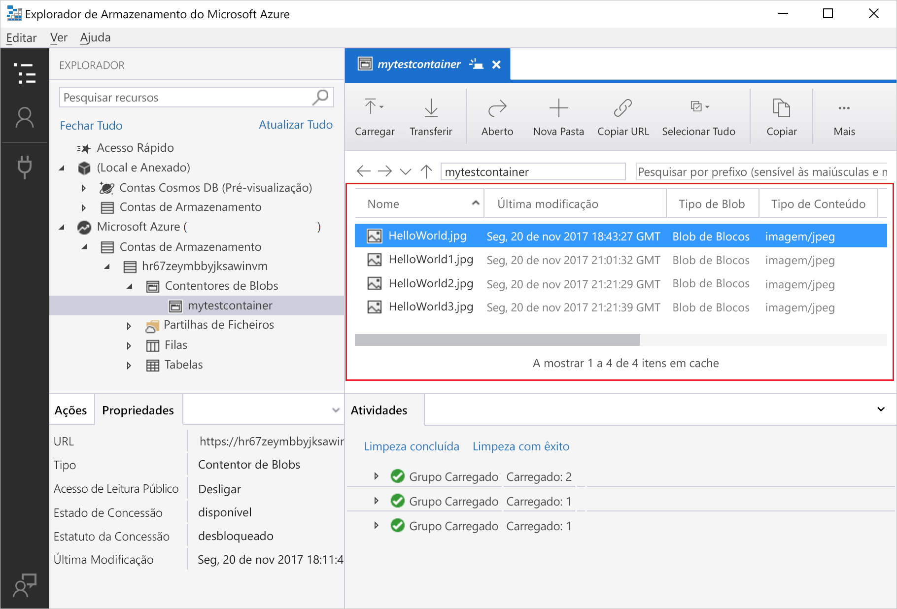
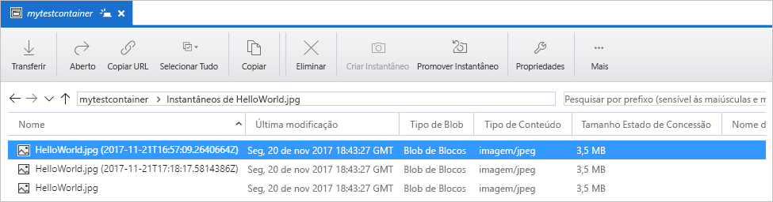
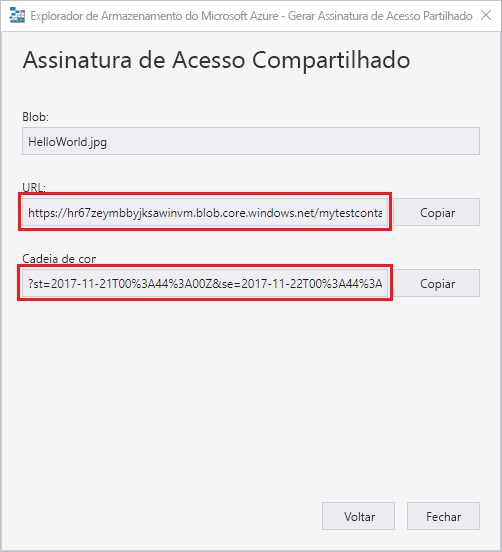

# Quickstart: Use o Azure Storage Explorer para criar uma bolha

Neste arranque rápido, aprende-se a usar [o Azure Storage Explorer](https://azure.microsoft.com/features/storage-explorer/) para criar um recipiente e uma bolha. Em seguida, vai aprender como transferir o blob para o computador local e como visualizar todos os blobs num contentor. Também vai aprender a criar um instantâneo de um blob, gerir políticas de acesso do contentor e a criar uma assinatura de acesso partilhado.

## Pré-requisitos

[!INCLUDE [storage-quickstart-prereq-include](../../../includes/storage-quickstart-prereq-include.md)]

Este início rápido requer que instale o Explorador de Armazenamento do Azure. Para instalar o Explorador de Armazenamento do Azure para Windows, Macintosh ou Linux, consulte [Explorador de Armazenamento do Azure](https://azure.microsoft.com/features/storage-explorer/).

## Iniciar sessão no Explorador de Armazenamento

Na primeira execução, é mostrada a janela **Explorador de Armazenamento do Microsoft Azure – Ligar**. O Explorador de Armazenamento proporciona várias formas de ligar a contas de armazenamento. A tabela seguinte lista as diferentes formas de ligação:

|Tarefa|Objetivo|
|---|---|
|Adicionar uma Conta do Azure | Redireciona-o para a página de inscrição da sua organização para autenticá-lo para Azure. |
|Utilizar uma cadeia de ligação ou um URI de assinatura de acesso partilhado | Pode ser utilizado para aceder diretamente a um contentor ou conta de armazenamento com um token SAS ou uma cadeia de ligação partilhada. |
|Utilizar o nome e a chave de uma conta de armazenamento| Utilize o nome e a chave da conta de armazenamento para ligar ao armazenamento do Azure.|

**Selecione Adicionar uma Conta Azure** e clique em Iniciar **sôm.** Siga as instruções no ecrã para iniciar súm na sua conta Azure.

Quando a ligação for concluída, o Explorador de Armazenamento do Azure é carregado com o separador **Explorador** mostrado. Esta vista dá-lhe uma visão de todas as suas contas de armazenamento Azure, bem como armazenamento local configurado através do [emulador de armazenamento Azurite,](../common/storage-use-azurite.md?toc=%2fazure%2fstorage%2fblobs%2ftoc.json) [contas cosmos DB](../../cosmos-db/storage-explorer.md?toc=%2fazure%2fstorage%2fblobs%2ftoc.json) ou ambientes [Azure Stack.](/azure-stack/user/azure-stack-storage-connect-se?toc=%2fazure%2fstorage%2fblobs%2ftoc.json)

## Criar um contentor

Os Blobs são sempre carregados para um contentor. Isto permite organizar grupos de blobs, como organiza os ficheiros em pastas no seu computador.

Para criar um contentor, expanda a conta de armazenamento que criou no passo seguinte. Selecione **Contentores de Blobs**, clique com o botão direito do rato e selecione **Criar Contentor de Blobs**. Introduza o nome do contentor de blobs. Consulte a secção [De Um recipiente](storage-quickstart-blobs-dotnet.md#create-a-container) para obter uma lista de regras e restrições sobre o nome de recipientes de bolhas. Quando terminar, prima **Enter** para criar o contentor de blobs. Depois de o contentor de blobs ser criado com êxito, será apresentado na pasta **Contentores de Blobs** da conta de armazenamento selecionada.

## Carregar blobs para o contentor

O armazenamento de blobs suporta blobs de blocos, blobs de acréscimo e blobs de páginas. Os ficheiros VHD utilizados nas cópias de segurança de VMs IaaS são blobs de páginas. Os blobs de acréscimo servem para registo, como quando quer escrever num ficheiro e continuar a adicionar mais informações. A maioria dos ficheiros guardados no armazenamento de Blobs são blobs de blocos.

No friso do contentor, selecione **Carregar**. Esta operação dá-lhe a opção de carregar uma pasta ou um ficheiro.

Escolha os ficheiros ou pasta a carregar. Selecione o **tipo de blob**. As opções aceitáveis são **Anexar**, **Página** ou **Blob de blocos**.

Se carregar um ficheiro .vhd ou .vhdx, selecione **Carregar ficheiros .vhd/.vhdx como blobs de páginas (recomendado)**.

No campo **Carregar para pasta (opcional)**, selecione o nome de uma pasta para armazenar os ficheiros ou pastas numa pasta no contentor. Se não for escolhida nenhuma pasta, os ficheiros são carregados diretamente no contentor.

Quando seleciona **OK**, os ficheiros selecionados são colocados em fila para carregamento. Quando o carregamento estiver concluído, os resultados são apresentados na janela **Atividades**.

## Ver blobs num contentor

Na aplicação **Explorador de Armazenamento do Azure**, selecione um contentor numa conta de armazenamento. O painel principal apresenta uma lista dos blobs no contentor selecionado.

## Transferir blobs

Para transferir blobs através do **Explorador de Armazenamento do Azure**, com um blob selecionado, selecione **Transferir** no friso. É aberta uma caixa de diálogo de ficheiro que lhe permite introduzir um nome de ficheiro. Selecione **Guardar** para iniciar a transferência de um blob para a localização local.

## Gerir instantâneos

O Explorador de Armazenamento do Azure permite criar e gerir [instantâneos](./snapshots-overview.md) dos blobs. Para criar um instantâneo de um blob, clique com o botão direito do rato no blob e selecione **Criar Instantâneo**. Para ver os instantâneos de um blob, clique com o botão direito do rato no blob e selecione **Gerir Instantâneos**. É apresentada uma lista dos instantâneos do blob no separador atual.

## Gerir políticas de acesso

O Explorador de Armazenamento permite gerir políticas de acesso para contentores na respetiva interface de utilizador. Existem dois tipos de políticas de acesso seguro (SAS), nível de serviço e nível de conta. A SAS de nível de conta destina-se à conta de armazenamento e pode aplicar-se a vários serviços e recursos. A SAS de nível de serviço é definida num recurso de um serviço específico. Para gerar um nível de serviço SAS, clique com o botão direito em qualquer recipiente e selecione **Gerir políticas de acesso...**. Para gerar um nível de conta SAS, clique com o botão direito na conta de armazenamento.

Selecione **Adicionar** para adicionar uma nova política de acesso e definir as permissões para a política. Quando terminar, selecione **Guardar** para guardar a política de acesso. Esta política está agora disponível para utilização quando configurar uma Assinatura de Acesso Partilhado.

## Utilizar Assinaturas de Acesso Partilhado

As Assinaturas de Acesso Partilhado (SAS) podem ser obtidas através do Explorador de Armazenamento. Clique com o botão direito numa conta de armazenamento, num recipiente ou numa bolha e escolha **Obter Assinatura de Acesso Partilhado...**. Escolha o tempo de início e expiração e permissões para o URL SAS e selecione **Criar**. O URL completo com a cadeia de consulta, bem como a cadeia de consulta por si só, são fornecidas e podem ser copiadas a partir do ecrã seguinte.

## Passos seguintes

Neste início rápido, aprendeu a transferir ficheiros entre um disco local e o armazenamento de Blobs do Azure através do **Explorador de Armazenamento do Azure**. Para saber mais sobre a utilização do armazenamento de Blobs, avance para os procedimentos do armazenamento de blobs.

> [!div class="nextstepaction"]
> [Procedimentos de Operações de Armazenamento de Blobs](./storage-quickstart-blobs-powershell.md)