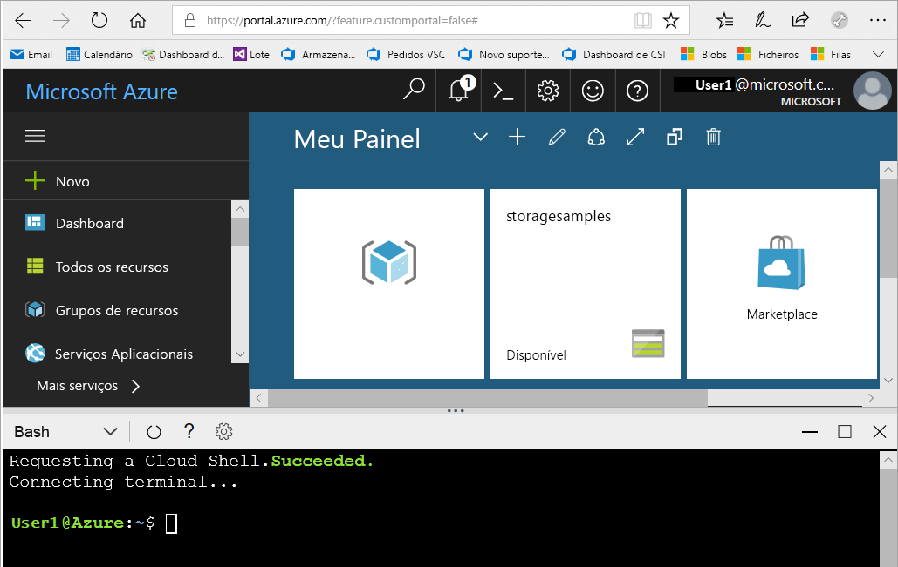

# <a name="create-a-storage-account"></a>Criar uma conta de armazenamento

Uma conta de armazenamento Azure contém todos os seus objetos de dados de armazenamento Azure: bolhas, ficheiros, filas, tabelas e discos. A conta de armazenamento fornece um espaço de nome único para os seus dados de Armazenamento Azure que estão acessíveis a partir de qualquer parte do mundo em HTTP ou HTTPS. Os dados na sua conta de armazenamento Azure são duráveis e altamente disponíveis, seguros e massivamente escaláveis.

Neste artigo de como fazer, aprende-se a criar uma conta de armazenamento utilizando o [portal Azure](https://portal.azure.com/) [, Azure PowerShell,](/powershell/azure/) [Azure CLI,](/cli/azure)ou um [modelo Azure Resource Manager](../../azure-resource-manager/management/overview.md).  

[!INCLUDE [updated-for-az](../../../includes/updated-for-az.md)]

## <a name="prerequisites"></a>Pré-requisitos

Se não tiver uma subscrição do Azure, crie uma [conta gratuita](https://azure.microsoft.com/free/) antes de começar.

# <a name="portal"></a>[Portal](#tab/azure-portal)

Nenhum.

# <a name="powershell"></a>[PowerShell](#tab/azure-powershell)

Para criar uma conta de armazenamento Azure com o PowerShell, certifique-se de que instalou o módulo Azure PowerShell versão 0.7 ou posterior. Para obter mais informações, consulte [a introdução do módulo Azure PowerShell Az](/powershell/azure/new-azureps-module-az).

Para encontrar a sua versão atual, executar o seguinte comando:

```powershell
Get-InstalledModule -Name "Az"
```

Para instalar ou atualizar o Azure PowerShell, consulte [instalar o módulo Azure PowerShell](/powershell/azure/install-Az-ps).

# <a name="azure-cli"></a>[CLI do Azure](#tab/azure-cli)

Pode entrar no Azure e executar os comandos Azure CLI de uma de duas maneiras:

- Pode executar comandos CLI a partir do portal Azure, em Azure Cloud Shell.
- Pode instalar o CLI e executar os comandos CLI localmente.

### <a name="use-azure-cloud-shell"></a>Utilizar o Azure Cloud Shell

O Azure Cloud Shell é um shell Bash gratuito que pode ser executado diretamente no portal do Azure. O Azure CLI está pré-instalado e configurado para ser utilizado com a sua conta. Clique no botão **Cloud Shell** no menu na secção superior direita do portal Azure:

[](https://portal.azure.com)

O botão lança uma concha interativa que pode usar para executar os passos descritos neste artigo de como fazer:

[](https://portal.azure.com)

### <a name="install-the-cli-locally"></a>Instalar a CLI localmente

Também pode instalar e utilizar a CLI do Azure localmente. Os exemplos deste artigo requerem a versão 2.0.4 ou posterior do Azure CLI. Corra `az --version` para encontrar a sua versão instalada. Se precisar de instalar ou atualizar, veja [Instalar a CLI do Azure](/cli/azure/install-azure-cli).

# <a name="template"></a>[Modelo](#tab/template)

Nenhum.

---

## <a name="sign-in-to-azure"></a>Iniciar sessão no Azure

# <a name="portal"></a>[Portal](#tab/azure-portal)

Inicie sessão no [portal do Azure](https://portal.azure.com).

# <a name="powershell"></a>[PowerShell](#tab/azure-powershell)

Inscreva-se na sua subscrição Azure com o `Connect-AzAccount` comando e siga as instruções no ecrã para autenticar.

```powershell
Connect-AzAccount
```

# <a name="azure-cli"></a>[CLI do Azure](#tab/azure-cli)

Para lançar a Azure Cloud Shell, inscreva-se no [portal Azure](https://portal.azure.com).

Para iniciar sessão na instalação local do CLI, execute o comando [de login az:](/cli/azure/reference-index#az-login)

```azurecli-interactive
az login
```

# <a name="template"></a>[Modelo](#tab/template)

N/D

---

## <a name="create-a-storage-account"></a>Criar uma conta de armazenamento

Cada conta de armazenamento tem de pertencer a um grupo de recursos do Azure. Um grupo de recursos é um contentor lógico para agrupar os seus serviços do Azure. Quando cria uma conta de armazenamento, tem a opção de criar um novo grupo de recursos ou utilizar um grupo de recursos existente. Este artigo mostra como criar um novo grupo de recursos.

Uma conta de armazenamento **v2 para fins gerais** concede acesso a todos os serviços de Armazenamento do Azure: blobs, ficheiros, filas, tabelas e discos. Os passos aqui delineados criam uma conta de armazenamento v2 para fins gerais, mas os passos para criar qualquer tipo de conta de armazenamento são semelhantes. Para obter mais informações sobre tipos de contas de armazenamento e outras definições de conta de armazenamento, consulte [Descrição geral da conta de armazenamento do Azure](storage-account-overview.md).

# <a name="portal"></a>[Portal](#tab/azure-portal)

[!INCLUDE [storage-create-account-portal-include](../../../includes/storage-create-account-portal-include.md)]

# <a name="powershell"></a>[PowerShell](#tab/azure-powershell)

Em primeiro lugar, crie um novo grupo de recursos com o PowerShell utilizando o comando [New-AzResourceGroup:](/powershell/module/az.resources/new-azresourcegroup)

```powershell
# put resource group in a variable so you can use the same group name going forward,
# without hard-coding it repeatedly
$resourceGroup = "storage-resource-group"
$location = "westus"
New-AzResourceGroup -Name $resourceGroup -Location $location
```

Se não tiver a certeza de qual região especificar para o `-Location` parâmetro, pode recuperar uma lista de regiões apoiadas para a sua subscrição com o comando [Get-AzLocation:](/powershell/module/az.resources/get-azlocation)

```powershell
Get-AzLocation | select Location
```

Em seguida, crie uma conta de armazenamento v2 de uso de uso de armazenamento geo-redundante de acesso de leitura (RA-GRS) utilizando o comando [New-AzStorageAccount.](/powershell/module/az.storage/New-azStorageAccount) Lembre-se que o nome da sua conta de armazenamento deve ser único em todo o Azure, por isso substitua o valor do espaço reservado nos parênteses pelo seu próprio valor único:

```powershell
New-AzStorageAccount -ResourceGroupName $resourceGroup `
  -Name <account-name> `
  -Location $location `
  -SkuName Standard_RAGRS `
  -Kind StorageV2
```

> [!IMPORTANT]
> Se pretender utilizar [o Azure Data Lake Storage,](https://azure.microsoft.com/services/storage/data-lake-storage/)inclua `-EnableHierarchicalNamespace $True` nesta lista de parâmetros.

Para criar uma conta de armazenamento v2 de uso geral com uma opção de replicação diferente, substitua o valor pretendido na tabela abaixo para o parâmetro **SkuName.**

|Opção de replicação  |Parâmetro SkuName  |
|---------|---------|
|Armazenamento localmente redundante (LRS)     |Standard_LRS         |
|Armazenamento com redundância entre zonas (ZRS)     |Standard_ZRS         |
|Armazenamento georredundante (GRS)     |Standard_GRS         |
|Armazenamento georredundante com acesso de leitura (GRS)     |Standard_RAGRS         |
|Armazenamento com redundância entre zonas (GZRS)    |Standard_GZRS         |
|Armazenamento com georredundância de zona com acesso de leitura (RA-GZRS)    |Standard_RAGZRS         |

# <a name="azure-cli"></a>[CLI do Azure](#tab/azure-cli)

Em primeiro lugar, crie um novo grupo de recursos com a CLI do Azure, através do comando [az group create](/cli/azure/group#az_group_create).

```azurecli-interactive
az group create \
    --name storage-resource-group \
    --location westus
```

Se não tiver a certeza de qual a região a especificar para o parâmetro `--location`, pode obter uma lista de regiões suportadas para a sua subscrição com o comando [az account list-locations](/cli/azure/account#az_account_list).

```azurecli-interactive
az account list-locations \
    --query "[].{Region:name}" \
    --out table
```

Em seguida, crie uma conta de armazenamento v2 de uso geral com armazenamento geo-redundante de acesso de leitura utilizando a [conta de armazenamento az criar](/cli/azure/storage/account#az_storage_account_create) comando. Lembre-se que o nome da sua conta de armazenamento deve ser único em todo o Azure, por isso substitua o valor do espaço reservado nos parênteses pelo seu próprio valor único:

```azurecli-interactive
az storage account create \
    --name <account-name> \
    --resource-group storage-resource-group \
    --location westus \
    --sku Standard_RAGRS \
    --kind StorageV2
```

> [!IMPORTANT]
> Se pretender utilizar [o Azure Data Lake Storage,](https://azure.microsoft.com/services/storage/data-lake-storage/)inclua `--enable-hierarchical-namespace true` nesta lista de parâmetros.

Para criar uma conta de armazenamento v2 de uso geral com uma opção de replicação diferente, substitua o valor desejado na tabela abaixo para o parâmetro **sku.**

|Opção de replicação  |parâmetro de sku  |
|---------|---------|
|Armazenamento localmente redundante (LRS)     |Standard_LRS         |
|Armazenamento com redundância entre zonas (ZRS)     |Standard_ZRS         |
|Armazenamento georredundante (GRS)     |Standard_GRS         |
|Armazenamento georredundante com acesso de leitura (GRS)     |Standard_RAGRS         |
|Armazenamento com redundância entre zonas (GZRS)    |Standard_GZRS         |
|Armazenamento com georredundância de zona com acesso de leitura (RA-GZRS)    |Standard_RAGZRS         |

# <a name="template"></a>[Modelo](#tab/template)

Pode utilizar o Azure PowerShell ou o Azure CLI para implementar um modelo de Gestor de Recursos para criar uma conta de armazenamento. O modelo utilizado neste artigo é de modelos de arranque rápido do [Azure Resource Manager](https://azure.microsoft.com/resources/templates/101-storage-account-create/). Para executar os scripts, selecione **Experimente-o** para abrir a Azure Cloud Shell. Para colar o script, clique com o botão direito da casca e, em seguida, **selecione Pasta**.

```azurepowershell-interactive
$resourceGroupName = Read-Host -Prompt "Enter the Resource Group name"
$location = Read-Host -Prompt "Enter the location (i.e. centralus)"

New-AzResourceGroup -Name $resourceGroupName -Location "$location"
New-AzResourceGroupDeployment -ResourceGroupName $resourceGroupName -TemplateUri "https://raw.githubusercontent.com/Azure/azure-quickstart-templates/master/101-storage-account-create/azuredeploy.json"
```

```azurecli-interactive
echo "Enter the Resource Group name:" &&
read resourceGroupName &&
echo "Enter the location (i.e. centralus):" &&
read location &&
az group create --name $resourceGroupName --location "$location" &&
az deployment group create --resource-group $resourceGroupName --template-uri "https://raw.githubusercontent.com/Azure/azure-quickstart-templates/master/101-storage-account-create/azuredeploy.json"
```

> [!NOTE]
> Este modelo serve apenas como um exemplo. Existem muitas configurações de conta de armazenamento que não são configuradas como parte deste modelo. Por exemplo, se pretender utilizar [o Azure Data Lake Storage,](https://azure.microsoft.com/services/storage/data-lake-storage/)modificaria este modelo definindo a `isHnsEnabledad` propriedade do objeto para `StorageAccountPropertiesCreateParameters` `true` . 

Para aprender a modificar este modelo ou criar novos, consulte:

- [Documentação do Gestor de Recursos Azure](../../azure-resource-manager/index.yml).
- [Referência do modelo de conta de armazenamento](/azure/templates/microsoft.storage/allversions).
- [Amostras adicionais do modelo de conta de armazenamento.](https://azure.microsoft.com/resources/templates/?resourceType=Microsoft.Storage)

---

## <a name="delete-a-storage-account"></a>Eliminar uma conta do Storage

A eliminação de uma conta de armazenamento elimina toda a conta, incluindo todos os dados da conta, e não pode ser desfeita.

# <a name="portal"></a>[Portal](#tab/azure-portal)

1. Navegue para a conta de armazenamento no [portal Azure](https://portal.azure.com).
1. Clique em **Eliminar**.

# <a name="powershell"></a>[PowerShell](#tab/azure-powershell)

Para eliminar a conta de armazenamento, utilize o comando [Remove-AzStorageAccount:](/powershell/module/az.storage/remove-azstorageaccount)

```powershell
Remove-AzStorageAccount -Name <storage-account> -ResourceGroupName <resource-group>
```

# <a name="azure-cli"></a>[CLI do Azure](#tab/azure-cli)

Para eliminar a conta de armazenamento, utilize o comando de eliminação da [conta de armazenamento az:](/cli/azure/storage/account#az-storage-account-delete)

```azurecli-interactive
az storage account delete --name <storage-account> --resource-group <resource-group>
```

# <a name="template"></a>[Modelo](#tab/template)

Para eliminar a conta de armazenamento, utilize a Azure PowerShell ou a Azure CLI.

```azurepowershell-interactive
$storageResourceGroupName = Read-Host -Prompt "Enter the resource group name"
$storageAccountName = Read-Host -Prompt "Enter the storage account name"
Remove-AzStorageAccount -Name $storageAccountName -ResourceGroupName $storageResourceGroupName
```

```azurecli-interactive
echo "Enter the resource group name:" &&
read resourceGroupName &&
echo "Enter the storage account name:" &&
read storageAccountName &&
az storage account delete --name storageAccountName --resource-group resourceGroupName
```

---

Em alternativa, pode eliminar o grupo de recursos, que elimina a conta de armazenamento e quaisquer outros recursos nesse grupo de recursos. Para obter mais informações sobre a eliminação de um grupo de recursos, consulte [eliminar o grupo de recursos e os recursos](../../azure-resource-manager/management/delete-resource-group.md).

> [!WARNING]
> Não é possível restaurar uma conta do Storage eliminada ou obter os conteúdos que esta continha antes da eliminação. Certifique-se de que faz uma cópia de segurança de tudo o que pretende guardar antes de eliminar a conta. Isto também se aplica a quaisquer recursos na conta – depois de eliminar um blob, tabela, fila ou ficheiro, este é eliminado permanentemente.
>
> Se tentar eliminar uma conta de armazenamento associada a uma máquina virtual do Azure, poderá receber um erro informando-o de que a conta de armazenamento ainda está em utilização. Para ajudar a resolver este erro, consulte [erros de resolução de problemas quando eliminar as contas de armazenamento](../../virtual-machines/troubleshooting/index.yml).

## <a name="next-steps"></a>Passos seguintes

- [Descrição geral da conta de armazenamento](storage-account-overview.md)
- [Upgrade para uma conta de armazenamento v2 para fins gerais](storage-account-upgrade.md)
- [Mover uma conta de Armazenamento Azure para outra região](storage-account-move.md)
- [Recuperar uma conta de armazenamento eliminada](storage-account-recover.md)
