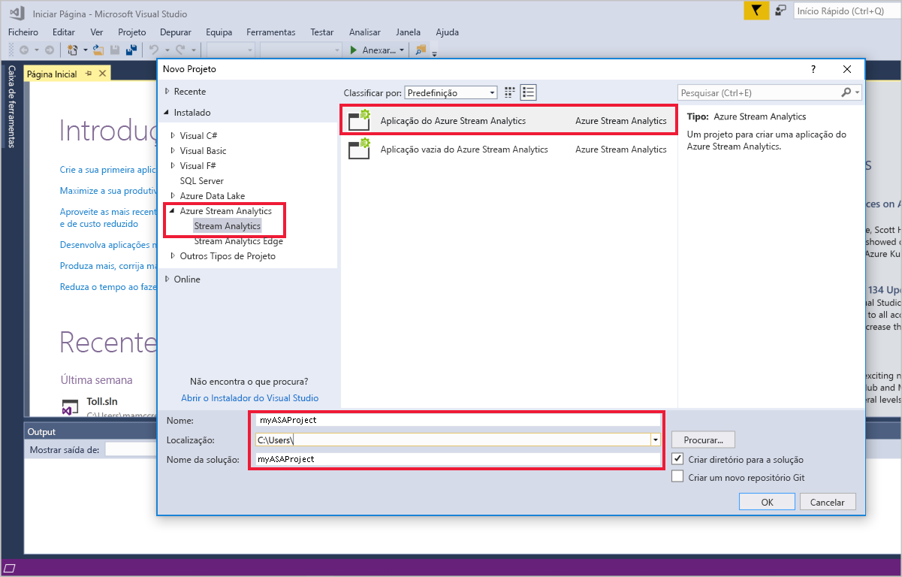
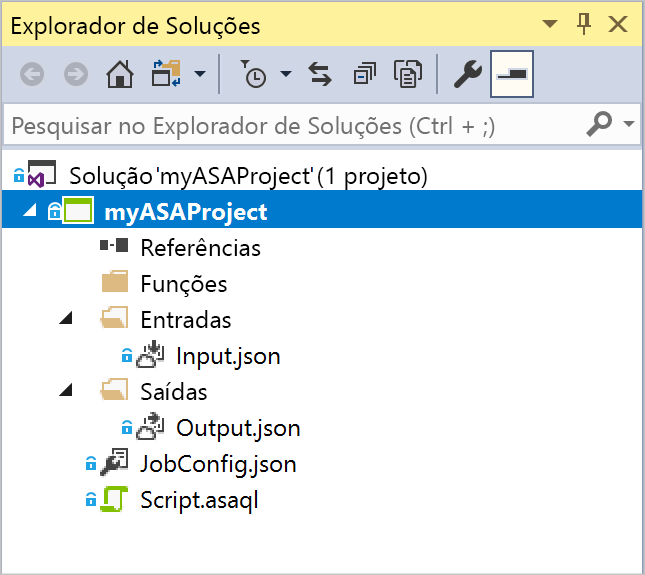
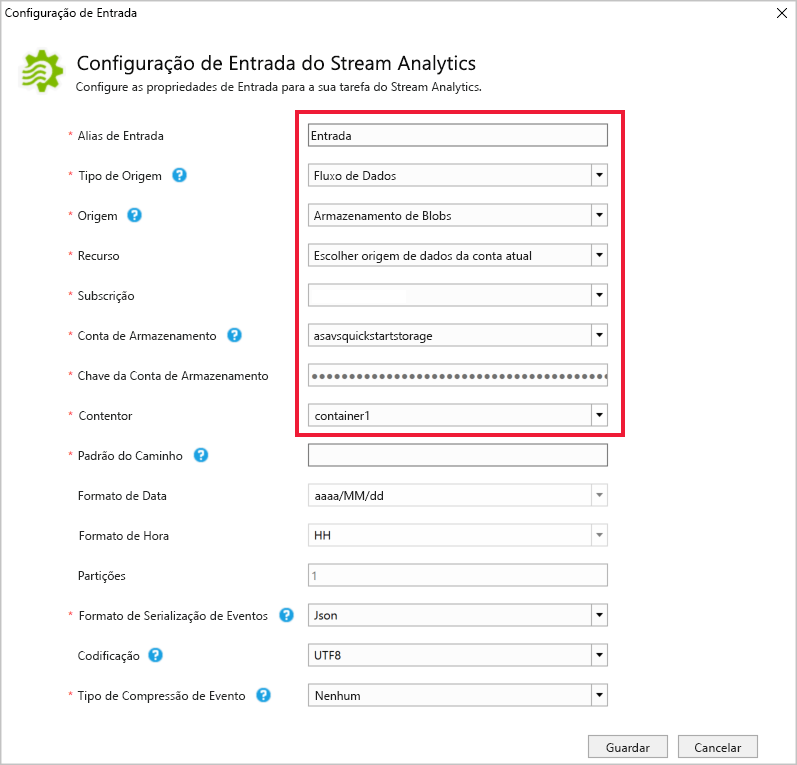
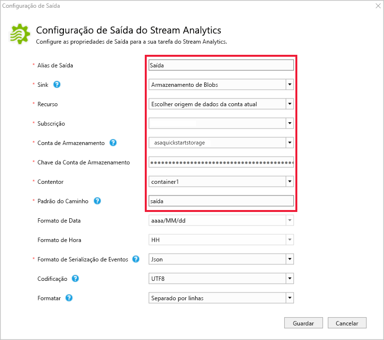
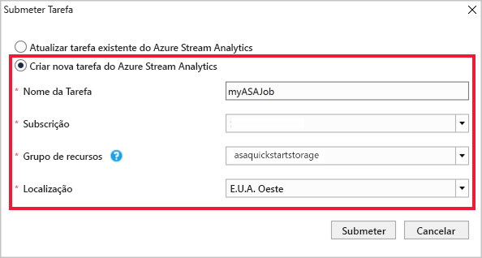
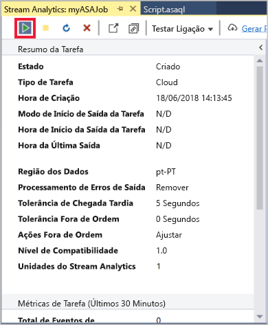
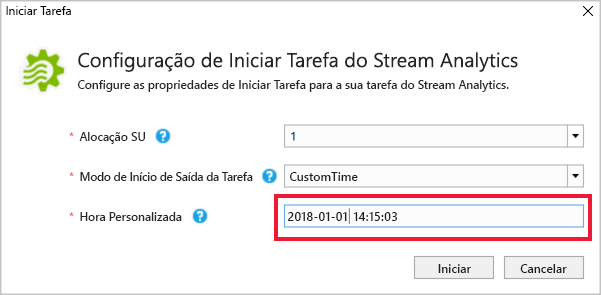
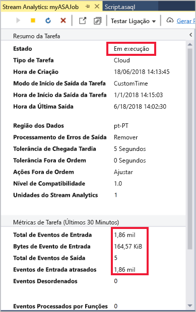
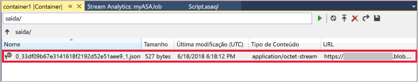

# <a name="quickstart-create-an-azure-stream-analytics-job-by-using-visual-studio"></a>Quickstart: Criar um trabalho Azure Stream Analytics utilizando o Visual Studio

Este início rápido mostra como criar e executar uma tarefa do Stream Analytics com ferramentas do Azure Stream Analytics para Visual Studio. O trabalho de exemplo lê dados de streaming de um dispositivo IoT Hub. Define-se um trabalho que calcula a temperatura média quando ultrapassa os 27° e escreve os eventos de saída resultantes para um novo ficheiro no armazenamento de bolhas.

> [!NOTE]
> As ferramentas Visual Studio e Visual Studio Code não suportam empregos nas regiões do Leste da China, China Norte, Alemanha Central e Alemanha NorthEast.

## <a name="before-you-begin"></a>Antes de começar

* Se não tiver uma subscrição do Azure, crie uma [conta gratuita](https://azure.microsoft.com/free/).

* Inicie sessão no [portal do Azure](https://portal.azure.com/).

* Instalar Visual Studio 2019, Visual Studio 2015 ou Visual Studio 2013 Update 4. As edições Enterprise (Ultimate/Premium), Professional e Community são suportadas. A edição Express não é suportada.

* Siga as [instruções de instalação](./stream-analytics-tools-for-visual-studio-install.md) para instalar as ferramentas do Stream Analytics para Visual Studio.

## <a name="prepare-the-input-data"></a>Preparar os dados de entrada

Antes de definir o trabalho stream Analytics, deve preparar os dados, que são posteriormente configurados como entrada de trabalho. Para preparar os dados de entrada exigidos pelo trabalho, complete os seguintes passos:

1. Inicie sessão no [portal do Azure](https://portal.azure.com/).

2. Selecione **Criar um recurso** Internet of  >  **Things**  >  **IoT Hub** .

3. No painel **IoT Hub,** insira as seguintes informações:
   
   |**Definição**  |**Valor sugerido**  |**Descrição**  |
   |---------|---------|---------|
   |Subscrição  | \<Your subscription\> |  Selecione a subscrição do Azure que pretende utilizar. |
   |Grupo de recursos   |   asaquickstart-resourcegroup  |   Selecione **Criar Novo** e introduza um novo nome de grupo de recursos para a sua conta. |
   |Região  |  \<Select the region that is closest to your users\> | Selecione uma localização geográfica onde pode hospedar o seu Hub IoT. Utilize o local mais próximo dos seus utilizadores. |
   |Nome do hub IoT  | MyASAIotHub  |   Selecione um nome para o seu Hub IoT.   |

   

4. Selecione **Seguinte: Definir tamanho e escala** .

5. Selecione o seu **Escalão de preço e dimensionamento** . Para este arranque rápido, selecione o **F1 - Free** tier se ainda estiver disponível na sua subscrição. Se o nível gratuito não estiver disponível, escolha o nível mais baixo disponível. Para mais informações, consulte [os preços do IoT Hub.](https://azure.microsoft.com/pricing/details/iot-hub/)

   

6. Selecione **Rever + criar** . Reveja as informações do IoT Hub e clique em **Criar** . O seu Hub IoT pode levar alguns minutos a criar. Pode monitorizar o progresso no painel **Notificações** .

7. No seu menu de navegação IoT Hub, clique em **Adicionar** em **dispositivos IoT** . Adicione um **ID do dispositivo** e clique em **Guardar** .

   

8. Assim que o dispositivo for criado, abra o dispositivo a partir da lista de **dispositivos IoT.** Copie a **cadeia de ligação - tecla primária** e guarde-a num bloco de notas para usar mais tarde.

   

## <a name="create-blob-storage"></a>Criar armazenamento de bolhas

1. A partir do canto superior esquerdo do portal Azure, selecione **Criar uma** conta de  >  **armazenamento**  >  **de** recursos .

2. No painel de **conta de armazenamento Criar,** insira um nome de conta de armazenamento, localização e grupo de recursos. Escolha o mesmo grupo de localização e recursos que o Hub IoT que criou. Em seguida, clique em **Rever + criar** para criar a conta.

   

3. Assim que a sua conta de armazenamento for criada, selecione o azulejo **Blobs** no **painel de visão geral.**

   

4. Na página **Serviço Blob,** selecione **Recipiente** e forneça um nome para o seu recipiente, tal como *o contentor1* . Deixe o **nível de acesso público** como **Privado (sem acesso anónimo)** e selecione **OK** .

   

## <a name="create-a-stream-analytics-project"></a>Criar um projeto do Stream Analytics

1. Inicie o Visual Studio.

2. Selecione **Ficheiro > Novo Projeto** .  

3. Na lista de modelos, no lado esquerdo, selecione **Stream Analytics** e, em seguida, selecione **Aplicação do Azure Stream Analytics** .  

4. Introduza o **Nome** do projeto, a **Localização** e o **Nome da solução** e selecione **OK** .

   

Repare nos elementos que são incluídos num projeto do Azure Stream Analytics.

   


## <a name="choose-the-required-subscription"></a>Escolha a subscrição obrigatória

1. No Visual Studio, no menu **Ver** , selecione **Explorador de Servidores** .

2. Clique com o botão direito do rato em **Azure** , selecione **Ligar à Subscrição do Microsoft Azure** e, em seguida, inicie sessão com a conta do Azure.

## <a name="define-input"></a>Definir entrada

1. No **Explorador de Soluções** , expanda o nó **Entradas** e faça duplo clique em **Input.json** .

2. Preencha a **Configuração de Entrada do Stream Analytics** com os seguintes valores:

   |**Definição**  |**Valor sugerido**  |**Descrição**   |
   |---------|---------|---------|
   |Alias de Entrada  |  Entrada   |  Introduza um nome para identificar a entrada da tarefa.   |
   |Tipo de Fonte   |  Fluxo de Dados |  Escolha a origem de entrada adequada: Fluxo de Dados ou Dados de Referência.   |
   |Origem  |  IoT Hub |  Escolha a origem de entrada adequada.   |
   |Recurso  | Escolha a origem de dados na conta atual | Opte por introduzir dados manualmente ou selecionar uma conta existente.   |
   |Subscrição  |  \<Your subscription\>   | Selecione a subscrição Azure que tem o Hub IoT que criou.   |
   |IoT Hub  |  MyASAIotHub   |  Escolha ou insira o nome do seu Hub IoT. Os nomes do IoT Hub são automaticamente detetados se forem criados na mesma subscrição.   |
   
3. Mantenha as outras opções com os valores predefinidos e selecione **Guardar** para guardar as definições.  

   

## <a name="define-output"></a>Definir a saída

1. No **Explorador de Soluções** , expanda o nó **Saídas** e faça duplo clique em **Output.json** .

2. Preencha a **Configuração de Saída do Stream Analytics** com os seguintes valores:

   |**Definição**  |**Valor sugerido**  |**Descrição**   |
   |---------|---------|---------|
   |Alias de Saída  |  Saída   |  Introduza um nome para identificar a saída da tarefa.   |
   |Sink   |  Armazenamento de Blobs |  Escolha o sink adequado.    |
   |Recurso  |  Apresente as definições da origem de dados manualmente |  Opte por introduzir dados manualmente ou selecionar uma conta existente.   |
   |Subscrição  |  \<Your subscription\>   | Selecione a subscrição do Azure que tem a conta de armazenamento que criou. A conta de armazenamento pode estar na mesma subscrição ou numa diferente. Este exemplo assume que criou a conta de armazenamento na mesma subscrição.   |
   |Conta de Armazenamento  |  asaquickstartstorage   |  Escolha ou introduza o nome da conta de armazenamento. Os nomes de contas de armazenamento são detetados automaticamente se forem criados na mesma subscrição.   |
   |Contentor  |  container1   |  Selecione o contentor existente que criou na conta de armazenamento.   |
   |Padrão do Caminho  |  saída   |  Introduza o nome de um caminho de ficheiro a ser criado no contentor.   |
   
3. Mantenha as outras opções com os valores predefinidos e selecione **Guardar** para guardar as definições.  

   

## <a name="define-the-transformation-query"></a>Definir a consulta de transformação

1. Abra o ficheiro **Script.asaql** no **Explorador de Soluções** do Visual Studio.

2. Adicione a seguinte consulta:

   ```sql
   SELECT *
   INTO Output
   FROM Input
   HAVING Temperature > 27
   ```

## <a name="submit-a-stream-analytics-query-to-azure"></a>Submeter uma consulta do Stream Analytics para o Azure

1. No **Editor de Consultas** , selecione **Submeter para o Azure** no editor de scripts.

2. Selecione **Criar uma Nova Tarefa do Azure Stream Analytics** e introduza um **Nome da Tarefa** . Escolha a **Subscrição** , o **Grupo de Recursos** e a **Localização** utilizada no início do Início Rápido.

   

## <a name="run-the-iot-simulator"></a>Executar o simulador IoT

1. Abra o [Raspberry Pi Azure IoT Online Simulator](https://azure-samples.github.io/raspberry-pi-web-simulator/) num novo separador ou janela do navegador.

2. Substitua o espaço reservado na Linha 15 pela cadeia de ligação do dispositivo Azure IoT Hub que guardou numa secção anterior.

3. Clique em **Run** (Executar). A saída deve mostrar os dados do sensor e as mensagens que estão a ser enviadas para o seu Hub IoT.

   

## <a name="start-the-stream-analytics-job-and-check-output"></a>Iniciar a tarefa do Stream Analytics e verificar a saída

1. Quando a tarefa é criada, a vista de tarefa abre-se automaticamente. Selecione o botão da seta verde para iniciar a tarefa,

   

2. Altere o **modo de início de saída de Trabalho** para **JobStartTime** e selecione **Start** .

   

3. Tenha em atenção que o estado da tarefa foi alterado para **Em execução** e se existem eventos de entrada/saída. Esta operação poderá demorar alguns minutos.

   

4. Para ver os resultados, no menu **Vista** , selecione **Explorador da Cloud** e navegue para a conta de armazenamento no seu grupo de recursos. Em **Contentores de Blobs** , clique duas vezes em **contentor1** e, em seguida, no caminho do ficheiro **saída** .

   

## <a name="clean-up-resources"></a>Limpar recursos

Quando já não for necessário, elimine o grupo de recursos, a tarefa de transmissão em fluxo e todos os recursos relacionados. A eliminação da tarefa evita a faturação das unidades de transmissão em fluxo consumidas pela tarefa. Se estiver a planear utilizar a tarefa no futuro, pode pará-la e reiniciá-la mais tarde, quando for necessário. Se não quiser continuar a utilizar esta tarefa, elimine todos os recursos criados por este início rápido ao utilizar os seguintes passos:

1. No menu do lado esquerdo no portal do Azure, selecione **Grupos de recursos** e, em seguida, selecione o nome do recurso que criou.  

2. Na página do grupo de recursos, selecione **Eliminar** , escreva o nome do recurso a eliminar na caixa de texto e, em seguida, selecione **Eliminar** .

## <a name="next-steps"></a>Passos seguintes

Neste início rápido, implementou uma tarefa simples do Stream Analytics com o Visual Studio. Também pode implementar tarefas do Stream Analytics com o [portal do Azure](stream-analytics-quick-create-portal.md) e o [PowerShell](stream-analytics-quick-create-powershell.md). 

Para saber mais sobre as ferramentas Azure Stream Analytics para o Visual Studio, continue ao seguinte artigo:

> [!div class="nextstepaction"]
> [Use o Estúdio Visual para ver os trabalhos do Azure Stream Analytics](stream-analytics-vs-tools.md)