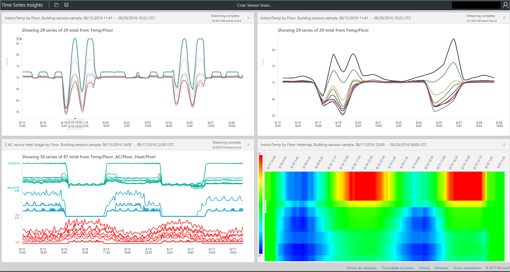

# O que é o Azure Time Series Insights?

O Azure Time Series Insights é criado para armazenar, Visualizar e consultar grandes quantidades de dados de série temporal, como os gerados por dispositivos IoT. Se quiser armazenar, gerir, consultar ou visualizar dados de séries de tempo na cloud, o Time Series Insights é provavelmente a solução adequada para si. 

O Time Series Insights tem quatro tarefas principais:

- Ele é totalmente integrado a gateways de nuvem como o Hub IoT do Azure e os hubs de eventos do Azure. Liga-se facilmente a estas origens de eventos e analisa o JSON das mensagens e estruturas que contêm dados em linhas e colunas limpas. Associa os metadados a telemetria e indexa os dados num arquivo em colunas.
- Time Series Insights gerencia o armazenamento de seus dados. Para garantir que os dados estejam sempre facilmente acessíveis, eles armazenam seus dados na memória e no SSDs por até 400 dias. Você pode consultar de forma interativa bilhões de eventos em segundos – sob demanda.
- Time Series Insights fornece visualização pronta para uso por meio do Time Series Insights Explorer. 
- O Time Series Insights fornece um serviço de consulta, no Time Series Insights Explorer e usando APIs que são fáceis de integrar para inserir dados de série temporal em aplicativos personalizados.

Se você criar um aplicativo para consumo interno ou para os clientes externos usarem, você poderá usar Time Series Insights como um back-end. Você pode usá-lo para indexar, armazenar e agregar dados de série temporal. Para criar uma visualização personalizada e experiência do usuário na parte superior, use o [SDK do cliente](https://github.com/microsoft/tsiclient/blob/master/docs/API.md). Time Series Insights também é equipado com várias [APIs de consulta](how-to-shape-query-json.md) para habilitar esses cenários personalizados.

Os dados de séries de tempo representam a forma como um recurso ou processo muda ao longo do tempo. Os dados de série temporal são indexados por carimbos de data/hora e o tempo é o eixo mais significativo ao longo do qual esses dados são organizados. Os dados de série temporal normalmente chegam em ordem sequencial, portanto, são tratados como uma inserção em vez de uma atualização para seu banco de dados.

Pode ser um desafio armazenar, indexar, consultar, analisar e Visualizar dados de série temporal em grandes volumes.
Azure Time Series Insights captura e armazena cada novo evento como uma linha, e a alteração é eficiente com o passar do tempo. Como resultado, você pode olhar para trás para desenhar ideias do passado para ajudar a prever alterações futuras.

## Vídeo

### Saiba mais sobre o Azure Time Series Insights, a plataforma de análise IoT baseada em nuvem. 

[VÍDEO de ](https://www.youtube.com/watch?v=GaARrFfjoss)

## Cenários principais

- Armazene dados de série temporal de maneira escalonável. 

   Na sua essência, o Time Series Insights tem uma base de dados concebida a pensar nos dados de séries de tempo. Como é escalonável e totalmente gerenciado, Time Series Insights lida com o trabalho de armazenar e gerenciar eventos.

- Explore os dados quase em tempo real. 

   Time Series Insights fornece um Gerenciador que visualiza todos os dados que transmitem para um ambiente. Logo depois de se conectar a uma fonte de eventos, você pode exibir, explorar e consultar dados de eventos no Time Series Insights. Os dados ajudam você a validar se um dispositivo emite dados conforme esperado e para monitorar um ativo de IoT quanto à integridade, à produtividade e à eficácia geral. 

- Executar análise de causa raiz e detectar anomalias.

   Time Series Insights tem ferramentas como padrões e exibições de perspectiva para realizar e salvar a análise de causa raiz em várias etapas. Time Series Insights também funciona com serviços de alerta como Azure Stream Analytics para que você possa exibir alertas e anomalias detectadas quase em tempo real no Time Series Insights Explorer. 

- Obter uma exibição global dos dados de série temporal que transmitem de locais diferentes para comparação de vários ativos ou sites.

   Pode ligar várias origens de eventos a um ambiente do Time Series Insights. Dessa forma, você pode exibir dados que transmitem de vários locais diferentes, juntos em tempo quase real. Os usuários podem aproveitar essa visibilidade para compartilhar dados com líderes de negócios. Eles podem colaborar melhor com especialistas de domínio que podem aplicar sua experiência para ajudar a resolver problemas, aplicar práticas recomendadas e compartilhar aprendizados.

- Crie um aplicativo de cliente sobre o Time Series Insights. 

   Time Series Insights expõe as APIs de consulta REST que você pode usar para criar aplicativos que usam dados de série temporal.

## Capacidades

- Comece **rapidamente**: Azure Time Series insights não exige preparação de dados antecipada, para que você possa se conectar rapidamente a milhões de eventos em seu hub IOT ou Hub de eventos. Depois de se conectar, você pode visualizar e interagir com os dados do sensor para validar rapidamente suas soluções de IoT. Você pode interagir com seus dados sem escrever código e não precisa aprender uma nova linguagem. O Time Series Insights fornece uma superfície de consulta de texto livre granular para usuários avançados e exploração de apontar e clicar.

- **Percepções quase em tempo real**: Time Series insights pode ingerir milhões de eventos de sensor por dia, com latência de um minuto. Time Series Insights ajuda você a obter informações sobre os dados do sensor. Use-o para identificar tendências e anomalias, realizar análises de causa raiz e evitar um tempo de inatividade dispendioso. A correlação cruzada entre dados históricos e em tempo real ajuda você a encontrar tendências ocultas nos dados.

- **Crie soluções personalizadas**: Incorpore dados de Azure Time Series insights em seus aplicativos existentes. Você também pode criar novas soluções personalizadas com as APIs REST do Time Series Insights. Crie e partilhe vistas personalizadas que pode partilhar para que as outras pessoas possam explorar as suas informações.

- **Escalabilidade**: o Time Series Insights foi concebido para suportar IoT em escala. Pode receber entre 1 milhão e 100 milhões de eventos por dia, com um intervalo de retenção predefinido de 31 dias. Você pode visualizar e analisar fluxos de dados dinâmicos quase em tempo real, juntamente com os dados históricos.

## Introdução

Para começar, siga estas etapas.

1. Provisione um ambiente de Time Series Insights no portal do Azure.
1. Conecte-se a uma fonte de eventos como um hub IoT ou um hub de eventos. 
1. Carregar dados de referência. Esse não é um serviço adicional.
1. Veja os dados em minutos com o explorador do Time Series Insights.

## Explorador do Time Series Insights

Este diagrama mostra um exemplo de dados de análises de séries temporais exibidas por meio do Time Series Insights Explorer.

## Passos seguintes

- Explore a Azure Time Series Insights ambiente de [demonstração gratuita](./time-series-quickstart.md)de disponibilidade geral.
- Saiba mais sobre como [planejar seu ambiente de time Series insights](time-series-insights-environment-planning.md) .
