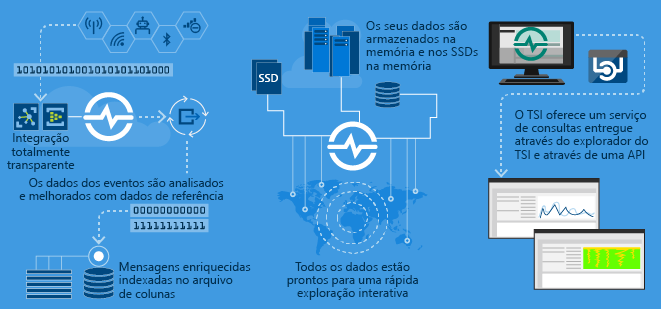

# O que é Azure Time Series Insights Gen1?

> [!CAUTION]
> Este é um artigo da Gen1.

Azure Time Series Insights é construído para armazenar, visualizar e consultar grandes quantidades de dados de séries de tempo, como os gerados por dispositivos IoT. Se pretender armazenar, gerir, consultar ou visualizar dados de séries de tempo na nuvem, o Azure Time Series Insights é provavelmente o correto para si.

Azure Time Series Insights tem quatro trabalhos-chave:

- Está totalmente integrado com gateways em nuvem como Azure IoT Hub e Azure Event Hubs. Liga-se facilmente a estas origens de eventos e analisa o JSON das mensagens e estruturas que contêm dados em linhas e colunas limpas. Associa os metadados a telemetria e indexa os dados num arquivo em colunas.
- A Azure Time Series Insights gere o armazenamento dos seus dados. Para garantir que os dados são sempre facilmente acessíveis, armazena os seus dados na memória e SSDs até 400 dias. Pode consultar interativamente biliões de eventos em segundos a pedido.
- Azure Time Series Insights fornece visualização fora da caixa através do Azure Time Series Insights Explorer.
- O Azure Time Series Insights fornece um serviço de consulta, tanto no Azure Time Series Insights Explorer como utilizando APIs que são fáceis de integrar para incorporar os seus dados da série de tempo em aplicações personalizadas.

Se construir uma aplicação para consumo interno ou para clientes externos a utilizar, pode utilizar o Azure Time Series Insights como back-end. Pode usá-lo para indexar, armazenar e agregar dados de séries de tempo. Para construir uma visualização personalizada e experiência de utilizador em cima, utilize o [Client SDK](https://github.com/microsoft/tsiclient/blob/master/docs/API.md). A azure Time Series Insights também está equipado com várias [APIs de consulta](./concepts-json-flattening-escaping-rules.md) para ativar estes cenários personalizados.

Os dados de séries de tempo representam a forma como um recurso ou processo muda ao longo do tempo. Os dados das séries de tempo são indexados por timetamps, e o tempo é o eixo mais significativo ao longo do qual esses dados são organizados. Os dados da série de tempo normalmente chegam em ordem sequencial, por isso é tratado como uma inserção em vez de uma atualização para a sua base de dados.

Pode ser um desafio armazenar, indexar, consultar, analisar e visualizar dados de séries temporárias em grandes volumes.
Azure Time Series Insights captura e armazena cada novo evento como uma linha, e a mudança é eficientemente medida ao longo do tempo. Como resultado, pode olhar para trás para extrair insights do passado para ajudar a prever mudanças futuras.

## Vídeo

### Saiba mais sobre o Azure Time Series Insights, a plataforma de análise IoT baseada na nuvem. 

## Cenários principais

- Armazenar dados da série de tempo de forma escalável.

   No seu cerne, a Azure Time Series Insights tem uma base de dados desenhada com dados da série de tempo em mente. Por ser escalável e totalmente gerido, o Azure Time Series Insights lida com o trabalho de armazenar e gerir eventos.

- Explore os dados em tempo real.

   Azure Time Series Insights fornece um Explorer que visualiza todos os dados que fluem para um ambiente. Pouco depois de se ligar a uma fonte de evento, pode ver, explorar e consultar dados de eventos dentro do Azure Time Series Insights. Os dados ajudam-no a validar se um dispositivo emite dados como esperado e a monitorizar um ativo IoT para a saúde, produtividade e eficácia global.

- Realizar análises de causa-raiz e detetar anomalias.

   Azure Time Series Insights tem ferramentas como padrões e visões de perspetiva para conduzir e salvar análises de causas de raiz em vários passos. A azure Time Series Insights também trabalha com serviços de alerta como o Azure Stream Analytics para que possa ver alertas e anomalias detetadas em quase tempo real no Azure Time Series Insights Explorer.

- Obtenha uma visão global dos dados das séries de tempo que transmitem de locais diferentes para comparação de vários ativos ou sites.

   Pode ligar várias fontes de evento a um ambiente Azure Time Series Insights. Desta forma, pode ver dados que fluem de vários locais diferentes em tempo real. Os utilizadores podem aproveitar esta visibilidade para partilhar dados com líderes empresariais. Podem colaborar melhor com especialistas de domínio que possam aplicar os seus conhecimentos para ajudar a resolver problemas, aplicar as melhores práticas e partilhar aprendizagens.

- Construa uma aplicação de cliente em cima da Azure Time Series Insights.

   Azure Time Series Insights expõe AS APIs de consulta de REST que pode usar para construir aplicações que utilizam dados de séries de tempo.

## Capacidades

- **Começa rapidamente**: O Azure Time Series Insights não requer preparação antecipada de dados, para que possa ligar-se rapidamente a milhões de eventos no seu hub ioT ou centro de eventos. Depois de se ligar, pode visualizar e interagir com os dados do sensor para validar rapidamente as suas soluções IoT. Pode interagir com os seus dados sem escrever código, e não precisa de aprender uma nova linguagem. Azure Time Series Insights fornece uma superfície de consulta de texto livre granular para utilizadores avançados e exploração de pontos e cliques.

- **Quase introspeções em tempo real**: Azure Time Series Insights pode ingerir milhões de eventos de sensores por dia, com latência de um minuto. O Azure Time Series Insights ajuda-o a obter informações sobre os dados do sensor. Use-o para detetar tendências e anomalias, realizar análises de causa-raiz e evitar tempos de inatividade dispendiosos. A correlação entre dados em tempo real e históricos ajuda-o a encontrar tendências ocultas nos dados.

- **Construa soluções personalizadas**: Incorporar dados da Série de Tempo Azure Insights nas suas aplicações existentes. Também pode criar novas soluções personalizadas com as APIs do Azure Time Series Insights REST. Crie e partilhe vistas personalizadas que pode partilhar para que as outras pessoas possam explorar as suas informações.

- **Escalabilidade**: Azure Time Series Insights é projetado para suportar IoT em escala. Pode receber entre 1 milhão e 100 milhões de eventos por dia, com um intervalo de retenção predefinido de 31 dias. Pode visualizar e analisar fluxos de dados ao vivo em tempo real, ao lado de dados históricos.

## Introdução

Para começar, siga estes passos.

1. Fornecer um ambiente Azure Time Series Insights no portal Azure.
1. Ligue-se a uma fonte de eventos como um hub IoT ou um centro de eventos.
1. Faça upload de dados de referência. Este não é um serviço adicional.
1. Reveja e apresente os seus dados em minutos com o Azure Time Series Insights Explorer.

## Explorador

Ver, analisar e descobrir tendências nos seus dados utilizando o Azure Time Series Insights Explorer.

Aprenda a usar o [Azure Time Series Insights Explorer](time-series-insights-explorer.md) e retire insights dos seus dados.

## Passos seguintes

- Explore o [ambiente de demonstração da](./time-series-quickstart.md)Azure Time Series Insights Gen1 .

- Saiba mais sobre como planear o seu ambiente [Azure Time Series Insights.](time-series-insights-environment-planning.md)