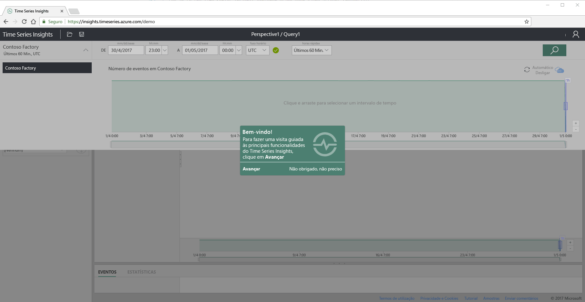
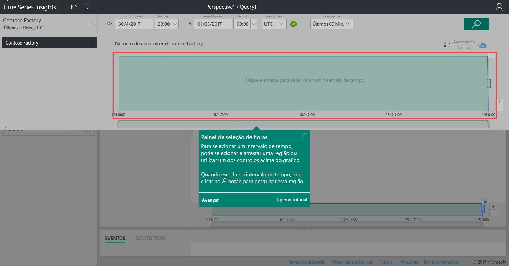
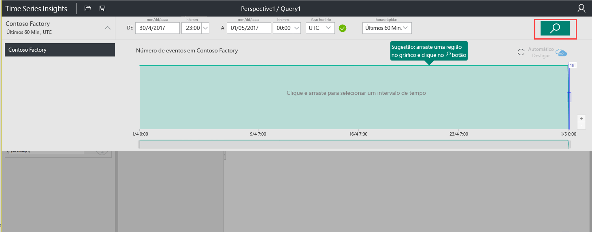
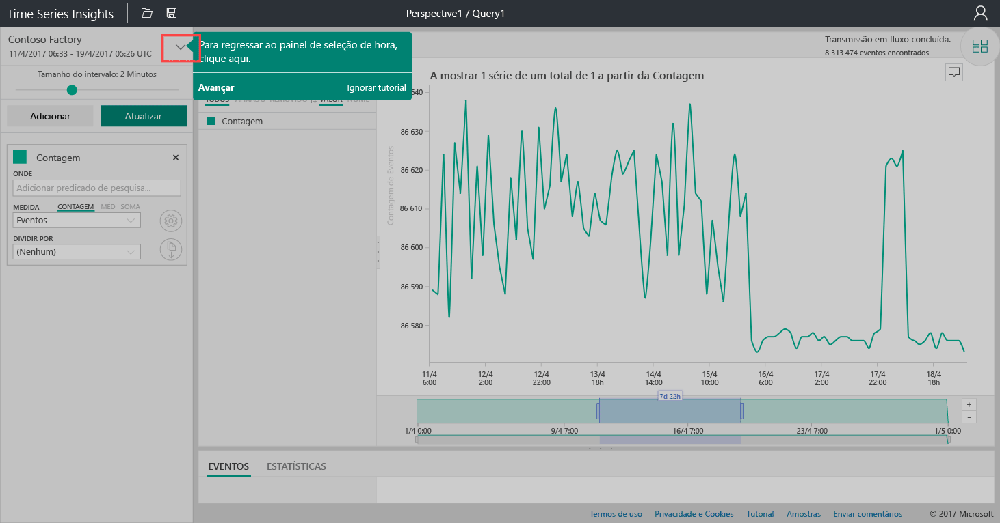
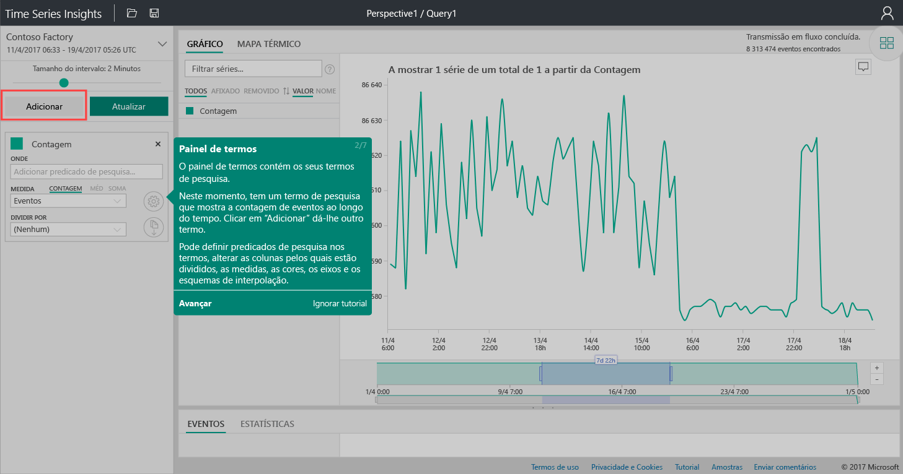
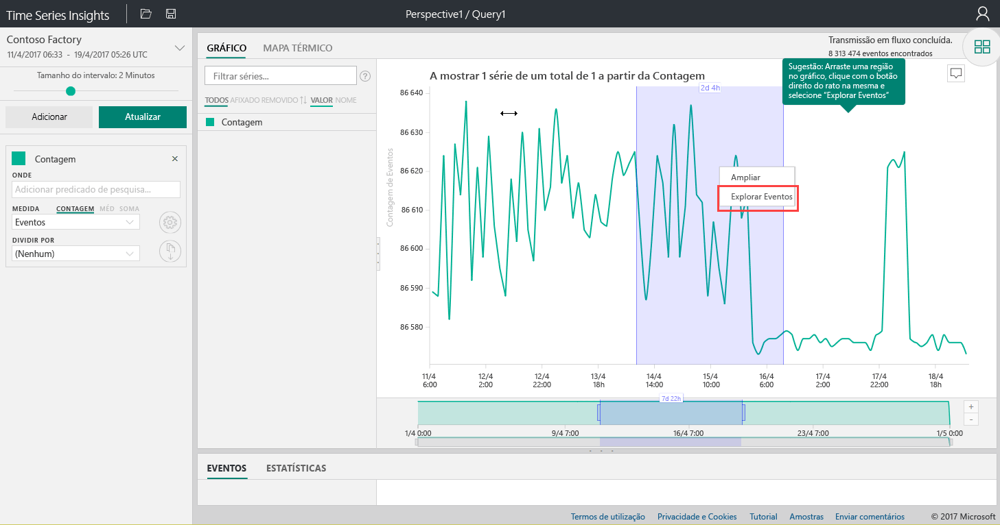
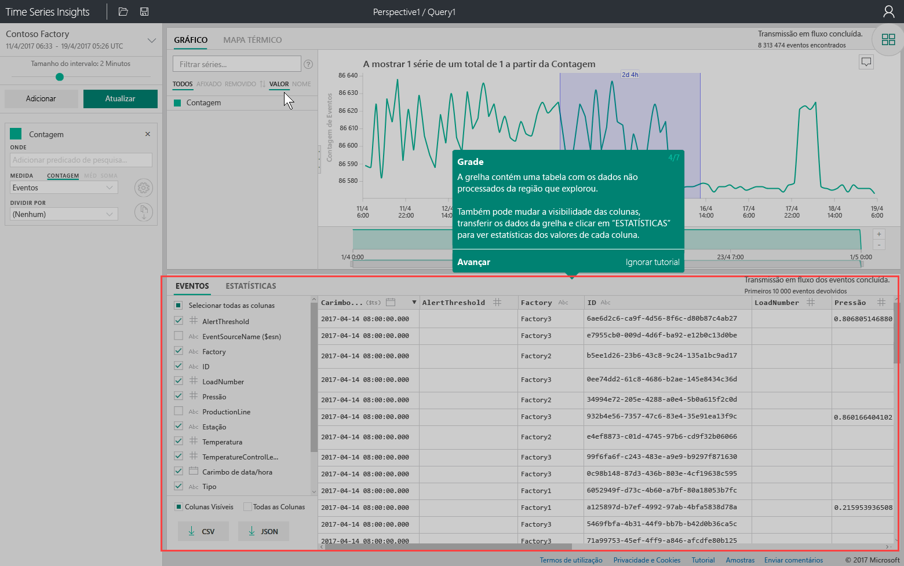
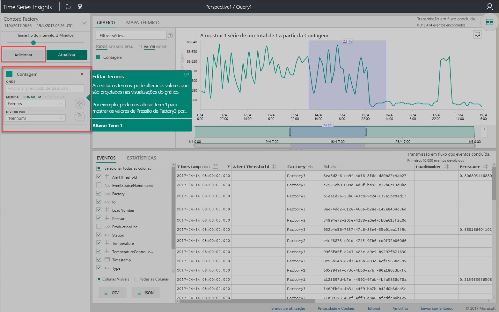
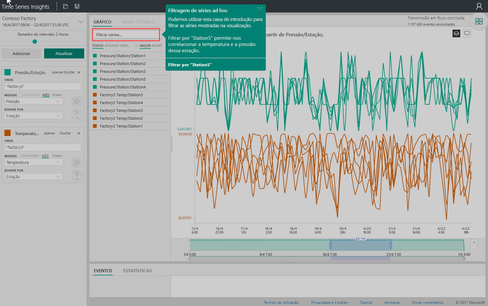

# Guia de introdução: Explorar o Azure Time Series Insights

Este guia de início rápido do Azure Time Series Insights Explorer ajuda você a começar a usar o Time Series Insights em um ambiente de demonstração gratuita. Neste guia de início rápido, você aprende a usar seu navegador da Web para visualizar grandes volumes de dados de IoT e recursos principais de Tour que estão geralmente disponíveis agora.

Azure Time Series Insights é um serviço de análise, armazenamento e visualização totalmente gerenciado que simplifica como explorar e analisar bilhões de eventos de IoT simultaneamente. Ele fornece uma exibição global de seus dados para que você possa validar rapidamente sua solução de IoT e evitar um tempo de inatividade dispendioso para dispositivos críticos. Azure Time Series Insights ajuda a descobrir tendências ocultas, detectar anomalias e realizar análises de causa raiz quase em tempo real.

Para flexibilidade adicional, você pode adicionar Azure Time Series Insights a um aplicativo preexistente por meio de suas [APIs REST](./time-series-insights-update-tsq.md) poderosas e [SDK de cliente](https://github.com/microsoft/tsiclient). Você pode usar as APIs para armazenar, consultar e consumir dados de série temporal em um aplicativo cliente de sua escolha. Você também pode usar o SDK do cliente para adicionar componentes de interface do usuário ao seu aplicativo existente.

Este início rápido do Time Series Insights Explorer oferece um tour guiado de recursos que estão em disponibilidade geral.

> [!IMPORTANT]
> Crie uma [conta gratuita do Azure](https://azure.microsoft.com/free/?ref=microsoft.com&utm_source=microsoft.com&utm_medium=docs&utm_campaign=visualstudio) se ainda não tiver criado uma.

## Preparar o ambiente de demonstração

1. No navegador, vá para a [demonstração de disponibilidade geral](https://insights.timeseries.azure.com/demo).

1. Se solicitado, entre no Time Series Insights Explorer usando suas credenciais de conta do Azure.

1. A página Quick Tour Time Series Insights é exibida. Selecione **Avançar** para iniciar o tour rápido.

   

## Explore o ambiente de demonstração

1. O **painel de seleção de tempo** é exibido. Utilize este painel para selecionar um intervalo de tempo para visualizar.

   [painel de seleção de](media/quickstart/quickstart2.png#lightbox)

1. Selecione um intervalo de tempo e arraste-o na região. Em seguida, selecione **Pesquisar**.

   

   O Time Series Insights apresenta uma visualização de gráfico para o intervalo de tempo especificado. Você pode executar várias ações no gráfico de linhas. Por exemplo, você pode filtrar, fixar, classificar e empilhar.

   Para retornar ao **painel de seleção de tempo**, selecione a seta para baixo conforme mostrado:

   [Gráfico de](media/quickstart/quickstart4.png#lightbox)

1. Selecione **Adicionar** no **painel termos** para adicionar um novo termo de pesquisa.

   

1. No gráfico, pode selecionar uma região, clicar com o botão direito na região e selecionar **Explorar Eventos**.

   

   Uma grade de seus dados brutos é exibida na região que você está explorando.

   [exibição de grade](media/quickstart/quickstart7.png#lightbox)

## Selecionar e filtrar dados

1. Edite seus termos para alterar os valores no gráfico. Adicione outro termo para fazer a correlação cruzada de diferentes tipos de valores.

   

1. Insira um termo de filtro na caixa **série de filtro** para filtragem da série improvisadas. Para o guia de introdução, introduza **Station5** para correlacionar entre si a temperatura e a pressão dessa estação.

   

Depois de concluir o guia de introdução, pode experimentar com o conjunto de dados de exemplo para criar visualizações diferentes.

## Limpar recursos

Agora que você concluiu o tutorial, limpe os recursos que criou:

1. No menu à esquerda na [portal do Azure](https://portal.azure.com), selecione **todos os recursos**, localize o grupo de recursos Azure Time Series insights.
1. Exclua todo o grupo de recursos (e todos os recursos contidos nele) selecionando **excluir** ou remover cada recurso individualmente.

## Passos seguintes

Você está pronto para criar seu próprio ambiente de Time Series Insights:
> [!div class="nextstepaction"]
> [Planeie o seu ambiente do Time Series Insights](time-series-insights-environment-planning.md)
