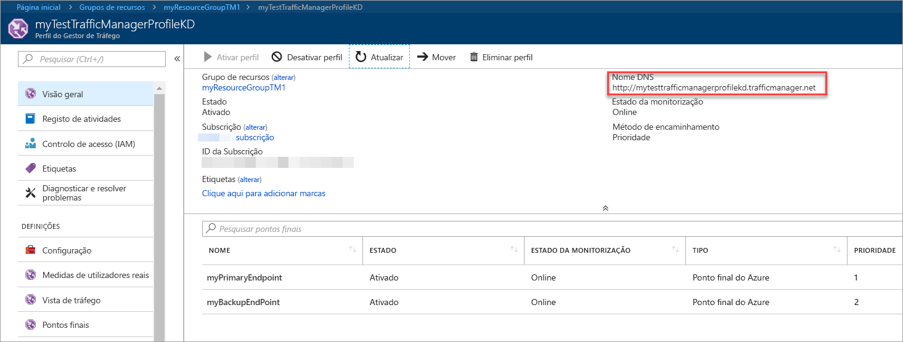
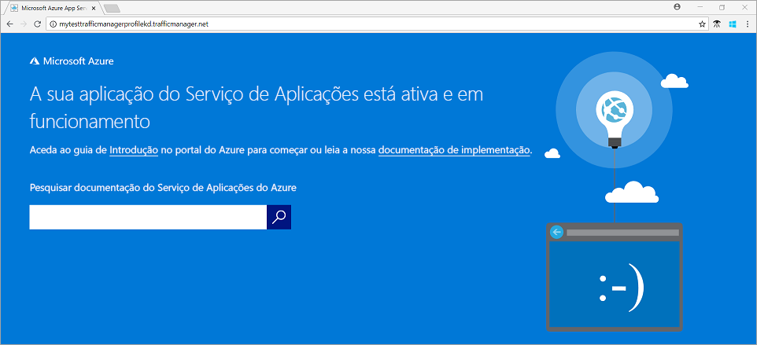

# Início rápido: criar um perfil do Gerenciador de tráfego usando o portal do Azure

Este guia de início rápido descreve como criar um perfil do Gerenciador de tráfego que fornece alta disponibilidade para seu aplicativo Web.

Neste guia de início rápido, você lerá sobre duas instâncias de um aplicativo Web. Cada um deles está sendo executado em uma região diferente do Azure. Você criará um perfil do Gerenciador de tráfego com base na [prioridade do ponto de extremidade](traffic-manager-routing-methods.md#priority-traffic-routing-method). O perfil direciona o tráfego do usuário para o site primário que está executando o aplicativo Web. O Gerenciador de tráfego monitora continuamente o aplicativo Web. Se o site primário não estiver disponível, ele fornecerá o failover automático para o site de backup.

Se não tiver uma subscrição do Azure, crie uma [conta gratuita](https://azure.microsoft.com/free/?WT.mc_id=A261C142F) agora.

## Iniciar sessão no Azure

Inicie sessão no [Portal do Azure](https://portal.azure.com).

## Pré-requisitos

Para este guia de início rápido, você precisará de duas instâncias de um aplicativo Web implantado em duas regiões diferentes do Azure (*leste dos EUA* e *Europa Ocidental*). Cada um servirá como pontos de extremidade primários e de failover para o Gerenciador de tráfego.

1. No lado superior esquerdo da tela, selecione **criar um recurso** > **Web** > **aplicativo Web**.

1. Em **criar um aplicativo Web**, digite ou selecione os seguintes valores na guia **noções básicas** :

   -  > **grupo de recursos**de **assinatura** : selecione **criar novo** e digite **myResourceGroupTM1**.
   - **Detalhes da instância** > **nome**: digite *myWebAppEastUS*.
   - **Detalhes da instância** > **publicar**: selecione o **código**.
   - **Detalhes da instância** > **pilha de tempo de execução**: selecione **ASP.NET v 4.7**
   - **Detalhes da instância** > **sistema operacional**: selecione **Windows**.
   - **Detalhes da instância** > **região**: selecione **leste dos EUA**.
   - **Plano do serviço de aplicativo** > **plano do Windows (leste dos EUA)** : selecione **criar novo** e digite **myAppServicePlanEastUS**
   - **Plano do serviço de aplicativo** > **SKU e tamanho**: selecione **Standard S1**.
   
3. Selecione a guia **monitoramento** ou selecione **Avançar: monitoramento**.  Em **monitoramento**, defina **Application Insights** > **habilitar Application insights** como **não**.

4. Selecione **revisar e criar**

5. Examine as configurações e clique em **criar**.  Quando o aplicativo Web é implantado com êxito, ele cria um site padrão.

6. Siga as etapas para criar um segundo aplicativo Web chamado *myWebAppWestEurope*, com um nome de **grupo de recursos** de *myResourceGroupTM2*, uma **região** de *Europa Ocidental*, um nome de plano do **serviço de aplicativo** de **myAppServicePlanWestEurope**e todas as outras configurações como *myWebAppEastUS*.

## Criar um perfil do Gestor de Tráfego

Crie um perfil do Gerenciador de tráfego que direcione o tráfego do usuário com base na prioridade do ponto de extremidade.

1. No lado superior esquerdo da tela, selecione **criar um recurso** > **rede** > **perfil do Gerenciador de tráfego**.
2. Em **Criar perfil do Gerenciador de tráfego**, insira ou selecione estas configurações:

    | Definição | Valor |
    | --------| ----- |
    | Nome | Insira um nome exclusivo para o seu perfil do Gerenciador de tráfego.|
    | Método de encaminhamento | Selecione **prioridade**.|
    | Subscrição | Selecione a assinatura à qual você deseja que o perfil do Gerenciador de tráfego seja aplicado. |
    | Grupo de recursos | Selecione *myResourceGroupTM1*.|
    | Localização |Essa configuração refere-se ao local do grupo de recursos. Ele não tem nenhum efeito no perfil do Gerenciador de tráfego que será implantado globalmente.|

3. Selecione **Criar**.

## Adicionar pontos finais do Gestor de Tráfego

Adicione o Website em *E.U.A. Leste* como o ponto final principal para encaminhar todo o tráfego do utilizador. Adicione o site no *Europa Ocidental* como um ponto de extremidade de failover. Quando o ponto de extremidade primário não está disponível, o tráfego roteia automaticamente para o ponto de extremidade de failover.

1. Na barra de pesquisa do portal, insira o nome do perfil do Gerenciador de tráfego que você criou na seção anterior.
2. Selecione o perfil nos resultados da pesquisa.
3. No **perfil do Gerenciador de tráfego**, na seção **configurações** , selecione **pontos de extremidade**e, em seguida, selecione **Adicionar**.
4. Insira ou selecione essas configurações:

    | Definição | Valor |
    | ------- | ------|
    | Tipo | Selecione **ponto de extremidade do Azure**. |
    | Nome | Insira *myPrimaryEndpoint*. |
    | Tipo de recurso de destino | Selecione **serviço de aplicativo**. |
    | Recurso de destino | Selecione **escolher um serviço de aplicativo** > **leste dos EUA**. |
    | Prioridade | Selecione **1**. Todo o tráfego vai para esse ponto de extremidade quando ele está íntegro. |

    

5. Selecione **OK**.
6. Para criar um ponto de extremidade de failover para sua segunda região do Azure, repita as etapas 3 e 4 com estas configurações:

    | Definição | Valor |
    | ------- | ------|
    | Tipo | Selecione **ponto de extremidade do Azure**. |
    | Nome | Insira *myFailoverEndpoint*. |
    | Tipo de recurso de destino | Selecione **serviço de aplicativo**. |
    | Recurso de destino | Selecione **escolher um serviço de aplicativo** > **Europa Ocidental**. |
    | Prioridade | Selecione **2**. Todo o tráfego vai para esse ponto de extremidade de failover se o ponto de extremidade primário não estiver íntegro. |

7. Selecione **OK**.

Quando você terminar de adicionar os dois pontos de extremidade, eles serão exibidos no **perfil do Gerenciador de tráfego**. Observe que seu status de monitoramento está **online** agora.

## Testar o perfil do Gestor de Tráfego

Nesta seção, você verificará o nome de domínio do seu perfil do Gerenciador de tráfego. Você também configurará o ponto de extremidade primário como indisponível. Por fim, você verá que o aplicativo Web ainda está disponível. É porque o Traffic Manager envia o tráfego para o ponto de extremidade de failover.

### Verifique o nome DNS

1. Na barra de pesquisa do portal, procure o nome do **perfil do Gestor de Tráfego** que criou na secção anterior.
2. Selecione o perfil do Gerenciador de tráfego. A **visão geral** é exibida.
3. O **Perfil do Gestor de Tráfego** mostra o nome DNS do perfil que acabou de criar.
  
   

### Ver o Gestor de Tráfego em ação

1. Em um navegador da Web, insira o nome DNS do seu perfil do Gerenciador de tráfego para exibir o site padrão do seu aplicativo Web.

    > [!NOTE]
    > Neste cenário de início rápido, todas as solicitações são roteadas para o ponto de extremidade primário. Ele é definido como **prioridade 1**.

    

2. Para exibir o failover do Gerenciador de tráfego em ação, desabilite o site primário:
    1. Na página perfil do Gerenciador de tráfego, na seção **visão geral** , selecione **myPrimaryEndpoint**.
    2. Em *myPrimaryEndpoint*, selecione **desabilitado** > **salvar**.
    3. Feche o **myPrimaryEndpoint**. Observe que o status está **desabilitado** agora.
3. Copie o nome DNS do seu perfil do Gerenciador de tráfego da etapa anterior para exibir o site em uma nova sessão do navegador da Web.
4. Verifique se o aplicativo Web ainda está disponível.

O ponto de extremidade primário não está disponível, portanto, você foi encaminhado para o ponto de extremidade de failover.

## Limpar recursos

Quando terminar, exclua os grupos de recursos, aplicativos Web e todos os recursos relacionados. Para fazer isso, selecione cada item individual no painel e selecione **excluir** na parte superior de cada página.

## Passos seguintes

Neste guia de início rápido, você criou um perfil do Gerenciador de tráfego. Ele permite que você direcione o tráfego do usuário para aplicativos Web de alta disponibilidade. Para saber mais sobre o tráfego de roteamento, continue para os tutoriais do Gerenciador de tráfego.

> [!div class="nextstepaction"]
> [Traffic Manager tutorials](tutorial-traffic-manager-improve-website-response.md) (Tutoriais do Gestor de Tráfego)
