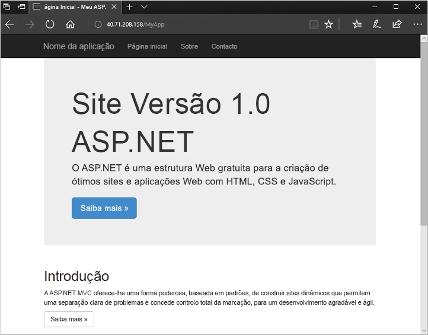

# <a name="quickstart-create-a-virtual-machine-scale-set-with-azure-powershell"></a>Início Rápido - Criar um conjunto de dimensionamento de máquinas virtuais com o Azure PowerShell


Um conjunto de escala de máquina virtual permite-lhe implantar e gerir um conjunto de máquinas virtuais auto-caling. Pode dimensionar o número de VMs no conjunto de dimensionamento manualmente ou definir regras para dimensionar automaticamente com base na utilização de recursos como CPU, exigência de memória ou tráfego de rede. Em seguida, um balanceador de carga do Azure distribui o tráfego pelas instâncias de VM no conjunto de dimensionamento. Neste início rápido, vai criar um conjunto de dimensionamento de máquinas virtuais e implementar um exemplo de aplicação com o Azure PowerShell.

Se não tiver uma subscrição do Azure, crie uma [conta gratuita](https://azure.microsoft.com/free/?WT.mc_id=A261C142F) antes de começar.

[!INCLUDE [cloud-shell-try-it.md](../../includes/cloud-shell-try-it.md)]


## <a name="create-a-scale-set"></a>Criar um conjunto de dimensionamento
Antes de criar um conjunto de escala, crie um grupo de recursos com [o New-AzResourceGroup](/powershell/module/az.resources/new-azresourcegroup). O exemplo a seguir cria um grupo de recursos chamado *myResourceGroup* na localização *este:*

```azurepowershell-interactive
New-AzResourceGroup -ResourceGroupName "myResourceGroup" -Location "EastUS"
```

Agora crie um conjunto de escala de máquina virtual com [New-AzVmss](/powershell/module/az.compute/new-azvmss). O exemplo seguinte cria um conjunto de dimensionamento com o nome *myScaleSet* que utiliza a imagem de plataforma do *Windows Server 2016 Datacenter*. Os recursos de rede do Azure para a rede virtual, o endereço IP público e o balanceador de carga são criados automaticamente. Quando solicitado, pode definir as suas próprias credenciais administrativas para as instâncias VM no conjunto de escala:

```azurepowershell-interactive
New-AzVmss `
  -ResourceGroupName "myResourceGroup" `
  -Location "EastUS" `
  -VMScaleSetName "myScaleSet" `
  -VirtualNetworkName "myVnet" `
  -SubnetName "mySubnet" `
  -PublicIpAddressName "myPublicIPAddress" `
  -LoadBalancerName "myLoadBalancer" `
  -UpgradePolicyMode "Automatic"
```

A criação e configuração de todas as VMs e recursos do conjunto de dimensionamento demora alguns minutos.


## <a name="deploy-sample-application"></a>Implementar aplicação de exemplo
Para testar o conjunto de dimensionamento, instale uma aplicação Web básica. A Extensão de Script Personalizado do Azure serve para transferir e executar um script que instala o IIS nas instâncias de VM. Esta extensão é útil para a configuração pós-implementação, instalação de software ou qualquer outra tarefa de gestão/configuração. Para obter mais informações, veja a [Descrição geral da Extensão de Script Personalizado](../virtual-machines/extensions/custom-script-windows.md).

Utilize a Extensão de Script Personalizado para instalar um servidor Web do IIS básico. Aplique a Extensão de Script Personalizado que instala o IIS da seguinte forma:

```azurepowershell-interactive
# Define the script for your Custom Script Extension to run
$publicSettings = @{
    "fileUris" = (,"https://raw.githubusercontent.com/Azure-Samples/compute-automation-configurations/master/automate-iis.ps1");
    "commandToExecute" = "powershell -ExecutionPolicy Unrestricted -File automate-iis.ps1"
}

# Get information about the scale set
$vmss = Get-AzVmss `
            -ResourceGroupName "myResourceGroup" `
            -VMScaleSetName "myScaleSet"

# Use Custom Script Extension to install IIS and configure basic website
Add-AzVmssExtension -VirtualMachineScaleSet $vmss `
    -Name "customScript" `
    -Publisher "Microsoft.Compute" `
    -Type "CustomScriptExtension" `
    -TypeHandlerVersion 1.8 `
    -Setting $publicSettings

# Update the scale set and apply the Custom Script Extension to the VM instances
Update-AzVmss `
    -ResourceGroupName "myResourceGroup" `
    -Name "myScaleSet" `
    -VirtualMachineScaleSet $vmss
```

## <a name="allow-traffic-to-application"></a>Permitir o tráfego para a aplicação

 Para permitir o acesso à aplicação web básica, crie um grupo de segurança de rede com [o New-AzNetworkSecurityRuleConfig](/powershell/module/az.network/new-aznetworksecurityruleconfig) e [o New-AzNetworkSecurityGroup](/powershell/module/az.network/new-aznetworksecuritygroup). Para obter mais informações, consulte [conjuntos de balanças de máquinas virtuais Azure](virtual-machine-scale-sets-networking.md).

 ```azurepowershell-interactive
 # Get information about the scale set
 $vmss = Get-AzVmss `
             -ResourceGroupName "myResourceGroup" `
             -VMScaleSetName "myScaleSet"

 #Create a rule to allow traffic over port 80
 $nsgFrontendRule = New-AzNetworkSecurityRuleConfig `
   -Name myFrontendNSGRule `
   -Protocol Tcp `
   -Direction Inbound `
   -Priority 200 `
   -SourceAddressPrefix * `
   -SourcePortRange * `
   -DestinationAddressPrefix * `
   -DestinationPortRange 80 `
   -Access Allow

 #Create a network security group and associate it with the rule
 $nsgFrontend = New-AzNetworkSecurityGroup `
   -ResourceGroupName  "myResourceGroup" `
   -Location EastUS `
   -Name myFrontendNSG `
   -SecurityRules $nsgFrontendRule

 $vnet = Get-AzVirtualNetwork `
   -ResourceGroupName  "myResourceGroup" `
   -Name myVnet

 $frontendSubnet = $vnet.Subnets[0]

 $frontendSubnetConfig = Set-AzVirtualNetworkSubnetConfig `
   -VirtualNetwork $vnet `
   -Name mySubnet `
   -AddressPrefix $frontendSubnet.AddressPrefix `
   -NetworkSecurityGroup $nsgFrontend

 Set-AzVirtualNetwork -VirtualNetwork $vnet

 # Update the scale set and apply the Custom Script Extension to the VM instances
 Update-AzVmss `
     -ResourceGroupName "myResourceGroup" `
     -Name "myScaleSet" `
     -VirtualMachineScaleSet $vmss
 ```

## <a name="test-your-scale-set"></a>Testar o seu conjunto de dimensionamento
Para ver o conjunto de dimensionamento em ação, aceda à aplicação Web de exemplo num browser. Obtenha o endereço IP público do seu equilibrador de carga com [Get-AzPublicIpAddress](/powershell/module/az.network/get-azpublicipaddress). O exemplo a seguir mostra o endereço IP criado no grupo de recursos *myResourceGroup:*

```azurepowershell-interactive
Get-AzPublicIpAddress -ResourceGroupName "myResourceGroup" | Select IpAddress
```

Introduza o endereço IP público do balanceador de carga num browser. O balanceador de carga distribui o tráfego para uma das suas instâncias de VM, conforme mostra o exemplo seguinte:




## <a name="clean-up-resources"></a>Limpar os recursos
Quando já não é necessário, pode utilizar o [Remove-AzResourceGroup](/powershell/module/az.resources/remove-azresourcegroup) para remover o grupo de recursos, o conjunto de escalas e todos os recursos relacionados da seguinte forma. O parâmetro `-Force` confirma que pretende eliminar os recursos sem uma linha de comandos adicional para fazê-lo. O parâmetro `-AsJob` devolve o controlo à linha de comandos, sem aguardar a conclusão da operação.

```azurepowershell-interactive
Remove-AzResourceGroup -Name "myResourceGroup" -Force -AsJob
```


## <a name="next-steps"></a>Passos seguintes
Neste início rápido, criou um conjunto de dimensionamento básico e utilizou a Extensão de Script Personalizado para instalar um servidor Web de IIS básico nas instâncias de VM. Para obter mais informações, avance para o tutorial para saber como criar e gerir conjuntos de dimensionamento de máquinas virtuais do Azure.

> [!div class="nextstepaction"]
> [Criar e gerir conjuntos de dimensionamento de máquinas virtuais do Azure](tutorial-create-and-manage-powershell.md)
