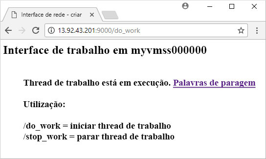

# <a name="quickstart-create-a-linux-virtual-machine-scale-set-with-an-arm-template"></a>Quickstart: Criar uma balança de máquina virtual Linux definida com um modelo ARM

Um conjunto de escala de máquina virtual permite-lhe implantar e gerir um conjunto de máquinas virtuais de escala automática. Pode dimensionar o número de VMs no conjunto de dimensionamento manualmente ou definir regras para dimensionar automaticamente com base na utilização de recursos como CPU, exigência de memória ou tráfego de rede. Em seguida, um balanceador de carga do Azure distribui o tráfego pelas instâncias de VM no conjunto de dimensionamento. Neste arranque rápido, você cria um conjunto de escala de máquina virtual e implementa uma aplicação de amostra com um modelo Azure Resource Manager (modelo ARM).

[!INCLUDE [About Azure Resource Manager](../../includes/resource-manager-quickstart-introduction.md)]

Os modelos ARM permitem-lhe implantar grupos de recursos relacionados. Num único modelo, pode criar o conjunto de dimensionamento de máquinas virtuais, instalar aplicações e configurar regras de dimensionamento automático. Com a utilização de parâmetros e variáveis, este modelo pode ser reutilizado para atualizar conjuntos de dimensionamento existentes ou criar conjuntos de dimensionamento adicionais. Pode implementar modelos através do portal do Azure, da CLI do Azure ou do Azure PowerShell ou a partir de pipelines de integração contínua/entrega contínua (CI/CD).

Se o seu ambiente cumpre os pré-requisitos e se está familiarizado com a utilização de modelos ARM, selecione o botão **Implementar no Azure** . O modelo será aberto no portal do Azure.

[](https://portal.azure.com/#create/Microsoft.Template/uri/https%3A%2F%2Fraw.githubusercontent.com%2FAzure%2Fazure-quickstart-templates%2Fmaster%2F201-vmss-bottle-autoscale%2Fazuredeploy.json)

## <a name="prerequisites"></a>Pré-requisitos

Se não tiver uma subscrição do Azure, crie uma [conta gratuita](https://azure.microsoft.com/free/?WT.mc_id=A261C142F) antes de começar.

## <a name="review-the-template"></a>Rever o modelo

O modelo utilizado neste início rápido pertence aos [Modelos de Início Rápido do Azure](https://azure.microsoft.com/resources/templates/201-vmss-bottle-autoscale/).

:::code language="json" source="~/quickstart-templates/201-vmss-bottle-autoscale/azuredeploy.json":::

Estes recursos são definidos no modelo:

- [**Microsoft.Network/virtualNetworks**](/azure/templates/microsoft.network/virtualnetworks)
- [**Microsoft.Network/publicIPAddresses**](/azure/templates/microsoft.network/publicipaddresses)
- [**Microsoft.Network/loadBalancers**](/azure/templates/microsoft.network/loadbalancers)
- [**Microsoft.Compute/virtualMachineScaleSets**](/azure/templates/microsoft.compute/virtualmachinescalesets)
- [**Microsoft.Insights/AutoscaleSettings**](/azure/templates/microsoft.insights/autoscalesettings)

### <a name="define-a-scale-set"></a>Definir um conjunto de dimensionamento

Para criar um dimensionamento com um modelo, tem de definir os recursos adequados. As partes principais do tipo de recurso de conjunto de dimensionamento de máquinas virtuais são:

| Propriedade                     | Descrição da propriedade                                  | Valor de modelo de exemplo                    |
|------------------------------|----------------------------------------------------------|-------------------------------------------|
| tipo                         | Tipo de recurso do Azure a criar                            | Microsoft.Compute/virtualMachineScaleSets |
| name                         | O nome do conjunto de dimensionamento                                       | myScaleSet                                |
| localização                     | A localização para criar o conjunto de dimensionamento                     | E.U.A. Leste                                   |
| sku.name                     | O tamanho da VM para cada instância do conjunto de dimensionamento                  | Standard_A1                               |
| sku.capacity                 | O número de instâncias de VM a criar inicialmente           | 2                                         |
| upgradePolicy.mode           | Modo de atualização de instâncias de VM quando ocorrem alterações              | Automático                                 |
| imageReference               | A plataforma ou imagem personalizada a utilizar para as instâncias de VM | Canonical Ubuntu Server 16.04-LTS         |
| osProfile.computerNamePrefix | O prefixo de nome para cada instância de VM                     | myvmss                                    |
| osProfile.adminUsername      | O nome de utilizador para cada instância de VM                        | azureuser                                 |
| osProfile.adminPassword      | A palavra-passe para cada instância de VM                        | P@ssw0rd!                                 |

Para personalizar um modelo de conjunto de escala, pode alterar o tamanho do VM ou a capacidade inicial. Outra opção é usar uma plataforma diferente ou uma imagem personalizada.

### <a name="add-a-sample-application"></a>Adicionar uma aplicação de exemplo

Para testar o conjunto de dimensionamento, instale uma aplicação Web básica. Quando implementa um conjunto de dimensionamento, as extensões de VM podem fornecer tarefas de automatização e configuração pós-implementação, tais como a instalação de uma aplicação. Os scripts podem ser transferidos a partir do armazenamento do Azure ou do GitHub, ou fornecidos para o portal do Azure no runtime da extensão. Para aplicar uma extensão ao conjunto de dimensionamento, adicione a secção *extensionProfile* ao exemplo de recurso anterior. Normalmente, o perfil de extensão define as seguintes propriedades:

- Tipo de extensão
- Publicador da extensão
- Versão da extensão
- Localização dos scripts de configuração ou instalação
- Comandos para executar nas instâncias de VM

O modelo utiliza a extensão de script personalizada para instalar [o Bottle,](https://bottlepy.org/docs/dev/)uma estrutura web Python e um servidor HTTP simples.

Dois scripts são definidos em **fileUris**  -  *installserver.sh* , e *workserver.py* . Estes ficheiros são descarregados a partir do GitHub, e depois *o comandoToExecute* corre `bash installserver.sh` para instalar e configurar a aplicação.

## <a name="deploy-the-template"></a>Implementar o modelo

Pode implementar o modelo selecionando o seguinte botão **Implementar para Azure.** Este botão abre o portal do Azure, carrega o modelo completo e pede-lhe alguns parâmetros, tais como um nome de conjunto de dimensionamento, uma contagem de instâncias e as credenciais de administrador.

[](https://portal.azure.com/#create/Microsoft.Template/uri/https%3A%2F%2Fraw.githubusercontent.com%2FAzure%2Fazure-quickstart-templates%2Fmaster%2F201-vmss-bottle-autoscale%2Fazuredeploy.json)

Também pode implementar um modelo de Gestor de Recursos utilizando o Azure CLI:

```azurecli-interactive
# Create a resource group
az group create --name myResourceGroup --location EastUS

# Deploy template into resource group
az group deployment create \
    --resource-group myResourceGroup \
    --template-uri https://raw.githubusercontent.com/Azure/azure-quickstart-templates/master/201-vmss-bottle-autoscale/azuredeploy.json
```

Responda aos pedidos para fornecer um nome do conjunto de dimensionamento, uma contagem de instâncias e as credenciais de administrador para as instâncias de VM. A criação do conjunto de dimensionamento e dos recursos de apoio demora algum tempo.

## <a name="validate-the-deployment"></a>Validar a implementação

Para ver o conjunto de dimensionamento em ação, aceda à aplicação Web de exemplo num browser. Obtenha o endereço IP público do balanceador de carga com [az network public-ip list](/cli/azure/network/public-ip) da seguinte forma:

```azurecli-interactive
az network public-ip list \
    --resource-group myResourceGroup \
    --query [*].ipAddress -o tsv
```

Introduza o endereço IP público do balançador de carga num navegador web no formato *http: \/ /publicIpAddress:9000/do_work* . O balanceador de carga distribui o tráfego para uma das suas instâncias de VM, conforme mostra o exemplo seguinte:



## <a name="clean-up-resources"></a>Limpar os recursos

Quando já não for necessário, pode utilizar [az group delete](/cli/azure/group) para remover o grupo de recursos, o conjunto de dimensionamento e todos os recursos relacionados da seguinte forma. O parâmetro `--no-wait` devolve o controlo à linha de comandos, sem aguardar a conclusão da operação. O parâmetro `--yes` confirma que pretende eliminar os recursos sem uma linha de comandos adicional para fazê-lo.

```azurecli-interactive
az group delete --name myResourceGroup --yes --no-wait
```

## <a name="next-steps"></a>Passos seguintes

Neste arranque rápido, criou um conjunto de escala Linux com um modelo ARM e usou a Extensão de Script Personalizado para instalar um servidor web python básico nas instâncias VM. Para obter mais informações, avance para o tutorial para saber como criar e gerir conjuntos de dimensionamento de máquinas virtuais do Azure.

> [!div class="nextstepaction"]
> [Criar e gerir conjuntos de dimensionamento de máquinas virtuais do Azure](tutorial-create-and-manage-cli.md)
