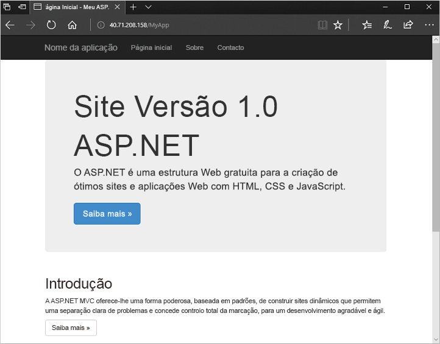

# <a name="quickstart-create-a-windows-virtual-machine-scale-set-with-an-azure-template"></a>Início Rápido: criar um conjunto de dimensionamento de máquinas virtuais Windows com um modelo do Azure

Um conjunto de dimensionamento de máquinas virtuais permite implementar e gerir um conjunto de máquinas virtuais idênticas e de dimensionamento automático. Pode dimensionar o número de VMs no conjunto de dimensionamento manualmente ou definir regras para dimensionar automaticamente com base na utilização de recursos como CPU, exigência de memória ou tráfego de rede. Em seguida, um balanceador de carga do Azure distribui o tráfego pelas instâncias de VM no conjunto de dimensionamento. Neste início rápido, vai criar um conjunto de dimensionamento de máquinas virtuais e implementar um exemplo de aplicação com um modelo do Azure Resource Manager.

[!INCLUDE [About Azure Resource Manager](../../includes/resource-manager-quickstart-introduction.md)]

Se não tiver uma subscrição Azure, crie uma [conta gratuita](https://azure.microsoft.com/free/?WT.mc_id=A261C142F) antes de começar.

## <a name="prerequisites"></a>Pré-requisitos

Nenhum.

## <a name="create-a-scale-set"></a>Criar um conjunto de dimensionamento

Os modelos do Azure Resource Manager permitem implementar grupos de recursos relacionados. Num único modelo, pode criar o conjunto de dimensionamento de máquinas virtuais, instalar aplicações e configurar regras de dimensionamento automático. Com a utilização de parâmetros e variáveis, este modelo pode ser reutilizado para atualizar conjuntos de dimensionamento existentes ou criar conjuntos de dimensionamento adicionais. Pode implantar modelos através do portal Azure, Azure CLI, Azure PowerShell, ou de gasodutos de integração contínua/entrega contínua (CI/CD).

### <a name="review-the-template"></a>Reveja o modelo

O modelo utilizado neste quickstart é de [modelos Azure Quickstart](https://azure.microsoft.com/resources/templates/201-vmss-windows-webapp-dsc-autoscale/).

:::code language="json" source="~/quickstart-templates/201-vmss-windows-webapp-dsc-autoscale/azuredeploy.json" range="1-397" highlight="236-325":::

Estes recursos são definidos nestes modelos:

- [**Microsoft.Network/virtualNetworks**](/azure/templates/microsoft.network/virtualnetworks)
- [**Microsoft.Network/publicIPAddresss**](/azure/templates/microsoft.network/publicipaddresses)
- [**Microsoft.Network/loadBalancers**](/azure/templates/microsoft.network/loadbalancers)
- [**Microsoft.Compute/virtualMachineScaleSets**](/azure/templates/microsoft.compute/virtualmachinescalesets)
- [**Microsoft.Insights/autoscaleSettings**](/azure/templates/microsoft.insights/autoscalesettings)

#### <a name="define-a-scale-set"></a>Definir um conjunto de dimensionamento

A parte realçada é a definição de recurso definido pela escala. Para criar um dimensionamento com um modelo, tem de definir os recursos adequados. As partes principais do tipo de recurso de conjunto de dimensionamento de máquinas virtuais são:

| Propriedade                     | Descrição da propriedade                                  | Valor de modelo de exemplo                    |
|------------------------------|----------------------------------------------------------|-------------------------------------------|
| tipo                         | Tipo de recurso do Azure a criar                            | Microsoft.Compute/virtualMachineScaleSets |
| name                         | O nome do conjunto de dimensionamento                                       | myScaleSet                                |
| localização                     | A localização para criar o conjunto de dimensionamento                     | E.U.A. Leste                                   |
| sku.name                     | O tamanho da VM para cada instância do conjunto de dimensionamento                  | Standard_A1                               |
| sku.capacity                 | O número de instâncias de VM a criar inicialmente           | 2                                         |
| upgradePolicy.mode           | Modo de atualização de instâncias de VM quando ocorrem alterações              | Automático                                 |
| imageReference               | A plataforma ou imagem personalizada a utilizar para as instâncias de VM | Microsoft Windows Server 2016 Datacenter  |
| osProfile.computerNamePrefix | O prefixo de nome para cada instância de VM                     | myvmss                                    |
| osProfile.adminUsername      | O nome de utilizador para cada instância de VM                        | azureuser                                 |
| osProfile.adminPassword      | A palavra-passe para cada instância de VM                        | P@ssw0rd!                                 |

Para personalizar um modelo de conjunto de escala, pode alterar o tamanho vm ou a capacidade inicial. Outra opção é usar uma plataforma diferente ou uma imagem personalizada.

#### <a name="add-a-sample-application"></a>Adicionar uma aplicação de exemplo

Para testar o conjunto de dimensionamento, instale uma aplicação Web básica. Quando implementa um conjunto de dimensionamento, as extensões de VM podem fornecer tarefas de automatização e configuração pós-implementação, tais como a instalação de uma aplicação. Os scripts podem ser transferidos a partir do armazenamento do Azure ou do GitHub, ou fornecidos para o portal do Azure no runtime da extensão. Para aplicar uma extensão ao conjunto de dimensionamento, adicione a secção *extensionProfile* ao exemplo de recurso anterior. Normalmente, o perfil de extensão define as seguintes propriedades:

- Tipo de extensão
- Publicador da extensão
- Versão da extensão
- Localização dos scripts de configuração ou instalação
- Comandos para executar nas instâncias de VM

O modelo utiliza a extensão PowerShell DSC para instalar uma aplicação ASP.NET MVC que funciona no IIS.

Um script de instalação é transferido a partir do GitHub, tal como definido em *url*. Em seguida, a extensão executa *InstallIIS* a partir do script *IISInstall.ps1*, tal como definido em *função* e *Script*. A aplicação ASP.NET propriamente dita é fornecida como um pacote do Web Deploy, que também é transferido a partir do GitHub, tal como definido em *WebDeployPackagePath*:

## <a name="deploy-the-template"></a>Implementar o modelo

Pode implantar o modelo selecionando o botão **Deploy para Azure.** Este botão abre o portal do Azure, carrega o modelo completo e pede-lhe alguns parâmetros, tais como um nome de conjunto de dimensionamento, uma contagem de instâncias e as credenciais de administrador.

[](https://portal.azure.com/#create/Microsoft.Template/uri/https%3A%2F%2Fraw.githubusercontent.com%2FAzure%2Fazure-quickstart-templates%2Fmaster%2F201-vmss-windows-webapp-dsc-autoscale%2Fazuredeploy.json)

Também pode implementar um modelo de Gestor de Recursos utilizando o Azure PowerShell:

```azurepowershell-interactive
# Create a resource group
New-AzResourceGroup -Name myResourceGroup -Location EastUS

# Deploy template into resource group
New-AzResourceGroupDeployment `
    -ResourceGroupName myResourceGroup `
    -TemplateURI https://raw.githubusercontent.com/Azure/azure-quickstart-templates/master/201-vmss-windows-webapp-dsc-autoscale/azuredeploy.json

# Update the scale set and apply the extension
Update-AzVmss `
    -ResourceGroupName myResourceGroup `
    -VmScaleSetName myVMSS `
    -VirtualMachineScaleSet $vmssConfig
```

Responda aos pedidos para fornecer um nome do conjunto de dimensionamento e as credenciais de administrador para as instâncias de VM. Pode demorar 10 a 15 minutos para que a escala definida seja criada e aplique a extensão para configurar a aplicação.

## <a name="test-the-deployment"></a>Testar a implementação

Para ver o conjunto de dimensionamento em ação, aceda à aplicação Web de exemplo num browser. Obtenha o endereço IP público do seu balanceor de carga com [Get-AzPublicIpAddress](/powershell/module/az.network/get-azpublicipaddress) da seguinte forma:

```azurepowershell-interactive
Get-AzPublicIpAddress -ResourceGroupName myResourceGroup | Select IpAddress
```

Introduza o endereço IP público do equilibrador de carga num navegador web no formato *http: \/ /publicIpAddress/MyApp*. O balanceador de carga distribui o tráfego para uma das suas instâncias de VM, conforme mostra o exemplo seguinte:



## <a name="clean-up-resources"></a>Limpar recursos

Quando já não for necessário, pode utilizar o [Remove-AzResourceGroup](/powershell/module/az.resources/remove-azresourcegroup) para remover o grupo de recursos, conjunto de escala. O parâmetro `-Force` confirma que pretende eliminar os recursos sem uma linha de comandos adicional para fazê-lo. O parâmetro `-AsJob` devolve o controlo à linha de comandos, sem aguardar a conclusão da operação.

```azurepowershell-interactive
Remove-AzResourceGroup -Name "myResourceGroup" -Force -AsJob
```

## <a name="next-steps"></a>Próximos passos

Neste início rápido, criou um conjunto de dimensionamento Windows com um modelo do Azure e utilizou a extensão de PowerShell DSC para instalar uma aplicação ASP.NET básica nas instâncias da VM. Para obter mais informações, avance para o tutorial para saber como criar e gerir conjuntos de dimensionamento de máquinas virtuais do Azure.

> [!div class="nextstepaction"]
> [Criar e gerir conjuntos de dimensionamento de máquinas virtuais do Azure](tutorial-create-and-manage-powershell.md)
