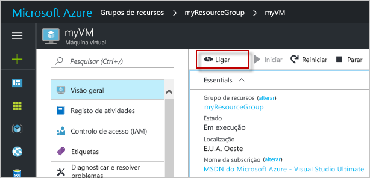

# <a name="quickstart-create-a-linux-virtual-machine-in-the-azure-portal"></a>Início Rápido: Criar uma máquina virtual do Linux no portal do Azure

As máquinas virtuais do Azure (VMs) podem ser criadas através do portal do Azure. O portal Azure é uma interface de utilizador baseada no navegador para criar recursos Azure. Este quickstart mostra-lhe como usar o portal Azure para implementar uma máquina virtual Linux (VM) que executa Ubuntu 18.04 LTS. Para ver a VM em ação, estabeleça o SSH para a VM e instale o servidor Web NGINX.

Se não tiver uma subscrição do Azure, crie uma [conta gratuita](https://azure.microsoft.com/free/?WT.mc_id=A261C142F) antes de começar.

## <a name="create-ssh-key-pair"></a>Criar o par de chaves SSH

Precisa de um par de chaves SSH para concluir este início rápido. Se já tiver um par de chaves SSH, pode ignorar este passo.

Abra uma shell do Bash e utilize [ssh-keygen](https://www.ssh.com/ssh/keygen/) para criar um par de chaves SSH. Se não tiver uma shell do Bash no computador local, pode utilizar o [Azure Cloud Shell](https://shell.azure.com/bash).


1. Inicie sessão no [portal do Azure](https://portal.azure.com).
1. No menu no topo da página, selecione o ícone `>_` para abrir cloud Shell.
1. Certifique-se de que a CloudShell diz **"Bash"** na parte superior esquerda. Se disser PowerShell, use a gota para selecionar **Bash** e selecione **Confirmar** para mudar para a concha bash.
1. Digite `ssh-keygen -t rsa -b 2048` para criar a chave ssh. 
1. Será solicitado a introduzir um ficheiro no qual salvar o par de chaves. Basta pressionar **Introduza** para guardar na localização predefinida, listada nos suportes. 
1. Será-lhe pedido que introduza uma frase de passe. Pode escrever uma palavra-passe para a sua tecla SSH ou prima **Enter** para continuar sem uma frase de passe.
1. O comando `ssh-keygen` gera chaves públicas e privadas com o nome padrão de `id_rsa` no `~/.ssh directory`. O comando devolve o caminho completo para a chave pública. Utilize o caminho para a chave pública para mostrar o seu conteúdo com `cat` digitando `cat ~/.ssh/id_rsa.pub`.
1. Copie a saída deste comando e guarde-o em algum lugar para usar mais tarde neste artigo. Esta é a sua chave pública e vai precisar dela ao configurar a sua conta de administrador para iniciar sessão no seu VM.

## <a name="sign-in-to-azure"></a>Iniciar sessão no Azure

Inscreva-se no [portal Azure](https://portal.azure.com) se ainda não o fez.

## <a name="create-virtual-machine"></a>Criar a máquina virtual

1. Digite **máquinas virtuais** na procura.
1. Em **Serviços,** selecione **máquinas Virtuais**.
1. Na página das **máquinas Virtuais,** selecione **Adicionar**. A página **Criar uma máquina virtual** abre.
1. No separador **Noções básicas**, em **Detalhes do projeto**, certifique-se de que está selecionada a subscrição correta e, em seguida, selecione **Criar novo** no grupo de recursos. Digite *o myResourceGroup* para o nome.*. 

    

1. Em **caso de detalhes**, *escreva myVM* para o nome da máquina **virtual,** escolha *Os EUA Orientais* para a sua **Região**, e escolha *Ubuntu 18.04 LTS* para a sua **imagem**. Mantenha as restantes predefinições inalteradas.

    

1. Na **conta Do Administrador,** selecione **a chave pública SSH,** digite o seu nome de utilizador e, em seguida, cola na sua chave pública. Remova quaisquer espaços em branco à esquerda ou à direita na chave pública.

    

1. Em **Regras da porta de entrada** > **Portas de entrada públicas**, selecione **Permitir portas selecionadas** e, em seguida, selecione **SSH (22)** e **HTTP (80)** na lista pendente. 

    

1. Mantenha as restantes predefinições e, em seguida, selecione o botão **Rever + criar** na parte inferior da página.

1. Na página **Criar uma máquina virtual**, pode ver os detalhes sobre a VM que está prestes a criar. Quando estiver pronto, selecione **Criar**.

Irá demorar alguns minutos até a VM ser implementada. Quando a implementação estiver concluída, avance para a secção seguinte.

    
## <a name="connect-to-virtual-machine"></a>Conectar à máquina virtual

Crie uma ligação SSH à VM.

1. Selecione o botão **Ligar** na página de descrição geral da VM. 

    

2. Na página **Ligar à máquina virtual**, mantenha as opções predefinidas para estabelecer ligação por endereço IP através da porta 22. Em **Iniciar sessão com uma conta local da VM**, é apresentado um comando de ligação. Selecione o botão para copiar o comando. O exemplo seguinte mostra o aspeto do comando de ligação SSH:

    ```bash
    ssh azureuser@10.111.12.123
    ```

3. Utilizando a mesma concha de bash que usou para criar o seu par de teclas SSH (pode reabrir a Cloud Shell selecionando novamente `>_` ou indo https://shell.azure.com/bash), colar o comando de ligação SSH na casca para criar uma sessão SSH.

## <a name="install-web-server"></a>Instalar o servidor Web

Para ver a VM em ação, instale o servidor Web NGINX. Na sessão SSH, atualize as origens do pacote e, em seguida, instale o pacote NGINX mais recente.

```bash
sudo apt-get -y update
sudo apt-get -y install nginx
```

Quando terminar, escreva `exit` para deixar a sessão SSH.


## <a name="view-the-web-server-in-action"></a>Ver o servidor Web em ação

Utilize um browser à sua escolha para ver a página predefinida de boas-vindas do NGINX. Digite o endereço IP público do VM como endereço web. O endereço IP público pode ser encontrado na página de descrição geral da VM ou como parte da cadeia de ligação SSH que utilizou anteriormente.


## <a name="clean-up-resources"></a>Limpar recursos

Quando já não forem necessários, pode eliminar o grupo de recursos, a máquina virtual e todos os recursos relacionados. Para tal, selecione o grupo de recursos para a máquina virtual, selecione **Eliminar** e confirme o nome do grupo de recursos a eliminar.

## <a name="next-steps"></a>Passos seguintes

Neste início rápido, implementou uma máquina virtual simples, criou um Grupo de Segurança de Rede e uma regra e instalou um servidor Web básico. Para saber mais sobre as máquinas virtuais do Azure, continue para o tutorial das VMs do Linux.

> [!div class="nextstepaction"]
> [Tutoriais das máquinas virtuais do Linux do Azure](./tutorial-manage-vm.md)
