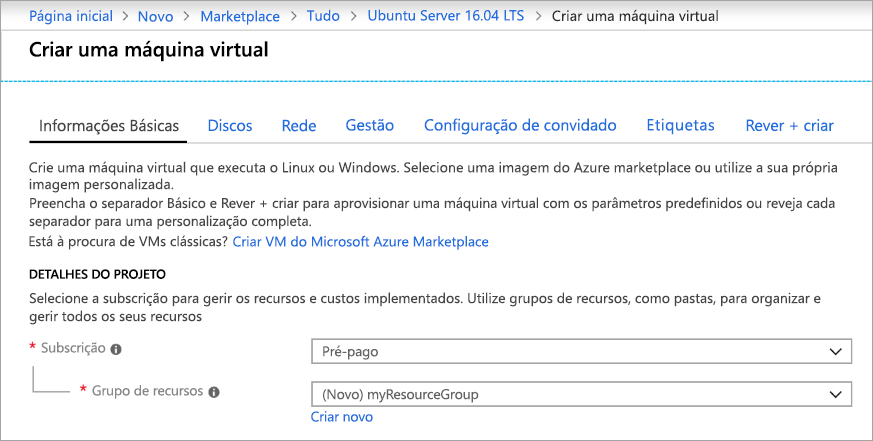
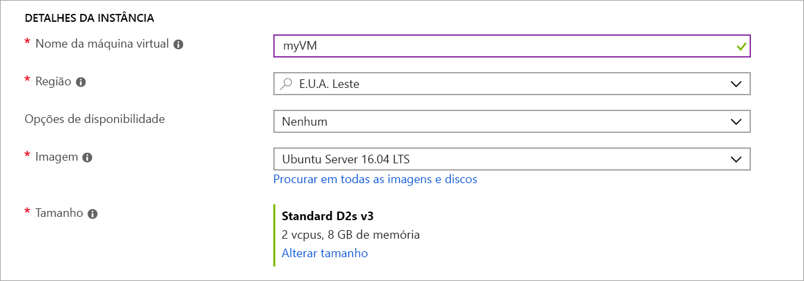
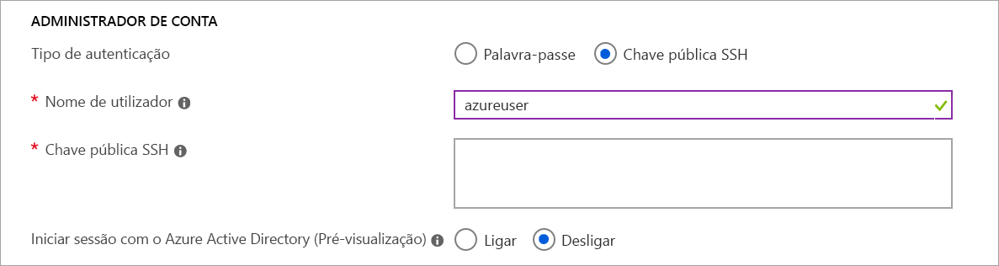
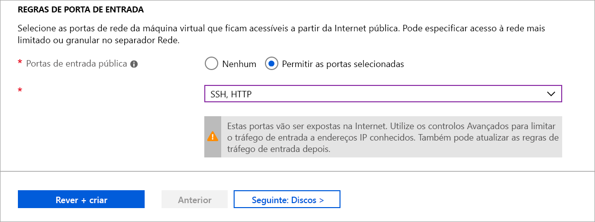

# <a name="quickstart-create-a-linux-virtual-machine-in-the-azure-portal"></a>Início Rápido: Criar uma máquina virtual do Linux no portal do Azure

As máquinas virtuais do Azure (VMs) podem ser criadas através do portal do Azure. O portal Azure é uma interface de utilizador baseada no navegador para criar recursos Azure. Este quickstart mostra-lhe como usar o portal Azure para implantar uma máquina virtual Linux (VM) que executa Ubuntu 18.04 LTS. Para ver a VM em ação, estabeleça o SSH para a VM e instale o servidor Web NGINX.

Se não tiver uma subscrição do Azure, crie uma [conta gratuita](https://azure.microsoft.com/free/?WT.mc_id=A261C142F) antes de começar.

## <a name="sign-in-to-azure"></a>Iniciar sessão no Azure

Inscreva-se no [portal Azure](https://portal.azure.com) se ainda não o fez.

## <a name="create-virtual-machine"></a>Criar a máquina virtual

1. Digite **máquinas virtuais** na pesquisa.
1. Em **Serviços**, selecione **Máquinas Virtuais.**
1. Na página **'Máquinas Virtuais',** selecione **Adicionar**. A página **de máquina virtual Create** abre.
1. No separador **Noções básicas**, em **Detalhes do projeto**, certifique-se de que está selecionada a subscrição correta e, em seguida, selecione **Criar novo** no grupo de recursos. Digite *myResourceGroup* para o nome.*. 

    

1. Em **Exemplo,** digite *myVM* para o **nome da máquina Virtual,** escolha East *US* para a sua **Região**, e escolha *Ubuntu 18.04 LTS* para a sua **imagem**. Mantenha as restantes predefinições inalteradas.

    

1. Na **conta de administrador**, selecione **SSH public key**.

1. No **nome de utilizador,** *escreva azureuser*.

1. Para **a fonte de chave pública SSH,** deixe o padrão de Gerar novo par de **chaves** e, em seguida, digite *myKey* para o **nome do par chave**.

    

1. Sob **as regras portuárias de entrada** Públicas portas de entrada , escolha Permitir portas  >  **selecionadas** e,**em** seguida, selecione **SSH (22)** e **HTTP (80)** a partir do drop-down. 

    

1. Mantenha as restantes predefinições e, em seguida, selecione o botão **Rever + criar** na parte inferior da página.

1. Na página **Criar uma máquina virtual**, pode ver os detalhes sobre a VM que está prestes a criar. Quando estiver pronto, selecione **Criar**.

1. Quando a **janela do novo par de chaves** se abrir, selecione Baixar a **tecla privada e criar recurso**. O seu ficheiro-chave será descarregado como **myKey.pem**. Certifique-se de que sabe onde o `.pem` ficheiro foi descarregado, vai precisar do caminho para o mesmo no passo seguinte.

1. Quando a implementação estiver concluída, selecione **Ir para o recurso**.

1. Na página para o seu novo VM, selecione o endereço IP público e copie-o para a sua área de transferência.


    

## <a name="connect-to-virtual-machine"></a>Conectar à máquina virtual

Crie uma ligação SSH à VM.

1. Se estiver numa máquina Mac ou Linux, abra um pedido de Bash. Se estiver numa máquina Do Windows, abra um pedido PowerShell. 

1. A seu pedido, abra uma ligação SSH à sua máquina virtual. Substitua o endereço IP pelo do seu VM e substitua o caminho para o `.pem` caminho para onde o ficheiro chave foi descarregado.

```console
ssh -i .\Downloads\myKey1.pem azureuser@10.111.12.123
```

> [!TIP]
> A chave SSH que criou pode ser usada da próxima vez que criar um VM em Azure. Basta selecionar **a tecla Utilizar uma tecla armazenada em Azure** para **fonte de chave pública SSH** da próxima vez que criar um VM. Já tem a chave privada no seu computador, por isso não precisa de descarregar nada.

## <a name="install-web-server"></a>Instalar o servidor Web

Para ver a VM em ação, instale o servidor Web NGINX. Na sessão SSH, atualize as origens do pacote e, em seguida, instale o pacote NGINX mais recente.

```bash
sudo apt-get -y update
sudo apt-get -y install nginx
```

Quando terminar, escreva `exit` para deixar a sessão SSH.


## <a name="view-the-web-server-in-action"></a>Ver o servidor Web em ação

Utilize um browser à sua escolha para ver a página predefinida de boas-vindas do NGINX. Digite o endereço IP público do VM como endereço web. O endereço IP público pode ser encontrado na página de descrição geral da VM ou como parte da cadeia de ligação SSH que utilizou anteriormente.


## <a name="clean-up-resources"></a>Limpar os recursos

Quando já não forem necessários, pode eliminar o grupo de recursos, a máquina virtual e todos os recursos relacionados. Para tal, selecione o grupo de recursos para a máquina virtual, selecione **Eliminar** e confirme o nome do grupo de recursos a eliminar.

## <a name="next-steps"></a>Passos seguintes

Neste início rápido, implementou uma máquina virtual simples, criou um Grupo de Segurança de Rede e uma regra e instalou um servidor Web básico. Para saber mais sobre as máquinas virtuais do Azure, continue para o tutorial das VMs do Linux.

> [!div class="nextstepaction"]
> [Tutoriais das máquinas virtuais do Linux do Azure](./tutorial-manage-vm.md)
