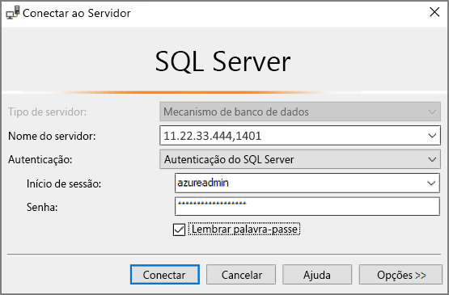

# Início Rápido: criar uma máquina virtual do SQL Server 2017 do Windows no portal do Azure

> [!div class="op_single_selector"]
> * [Windows](quickstart-sql-vm-create-portal.md)
> * [Linux](../../linux/sql/provision-sql-server-linux-virtual-machine.md)

Estes passos do guia de introdução explicam a criação de uma máquina virtual de SQL Server com o portal do Azure.

  > [!TIP]
  > - Este início rápido proporciona um caminho para aprovisionar e ligar a uma VM do SQL de forma rápida. Para obter mais informações sobre outras opções de aprovisionamento de VMs do SQL, veja o [Guia de aprovisionamento de VMs do SQL Server do Windows no portal do Azure](virtual-machines-windows-portal-sql-server-provision.md).
  > - Se tiver dúvidas sobre máquinas virtuais do SQL Server, veja as [Perguntas Mais Frequentes](virtual-machines-windows-sql-server-iaas-faq.md).

## Obtenha uma subscrição azure

Se não tiver uma subscrição Azure, crie uma [conta gratuita](https://azure.microsoft.com/free/?WT.mc_id=A261C142F) antes de começar.

##  Selecionar uma imagem de VM do SQL Server

1. Inicie sessão no [portal do Azure](https://portal.azure.com) com a sua conta.

1. Selecione **Azure SQL** no menu à esquerda do portal Azure. Se o **Azure SQL** não estiver na lista, selecione **Todos os serviços,** em seguida, *digite o Azure SQL* na caixa de pesquisa.
1. Selecione **+Adicionar** para abrir a página de opção de **implementação Select SQL.** Pode ver informações adicionais selecionando detalhes do **Show** no azulejo das **máquinas virtuais SQL.**
1. Selecione a Licença gratuita do **Servidor SQL: Desenvolvedor do SQL Server 2017 na imagem do Windows Server 2016** a partir da queda.

   

1. Selecione **Criar**.

   

##  Forneça os detalhes básicos

No separador **Basics,** forneça as seguintes informações:

1. Na secção Detalhes do **Projeto,** selecione a sua subscrição Azure e, em seguida, selecione **Criar novo** para criar um novo grupo de recursos. Digite _SQLVM-RG_ para o nome.

   

1. Em **detalhes por exemplo:**
    1. Digite _SQLVM_ para o nome da **máquina virtual**. 
    1. Escolha um local para a sua **Região.** 
    1. Para efeitos deste arranque rápido, deixe **as opções** de disponibilidade definidas para nenhum despedimento de _infraestrutura necessário_. Para saber mais informações sobre opções de disponibilidade, consulte [Disponibilidade](../../windows/availability.md). 
    1. Na lista **de Imagens,** selecione _Free SQL Server License: SQL Server 2017 Developer no Windows Server 2016_. 
    1. Opte por alterar o **tamanho** para o **tamanho** da máquina virtual e selecione a oferta **Básica A2.** Certifique-se de limpar os seus recursos uma vez que terminar com eles para evitar quaisquer acusações inesperadas. 

   

1. Na **conta Do Administrador,** forneça um nome de utilizador, como _azureuser_ e uma palavra-passe. A palavra-passe tem de ter, pelo menos, 12 carateres e cumprir os [requisitos de complexidade definidos](../../windows/faq.md#what-are-the-password-requirements-when-creating-a-vm).

   

1. De acordo com as regras da **porta de entrada,** escolha **permitir portas selecionadas** e, em seguida, selecionar **RDP (3389)** a partir da queda. 

   

## Definições do SQL Server

No **separador de definições do Servidor SQL,** configure as seguintes opções:

1. Em **Segurança & Networking**, selecione _Public (Internet)_ para `1401` Conectividade **SQL** e altere a porta para evitar a utilização de um número de porta bem conhecido no cenário público. 
1. Em **autenticação SQL,** selecione **Ativar**. O Início de Sessão de SQL está definido para o mesmo nome de utilizador e palavra-passe que configurou para a VM. Utilize a definição predefinida para a integração do cofre de [**chaves Azure**](virtual-machines-windows-ps-sql-keyvault.md). **A configuração** de armazenamento não está disponível para a imagem VM do Servidor SQL básica, mas pode encontrar mais informações sobre as opções disponíveis para outras imagens na [configuração de armazenamento](virtual-machines-windows-sql-server-storage-configuration.md#new-vms).  

   

1. Mude quaisquer outras definições, se necessário, e, em seguida, selecione **Rever + criar**. 

   

## Criar a VM do SQL Server

No **separador Review + criar,** reveja o resumo e selecione **Criar** para criar o SQL Server, grupo de recursos e recursos especificados para este VM.

Pode monitorizar a implementação a partir do portal do Azure. O botão **Notificações** na parte superior do ecrã mostra o estado básico da implementação. O destacamento pode demorar vários minutos. 

## Ligar ao SQL Server

1. No portal, encontre o **endereço IP público** do seu VM do Servidor SQL na secção de visão **geral** das propriedades da sua máquina virtual.

1. Num computador diferente ligado à Internet, abra o [Estúdio de Gestão de Servidores SQL (SSMS)](/sql/ssms/download-sql-server-management-studio-ssms).

1. Na caixa de diálogo **Ligar ao Servidor** ou **Ligar ao Motor de Base de Dados**, edite o valor **Nome do servidor**. Introduza o endereço IP público da VM. Em seguida, adicione uma vírgula e a porta personalizada, **1401**, que especificamos quando configurou a nova VM. Por exemplo, `11.22.33.444,1401`.

1. Na caixa **Autenticação**, selecione **Autenticação do SQL Server**.

1. Na caixa **Início de sessão**, escreva o nome de um início de sessão SQL válido.

1. Na caixa **Palavra-passe**, escreva a palavra-passe do início de sessão.

1. Selecione **Ligar**.

    

##  Inicie a sessão para a VM remotamente

Utilize os seguintes passos para ligar à máquina virtual do SQL Server com o Ambiente de Trabalho Remoto:

[!INCLUDE [Connect to SQL Server VM with remote desktop](../../../../includes/virtual-machines-sql-server-remote-desktop-connect.md)]

Depois de ligar à máquina virtual do SQL Server, pode iniciar o SQL Server Management Studio e estabelecer ligação à Autenticação do Windows com as suas credenciais de administrador local. Se ativou a Autenticação do SQL Server, também pode ligar com Autenticação do SQL Server com o início de sessão do SQL e a palavra-passe que configurou durante o aprovisionamento.

O acesso ao computador permite-lhe alterar diretamente as definições do SQL Server e da máquina com base nos seus requisitos. Por exemplo, pode configurar as definições da firewall ou alterar as definições de configuração do SQL Server.

## Limpar recursos

Se não precisar que a sua VM SQL execute continuamente, pode evitar despesas desnecessárias ao pará-la quando não estiver a utilizar. Também pode eliminar permanentemente todos os recursos associados à máquina virtual ao eliminar o seu grupo de recursos associados no portal. Isto também elimina permanentemente a máquina virtual, pelo que utilize este comando com cuidado. Para mais informações, consulte [Manage Azure resources through portal (Gerir recursos do Azure através do portal)](../../../azure-resource-manager/management/manage-resource-groups-portal.md).

## Passos seguintes

Neste arranque rápido, criou uma máquina virtual SQL Server 2017 no portal Azure. Para saber mais sobre como migrar os seus dados para o novo SQL Server, consulte o seguinte artigo.

> [!div class="nextstepaction"]
> [Migrar uma base de dados para uma VM de SQL](virtual-machines-windows-migrate-sql.md)
