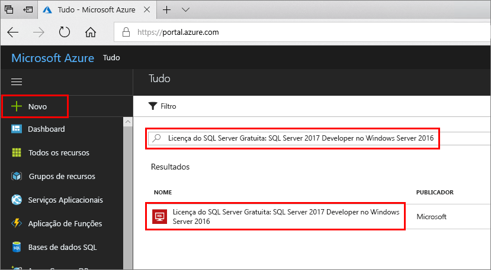

# Início rápido: Crie uma máquina virtual do SQL Server 2017 Windows no portal do Azure

> [!div class="op_single_selector"]
> * [Windows](quickstart-sql-vm-create-portal.md)
> * [Linux](../../linux/sql/provision-sql-server-linux-virtual-machine.md)

Estes passos do guia de introdução explicam a criação de uma máquina virtual de SQL Server com o portal do Azure.

  > [!TIP]
  > - Este início rápido proporciona um caminho para aprovisionar e ligar a uma VM do SQL de forma rápida. Para obter mais informações sobre outras opções de aprovisionamento de VMs do SQL, veja o [Guia de aprovisionamento de VMs do SQL Server do Windows no portal do Azure](virtual-machines-windows-portal-sql-server-provision.md).
  > - Se tiver dúvidas sobre máquinas virtuais do SQL Server, veja as [Perguntas Mais Frequentes](virtual-machines-windows-sql-server-iaas-faq.md).

##  Obter uma subscrição do Azure

Se não tiver uma subscrição do Azure, crie uma [conta gratuita](https://azure.microsoft.com/free/?WT.mc_id=A261C142F) antes de começar.

##  Selecionar uma imagem de VM do SQL Server

1. Inicie sessão para o [portal do Azure](https://portal.azure.com) com a sua conta.

1. No portal do Azure, selecione **Criar um recurso**. 

1. No campo de pesquisa, escreva `SQL Server 2017 Developer on Windows Server 2016`, e prima ENTER. Expanda o SQL Server 2017 no Windows Server 2016 opção. 

1. Selecione o **gratuitos a licença do SQL Server: SQL Server 2017 Developer no Windows Server 2016** imagem. A edição de Programador é utilizada neste tutorial porque é uma edição com todas as funcionalidades do SQL Server que é gratuita para fins de teste de programação. Apenas paga pelo custo de execução da VM. Para obter considerações mais compeltas sobre preços, consulte [Pricing guidance for SQL Server Azure VMs (Documentação de orientação sobre preços de VMs do Azure do SQL Server)](virtual-machines-windows-sql-server-pricing-guidance.md).

   

1. Selecione **Criar**.

##  Forneça os detalhes básicos

Sobre o **Noções básicas** separador, forneça as seguintes informações:

1. Na **detalhes do projeto** secção, selecione a sua subscrição do Azure e, em seguida, selecione **criar nova** para criar um novo grupo de recursos. Tipo _SQLVM-RG_ para o nome.

   

1. Sob **detalhes de instância**:
    1. Tipo _SQLVM_ para o **nome da Máquina Virtual**. 
    1. Escolha uma localização para o seu **região**. 
    1. Para efeitos deste início rápido, deixe **opções de disponibilidade** definida como _nenhuma redundância de infraestrutura necessária_. Para obter mais informações sobre as opções de disponibilidade, veja [regiões do Azure e a disponibilidade](../../windows/regions-and-availability.md). 
    1. Na **imagem** lista, selecione _licença gratuita do SQL Server: O SQL Server 2017 Developer no Windows Server 2016_. 
    1. Optar por **alterar o tamanho** para o **tamanho** da máquina virtual e selecione o **A2 básica** oferta. Certifique-se de que limpe os recursos, uma vez que terminar de usá-los para evitar quaisquer cobranças inesperadas. 

   

1. Sob **conta de administrador**, forneça um nome de utilizador, como _azureuser_ e uma palavra-passe. A palavra-passe tem de ter, pelo menos, 12 carateres e cumprir os [requisitos de complexidade definidos](../../windows/faq.md#what-are-the-password-requirements-when-creating-a-vm).

   

1. Sob **regras de porta de entrada**, escolha **permitir portas selecionadas** e, em seguida, selecione **RDP (. 3389)** na lista suspensa. 

   

## Definições de SQL Server

Sobre o **definições do SQL Server** separador, configure as seguintes opções:

1. Sob **segurança e funcionamento em rede**, selecione _público (Internet_) para **conectividade de SQL** e altere a porta para `1401` para evitar o uso de um número de porta conhecido no cenário público. 
1. Sob **autenticação de SQL**, selecione **ativar**. O Início de Sessão de SQL está definido para o mesmo nome de utilizador e palavra-passe que configurou para a VM. Utilizar as predefinições para **integração do Azure Key Vault** e **configuração de armazenamento**.  

   

1. Altere quaisquer outras definições, se for necessário e, em seguida, selecione **rever + criar**. 

   

## Criar a VM do SQL Server

Sobre o **rever + criar** separador, reveja o resumo e selecione **criar** para criar o SQL Server, o grupo de recursos e recursos especificados para esta VM.

Pode monitorizar a implementação a partir do portal do Azure. O botão **Notificações** na parte superior do ecrã mostra o estado básico da implementação. Implementação pode demorar vários minutos. 

## Ligar ao SQL Server

1. No portal, localize a **endereço IP público** da sua VM do SQL Server no **descrição geral** secção de propriedades da sua máquina virtual.

1. Num computador diferente ligado à Internet, abra [SQL Server Management Studio (SSMS)](/sql/ssms/download-sql-server-management-studio-ssms).

1. Na caixa de diálogo **Ligar ao Servidor** ou **Ligar ao Motor de Base de Dados**, edite o valor **Nome do servidor**. Introduza o endereço IP público da VM. Em seguida, adicione uma vírgula e a porta personalizada, **1401**, que especificamos quando configurou a nova VM. Por exemplo, `11.22.33.444,1401`.

1. Na caixa **Autenticação**, selecione **Autenticação do SQL Server**.

1. Na caixa **Início de sessão**, escreva o nome de um início de sessão SQL válido.

1. Na caixa **Palavra-passe**, escreva a palavra-passe do início de sessão.

1. Selecione **Ligar**.

    

##  Inicie a sessão para a VM remotamente

Utilize os seguintes passos para ligar à máquina virtual do SQL Server com o Ambiente de Trabalho Remoto:

[!INCLUDE [Connect to SQL Server VM with remote desktop](../../../../includes/virtual-machines-sql-server-remote-desktop-connect.md)]

Depois de ligar à máquina virtual do SQL Server, pode iniciar o SQL Server Management Studio e estabelecer ligação à Autenticação do Windows com as suas credenciais de administrador local. Se ativou a Autenticação do SQL Server, também pode ligar com Autenticação do SQL Server com o início de sessão do SQL e a palavra-passe que configurou durante o aprovisionamento.

O acesso ao computador permite-lhe alterar diretamente as definições do SQL Server e da máquina com base nos seus requisitos. Por exemplo, pode configurar as definições da firewall ou alterar as definições de configuração do SQL Server.

## Limpar recursos

Se não precisar que a sua VM SQL execute continuamente, pode evitar despesas desnecessárias ao pará-la quando não estiver a utilizar. Também pode eliminar permanentemente todos os recursos associados à máquina virtual ao eliminar o seu grupo de recursos associados no portal. Isto também elimina permanentemente a máquina virtual, pelo que utilize este comando com cuidado. Para mais informações, consulte [Manage Azure resources through portal (Gerir recursos do Azure através do portal)](../../../azure-resource-manager/manage-resource-groups-portal.md).

## Passos Seguintes

Neste início rápido, criou uma máquina virtual do SQL Server 2017 no portal do Azure. Para saber mais sobre como migrar os seus dados para o novo SQL Server, consulte o seguinte artigo.

> [!div class="nextstepaction"]
> [Migrar uma base de dados para uma VM de SQL](virtual-machines-windows-migrate-sql.md)
